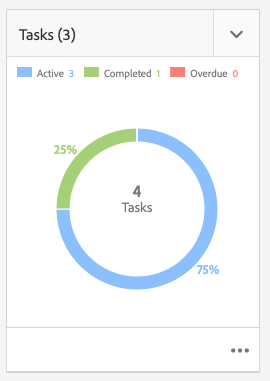
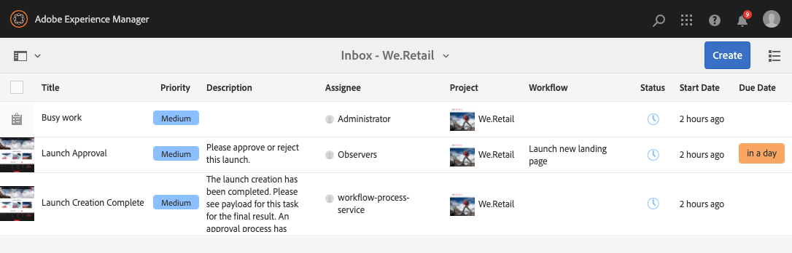
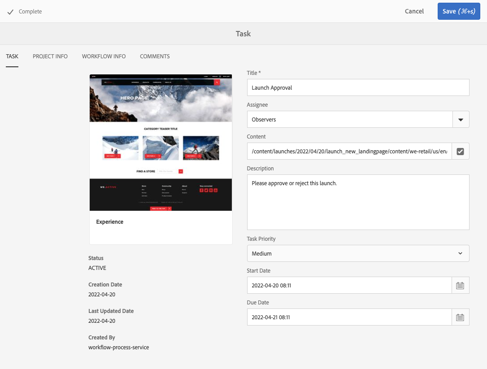
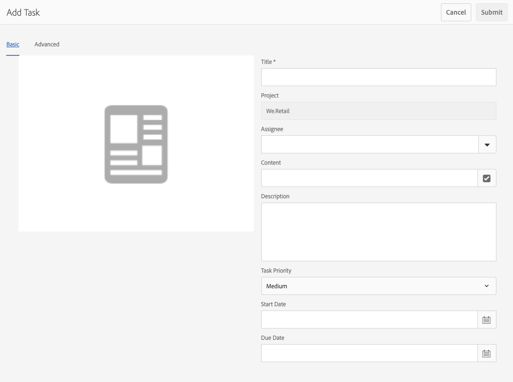
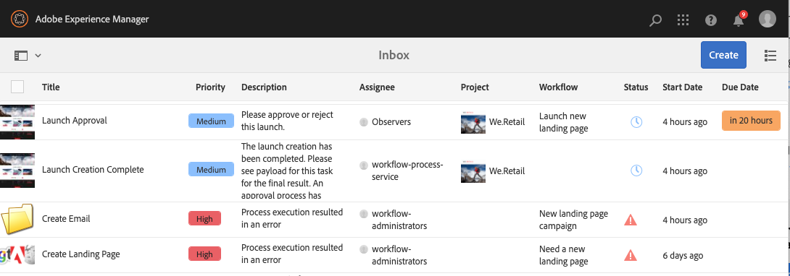

# Working with Tasks {#working-with-tasks}

Tasks represent items of work to be performed with regard to content. When you are assigned a task, it appears in your Workflow Inbox. Task items can be distinguished from workflow items by the value the **Type** column.

Tasks are also used in projects to determine the level of completeness of the project.

## Tracking Project Progress {#tracking-project-progress}

You can track project progress by looking at the active/completed tasks inside a project represented by the **Tasks** tile. Project progress can be determined by:

* **Task Tile:** An overall progress of the project is depicted in the task tile, available on the project details page.

* **Task List:** When clicking the task tile, a list of tasks is displayed. This list has detailed information about all the tasks related to the project.

Both options list workflow tasks and tasks you create directly in the tasks tile.

### Task Tile {#task-tile}

If a project has any related tasks, a task tile is displayed inside the project. The task tile shows the current status of the project. This is based on existing tasks inside the workflow and does not include any tasks that will generated in future as the workflow proceeds. The following information is visible in the task tile:

* Percentage of completed tasks
* Percentage of active tasks
* Percentage of overdue tasks

### Viewing or Modifying the Tasks in a Project {#viewing-or-modifying-the-tasks-in-a-project}

Besides tracking progress, you may also want to view more information about the project or modify it.

#### Task List {#task-list}

Click the ellipsis button at the bottom-right of the tasks tile to display your inbox filtered on the tasks related to the project. The task details are displayed along with metadata such as due date, assignee, priority, and status.

#### Task Details {#task-details}

For more information on a particular task, in the inbox, click the task to select it then click **Open** in the toolbar.

You can view, edit, or add details to the task via different tabs.

* **Task** - General task information
* **Project Info** - Summary of the project that the task is associated with
* **Workflow Ino** - Summary of the workflow that the task is associated with (if applicable)
* **Comments** - General comments on the task itself

### Adding Tasks {#adding-tasks}

You can add new tasks to projects. These tasks then appear in the tasks tile and are available in the notifications inbox so you are aware of your outstanding tasks.

To add a task:

1. In the project, locate the **Tasks** tile
1. Click the downward chevron at the top-right of the tile and select **Create Task**.
1. In the **Add Task** window, provide task details such as priority, assignee, and due date.

   

1. Click **Submit**.

## Working with Tasks in the Inbox {#working-with-tasks-in-the-inbox}

Instead of accessing your project tasks from the project itself, you can access them directly from your inbox. Your inbox gives you an overview of your tasks across projects so you can understand your entire workflow.

From the inbox, you can open the tasks and set the task status. Tasks also appear in your inbox when they are assigned to a user group that you belong to. In this case, any member of the group can perform the work and complete the task.

To complete a task, select the task and click **Complete** in the toolbar. Add information to the task and then click **Done**. See [Your Inbox](/help/sites-authoring/inbox.md) for more information.
