# Creating Page Templates{#creating-page-templates}

When creating a page you must select a template, which is used as the basis for creating the new page. The template defines the structure of the resultant page, any initial content, and the components that can be used.

With the **Template Editor**, creating and maintaining templates is no longer a developer-only task. A type of power-user, who is called a **template author**, can be involved too. Developers are still required to setup the environment, create client libraries, and create the components to be used, but once these basics are in place the **template author** has the flexibility to create and configure templates without a development project.

The **Templates Console** allows template authors to:

* Create a template or copy an existing template.
* Manage the lifecycle of the template.

The **Template Editor** allows template authors to:

* Add components to the template and position them on a responsive grid.
* Pre-configure the components.
* Define which components can be edited on pages created with the template.

This document explains how a **template author** can use the template console and editor to create and manage editable templates.

For detailed information about how editable templates work at a technical level, see the developer document [Page Templates - Editable](/help/sites-developing/page-templates-editable.md) for more information.

>[!NOTE]
>
>The **Template Editor** does not support targeting directly on the template level. Pages created based on an editable template can be targeted, but the templates themselves cannot be.

>[!CAUTION]
>
>Pages and templates created with the **Templates Console** are not meant to be used with the classic UI and such use is not supported.

## Before You Start {#before-you-start}

>[!NOTE]
>
>An administrator must configure a template folder in the **Configurations Browser** and apply proper permissions before a template author can create a template in that folder.

The following points are important to consider before you start:

* Creating a template requires collaboration. For this reason the [Role](#roles) is indicated for each task.

* Depending on how your instance is configured, AEM now provides [two basic types of template](/help/sites-authoring/templates.md#editable-and-static-templates). This does not impact how you actually [use a template to create a page](#using-a-template-to-create-a-page), but it does impact the type of template you can create and how a page relates to its template.

### Roles {#roles}

Creating a template using the **Templates Console** and the **Template Editor** requires collaboration between the following roles:

* **Admin**:

    * Creates a new folder for templates requires `admin` rights.

    * Such tasks can often also be done by a developer

* **Developer**:

    * Concentrates on the technical/internal details
    * Needs experience with the development environment.
    * Provides the template author with necessary information.

* **Template Author**:

    * This is a specific author who is member of the group `template-authors`

        * This allocates the required privileges and permissions.

    * Can configure the use of components and other high level details which requires:

        * Some technical knowledge

            * For example, using patterns when defining paths.

        * Technical information from the developer.

Due to the nature of some tasks such as creating a folder, a development environment is needed, and this requires knowledge/experience.

The tasks detailed in this document are listed with the role responsible for carrying them out.

### Editable and Static Templates {#editable-and-static-templates}

AEM now offers two basic types of templates:

* [Editable Templates](/help/sites-authoring/templates.md#creatingandmanagingnewtemplates)

    * Can be [created](#creatinganewtemplate) and [edited](#editingatemplate) by template authors using the **Template** console and editor. The **Template** console is accessible in the **General** section of the **Tools** console.

    * After the new page is created a dynamic connection is maintained between the page and the template. This means that changes to the template structure and/or locked content will be reflected on any pages created with that template. Changes to the unlocked (that is, initial) content will not be reflected.
    * Use content policies, which you can define these from the template editor, to persist the design properties. Design mode within the page editor is no longer used for editable templates.

* Static Templates

    * Static templates have been available for several versions of AEM.
    * They are [provided by your developers](/help/sites-developing/page-templates-static.md), so they cannot be created or edited by authors.
    * Are copied to create the new page, but no dynamic connection exists after this (though the template name is registered for information).
    * Use [Design Mode](/help/sites-authoring/default-components-designmode.md) to persist design properties.
    * Because editing static templates is the exclusive task of a developer, see the developer document [Page Templates - Static](/help/sites-developing/page-templates-static.md) for more information.

By definition, the template console and template editor only allow creation and editing of editable templates. Therefore this document focuses exclusively on editable templates.

### Using a Template to Create a Page {#using-a-template-to-create-a-page}

When using a template to [create a page](/help/sites-authoring/managing-pages.md#creating-a-new-page) there is no visible difference and no indication between static and editable templates. For the page author, the process is transparent.

## Creating and Managing Templates {#creating-and-managing-templates}

When creating an editable template you:

* Use the **Template** console. This is available in the **General** section of the **Tools** console.

    * Or directly at: [https://localhost:4502/libs/wcm/core/content/sites/templates.html/conf](https://localhost:4502/libs/wcm/core/content/sites/templates.html/conf)

* Can [create a folder for the templates](#creating-a-template-folder-admin) if necessary
* [Create a template](#creatinganewtemplateauthor), which is initially empty

* [Define additional properties](#definingtemplatepropertiesauthor) for the template if necessary
* [Edit the template](#editingtemplates) to define the:

    * [Structure](#editingatemplatestructureauthor) - Predefined content that cannot be changed on pages created with the template.
    * [Initial Content](#editing-a-template-initial-content-author) - Predefined content that can be changed on pages created with the template.
    * [Layout](#editingatemplatelayoutauthor) - For a range of devices.
    * [Styles](/help/sites-authoring/style-system.md) - Define the styles to be used with the template and its components.

* [Enable the template](#enablingatemplateauthor) for use when creating a page
* [Allow the template](#allowing-a-template-author) for the required page or branch of your website
* [Publish the template](#publishingatemplateauthor) to make it available on the publish environment

>[!NOTE]
>
>The **Allowed Templates** are often pre-defined when your website is initially set up.

>[!CAUTION]
>
>Never enter any information that needs to be [internationalized](/help/sites-developing/i18n.md) into a template. For internalization purposes, the [localization features of the Core Components](https://experienceleague.adobe.com/docs/experience-manager-core-components/using/get-started/localization.html) are recommended.

### Creating a Template Folder - Admin {#creating-a-template-folder-admin}

A template folder should be created for your project to hold your project-specific templates. This is an admin task and is described in the document [Page Templates - Editable](/help/sites-developing/page-templates-editable.md#template-folders).

### Creating a New Template - Template Author {#creating-a-new-template-template-author}

1. Open the **Templates Console** (via **Tools >** **General**) then navigate to the required folder.

   >[!NOTE]
   >
   >In a standard AEM instance the **global** folder already exists in the template console. This holds default templates and acts as a fallback if no policies and/or template-types are found in the current folder.
   >
   >
   >It is recommended best practice to use a [template folder created for your project](/help/sites-developing/page-templates-editable.md#template-folders).

1. Select **Create**, followed by **Create Template** to open the wizard.

1. Pick a **Template Type**, then select **Next**.

   >[!NOTE]
   >
   >Template types are predefined template layouts and can be thought of as templates for a template. These are predefined by developers or the system administrator. More information can be found in the developer document [Page Templates - Editable](/help/sites-developing/page-templates-editable.md#template-type).

1. Complete the **Template Details**:

    * **Template Name**
    * **Description**

1. Select **Create**. A confirmation is shown, select **Open** to start [editing the template](#editingatemplate) or **Done** to return to the template console.

   >[!NOTE]
   >
   >When a new template is created it is marked as **Draft** in the console, this indicates that it is not yet available to use by page authors.

### Defining Template Properties - Template Author {#defining-template-properties-template-author}

A template can have the following properties:

* Image

    * Image to be used as a [thumbnail of the template](/help/sites-authoring/templates.md#template-thumbnail-image) to aid selection such as in the Create Page wizard.

        * Can be uploaded
        * Can be generated based on the template content

* Title

    * A title used for identifying the template such as in the **Create Page** wizard.

* Description

    * An optional description to provide more information about the template and its use, which can be seen for example, in the **Create Page** wizard.

To view and/or edit the properties:

1. In the **Templates Console**, select the template.
1. Select **View Properties** from the toolbar or quick options to open the dialog.
1. You can now view or edit the template properties.

>[!NOTE]
>
>Templates are powerful tools to streamline your page creation workflow. However too many templates can overwhelm the authors and make page creation confusing. A good rule of thumb is to keep the number of templates under 100.
>
>Adobe does not recommend having more than 1000 templates due to potential performance impacts.

>[!NOTE]
>
>The status of a template (draft, enabled, or disabled) is indicated in the console.

#### Template Thumbnail Image {#template-thumbnail-image}

To define the template thumbnail:

1. Edit the template properties.
1. Choose if you wish to upload a thumbnail or have it generated from the template content.

    * If you wish to upload a thumbnail, click **Upload Image**
    * If you wish to generate a thumbnail, click **Generate Preview**

1. For both methods a preview of the thumbnail will be displayed.

   If it is not satisfactory, click **Clear** to upload another image or re-generate the thumbnail.

1. When you are satisfied with the thumbnail, click **Save & Close**.

### Enabling and Allowing a Template - Template Author {#enabling-and-allowing-a-template-template-author}

To be able to use a template when creating a page you need to:

* [Enable the template](#enablingatemplate) to make it available for use when creating pages.
* [Allow the template](#allowingatemplate) to specify the content branches where the template can be used.

#### Enabling a Template - Template Author {#enabling-a-template-template-author}

A template can be enabled or disabled to make it available or unavailable in the **Create Page** wizard.

>[!CAUTION]
>
>Once a template is enabled a warning will be displayed when a template author starts to update the template further. This is to inform the user that the template might be referenced, so any changes might affect the pages referencing the template.

1. In the **Templates Console**, select the template.
1. Select **Enable** or **Disable** from the toolbar, and again in the confirmation dialog.
1. You can now use your template when [creating a page](/help/sites-authoring/managing-pages.md#creating-a-new-page), though you likely want to [edit the template](#editingatemplate) according to your own requirements.

>[!NOTE]
>
>The status of a template (draft, enabled, or disabled) is indicated in the console.

#### Allowing a Template - Author {#allowing-a-template-author}

A template can be made available or unavailable for certain page branches.

1. Open the [Page Properties](/help/sites-authoring/editing-page-properties.md) for the root page of the branch where you want the template to be available.

1. Open the **Advanced** tab.

1. Under **Template Settings** use **Add field** to specify the paths to your template(s).

   The path can be explicit or use patterns. For example:

   `/conf/<your-folder>/settings/wcm/templates/.*`

   The order of the paths is irrelevant, all paths will be scanned and any templates retrieved.

   >[!NOTE]
   >
   >If the **Allowed Templates** list is left empty then the tree will be ascended until a value/list is found.
   >
   >
   >See [Template Availability](/help/sites-developing/templates.md#template-availability) - the principles for allowed templates remain the same.

1. Click **Save** to save the changes to the page properties.

>[!NOTE]
>
>Often the allowed templates are pre-defined for your entire site when it is set up.

### Publishing a Template - Template Author {#publishing-a-template-template-author}

As the template is referenced when a page is rendered, the fully configured template needs to be published so that it is available on the publish environment.

1. In the **Templates Console**, select the template.
1. Select **Publish** from the toolbar to open the wizard.
1. Select the **Content Policies** to be published in tandem.

1. Select **Publish** from the toolbar to complete the action.

## Editing Templates - Template Authors {#editing-templates-template-authors}

When creating or editing a template there are various aspects that you can define. Editing templates is similar to page authoring.

The following aspects of a template can be edited:

* [Structure](#editingatemplatestructure)

  Components added here cannot be moved/removed from resultant pages by the page authors. If you want page authors to be able to add and remove components to resultant pages, then you need to add a paragraph system to the template.

  When components are locked you can add content, which cannot be edited by page authors. You can unlock components to let you define [Initial Content](#editingatemplateinitialcontent).

  >[!NOTE]
  >
  >In structure mode, any components that are the parent of an unlocked component cannot be moved, cut, or deleted.

* [Initial Content](#editingatemplateinitialcontent)

  When a component has been unlocked you can define the initial content that will be copied to the resultant page(s), created from the template. These unlocked components can be edited on the resulting page(s).

  >[!NOTE]
  >
  >In **Initial Content** mode and on the resultant pages, any unlocked components that have an accessible parent (that is, components within a layout container) can be deleted.

* [Layout](#editingatemplatelayout)

  Here you can predefine the template layout for the required device formats. **Layout** mode for template authoring has the same functionality as the [**Layout** mode for page authoring](/help/sites-authoring/responsive-layout.md#defining-layouts-layout-mode).

* [Page Policies](#editingatemplatepagepolicies)

  Under page policies you can connect predefined page policies to the page. These page policies define the various design configurations.

* [Styles](/help/sites-authoring/style-system.md)

  The Style System allows a template author to define style classes in the content policy of a component so that a content author is able to select them when editing the component on a page. These styles can be alternative visual variations of a component, making it more flexible.

  See the [Style System documentation](/help/sites-authoring/style-system.md) for more information.

The **Mode** selector in the toolbar lets you select and edit the appropriate aspect of the template:

* [Structure](#editingatemplatestructure)
* [Initial Content](#editingatemplateinitialcontent)
* [Layout](#editingatemplatelayout)

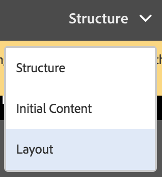

While the **Page Policy** option on the **Page Information** menu lets you [select the required page policies](#editingatemplatepagepolicies):

>[!CAUTION]
>
>If an author starts to edit a template that has already been enabled a warning will be displayed. This is to inform the user that the template might be referenced, so any changes might affect the pages referencing the template.

### Editing a Template - Structure - Template Author {#editing-a-template-structure-template-author}

In **Structure** mode you define components and content for your template and define policy for the template and its components.

* Components defined in the template structure cannot be moved on a resulting page nor deleted from any resulting pages.
* If you want page authors to be able to add and remove components, add a paragraph system to the template.
* Components can be unlocked and locked again to let you define [initial content](#editingatemplateinitialcontent).

* The design policies for the components and page are defined.

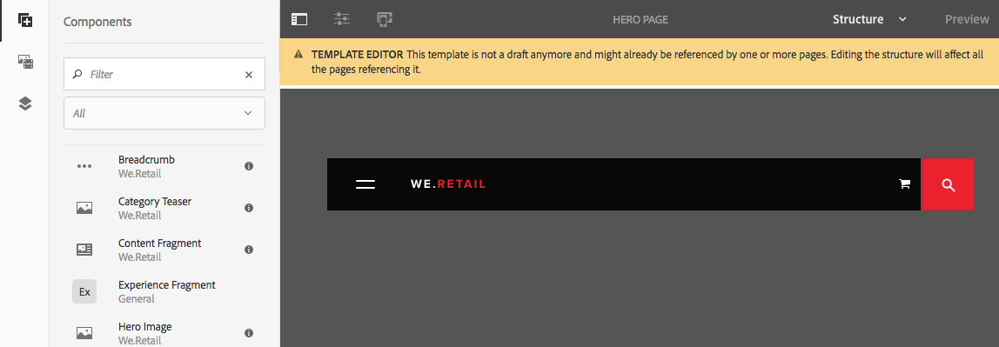

In **Structure** mode of the template editor:

* **Add components**

  There are several mechanisms for adding components to the template:

    * From the **Components** browser in the side panel.
    * By using the **Insert Component** option (**+** icon) available on the toolbar of components already on the template or the **Drag components here** box.

    * By dragging an asset (from the **Assets** browser in the side panel) directly onto the template to generate the appropriate component in situ.

  Once added, each component is marked with:

    * A border
    * A marker to show the component type
    * A marker to show when the component has been unlocked

  >[!NOTE]
  >
  >When you add an out-of-the-box **Title** component to the template it will contain the default text **structure**.
  >
  >
  >If you change this, and add your own text, then this updated text is used when a page is created from the template.
  >
  >
  >If you leave the default text (structure) then the title will default to the name of the subsequent page.

  >[!NOTE]
  >
  >Although not identical, adding components and assets to a template has many similarities to similar actions when [page authoring](/help/sites-authoring/editing-content.md).

* **Component Actions**

  Take actions on the components once they have been added to the template. Each individual instance has a toolbar that lets you access the available actions, the toolbar is dependent on the component type.

  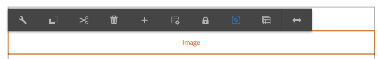

  It can also be dependent on actions taken such as when a policy has been associated with the component, then the design configuration icon becomes available.

* **Edit and Configure**

  With these two actions you can add content to your components.

* **Border to indicate Structure**

  When working in **Structure** mode an orange border indicates the component currently selected. A dotted line also indicates the parent component.

  For example, in the screenshot below the **Text** component is selected, within a **Layout Container** (responsivegrid).

  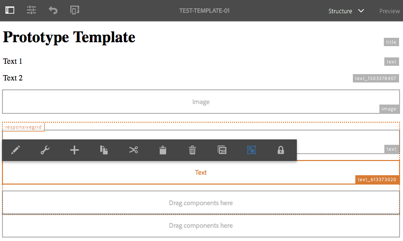

* **Policy & Properties (General)**

  The content (or design) policies define the design properties of a component. For example, the components available or minimum/maximum dimensions. These are applicable to the template (and pages created with the template).

  Create a content policy, or select an existing one, for a component. This lets you define the design details.

   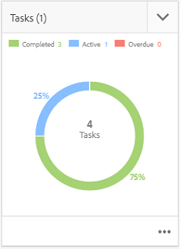

  The configuration window is divided in two.

    * In the left side of the dialogue under **Policy**, you have the ability to select an existing policy or select an existing one.
    * In the right side of the dialogue under **Properties**, you can set the properties specific to the component type.

  The properties available are dependent on the selected component. For example, for a text component the properties define the copy and paste options, formatting options, and paragraph style among other options.

  ***Policy***

  The content (or design) policies define the design properties of a component. For example, the components available or minimum/maximum dimensions. These are applicable to the template (and pages created with the template).

  Under **Policy** you can select an existing policy to apply to the component via the drop-down.

  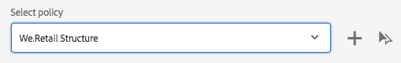

  A new policy can be added by selecting the add button next to the **Select policy** dropdown. A new title should then be given in the **Policy Title** field.

  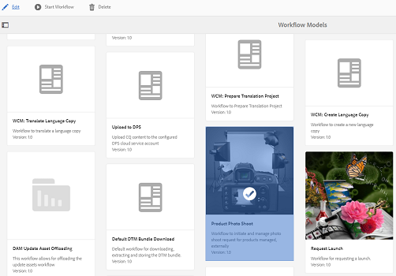

  The selected existing policy in the **Select policy** dropdown can be copied as a new policy using the copy button next to the dropdown. A new title should then be given in the **Policy Title** field. By default the copied policy will be titled **Copy of X**, where X is the title of the copied policy.

  

  A description of the policy is optional in the **Policy Description** field.

  In the **Other templates also using the selected policy** section, you can easily see which other templates use the policy selected in the **Select policy** dropdown.

  

  >[!NOTE]
  >
  >If multiple components of the same type are added as initial content, the same policy applies to all the components. This mirrors the same restriction in [**Design Mode** for static templates](/help/sites-authoring/default-components-designmode.md).

  ***Properties***

  Under the **Properties** heading you can define the settings of the component. The heading has two tabs:

    * Main
    * Features

  *Main*

  On the **Main** tab, the most important settings of the component are defined.

  For example, for an image component the allowed widths can be defined along with enabling lazy loading.

  If a setting allows for multiple configurations, click the **Add** button to add another configuration.

  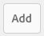

  To remove a configuration, click the **Delete** button located to the right of the configuration.

  To remove a configuration, click the** Delete** button.

  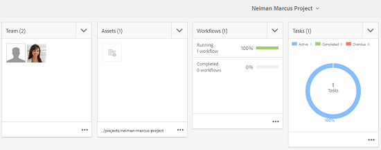

  *Features*

  The **Features** tab lets you enable or disable additional features of the component.

  For example, for an image component you can define the cropping proportions, allowed image orientations, and if uploads are allowed.

  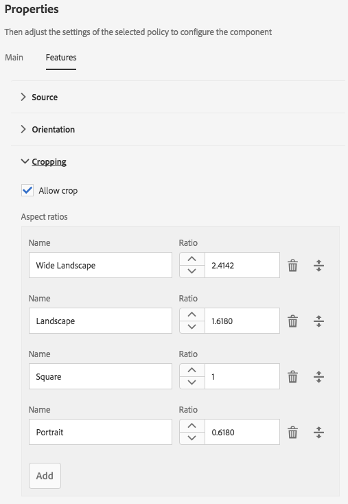

  >[!CAUTION]
  >
  >Note that in AEM crop ratios are defined as **height/width**. This differs from the conventional definition of width/height and is done for legacy compatibility reasons. The page authoring users will not be aware of any difference provided you define the **Name** clearly as this is what is displayed in the UI.

  >[!NOTE]
  >
  >[Content policies for components implementing the rich text editor](/help/sites-administering/rich-text-editor.md#main-pars-header-206036638) can only be defined for options made available by the RTE through its UI settings.  

* **Policy & Properties (Layout Container)**

  The policy and properties settings of a layout container are similar to the general usage, but with some differences.

  >[!NOTE]
  >
  >Configuring a policy is mandatory for container components as it enables you to define components that will be available in the container.

  The configuration window is divided in two, just as in the general usage of the window.

  ***Policy***

  The content (or design) policies define the design properties of a component. For example, the components available or minimum/maximum dimensions. These are applicable to the template (and pages created with the template).

  Under **Policy** you can select an existing policy to apply to the component via the drop-down. This functions just as it does in the general usage of the window.

  ***Properties***

  Under the **Properties** heading you can choose which components are available for the layout container and define their settings. The heading has three tabs:

    * Allowed Components
    * Default Components
    * Responsive Settings

  *Allowed Components*

  On the **Allowed Components** tab, you define which components are available for the layout container.

    * The components are grouped by their component groups, which can be expanded and collapsed.
    * An entire group can be selected, by checking the group name and all can be deselected by unchecking.
    * A minus represents at least one but not all items in a group are selected.
    * A search is available to filter for a component by name.
    * The counts listed to the right of the component group name represent the total number of selected components in those groups regardless of the filter.

  

  *Default Components*

  On the **Default Components** tab, you define which components are automatically associated with given media types so that when an author drags an asset from the asset browser, AEM knows with which component to associate it. Note that only components with drop zones are available for such configuration.

  Click **Add Mapping** to add an entirely new component and MIME type mapping.

  Select a component in the list and click **Add type** to add an additional MIME type to an already mapped component. Click the **Delete** icon to remove a MIME type.

  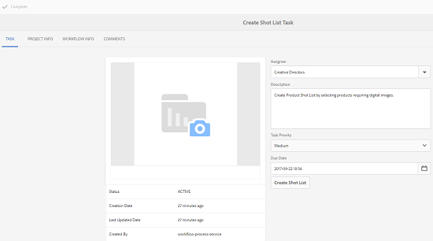

  *Responsive Settings*

  On the **Responsive Settings** tab you can configure the number of columns in the resulting grid of the layout container.

* **Unlock/Lock components**

  You unlock/lock components to define whether the content is available for change in **Initial Content** mode.

  When a component has been unlocked:

    * An open padlock indicator is shown in the border.
    * The component toolbar will be adjusted accordingly.
    * Any content already entered will no longer be shown in **Structure** mode.

        * Already entered content is considered initial content and is only visible in **Initial Content** mode.

    * The parents of the unlocked component cannot be moved, cut or deleted.

  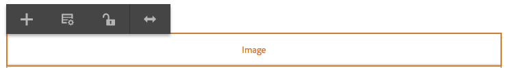

  This includes unlocking container components so that further components can be added, either in **Initial Content** mode or on resulting pages. If you have already added components/content to the container before unlocking it, then these are no longer shown when in **Structure** mode, but they are shown in **Initial Content** mode. In **Structure Mode**, only the container component itself is shown with its list of **Allowed Components**.

  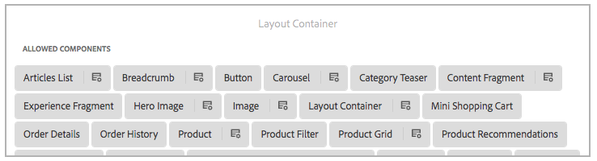

  To save space, the layout container does not grow to accommodate the list of allowed components. Rather the container becomes a scrollable list.

  Components that are configurable are shown with a **Policy** icon, which can be tapped or clicked to edit the policy and properties of that component.

  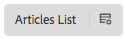

* **Relationship to Existing Pages**

  If the structure is updated after creating pages based on the template, then these pages will reflect the changes to the template. A warning is displayed in the toolbar to remind you of this fact along with confirmation dialogues.

  

### Editing a Template - Initial Content - Author {#editing-a-template-initial-content-author}

**Initial Content** mode is used to defined content that will appear when a page is first created based on the template. The initial content can then be edited by page authors.

Although all content created in **Structure** mode is visible in **Initial Content**, only components that have been unlocked can be selected and edited.

>[!NOTE]
>
>**Initial Content** mode can be thought of edit mode for pages created with that template. Therefore policies are not defined in **Initial Content** mode but rather in [**Structure** mode](/help/sites-authoring/templates.md#editing-a-template-structure-template-author).

* Unlocked components that are available for editing are marked. When selected they have a blue border:

  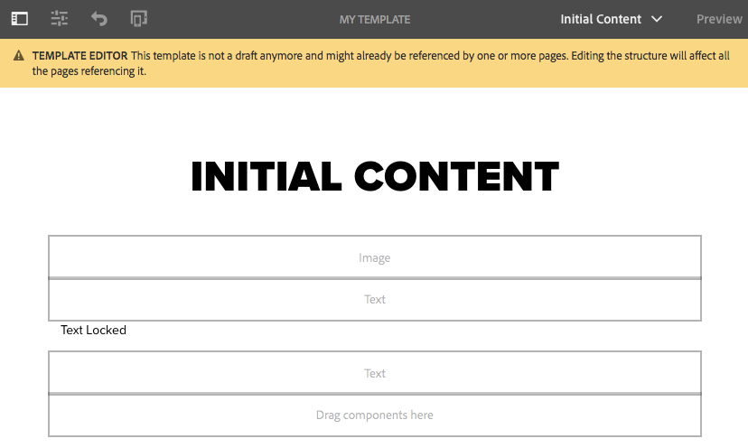

* Unlocked components have a toolbar allowing you to edit and configure the content:

  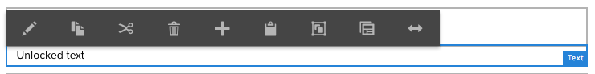

* If a container component has been unlocked (in **Structure** mode) then you can add new components to the container (in **Initial Content** mode). Components added in **Initial Content** mode can be moved on or deleted from resulting pages.

  You can add component using either the **Drag components here** area or the **Insert New Component** option from the toolbar of the appropriate container.

  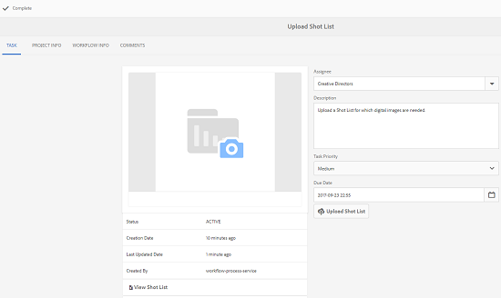 

* If the initial content of the template is updated after pages are created based on the template, then these pages will not be affected by changes to the initial content in the template.

>[!NOTE]
>
>Initial content is intended for preparing components and the page layout that serve as a starting point for creating the content. It is not intended to be the actual content that would remain as is. For this reason, initial content cannot be translated.
>
>If you need to include translatable text in your template such as in headers or footers, you can use the [localization features of the core components](https://experienceleague.adobe.com/docs/experience-manager-core-components/using/get-started/localization.html).

### Editing a Template - Layout - Template Author {#editing-a-template-layout-template-author}

You can define the template layout for a range of devices. [Responsive layout](/help/sites-authoring/responsive-layout.md) for templates operates as it does for page authoring.

>[!NOTE]
>
>Changes to the layout will be reflected in **Initial Content** mode, but no change is seen in **Structure** mode.

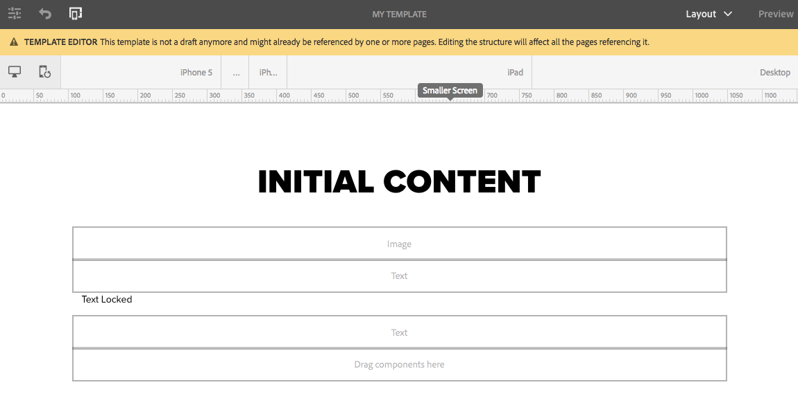

### Editing a Template - Page Design - Template Author/Developer {#editing-a-template-page-design-template-author-developer}

The page design including required client-side libraries and page policies are maintained under the **Page Design** option of the **Page Information** menu.

To access the **Page Design** dialog:

1. From the **Template Editor**, select **Page Information** from the toolbar, then **Page Design** to open the dialog.
1. The **Page Design** dialog opens and is divided into two sections:

    * The left half defines the [page policies](/help/sites-authoring/templates.md#page-policies)
    * The right half defines the [page properties](/help/sites-authoring/templates.md#page-properties)

   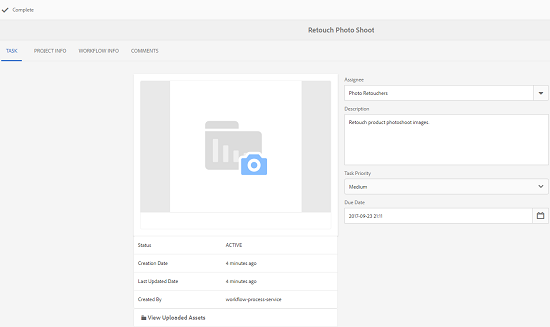

#### Page Policies {#page-policies}

You can apply a content policy to either the template or resultant pages. This defines the content policy for the main paragraph system on the page.

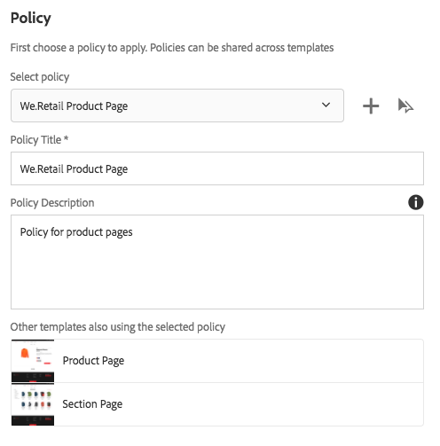

* You can select an existing policy for the page from the **Select policy** drop-down.

  

  A new policy can be added by selecting the add button next to the **Select policy** dropdown. A new title should then be given in the **Policy Title** field.

  

  The selected existing policy in the **Select policy** dropdown can be copied as a new policy using the copy button next to the dropdown. A new title should then be given in the **Policy Title** field. By default the copied policy will be titled **Copy of X**, where X is the title of the copied policy.

  

* Define a title for the policy in the **Policy Title** field. A policy is required to have a title so that it can be easily selected in the **Select policy** dropdown.

  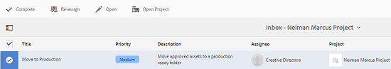

* A description of the policy is optional in the **Policy Description** field.
* In the **Other templates also using the selected policy** section, you can easily see which other templates use the policy selected in the **Select policy** dropdown.

  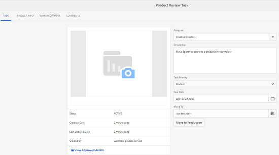

#### Page Properties {#page-properties}

Using page properties, you can define the required client-side libraries by using the **Page Design** dialog. These client-side libraries include stylesheets and javascript to be loaded with the template and pages created with that template.

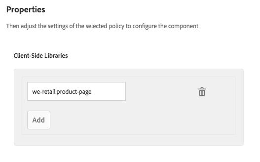

* Specify the client-side libraries you want applied to pages created with this template. Entering the name of a library in the text field in the **Client Side Libraries** section.

  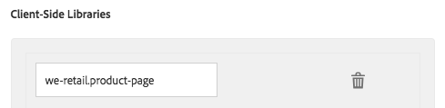

* If multiple libraries are needed, click the Add button to add an additional text field for the library name.

  

  Add as many text fields as necessary for your client-side libraries.

  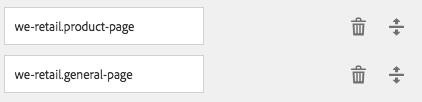

* Define the libraries' relative position as necessary by dragging the fields using the drag handle.

  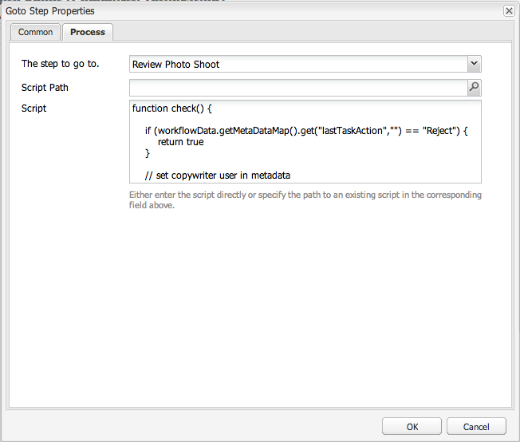

>[!NOTE]
>
>While the template author can specify the page policy on the template, they must get details of the appropriate client-side libraries from the developer.

### Editing a Template - Initial Page Properties - Author {#editing-a-template-initial-page-properties-author}

Using the **Initial Page Properties** option, you can define the initial [page properties](/help/sites-authoring/editing-page-properties.md) to be used when creating resultant pages.

1. From the template editor, select **Page Information** from the toolbar, then **Initial Page Properties** to open the dialog.

1. In the dialog you can define the properties you want applied to pages created with this template.

   

1. Confirm your definitions with **Done**.

## Best Practices {#best-practices}

When creating templates you should consider:

1. The impact of changes to the template once pages have been created from that template.

   Here is a list of the different operations possible on templates together with how they affect the pages created from them:

    * Changes to the structure:

        * These are immediately applied to the resulting pages.
        * Publication of the changed template is still needed for visitors to see the changes.

    * Changes to content policies and design configurations:

        * These apply immediately to the resultant pages.
        * Publication of the changes is needed for visitors to see the changes.

    * Changes to the initial content:

        * These only apply to pages created after the changes to the template.

    * Changes to the layout depend on whether the modified component is part of:

        * Structure-only - applied immediately
        * Contain initial content - only on pages created after the change

   Take special caution when:

    * Locking or unlocking components on enabled templates.
    * This can have side-effects, as existing pages can already be using it. Typically:

        * Unlocking components (that were locked) will be missing on existing pages.
        * Locking components (that were editable) will hide that content from being displayed on the pages.

   >[!NOTE]
   >
   >AEM gives explicit warnings when changing the lock status of components on templates that are no longer drafts.

1. [Creating your own folders](#creatingatemplatefolderdeveloper) for your site-specific templates.
1. [Publish your templates](#publishingatemplateauthor) from the **Templates** console.
