# Managing Projects{#managing-projects}

Projects lets you organize your project by grouping resources into one entity.

In the **Projects** console, you access and take action on your projects:

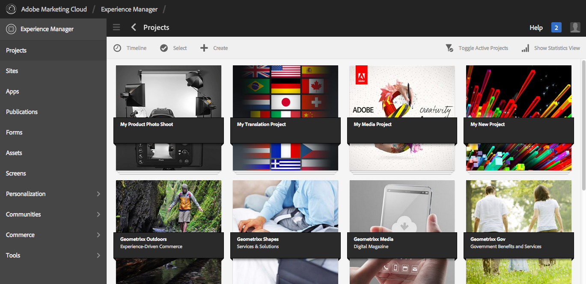

In Projects, you can create a project, associate resources with your project, and also delete a project or Resource links. You may want to open a tile to view its content as well as add items to a tile. This topic describes those procedures.

>[!NOTE]
>
>6.2 introduced the ability to organize Projects into folders. On the Projects page, you have the ability to create a project or a folder.
>
>If a folder is created, the user is then taken to that folder where they can create another folder or a project. It helps to organize projects into folders based on categories like product campaigns, location, translation languages, and so on.
>
>The projects and folders can be viewed in a list view and also searched.

>[!CAUTION]
>
>For users in projects to see other users/groups while using Projects functionality like creating projects, creating tasks/workflows, seeing and managing the team, those users need to have read access on **/home/users** and **/home/groups**. The easiest way to implement this is to give the **projects-users** group read access to **/home/users** and **/home/groups**.

## Creating a Project {#creating-a-project}

Out of the box, AEM provides these templates to choose from when you create a project:

* Simple Project
* Media Project
* Product Photo Shoot Project
* Translation Project

The procedure of creating a project is the same from project to project. The difference between the types of projects includes available [user roles](/help/sites-authoring/projects.md) and [workflows](/help/sites-authoring/projects-with-workflows.md).  To create a new project:

1. In **Projects**, tap/click **Create** to open the **Create Project** wizard:
1. Select a template. Out of the box, Simple Project, Media Project, [Translation Project](/help/sites-administering/tc-manage.md), and [Product Photo Shoot Product](/help/sites-authoring/managing-product-information.md) are available and click **Next**. 

   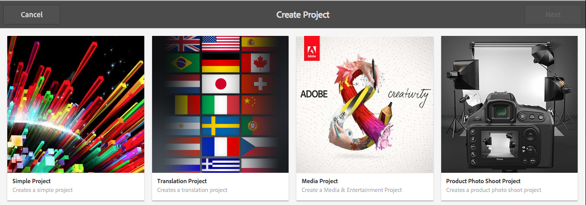

1. Define the **Title** and **Description** and add a **Thumbnail** image if required. You also add or delete users and what group they belong to. In addition, click **Advanced** to add a name used in the URL.

   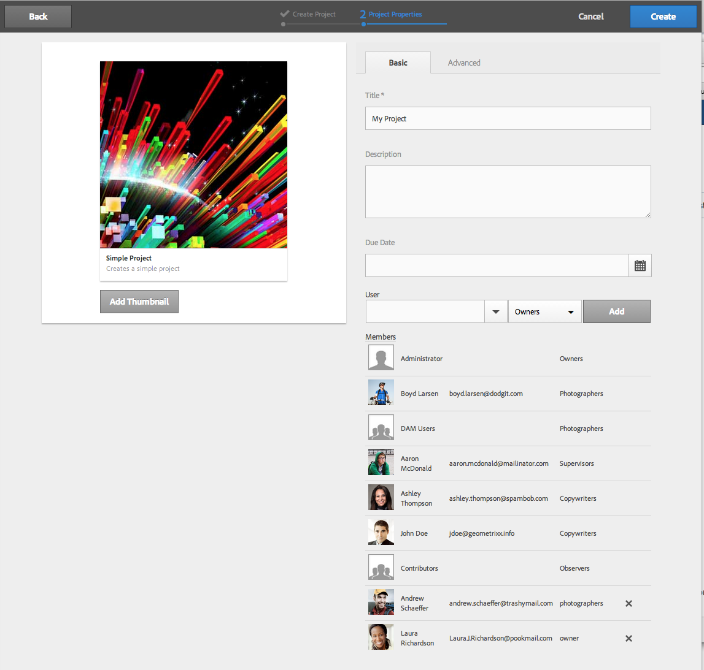

1. Tap/click **Create**. The confirmation asks whether you want to open your new project or to return to the console.

### Associating Resources with your Project {#associating-resources-with-your-project}

As projects enable you to group resources into one entity, you want to associate resources to your project. These resources are called **Tiles**. The types of resources you can add are described in [Project Tiles](/help/sites-authoring/projects.md#project-tiles).

To associate resources with your project:

1. Open your project from the **Projects** console.
1. Tap/click **Add Tile** and select the tile that you want to link to your project. You can select multiple types of tiles.

   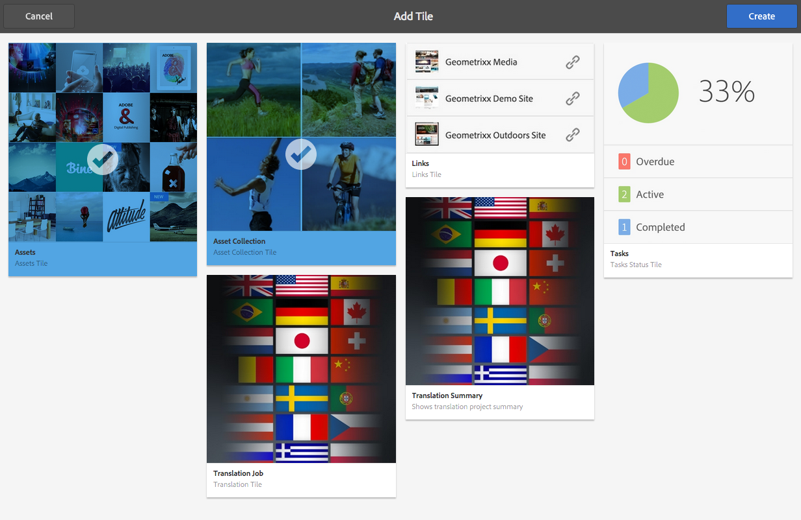

   >[!NOTE]
   >
   >Project tiles that can be associated with a project are described in detail in [Project tiles.](/help/sites-authoring/projects.md#project-tiles)

1. Tap/click **Create**. Your resource is linked to your project and from now on you can access it from your project.

### Deleting a Project or Resource Link {#deleting-a-project-or-resource-link}

The same method is used to delete a project from the console or a linked resource from your project:

1. Navigate to the appropriate location:

    * To delete a project go to the top level of the **Projects** console.
    * To delete a resource link within a project, open your project in the **Projects** console.

1. Enter selection mode by clicking **Select** and selecting your project or resource link.
1. Tap/click **Delete**.  

1. You need to confirm the deletion in a dialog. If confirmed, the project or resource link is deleted. Tap/click **Deselect** to exit selection mode.

>[!NOTE]
>
>When you create the project and add users to the various roles, groups associated with the project are automatically created to manage associated permissions. For example, a project called Myproject would have three groups **Myproject Owners**, **Myproject Editors**, **Myproject Observers**. However, if the project is deleted, those groups are not automatically deleted. An administrator needs to manually delete the groups in **Tools** &gt; **Security** &gt; **Groups**.

### Adding Items to a Tile {#adding-items-to-a-tile}

In some tiles, you may want to add more than one item. For example, you may have more than one workflow running at once or more than one experience.

To add items to a Tile:

1. In **Projects**, navigate to the project and click the Add + icon on the tile you want to add an item to.

   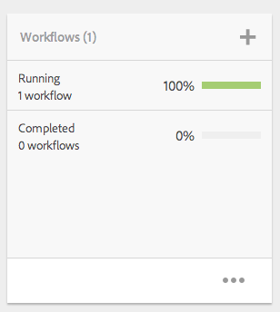

1. Add an item to the tile as you would when creating a new tile. Project tiles are described [here](/help/sites-authoring/projects.md#project-tiles). In this example, another workflow was added.

   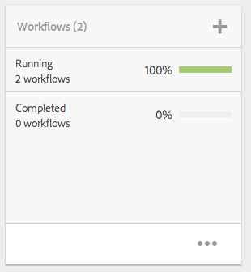

### Opening a Tile {#opening-a-tile}

You may want to see what items are included in a current tile, or modify or delete items in the tile.

To open a tile so that you can view or modify items:

1. In the Projects console, tap/click the ellipses (...)

   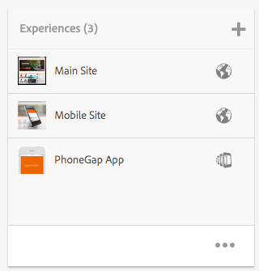

1. AEM lists the items in that tile. You can enter selection mode to modify or delete the items.

   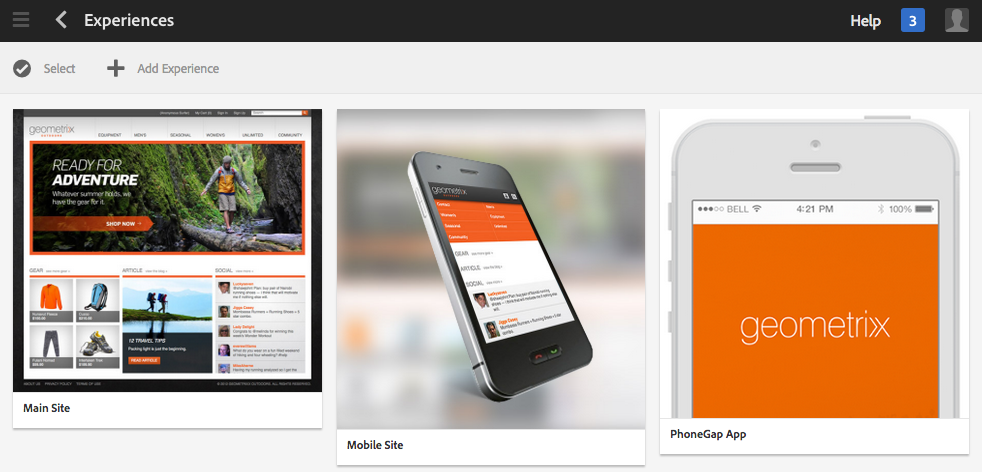

## Viewing Project Statistics {#viewing-project-statistics}

To view project statistics, in the **Projects** console, click **Show Statistics View**. The level of completion for each project displays. Click **Show Statistics View** again to go to the **Projects** console.

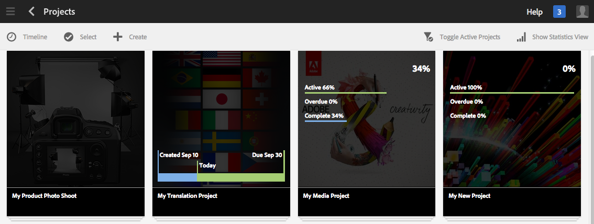 

### Viewing a Project Timeline {#viewing-a-project-timeline}

The project timeline provides information on when assets in the project were last used. To view the project timeline, click/tap **Timeline**, then enter selection mode and select the project. Assets are displayed in the left pane. Click/tap **Timeline** to return to the **Projects** console.

 

### Viewing Active/Inactive Projects {#viewing-active-inactive-projects}

To toggle between your active and inactive projects, in the **Projects** console, click **Toggle Active Projects**. If the icon has a checkmark next to it, it is displaying the active projects.

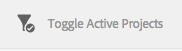

If the icon has an x next to, it is displaying the inactive projects.

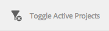 

## Making Projects Inactive or Active {#making-projects-inactive-or-active}

You may want to make a project inactive if you've completed it but you still want to keep the information on the project.

To make a project inactive (or active):

1. In the **Projects** console, open your project and then find the **Project information** tile.

   >[!NOTE]
   >
   >You may need to add this tile if it is not already in your project. See [Adding Tiles](#adding-items-to-a-tile).

1. Tap/click **Edit**.
1. Change the selector from **Active** to **Inactive** (or vice versa).

   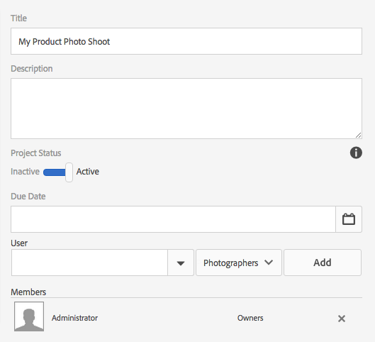

1. Tap/click **Done** to save your changes.

