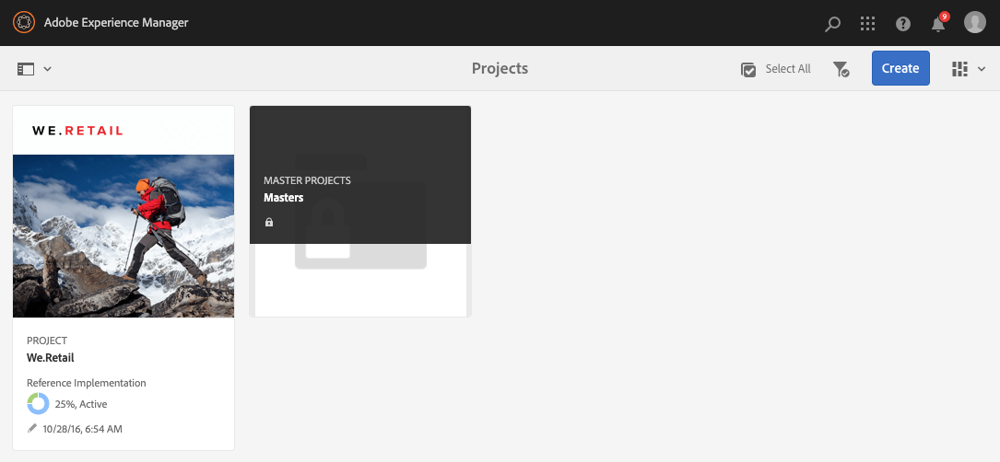
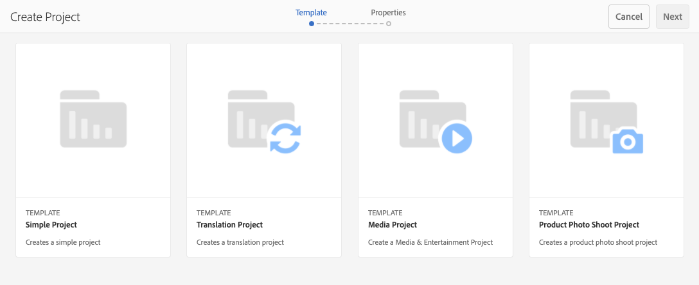
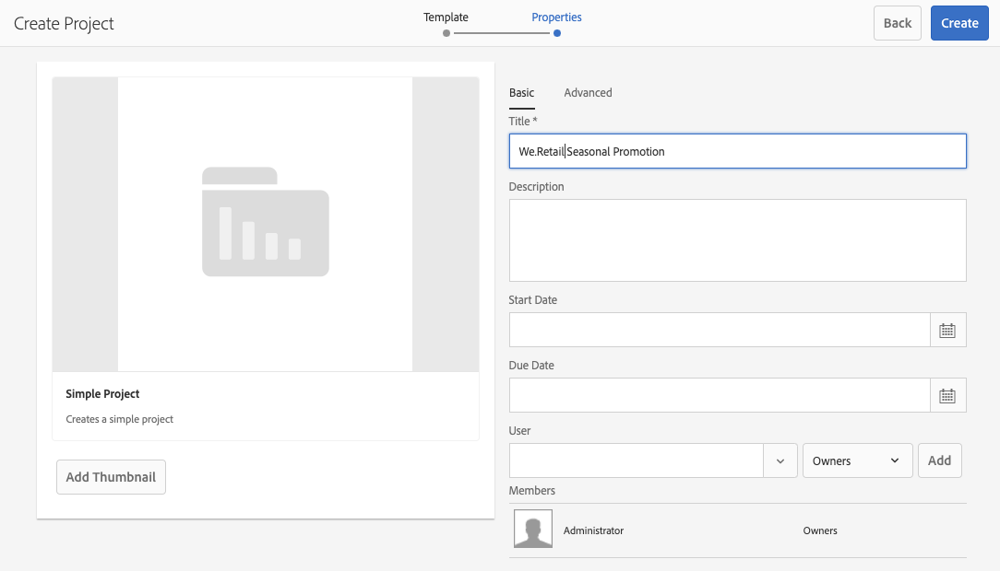
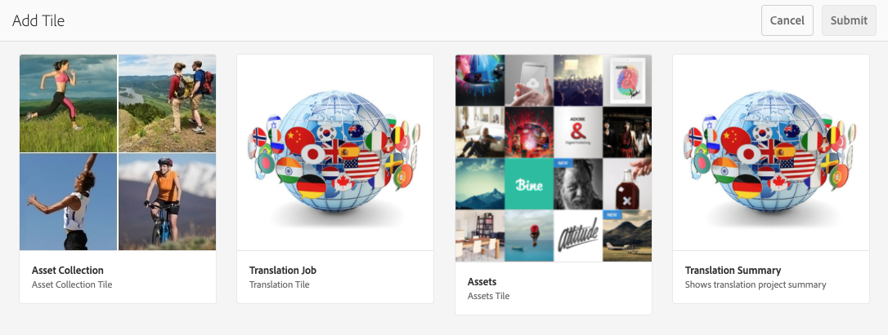
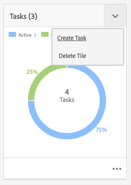
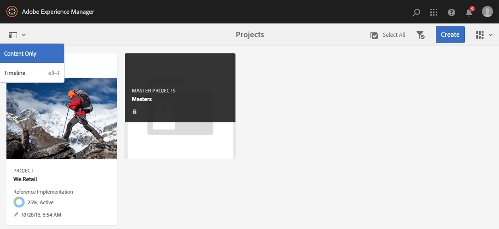
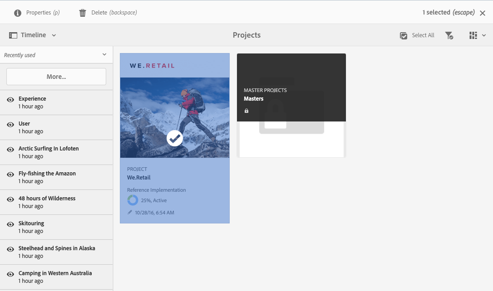
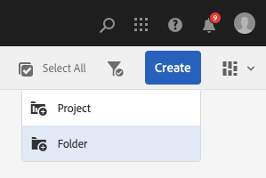
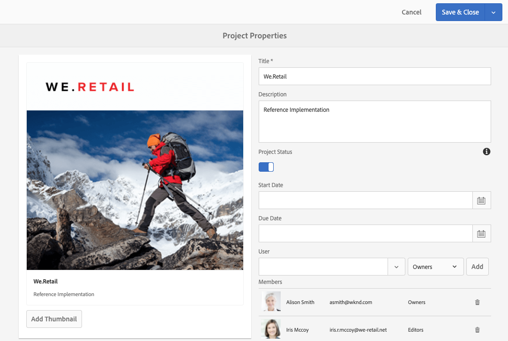
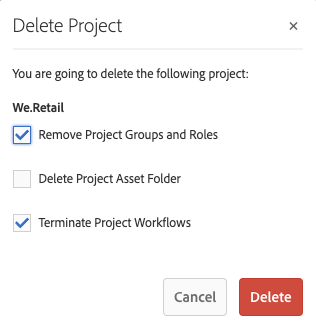

# Managing Projects {#managing-projects}

In the **Projects** console, you access and manage your projects.

Using the console, you can create a project, associate resources with your project, and also delete a project or resource links. 

## Access Requirements {#access-requirements}

Projects a standard AEM feature and do not require any additional setup.

However for users in projects to see other users/groups while using Projects such as when creating projects, creating tasks/workflows, or viewing and managing the team, those users need to have read access on `/home/users` and `/home/groups`.

The easiest way to do this is to give the **projects-users** group read access to `/home/users` and `/home/groups`.

## Creating a Project {#creating-a-project}

Follow these steps to create a project.

1. In the **Projects** console, click **Create** to open the **Create Project** wizard.
1. Select a template and click **Next**. You can learn more about the standard project templates [here.](/help/sites-authoring/projects.md#project-templates)

   

1. Define the **Title** and **Description** and add a **Thumbnail** image if necessary. You also add or delete users and what group they belong to.

   

1. Click **Create**. The confirmation asks whether you want to open your new project or to return to the console.

The procedure for creating a project is the same for all project templates. The difference between the types of projects relates to available [user roles](/help/sites-authoring/projects.md) and [workflows.](/help/sites-authoring/projects-with-workflows.md)

### Associating Resources with Your Project {#associating-resources-with-your-project}

Projects enable you to group resources into one entity to manage them as a whole. Therefore you need to associate resources to your project. These resources are grouped within the project as **Tiles**. The types of resources you can add are described in [Project Tiles](/help/sites-authoring/projects.md#project-tiles).

To associate resources with your project:

1. Open your project from the **Projects** console.
1. Click **Add Tile** and select the tile that you want to link to your project. You can select multiple types of tiles.

   

1. Click **Create**. Your resource is linked to your project and from now on you can access it from your project.

### Adding Items to a Tile {#adding-items-to-a-tile}

In some tiles, you may want to add more than one item. For example, you may have more than one workflow running at once or more than one experience.

To add items to a tile:

1. In **Projects**, navigate to the project and click the downward chevron icon at the top-right of the tile you want to add an item to and select the appropriate option.

   * The option depends on the type of tile. For example, it may be **Create Task** for the **Tasks** tile or **Start Workflow** for the **Workflows** tile.

   

1. Add the item to the tile as you would when creating a tile. Project tiles are described [here.](/help/sites-authoring/projects.md#project-tiles)

## Viewing Project Information {#viewing-project-info}

The main purpose of projects is to group associated information in one place to make it more accessible and actionable. You have several ways to access this information.

### Opening a Tile {#opening-a-tile}

You may want to see what items are included in a current tile, or modify or delete items in the tile.

To open a tile so that you can view or modify items:

1. Click the ellipses icon at the bottom-right of the tile.

   

1. AEM opens the console for the types of items associated with the tile and filters based on the project selected.

   

### Viewing a Project Timeline {#viewing-a-project-timeline}

The project timeline provides information on when assets in the project were last used. To view the project timeline follow these steps.

1. In the **Projects** console, click **Timeline** in the rail selector at the top-left of the console.
   
2. In the console select the project for which you wish to view its timeline.
   

Assets are displayed in the rail. Use the rail selector to return to normal view when finished.

### Viewing Inactive Projects {#viewing-active-inactive-projects}

To toggle between your active and [inactive projects,](#making-projects-inactive-or-active) in the **Projects** console, click the **Toggle Active Projects** icon in the toolbar.

By default the console shows active projects. Click the **Toggle Active Projects** icon once to switch to viewing inactive projects. Click it again to switch back to active projects.

## Organizing Projects {#organizing-projects}

There are several options available to help organize your projects to keep the **Projects** console manageable.

### Project Folders {#project-folders}

You can create folders in the **Projects** console to group and organize similar projects.

1. In the **Projects** console click **Create** and then **Create Folder**.

   

1. Give your folder a title and click **Create**.

1. The folder is added to the console.

You can now create projects within the folder. You can create multiple folders and also nest folders. 

### Inactivating Projects {#making-projects-inactive-or-active}

You may want to mark a project inactive if it s completed but you still want to keep the information about the project. [Inactive projects do now show](#viewing-active-inactive-projects) by default in the **Projects** console.

To make a project inactive follow these steps.

1. Open the **Project Properties** window of the project.
   * You can do this from the console by selecting the project or from within the project via the **Project Info** tile.
1. In the **Project Properties** window, change the **Project Status** slider from **Active** to **Inactive**.

   

1. Click **Save &amp; Close** to save your changes.

### Deleting Projects {#deleting-a-project}

Follow these steps to delete a project.

1. Navigate to the top-level of the **Projects** console.
1. Selecting your project in the console.
1. Click **Delete** in the toolbar.
1. AEM can remove/modify associated project data upon project deletion. Select which options you need in the **Delete Project** dialog.
   * Remove Project Groups and Roles
   * Delete Project Assets Folder
   * Terminate Project Workflows

   
1. Click **Delete** to delete the project with the options selected.

To learn more about groups automatically created by projects see [Automatic Group Creation](/help/sites-authoring/projects.md#auto-group-creation) for details.
