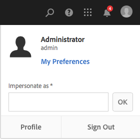
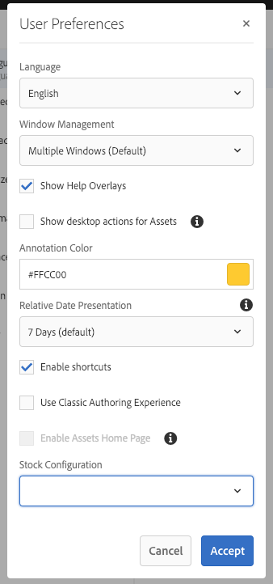

# Configuring Your Account Environment{#configuring-your-account-environment}

AEM provides you with the capability to configure your account and certain aspects of the author environment.

Using the [User](/help/sites-authoring/user-properties.md#user-settings) option in the [header](/help/sites-authoring/basic-handling.md#the-header) and the associated [My Preferences](#userpreferences) dialog, you can modify your user options such as.

Begin by accessing the [User](/help/sites-authoring/user-properties.md#user-settings) option in the header.

## User Settings {#user-settings}

The **User** settings dialog gives you access to:

* Impersonate as

    * With the [Impersonate as](/help/sites-administering/security.md#impersonating-another-user) functionality a user can work on behalf of another user.

* Profile

    * Offers a convenient link to your [user settings](/help/sites-administering/security.md))

* [My Preferences](/help/sites-authoring/user-properties.md#my-preferences)

    * Specify various preference settings unique to your user

### My Preferences {#my-preferences}

The **My Preferences** dialog is access via the [User](/help/sites-authoring/user-properties.md#user-settings) option in the header.

Each user can set certain properties for themselves.

* **Language**

  This defines the language to use for the UI of the authoring environment. Select the required language from the available list.

  This configuration is also used for the classic UI.

* **Window Management**

  This defines the behavior or opening windows. Select either:

    * **Multiple Windows** (Default)

        * Pages are opened in a new window.

    * **Single Window**

        * Pages are opened in the current window.

* **Show desktop actions for Assets**

  This option requires an AEM desktop app to use.

* **Annotation Color**

  This defines the default color used when making annotations.

    * Click the color block so you can open the swatch selector and select a color.
    * Alternatively, enter the hex code for the desire color in the field.

* **Relative Date Presentation**

  To improve readability, AEM renders dates within the last seven days as relative dates (for example, Three days ago) and older dates as exact dates (for example, 20 March 2017).

  This option defines how dates in the system are displayed. The following options are available:

    * **Always show exact date**: The exact date is always displayed (never a relative date).
    * **1 Day**: The relative date is shown for dates within one day, otherwise an exact date is shown.

    * **7 Days (default)**: The relative date is shown for dates within seven days, otherwise an exact date is shown.

    * **1 Month**: The relative date is shown for dates within one month, otherwise an exact date is shown.

    * **1 Year**: The relative date is shown for dates within one year, otherwise an exact date is shown.

    * **Always show relative date**: Exact dates are never shown and only relative dates are shown.

* **Enable Shortcuts**

  AEM supports several keyboard shortcuts that make authoring more efficient.

    * [Keyboard shortcuts for editing pages](/help/sites-authoring/page-authoring-keyboard-shortcuts.md)
    * [Keyboard shortcuts for consoles](/help/sites-authoring/keyboard-shortcuts.md)

  This option enables keyboard shortcuts. By default they are enabled, but can be disabled, for example,  if a user has certain accessibility requirements.

* **Use Classic Authoring Experience**

  This option enables [classic UI](/help/sites-classic-ui-authoring/classic-page-author-first-steps.md)-based page authoring. By default the standard UI is used.

* **Enable Assets Home Page**

  This option is only available if your system administrator has enabled the Assets Home Page experience for the entire organization.

* **Stock Configuration**

  This option lets you specify the preferred Adobe Stock configuration and is only available if your system administrator has enabled [Adobe Stock integration](/help/assets/aem-assets-adobe-stock.md).
