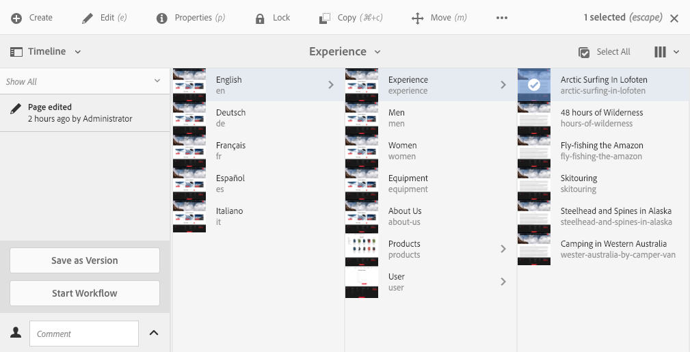
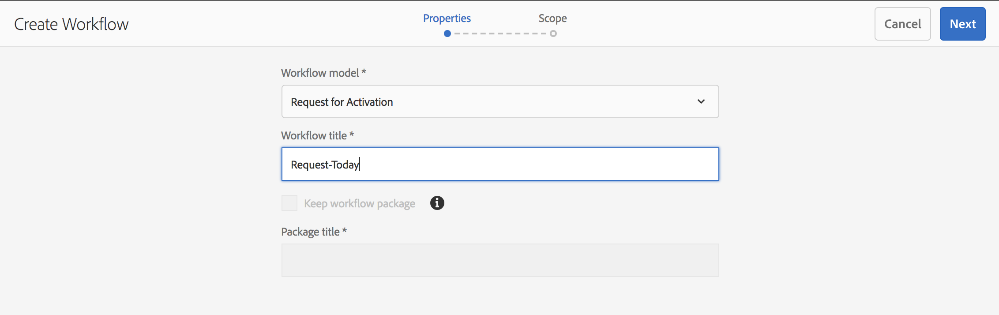

# Applying Workflows to Pages{#applying-workflows-to-pages}

When authoring, you can invoke workflows to take action on your pages; it is also possible to apply more than one workflow.

When you apply the workflow, you specify the following information:

* The workflow to apply.
  You can apply any workflow (that you have access to, as assigned by your AEM administrator).
* Optionally, a title that helps identify the workflow instance in a user's Inbox.
* The workflow payload; this can be one or more pages.

Workflows can be started from:

* [the Sites console](#starting-a-workflow-from-the-sites-console).
* [when editing a page, from Page Information](#starting-a-workflow-from-the-page-editor).

>[!NOTE]
>
>See also:
>
>* [How to apply workflows to DAM assets](/help/assets/assets-workflow.md).
>* [Working with Project Workflows](/help/sites-authoring/projects-with-workflows.md).
>

>[!NOTE]
>
>AEM administrators can [start workflows using several other methods](/help/sites-administering/workflows-starting.md).

## Starting a Workflow from the Sites Console {#starting-a-workflow-from-the-sites-console}

You can start a workflow from either:

* [the Create option of the Sites toolbar](#starting-a-workflow-from-the-sites-toolbar).
* [the Timeline rail of the Sites console](#starting-a-workflow-from-the-timeline).

In both cases you will need to:

* [Specify the Workflow Details in the Create Workflow Wizard](#specifying-workflow-details-in-the-create-workflow-wizard).

### Starting a Workflow from the Sites Toolbar {#starting-a-workflow-from-the-sites-toolbar}

You can start a workflow from the toolbar of the **Sites** console:

1. Navigate to and select the required page.

1. From the **Create** option in the toolbar you can now select **Workflow**.

   

1. The **Create Workflow** wizard will help you [specify the workflow details](#specifying-workflow-details-in-the-create-workflow-wizard).

### Starting a Workflow from the Timeline {#starting-a-workflow-from-the-timeline}

From the **Timeline** you can start a workflow to be applied to your selected resource.

1. [Select the resource](/help/sites-authoring/basic-handling.md#viewingandselectingyourresources) and open [Timeline](/help/sites-authoring/basic-handling.md#timeline) (or open Timeline and then select the resource).
1. The arrowhead by the comment field can be used to reveal **Start Workflow**:

   

1. The **Create Workflow** wizard will help you [specify the workflow details](#specifying-workflow-details-in-the-create-workflow-wizard).

### Specifying Workflow Details in the Create Workflow Wizard {#specifying-workflow-details-in-the-create-workflow-wizard}

The **Create Workflow** wizard will help you select the workflow and specify the required details.

After opening the **Create Workflow** wizard from either:

* [the Create option of the Sites toolbar](#starting-a-workflow-from-the-sites-toolbar).
* [the Timeline rail of the Sites console](#starting-a-workflow-from-the-timeline).

You can specify details:

1. In the **Properties** step, the basic options of the workflow are defined:

    * **Workflow model**
    * **Workflow title**

        * You can specify a title for this instance, to help you identify it at a later stage.

   Depending on the workflow model, the following options are also available. These allow the package created as payload to be kept after the workflow completes.

    * **Keep workflow package**
    * **Package title**

        * You can specify a title for the package, to help identification.

   >[!NOTE]
   >
   >The **Keep workflow package** option is available when the workflow has been configured for [Multi Resource Support](/help/sites-developing/workflows-models.md#configuring-a-workflow-for-multi-resource-support) and multiple resources have been selected.

   When complete, use **Next** to proceed.

   

1. In the **Scope** step you can select:

    * **Add Content** to open the [path browser](/help/sites-authoring/author-environment-tools.md#path-browser) and select additional resources; when in the browser, click/tap **Select** to add the content to the workflow instance.

    * An existing resource to see additional actions:

        * **Include children** to specify that children of that resource will be included in the workflow.
          A dialog will open allowing you to refine the selection according to:

            * Include only immediate children.
            * Include only modified pages.
            * Include only already published pages.

          Any children specified are added to the list of resources to which the workflow will apply.

        * **Remove Selection** to remove that resource from the workflow.

   

   >[!NOTE]
   >
   >If you add additional resources, then you can use **Back** to adjust the setting for **Keep workflow package** in the **Properties** step.

1. Use **Create** to close the wizard and create the workflow instance. A notification is displayed in the Sites console.

## Starting a Workflow from the Page Editor {#starting-a-workflow-from-the-page-editor}

When editing a page you can select **Page Information** from the toolbar. The drop down menu has the option **Start in Workflow**. This will open a dialog where you can specify the required workflow, together with a title if required:

