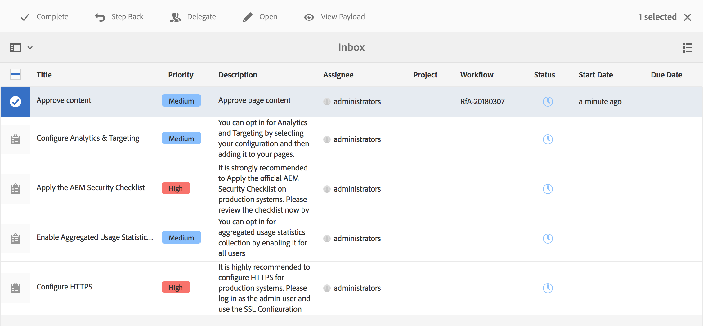
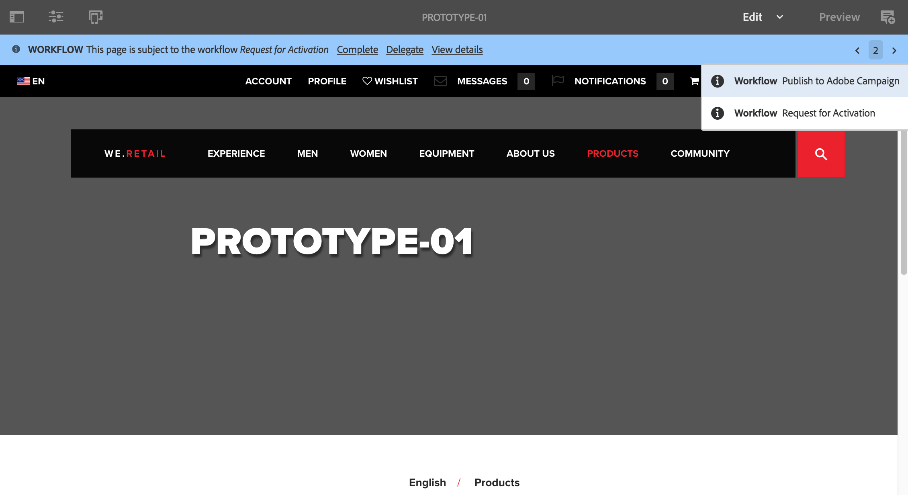
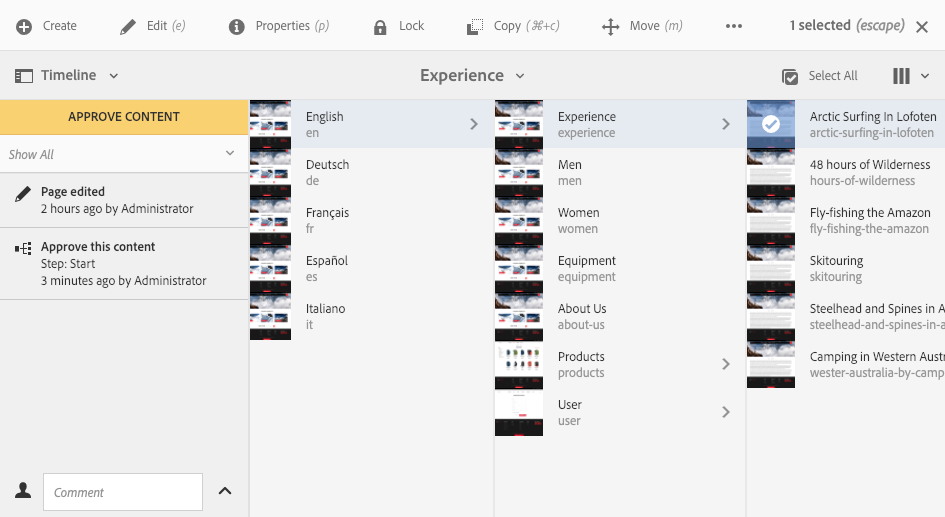
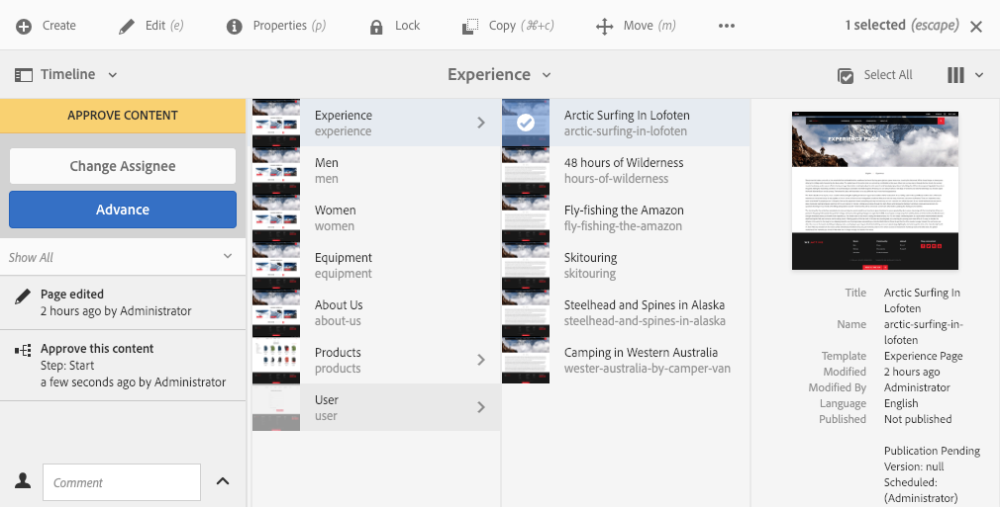
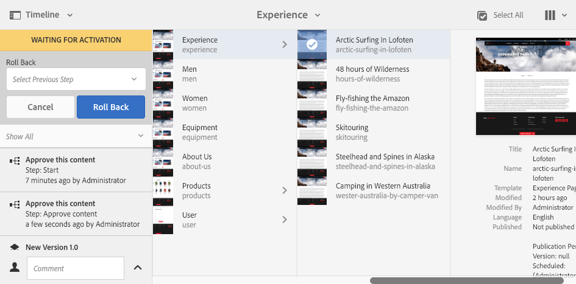
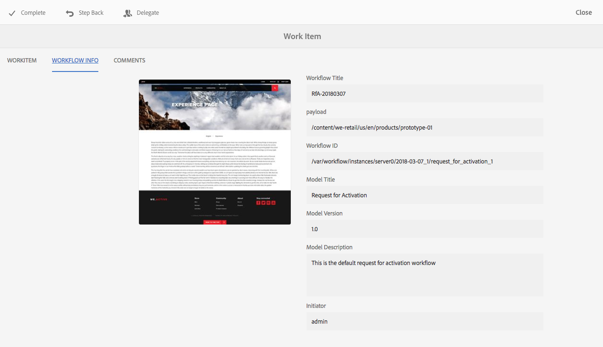
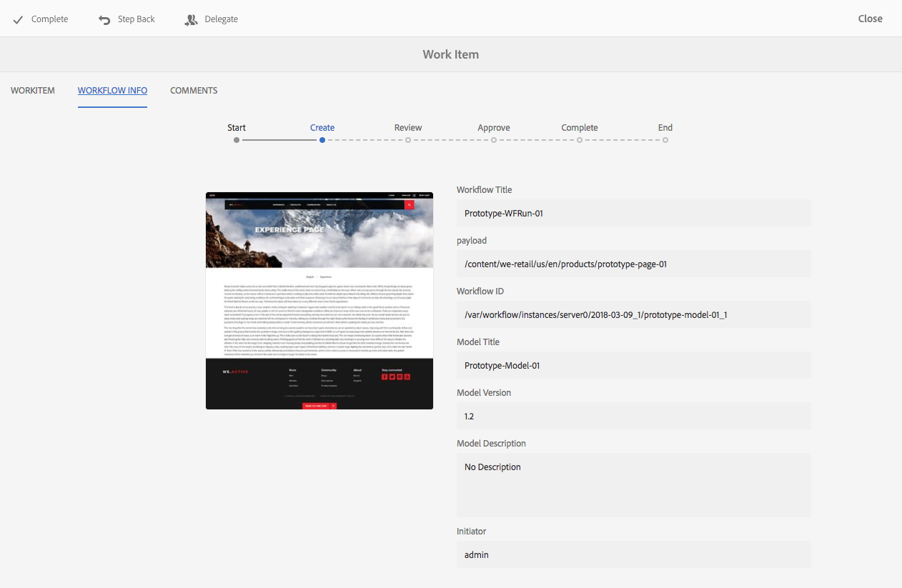

# Participating in Workflows{#participating-in-workflows}

Workflows typically include steps that require a person to perform an activity on a page or asset. The workflow selects a user or group to perform the activity and assigns a work item to that person or group. The user receives notification and can then take the appropriate action:

* [Viewing Notifications](#notifications-of-available-workflow-actions)
* [Complete a Participant Step](#completing-a-participant-step)
* [Delegate a Participant Step](#delegating-a-participant-step)
* [Perform Step Back on a Participant Step](#performing-step-back-on-a-participant-step)
* [Open a Workflow Item to View Details (and Take Actions)](#opening-a-workflow-item-to-view-details-and-take-actions)
* [View the Workflow Payload (Multiple Resources)](#viewing-the-workflow-payload-multiple-resources)

## Notifications of Available Workflow Actions {#notifications-of-available-workflow-actions}

When you are assigned a work item (for example, **Approve Content**) various alerts and/or notifications appear:

* Your [notification](/help/sites-authoring/inbox.md) indicator (toolbar) will be incremented:

  

* The item will be listed in your notification [Inbox](/help/sites-authoring/inbox.md):

  

* When you are using the page editor the status bar will show:

    * The name of the workflow(s) being applied to the page; for example Request for Activation.
    * Any actions available to the current user for the current step of the workflow; for example, Complete, Delegate, View details.
    * The number of workflows that the page is subject to. You can:

        * use the left/right arrows to navigate through the status information of the various workflows.
        * click/tap on the actual number to open a drop down list of all applicable workflows, then select the workflow you want displayed in the status bar.

  

  >[!NOTE]
  >
  >The status bar is only visible to users with workflow privileges; for example, members of the `workflow-users` group.
  >
  >
  >Actions are shown when the current user is directly involved in the current step of the workflow.

* When **Timeline** is open for the resource, the workflow step will be shown. When you click/tap on the alert banner, the available actions will also be shown:

  

### Completing a Participant Step {#completing-a-participant-step}

You can complete an item to allow the workflow to progress to the next step.

On this action you can indicate:

* **Next Step**: the next step to be taken; you can select from a list provided
* **Comment**: if required

You can complete a participant step from either:

* [the Inbox](#completing-a-participant-step-inbox)
* [the Page Editor](#completing-a-participant-step-page-editor)
* [Timeline](#completing-a-participant-step-timeline)
* when [opening a workflow item to view details](#opening-a-workflow-item-to-view-details-and-take-actions).

#### Completing a Participant Step - Inbox {#completing-a-participant-step-inbox}

Use the following procedure to complete the work item:

1. Open the **[AEM Inbox](/help/sites-authoring/inbox.md)**.
1. Select the workflow item you want to take action on (tap/click on the thumbnail).
1. Select **Complete** from the toolbar.
1. The **Complete Work Item** dialog will open. Select the **Next Step** from the drop down selector and add a **Comment** if required.
1. Use **OK** to complete the step (or the **Cancel** to abort the action).

#### Completing a Participant Step - Page Editor {#completing-a-participant-step-page-editor}

Use the following procedure to complete the work item:

1. Open the [page for editing](/help/sites-authoring/managing-pages.md#opening-a-page-for-editing).
1. Select **Complete** from the status bar at the top.
1. The **Complete Work Item** dialog will open. Select the **Next Step** from the drop down selector and add a **Comment** if required.
1. Use **OK** to complete the step (or the **Cancel** to abort the action).

#### Completing a Participant Step - Timeline {#completing-a-participant-step-timeline}

You can also use timeline to complete and advance a step:

1. Select the required page and open **Timeline** (or open **Timeline** and select the page):

   

1. Click/tap on the alert banner to show available actions. Select **Advance**:

   

1. Depending on the workflow, you can select the next step:

   

1. Select **Advance** to confirm the action.

### Delegating a Participant Step {#delegating-a-participant-step}

If a step has been assigned to you, but for any reason you are unable to take action, you can delegate the step to another user or group.

The users who are available for delegation depend on who was assigned the work item:

* If the work item was assigned to a group, the group members are available.
* If the work item was assigned to a group and then delegated to a user, the group members and the group are available.
* If the work item was assigned to a single user, the work item cannot be delegated.

On this action you can indicate:

* **User**: the user you want to delegate to; you can select from a list provided
* **Comment**: if required

You can delegate a participant step from either:

* [the Inbox](#delegating-a-participant-step-inbox)
* [the Page Editor](#delegating-a-participant-step-page-editor)
* [Timeline](#delegating-a-participant-step-timeline)
* when [opening a workflow item to view details](#opening-a-workflow-item-to-view-details-and-take-actions).

#### Delegating a Participant Step - Inbox {#delegating-a-participant-step-inbox}

Use the following procedure to delegate a work item:

1. Open the **[AEM Inbox](/help/sites-authoring/inbox.md)**.
1. Select the workflow item you want to take action on (tap/click on the thumbnail).
1. Select **Delegate** from the toolbar.
1. The dialog will open. Specify the **User** from the drop down selector (this can also be a group) and add a **Comment** if required.
1. Use **OK** to complete the step (or the **Cancel** to abort the action).

#### Delegating a Participant Step - Page Editor {#delegating-a-participant-step-page-editor}

Use the following procedure to delegate a work item:

1. Open the [page for editing](/help/sites-authoring/managing-pages.md#opening-a-page-for-editing).
1. Select **Delegate** from the status bar at the top.
1. The dialog will open. Specify the **User** from the drop down selector (this can also be a group) and add a **Comment** if required.
1. Use **OK** to complete the step (or the **Cancel** to abort the action).

#### Delegating a Participant Step - Timeline {#delegating-a-participant-step-timeline}

You can also use timeline to delegate and/or assign a step:

1. Select the required page and open **Timeline** (or open **Timeline** and select the page).
1. Click/tap on the alert banner to show available actions. Select **Change Assignee**:

   

1. Specify a new assignee:

   

1. Select **Assign** to confirm the action.

### Performing Step Back on a Participant Step {#performing-step-back-on-a-participant-step}

If you discover that a step, or series of steps, needs to be repeated you can step back. This allows you to select a step, that occurred earlier in the workflow, for reprocessing. The workflow returns to the step you specify, then proceeds from there.

On this action you can indicate:

* **Previous Step**: the step to be returned to; you can select from a list provided
* **Comment**: if required

You can perform step back on a participant step from either:

* [the Inbox](#performing-step-back-on-a-participant-step-inbox)
* [the Page Editor](#performing-step-back-on-a-participant-step-page-editor)
* [Timeline](#performing-step-back-on-a-participant-step-timeline)
* when [opening a workflow item to view details](#opening-a-workflow-item-to-view-details-and-take-actions).

#### Performing Step Back on a Participant Step - Inbox {#performing-step-back-on-a-participant-step-inbox}

Use the following procedure to step back:

1. Open the **[AEM Inbox](/help/sites-authoring/inbox.md)**.
1. Select the workflow item you want to take action on (tap/click on the thumbnail).
1. Select **Step Back** to open the dialog.

1. Specify the **Previous Step** and add a **Comment** if required.
1. Use **OK** to complete the step (or the **Cancel** to abort the action).

#### Performing Step Back on a Participant Step - Page Editor {#performing-step-back-on-a-participant-step-page-editor}

Use the following procedure to step back:

1. Open the [page for editing](/help/sites-authoring/managing-pages.md#opening-a-page-for-editing).
1. Select **Step Back** from the status bar at the top.
1. Specify the **Previous Step** and add a **Comment** if required.
1. Use **OK** to complete the step (or the **Cancel** to abort the action).

#### Performing Step Back on a Participant Step - Timeline {#performing-step-back-on-a-participant-step-timeline}

You can also use timeline to roll (step) back to a previous step:

1. Select the required page and open **Timeline** (or open **Timeline** and select the page).
1. Click/tap on the alert banner to show available actions. Select **Roll back**:

   

1. Specify the step the workflow should return to:

   

1. Select **Roll back** to confirm the action.

### Opening a Workflow Item to View Details (and Take Actions) {#opening-a-workflow-item-to-view-details-and-take-actions}

View details of the workflow work item and take appropriate actions.

The workflow details are shown in tabs and appropriate actions are available in the toolbar:

* **WORKITEM** tab:

  

* **WORKFLOW INFO** tab:

  

  If [Workflow Stages](/help/sites-developing/workflows.md#workflow-stages) have been configured for the model, you can view the progress according to these:

  

* **COMMENTS** tab:

  

You can open the work item details from either:

* [the Inbox](#performing-step-back-on-a-participant-step-inbox)
* [the Page Editor](#performing-step-back-on-a-participant-step-page-editor)

#### Opening Workflow Details - Inbox {#opening-workflow-details-inbox}

To open a workflow item and view the details:

1. Open the **[AEM Inbox](/help/sites-authoring/inbox.md)**.
1. Select the workflow item you want to take action on (tap/click on the thumbnail).
1. Select **Open** to open the information tabs.

1. If required, select the appropriate action, supply any details and confirm with **OK** (or **Cancel**).
1. Use **Save** or **Cancel** to exit.

#### Opening Workflow Details - Page Editor {#opening-workflow-details-page-editor}

To open a workflow item and view the details:

1. Open the [page for editing](/help/sites-authoring/managing-pages.md#opening-a-page-for-editing).
1. Select **View Details** from the status bar to open the information tabs.

1. If required, select the appropriate action, supply any details and confirm with **OK** (or **Cancel**).
1. Use **Save** or **Cancel** to exit.

### Viewing the Workflow Payload (Multiple Resources) {#viewing-the-workflow-payload-multiple-resources}

You can view details of the payload associated with the workflow instance. Initially the resources in the package are shown, then you can drill down to show the individual pages.

To view the payload, and resources, of the workflow instance:

1. Open the **[AEM Inbox](/help/sites-authoring/inbox.md)**.
1. Select the workflow item you want to take action on (tap/click on the thumbnail).
1. Select **View Payload** from the toolbar to open the dialog.

   As a workflow package is simply a collection of pointers to paths within the repository, you can add/remove/modify the entries here to adjust what is referenced by the workflow package. Use the **Resource Definition** component to add new entries.

   

1. The links can be used to open the individual pages.
