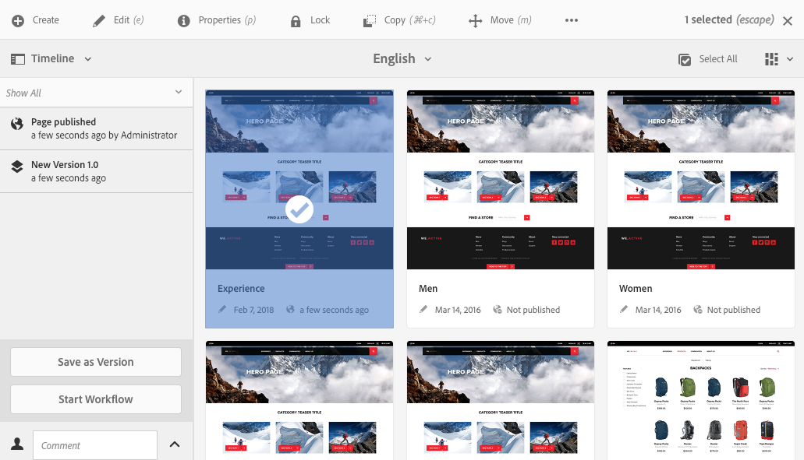
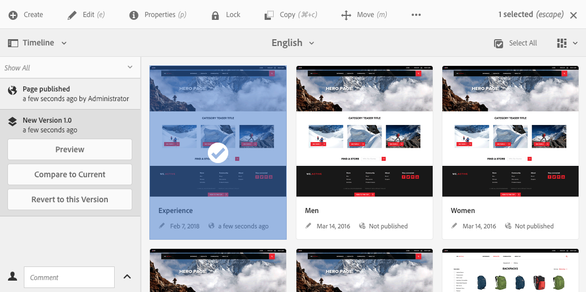
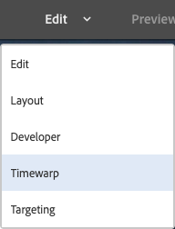

# Working with Page Versions{#working-with-page-versions}

Versioning creates a "snapshot" of a page at a specific point in time. With versioning, you can perform the following actions:

* Create a version of a page.
* Restore a page to a previous version in order to undo a change that you made to a page, for example.
* Compare the current version of a page with a previous version with differences in the text and images highlighted.

## Creating a New Version {#creating-a-new-version}

You can create a version of your resource from:

* the [Timeline rail](#creating-a-new-version-timeline)
* the [Create](#creating-a-new-version-create-with-a-selected-resource) option (when a resource is selected)

### Creating a New Version - Timeline {#creating-a-new-version-timeline}

1. Navigate to show the page for which you want to create a version.
1. Select the page in [selection mode](/help/sites-authoring/basic-handling.md#viewing-and-selecting-resources).
1. Open the **Timeline** column.
1. Click/tap on the arrowhead by the comment field to reveal the options:

   

1. Select **Save as Version**.
1. Enter a **Label** and **Comment** if required.

   

1. Confirm the new version with **Create**.

   The information in the timeline will be updated to indicate the new version.

### Creating a New Version - Create with a Selected Resource {#creating-a-new-version-create-with-a-selected-resource}

1. Navigate to show the page for which you want to create a version.
1. Select the page in [selection mode](/help/sites-authoring/basic-handling.md#viewing-and-selecting-resources).
1. Select the **Create** option from the toolbar.
1. The dialog will open. You can enter a **Label** and a **Comment** if required:

   

1. Confirm the new version with **Create**.

   The timeline will be opened with the information updated to indicate the new version.

## Reinstating Versions {#reinstating-versions}

Once you have created a version of your page, there are various methods of reinstating a prior version:

* the **Revert to this Version** option from the [Timeline](/help/sites-authoring/basic-handling.md#timeline) rail

  Reinstate a prior version of a selected page.

* the **Restore** options from the top [actions toolbar](/help/sites-authoring/basic-handling.md#actions-toolbar)

  * **Restore Version**

    Reinstate versions of specified pages within the currently selected folder; this can also include restoring pages that have been previously deleted.

  * **Restore Tree**

    Reinstate a version of an entire tree as at a specified date and time; this can include pages that have been previously deleted.

>[!NOTE]
>
>When reinstating a page, the version created will be part of a new branch.
>
>To illustrate:  
>
>1. Create versions of any page.
>1. The initial labels and version node names will be 1.0, 1.1, 1.2 and so forth.  
>1. Reinstate the first version; i.e. 1.0.
>1. Create new versions again.
>1. The generated labels and node names will now be 1.0.0, 1.0.1, 1.0.2, etc.

### Revert to a Version {#revert-to-a-version}

To **Revert** the selected page to a previous version:

1. Navigate to show the page you want to revert to a previous version.
1. Select the page in [selection mode](/help/sites-authoring/basic-handling.md#viewing-and-selecting-resources).
1. Open the **Timeline** column and select either **Show All** or **Versions**. The page versions for the selected page will be listed.
1. Select the version you want to revert to. The possible options will be shown:

   

1. Select **Revert to this Version**. The selected version will be restored and the information in timeline will be updated.

### Restore Version {#restore-version}

This method can be used to restore versions of specified pages within the current folder; this can also include restoring pages that have been previously deleted:

1. Navigate to, and [select](/help/sites-authoring/basic-handling.md#viewing-and-selecting-resources), the required folder.

1. Select **Restore**, then **Restore Version** from the top [actions toolbar](/help/sites-authoring/basic-handling.md#actions-toolbar).

   >[!NOTE]
   >
   >If, either:
   >
   >* you have selected a single page, that has never had any child pages,
   >* or none of the pages in the folder have versions,
   >
   >Then the display will be empty as there are no versions applicable.

1. The available versions will be listed:

   

1. For a specific page, use the drop down selector under **RESTORE TO VERSION** to select the required version for that page.

   

1. In the main display, select the required page to be restored:

   

1. Select **Restore** for the selected version, of the selected page, to be restored as the current version.

>[!NOTE]
>
>The order in which you select a required page and the related version is interchangeable.

### Restore Tree {#restore-tree}

This method can be used to restore a version of a tree as at a specified date and time; this can include pages that have been previously deleted:

1. Navigate to, and [select](/help/sites-authoring/basic-handling.md#viewing-and-selecting-resources), the required folder.

1. Select **Restore**, then **Restore Tree** from the top [actions toolbar](/help/sites-authoring/basic-handling.md#actions-toolbar). The latest version of the tree will be shown:

   

1. Use the date and time selector at **Latest Versions at Date** to select another version of the tree - the one to be restored.

1. Set the flag **Preserved Non Versioned Pages** as required:

   * If active (selected), then any non-versioned pages will be maintained and not impacted by the restore. 

   * If inactive (unselected), then any non-versioned pages will be removed as they did not exist in the versioned tree.

1. Select **Restore** for the selected version of the tree to be restored as the *current* version.

## Previewing a Version {#previewing-a-version}

You can preview a specific version:

1. Navigate to show the page you want to compare.
1. Select the page in [selection mode](/help/sites-authoring/basic-handling.md#viewing-and-selecting-resources).
1. Open the **Timeline** column and select either **Show All** or **Versions**.
1. The page versions will be listed. Select the version you want to preview:

   

1. Select **Preview**. The page will be shown in a new tab.

   >[!CAUTION]
   >
   >If a page has been moved, you can no longer perform a preview on any versions made before the move.
   >
   >* If you experience problems with a preview, check the [Timeline](/help/sites-authoring/basic-handling.md#timeline) for the page to see whether the page has been moved.

## Comparing a Version with Current Page {#comparing-a-version-with-current-page}

To compare a previous version with the current page:

1. Navigate to show the page you want to compare.
1. Select the page in [selection mode](/help/sites-authoring/basic-handling.md#viewing-and-selecting-resources).
1. Open the **Timeline** column and select either **Show All** or **Versions**.
1. The page versions will be listed. Select the version you want to compare:

   

1. Select **Compare to Current**. The [page diff](/help/sites-authoring/page-diff.md) will open and display the differences.

## Timewarp {#timewarp}

Timewarp is a feature designed to simulate the *published* state of a page at specific times in the past.

>[!TIP]
>
>[Timewarp can also be used with Launches to preview the future](/help/sites-authoring/launches.md) when running AEM 6.5.10.0 or later.

Because content creation is an ongoing and collaborative process, the purpose of Timewarp is to allow authors to track the published website over time in order to understand how the content has changed. This feature uses the page versions to determine the state of the publish environment.

To do this:

* The system looks for the page version that was active at the selected time.
* This means the version shown was created/activated *before* the point in time selected in Timewarp.
* When navigating to a page that has been deleted, it will also be rendered - as long as the old versions of the page are still available in the repository.
* If no published version is found, then Timewarp will revert to the current state of the page on the author environment (this is to prevent an error/404 page, which would prevent browsing).

### Using Timewarp {#using-timewarp}

Timewarp is a [mode](/help/sites-authoring/author-environment-tools.md#page-modes) of the page editor. To start it, simply switch it as you would any other mode.

1. Start the editor for the page where you wish to start Timewarp and then select **Timewarp** in the mode selection.

   

1. In the dialogue set a target date and time and click or tap **Set Date**. If you do not select a time, the current time will default.

   

1. The page is displayed based on the date set. Timewarp mode is indicated via the blue status bar at the top of the window. Use the links in the status bar to select a new target date or exit Timewarp mode.

   

### Timewarp Limitations {#timewarp-limitations}

Timewarp makes a best effort to reproduce a page at a selected point in time. However because of the complexities of the continuous authoring of content in AEM, this is not always possible. These limitations should be kept in mind as you use Timewarp.

* **Timewarp works based on published pages** - Timewarp will only work fully if you have previously published the page. If not, timewarp will show the current page on the author environment.
* **Timewarp uses page versions** - If you navigate to a page that has been removed/deleted from the repository it will be rendered properly if old versions of the page are still available in the repository.
* **Removed versions affect Timewarp** - If versions are removed from the repository then Timewarp cannot show the correct view.  

* **Timewarp is read-only** - You cannot edit the old version of the page. It is only available for viewing. If you want to restore the older version you will have to do that manually using [restore](#reverting-to-a-page-version).

* **Timewarp is only based on page content** - If elements (such as code, css, assets/images, etc) for rendering the website have changed, the view will differ from what it originally was, as those items are not versioned in the repository.

>[!CAUTION]
>
>Timewarp is designed as a tool to assit authors with understanding and creating their content. It is not intended as an audit log or for legal purposes.
