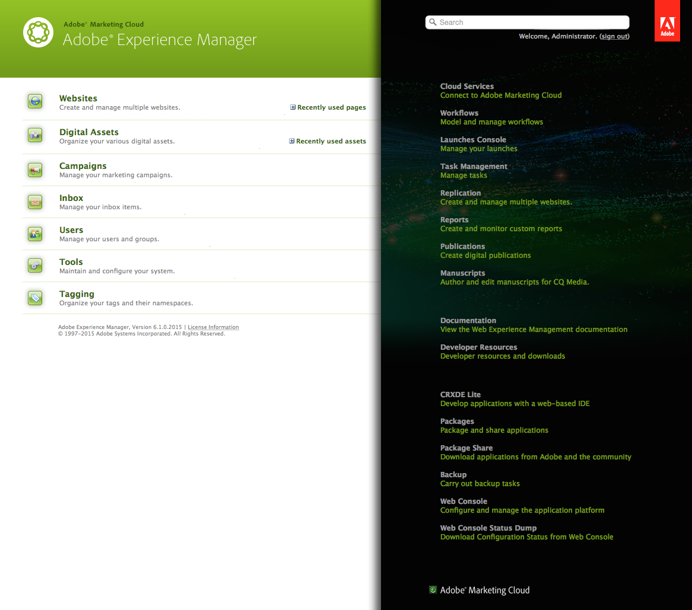
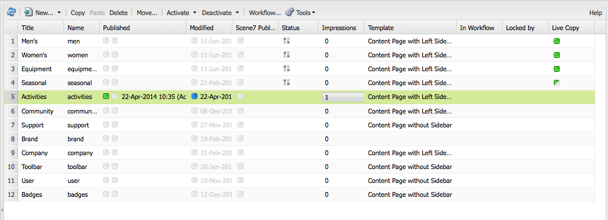
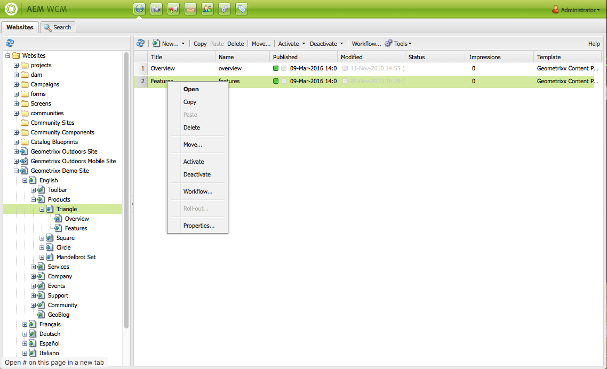

# Basic Handling{#basic-handling}

>[!NOTE]
>
>* This page is designed to give an overview of basic handling when using the AEM author environment. It uses the **Sites** console as a basis.
>
>* Some functionality is not available in all consoles and/or additional functionality is available in some consoles. Specific information about the individual consoles and their related functionality will be covered in more detail on other pages.
>* Keyboard shortcuts are available throughout AEM. In particular when [using consoles](/help/sites-classic-ui-authoring/author-env-keyboard-shortcuts.md) and [editing pages](/help/sites-classic-ui-authoring/classic-page-author-keyboard-shortcuts.md).
>

## The Welcome Screen {#the-welcome-screen}

The classic UI provides a selection of consoles, using well-known mechanisms for navigating and initiating actions, including click, double-click and [context menus](#context-menus).

Upon login the Welcome screen will be shown, this provides a list of links to consoles and services:

## Consoles {#consoles}

The main consoles are:

<table>
 <tbody>
  <tr>
   <td><strong>Console</strong></td>
   <td><strong>Purpose</strong></td>
  </tr>
  <tr>
   <td><strong>Welcome</strong></td>
   <td>Provides an overview and direct access (via links) to the main functionality of AEM.</td>
  </tr>
  <tr>
   <td><strong>Digital Assets</strong>  </td>
   <td>These consoles let you import and <a href="/help/sites-classic-ui-authoring/classicui-assets.md">manage digital assets</a> such as images, videos, documents and audio files. These assets can then be used by any website running on the same AEM instance. </td>
  </tr>
  <tr>
   <td><strong>Launches</strong></td>
   <td>This helps you manage your <a href="/help/sites-classic-ui-authoring/classic-launches.md">launches</a>; these enable you to develop the content for a future release of one or more activated web pages.  <i>Note: In the touch-enabled UI much of the same functionality is available in the Sites console, together with the References rail.</i> <i>If required, this console is available from the Tools console; select Operations, then Launches.</i></td>
  </tr>
  <tr>
   <td><strong>Inbox </strong></td>
   <td>In many cases a number of people are involved in the sub-tasks of a workflow and each person must complete their step before handing off the work to the next person. The Inbox allows you to see notifications related to such tasks. See <a href="/help/sites-administering/workflows.md">Working with Workflows</a>.   </td>
  </tr>
  <tr>
   <td><strong>Tagging</strong></td>
   <td>The Tagging consoles let you administer tags. Tags are short names or phrases that you can use to classify and annotate pieces of content making it easier to find and organize them. For further information see <a href="/help/sites-classic-ui-authoring/classic-feature-tags.md">Using and Managing Tags</a>.</td>
  </tr>
  <tr>
   <td><strong>Tools</strong></td>
   <td>The <a href="/help/sites-administering/tools-consoles.md">Tools consoles</a> provide access to a number of specialized tools and consoles that help you administer your websites, digital assets and other aspects of your content repository.</td>
  </tr>
  <tr>
   <td><strong>Users</strong></td>
   <td>These consoles let you manage access rights for users and groups. For full details see <a href="/help/sites-administering/security.md">User Administration and Security</a>.  </td>
  </tr>
  <tr>
   <td><strong>Websites</strong></td>
   <td>The Sites/Websites consoles let you <a href="/help/sites-classic-ui-authoring/classic-page-author.md">create, view and manage websites</a> running on your AEM instance. Through these consoles you can create, copy, move and delete website pages, start workflows, and activate (publish) pages. You can also open a page for editing.  </td>
  </tr>
  <tr>
   <td><strong>Workflows</strong></td>
   <td>A workflow is a defined series of steps that describes the process of completing some task. In many cases a number of people are involved in a task and each person must complete their step before handing off the work to the next person. The Workflow console lets you build workflow models and managing running workflow instances. See <a href="/help/sites-administering/workflows.md">Working with Workflows</a>.  </td>
  </tr>
 </tbody>
</table>

The **Websites** console provides two panes for you to navigate and manage your pages:

* Left pane

  This shows the tree structure of your websites and the pages within those websites.

  It also shows information about other aspects or AEM, including projects, blueprints and assets.

* Right pane

  This shows the pages (at the location selected in the left pane) and can be used for taking actions.

From here you can [manage your pages](/help/sites-authoring/managing-pages.md) using either the toolbar, a context menu or by opening a page for further actions.

>[!NOTE]
>
>The basic handling is the same across all consoles. This section concentrates on the **Websites** console as it is the primary console used when authoring.

## Accessing Help {#accessing-help}

On various consoles (e.g. Websites) there is also **Help** button is available, this will open either Package Share or the documentation site.

When editing a page the [sidekick also has a button for accessing help](/help/sites-classic-ui-authoring/classic-page-author-env-tools.md#accessing-help).

## Navigating with the Websites Console {#navigating-with-the-websites-console}

The **Websites** console lists your pages of content in a tree structure (left hand pane). For ease of navigation, sections of the tree structure can be expanded (+) or collapsed (-) as required:

* A single click on the page name (in the left pane) will:

    * List the child pages in the right pane
    * Also expand the structure in the left pane.

      For performance reasons this action is dependent on the number of children nodes. With a standard installation this method of expansion works when there are `30` or less child nodes.

* A double click on the page name (left pane) will also expand the tree, though as the page is opened at the same time this effect is not so obvious.

>[!NOTE]
>
>This default value ( `30`) can be changed per console in your application specific configurations of the siteadmin widget:
>
>On the siteadmin node:
>
>Set the value of the property:
>`treeAutoExpandMax`
>on:
>`/apps/wcm/core/content/siteadmin`
>
>Or globally in the theme:
>Set the value of:
>`TREE_AUTOEXPAND_MAX`
>in:
>`/apps/cq/ui/widgets/themes/default/widgets/wcm/SiteAdmin.js`
>
>See [SiteAdmin in the CQ Widget API](https://helpx.adobe.com/experience-manager/6-5/sites/developing/using/reference-materials/widgets-api/index.html?class=CQ.wcm.SiteAdmin) for more details.

## Page Information on the Websites Console {#page-information-on-the-websites-console}

The right pane of the **Websites** console provides a list view with information about pages:

The following are available; a subset of these fields is shown as default:

<table>
 <tbody>
  <tr>
   <td><strong>Column</strong></td>
   <td><strong>Description</strong></td>
  </tr>
  <tr>
   <td>Thumbnail</td>
   <td>Shows a thumbnail for the page.</td>
  </tr>
  <tr>
   <td>Title</td>
   <td>The title that appears on the page</td>
  </tr>
  <tr>
   <td>Name</td>
   <td>The name AEM refers to the page</td>
  </tr>
  <tr>
   <td>Published</td>
   <td>Indicates whether the page has been published and provides the publication date and time.</td>
  </tr>
  <tr>
   <td>Modified</td>
   <td>Indicates whether the page has been modified and provides the modification date and time. In order to save any modification, you must activate the page.</td>
  </tr>
  <tr>
   <td>Scene7 Publish</td>
   <td>Indicates whether the page has been published to Scene7.  </td>
  </tr>
  <tr>
   <td>Status</td>
   <td>Indicates the current status of the page, such as whether the page is part of a workflow or livecopy, or whether a page is currently locked.</td>
  </tr>
  <tr>
   <td>Impressions</td>
   <td>Shows the activity on a page in number of hits.</td>
  </tr>
  <tr>
   <td>Template</td>
   <td>Indicates the template that a page is based on.</td>
  </tr>
  <tr>
   <td>In Workflow</td>
   <td>Indicates when the page is in a workflow.</td>
  </tr>
  <tr>
   <td>Locked by</td>
   <td>Shows when a page has been locked and the user account that has locked it.</td>
  </tr>
  <tr>
   <td>Live Copy</td>
   <td>Indicates when the page is part of a live copy.</td>
  </tr>
 </tbody>
</table>

>[!NOTE]
>
>To select the columns visible hover your mouse over a column title. A drop-down menu will be shown, from here you can use the **Columns** option.

The colors next to pages in the **Published** and **Modified** columns indicate publication status:

| **Column** |**Color** |**Description** |
|---|---|---|
| Published |Green |Publication was successful. Content is published. |
| Published |Yellow |Publication is pending. Confirmation of publication has not yet been received by the system. |
| Published |Red |Publication failed. There is no connection with the publish instance. This can also mean that the content was deactivated. |
| Published |*blank* |This page has never been published. |
| Modified |Blue |Page has been modified since the last publication. |
| Modified |*blank* |This page has never been modified, or has not been modified since the last publication. |

## Context Menus {#context-menus}

The classic UI uses well-known mechanisms for navigating and initiating actions, including click and double-click. Depending on the current situation, a range of context menus (usually opened with the right-mouse-button) are also available:

