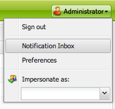
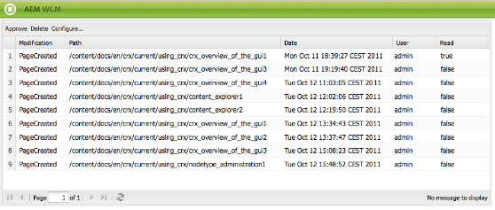
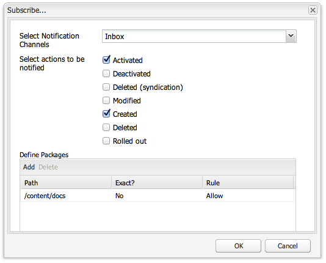
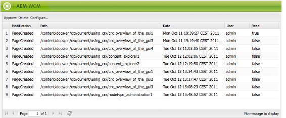

# Your Inbox{#your-inbox}

You can receive notifications from various areas of AEM such as notification about work items or tasks that represent actions that you need to perform on page content.

You receive these notifications in two inboxes, which are separated by the type of notifications:

* An inbox where you can see the notifications you receive as a result of subscriptions is described in the following section.
* A specialized inbox for workflow items is described in the [Participating in Workflows](/help/sites-classic-ui-authoring/classic-workflows-participating.md) document.

## Viewing Your Notifications {#viewing-your-notifications}

To view your notifications:

1. Open the notification inbox: in the **Websites** console, click the user button in the top right corner and select **Notification Inbox**.

   

   >[!NOTE]
   >
   >You can also access the console directly in your browser; for example:
   >
   >
   >` https://<host>:<port>/libs/wcm/core/content/inbox.html`

1. Your notifcations will be listed. You can take actions as required:

    * [Subscribing to Notifications](#subscribing-to-notifications)
    * [Processing your Notifications](#processing-your-notifications)

   

## Subscribing to Notifications {#subscribing-to-notifications}

To subscribe to notifications:

1. Open the notification inbox: in the **Websites** console, click the user button in the top right corner and select **Notification Inbox**.

   

   >[!NOTE]
   >
   >You can also access the console directly in your browser; for example:
   >
   >
   >`https://<host>:<port>/libs/wcm/core/content/inbox.html`

1. Click **Configure...** in the top left corner to open the configuration dialog.

   

1. Select the notification channel:

    * **Inbox**: notifications will be displayed in your AEM inbox.
    * **Email**: notifications will be emailed to the email address defined in your user profile.

   >[!NOTE]
   >
   >A few settings need to be configured in order to be notified by email. It is also possible to customize the email template or to add an email template for a new language. Please refer to [Configuring Email Notification](/help/sites-administering/notification.md#configuringemailnotification) to configure email notifications in AEM.

1. Select the page actions for which to be notified:

    * Activated: when a page has been activated.
    * Deactivated: when a page has been deactivated.
    * Deleted (syndication): when a page has been delete-replicated, i.e. when a delete action performed on a page is replicated.
      When a page is deleted or moved, a delete action is automatically replicated: the page is deleted on the source instance where the delete action was performed and on the destination instance defined by the replication agents.

    * Modified: when a page has been modified.
    * Created: when a page has been created.
    * Deleted: when a page has been deleted through the page delete action.
    * Rolled out: when a page has been rolled out.

1. Define the paths of the pages for which you will be notified:

    * Click **Add** to add a new row to the table.
    * Click the **Path** table cell and enter the path, e.g. `/content/docs`.

    * To be notified for all the pages belonging to the sub-tree, set **Exact?** to **No**.
      To be only notified for actions on the page defined by the path, set **Exact?** to **Yes**.

    * To allow the rule, set **Rule** to **Allow**. If set to **Deny**, the rule is denied but not removed and can be allowed later.

   To remove a definition, select the row by clicking a table cell and click **Delete**.

1. Click **OK** to save the configuration.

## Processing your Notifications {#processing-your-notifications}

If you have chosen to receive notifications in your AEM inbox, your inbox will fill up with notifications. You can [view your notifications](#viewing-your-notifications) then select the required notification(s) to:

* Approve it by clicking **Approve**: the value in the **Read** column is set to **true**.

* Delete it by clicking **Delete**.

