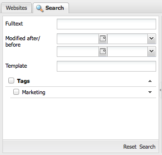
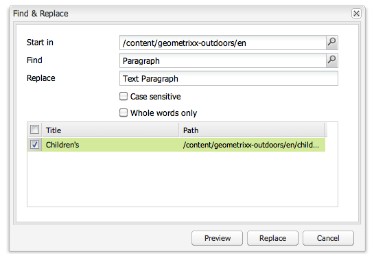

# Search{#searching}

The author environment of AEM provides various mechanisms for searching for content, dependent on the resource type.

>[!NOTE]
>
>Outside the author environment other mechanisms are also available for searching, such as the [Query Builder](/help/sites-developing/querybuilder-api.md) and [CRXDE Lite](/help/sites-developing/developing-with-crxde-lite.md).

## Search Basics {#search-basics}

To access the search panel, click on the **Search** tab at the top of the left-hand pane of the appropriate console.

The search panel lets you search across all your website pages. It contains fields and widgets for the following:

* **Fulltext**: Search for the specified text
* **Modified after/before**: Search only those pages that were changed between the specific dates
* **Template**: Search only those pages based on the specified template
* **Tags**: Search only those pages with the specified tags

>[!NOTE]
>
>When your instance is configured for [Lucene search](/help/sites-deploying/queries-and-indexing.md) you can use the following in **Fulltext**:
>
>* [Wildcards](https://lucene.apache.org/core/5_3_1/queryparser/org/apache/lucene/queryparser/classic/package-summary.html#Wildcard_Searches)
>* [Boolean Operators](https://lucene.apache.org/core/5_3_1/queryparser/org/apache/lucene/queryparser/classic/package-summary.html#Boolean_operators)
>
>* [Regular expressions](https://lucene.apache.org/core/5_3_1/queryparser/org/apache/lucene/queryparser/classic/package-summary.html#Regexp_Searches)
>* [Field Grouping](https://lucene.apache.org/core/5_3_1/queryparser/org/apache/lucene/queryparser/classic/package-summary.html#Field_Grouping)
>* [Boosting](https://lucene.apache.org/core/5_3_1/queryparser/org/apache/lucene/queryparser/classic/package-summary.html#Boosting_a_Term)
>

Execute the search by clicking **Search** at the bottom of the pane. Click **Reset** to clear the search criteria.

## Filter {#filter}

At various locations a filter can be set (and cleared) to drill down and refine your view:

## Find and Replace {#find-and-replace}

In the **Websites** console a **Find & Replace** menu option allows you to search for, and replace multiple instances of a string, within a section of the website.

1. Select the root page, or folder, where you want the find and replace action to take place.
1. Select **Tools** then **Find & Replace**:

   

1. The **Find & Replace** dialog does the following:

    * confirms the root path where the find action should start
    * defines the term to be found
    * defines the term that should replace it
    * indicates whether the search should be case-sensitive
    * indicates whether only whole words should be found (otherwise substrings are also found)

   Clicking **Preview** lists where the term has been found. You can select/clear specific instances to be replaced:

   

1. Click **Replace** to actually replace all instances. You will be asked to confirm the action.

The default scope for the find and replace servlet covers the following properties:

* `jcr:title`
* `jcr:description`
* `jcr:text`
* `text`

The scope can be changed using the Apache Felix Web Management Console (for example, at `https://localhost:4502/system/console/configMgr`). Select `CQ WCM Find Replace Servlet (com.day.cq.wcm.core.impl.servlets.FindReplaceServlet)` and configure the scope as required.

>[!NOTE]
>
>In a standard AEM installation Find and Replace uses Lucene for the search functionality.
>
>Lucene indexes string properties of up to 16k in length. Strings in excess of this will not be searched.
