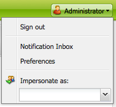

# Configuring your account environment{#configuring-your-account-environment}

Adobe Experience Manager (AEM) provides you with the capability to configure your account and certain aspects of the Author environment.

Using the [account settings](#account-settings) and [user preferences](#user-preferences) the following options and preferences can be defined:

* **Editing Toolbar**
  Select whether you want to have the global editing toolbar. This toolbar, which is shown at the top of the browser window, gives you **Copy**, **Cut**, **Paste**, **Delete** buttons for using with the paragraph components on that page:

    * Show when needed (Default)
    * Always show
    * Keep Hidden

* **Impersonate as**
  The functionality of [Impersonate as](/help/sites-administering/security.md#impersonating-another-user) lets a user work on behalf of another user.

* **Language**
  The language to use for the UI of the authoring environment. Select the required language from the available list.

* **Window Management**
  Select either:

    * Multiple Windows (Default)
      Pages are opened in a new window.
    * Single Window
      Pages are opened in the current window.

## Account Settings {#account-settings}

The user icon gives you access to the following options:

* Sign Out
* [Impersonate as](/help/sites-administering/security.md#impersonating-another-user)
* [User Preferences](#user-preferences)
* [Notification Inbox](/help/sites-classic-ui-authoring/author-env-inbox.md)

### User Preferences {#user-preferences}

Each user can set certain properties for themselves. This is available from the **Preferences** dialog box in the upper-right corner of the consoles.

The dialog offers the following options:

