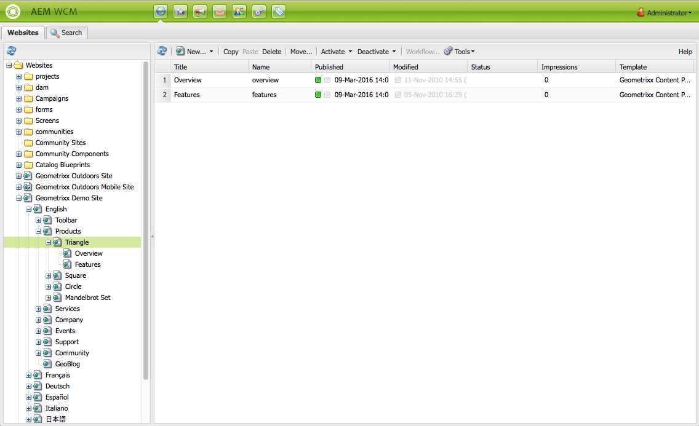
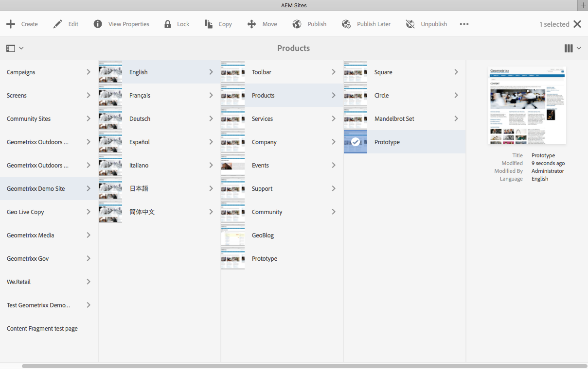
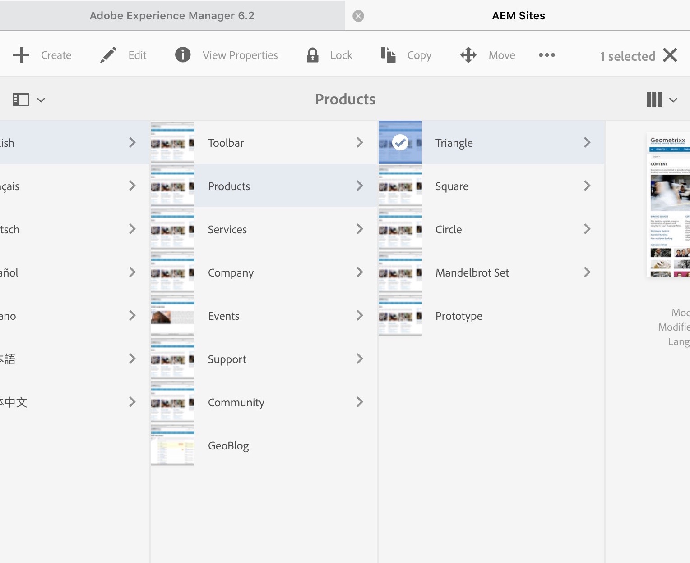

# Working with the Author Environment{#working-with-the-author-environment}

>[!NOTE]
>
>The following documentation focuses on the classic UI. For information about authoring in the modern, touch-enabled UI, see the [standard Authoring documentation](/help/assets/assets.md).

The author environment lets you perform tasks related to:

* [Authoring](/help/sites-authoring/author.md) (including [page authoring](/help/sites-authoring/qg-page-authoring.md) and [managing assets](/help/assets/assets.md))

* [Administering](/help/sites-administering/administer-best-practices.md) tasks you need when generating and maintaining the content on your website

Two graphical user interfaces are provided to achieve this, these are accessible through any modern browser:

1. Classic UI

    * This UI has always been available in AEM for many years.
    * It is predominantly green.
    * It was designed for use on desktop devices.
    * It is no longer maintained.
    * The following documentation focuses on this classic UI. For information about authoring in the modern, touch-based UI, see the [standard Authoring documentation](/help/sites-authoring/author.md).

   

1. Touch-Enabled UI

    * This is the modern, standard AEM UI.
    * It is predominantly grey, with a clean, flat interface.
    * It is designed for use on both touch and desktop devices (optimized for touch). The look and feel is the same on all devices, though [viewing and selecting your resources](/help/sites-authoring/basic-handling.md) differs slightly (taps versus clicks).
    * See the [standard Authoring documentation](/help/sites-authoring/author.md) for further details on how to author using the touch-based UI. The following documentation focuses on the classic UI.

    * Desktop:

   

    * Tablet devices (or desktop less than 1024 pixels wide):

   
