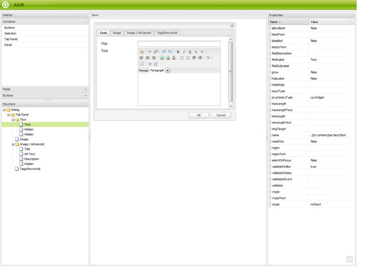
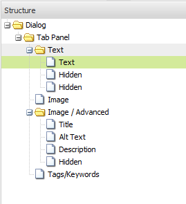
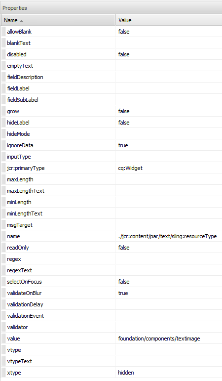

# Scaffolding{#scaffolding}

Sometimes you may need to create a large set of pages that share the same structure but have differing content. Through the standard AEM interface, you would need to create each page, drag the appropriate components onto the page and fill each of them in individually.

With scaffolding you can create a form (a scaffold) with fields that reflect the structure you want for your pages and then use this form to easily create pages based on this structure.

>[!NOTE]
>
>Scaffolding (in the classic UI) [respects MSM inheritance](#scaffolding-with-msm-inheritance).

## How Scaffolding Works {#how-scaffolding-works}

Scaffolds are stored in the **Tools** console of the site admin.

* Open the **Tools** console and click on **Default Page Scaffolding**.
* Under this click on **geometrixx**.
* Under **geometrixx** you will find a *scaffold page* called **News**. Double click to open this page.

The scaffold consists of a form with a field for each piece of content that will make up the page to be created and four important parameters which are accessed through the **Page Properties** of the scaffold page.

The scaffolding page properties are:

* **Title Text**: This is the name of this scaffolding page itself. In this example it is called "News".
* **Description**: This appears below the title on the scaffolding page.
* **Target Template**: This is the template that this scaffold will use when it creates a new page. In this example it is a *Geometrrixx Content Page* template.
* **Target Path**: This is the path of the parent page below which this scaffold will create new pages. In this example the path is */content/geometrixx/en/news*.

The body of the scaffold is the form. When a user wishes to create a page using the scaffold he fills out the form and clicks *Create*, at the bottom. In the **News** example above the form has the following fields:

* **Title**: This is the name of the page to be created. This field is always present on every scaffold.
* **Text**: This field corresponds to a Text Component on the resulting page.
* **Image**: This field corresponds to an Image Component on the resulting page.
* **Image/Advanced**: **Title**: The title of the image.
* **Image/Advanced**: **Alt Text**: The alt text for the image.
* **Image/Advanced**: **Description**: The description of the image.
* **Image/Advanced**: **Size**: The size of the image.
* **Tags/Keywords**: Metadata to be assigned to this page. This field is always present on every scaffold.

### Creating a Scaffold {#creating-a-scaffold}

To create a new scaffold go to the **Tools** console, then **Default Page Scaffolding** and create a new page. A single page template type will be available, the *Scaffolding Template.*

Go to the **Page Properties** of the new page and set the *Title Text*, *Description*, *Target Template* and *Target Path*, as described above.

Next, you have to define the structure of the page that this scaffold will create. To do this go into **[design mode](/help/sites-authoring/page-authoring.md#sidekick)** on the scaffold page. A link will appear allowing you to edit the scaffold in the **dialog editor**.

Using the dialog editor you specifiy the properties that will be created each time a new page is created using this scaffold.

The dialog definition for a scaffold works similarly to that of a component (see [Components](/help/sites-developing/components.md)). However a few important differences apply:

* Component dialog definitions are rendered as normal dialog boxes (as shown in the middle pane of the dialog editor, for example) while scaffold dialog definitions, though they appear as normal dialog boxes in the dialog editor, are rendered on the scaffold page as a scaffold form (as shown in the **News** scaffold above).
* Component dialogs provide fields for only those values needed to define the content of a single specific component. A scaffold dialog must provide fields for every property in every paragraph of the page to be created.
* In the case of component dialogs, the component used to render the specified content is implicit and therefore the `sling:resourceType` property of the paragraph is filled in automatically when the paragraph is created. With a scaffold all the information defining both the content and the assigned component for a given paragraph must be provided by the dialog itself. In scaffold dialogs this information must be provided by using *Hidden* fields to submit this information on page creation.

A look at the example **News** scaffold dialog in the dialog editor helps to explain how this works. Go into design mode on the scaffold page and click the dialog editor link.

Now, click on the dialog field **Dialog &gt; Tab Panel &gt; Text &gt; Text**, like this:

The property list for this field will appear on the right side of the dialog editor, like this:

Notice the name property for this field. It has the value

`./jcr:content/par/text/text`

This is the name of the property to which the content of this field will be written when the scaffold is used to create a page. The property is stated as a relative path from the node representing the page to be created. It specifies the property text, below the node text, which is below the node par, which is itself a child of the jcr:content node below the page node.

This defines the location of the content storage for the text that will be inputted into this field. However, we also need to specify two more characteristics for this content:

* The fact that the string being stored here must be interpreted as *rich text*, and
* which component should be used to render this content to the resulting page.

Note that in a normal component dialog you would not have to specify this information because it is implicit in the fact that the dialog is already bound to a specific component.

To specify these two pieces of information you use hidden fields. Click on the first hidden field **Dialog &gt; Tab Panel &gt; Text &gt; Hidden**, like this:

The properties of this hidden field are as follows:

The name property of this hidden field is

`./jcr:content/par/text/textIsRich`

This is a boolean property used to interpret the text string stored at `./jcr:content/par/text/text`.

Because we know that the text should be interpreted as a rich text we specify the `value` property of this field as `true`.

>[!CAUTION]
>
>The dialog editor allows the user to change the values of *existing* properties in the dialog definition. To add a new property, the user must use [CRXDE Lite](/help/sites-developing/developing-with-crxde-lite.md). For example, when a new hidden field is added to a dialog definition with the dialog editor it does not have a *value* property (i.e., a property with the name "value"). If the hidden field in question requires a default *value* property to be set then this property must be added manually with one of the CRX tools. The value cannot be added with the dialog editor itself. However, once the property is present, its value can be edited with the dialog editor.

The second hidden field can be seen by clicking on it like this:

The properties of this hidden field are as follows:

The name property of this hidden field is

`./jcr:content/par/text/sling:resourceType`

and the fixed value specified for this property is

`foundation/components/textimage`

This specifies that component to be used to render the text content of this paragraph is the *Text Image* component. Using with the `isRichText` boolean specified in the other hidden field, the component can render the actual text string stored at `./jcr:content/par/text/text` in the desired way.

### Scaffolding with MSM Inheritance {#scaffolding-with-msm-inheritance}

In the classic UI, scaffolding is fully integrated with MSM inheritance (when applicable).

When you open a page in **Scaffolding** mode (using the icon at the bottom of sidekick) any components that are subject to inheritance will be indicated by:

* a lock symbol (for most components; e.g. Text and Title)
* a mask with the text **Click to cancel inheritance** (for Image components)

These show that the component cannot be edited - until inheritance is cancelled.

>[!NOTE]
>
>This is comparable to [inherited components when editing page content](/help/sites-authoring/editing-content.md#inheritedcomponentsclassicui).

Clicking on either the lock symbol or the image icon allows you to break inheritance:

* the symbol will change to an open padlock.
* once unlocked, you can edit the content.

After unlocking you can restore inheritance by clicking on the unlocked padlock symbol - this will lose any edits you have made.

>[!NOTE]
>
>If the inheritance is canceled at the page level (from the Livecopy tab of Page Properties) then all components will be editable in **Scaffolding** mode (they will be shown in unlocked state).
