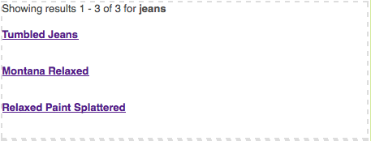
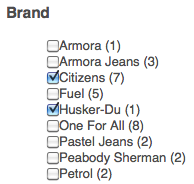
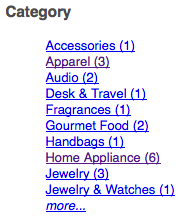

# Add Search&Promote features to your page{#adding-search-promote-features-to-your-page}

To integrate Search&Promote capabilities in your web site, use the Search&Promote components to add the following features to your pages:

* Keyword search
* Search results page
* Search refinement
* Banners

You can use Search&Promote capabilities only if your Adobe Experience Manager administrator has enabled them. See [Integrate with Adobe Search&Promote](/help/sites-administering/search-and-promote.md).

Facets are configured on the Search&Promote server, as is the information that each component provides. The following table provides a brief description of each component. Subsequent sections provide detailed information about their use.

<table>
 <tbody>
  <tr>
   <th>Search&amp;Promote component</th>
   <th>Description</th>
  </tr>
  <tr>
   <td>Banners</td>
   <td>Displays banner advertisements. Banners are selected based on data gathered through Search&amp;Promote.  </td>
  </tr>
  <tr>
   <td>Breadcrumbs</td>
   <td>Displays the search keyword and the sequence of filters that the user has applied to search results.</td>
  </tr>
  <tr>
   <td>Checkbox List-Facet</td>
   <td>A list of checkboxes for selecting facets for filtering search results.</td>
  </tr>
  <tr>
   <td>Dropdown Facet</td>
   <td>A drop-down list of facets for filtering search results.</td>
  </tr>
  <tr>
   <td>Link List Facet</td>
   <td>A list of facet links for filtering search results.</td>
  </tr>
  <tr>
   <td>Pagination</td>
   <td>Controls for navigating through pages of search results.</td>
  </tr>
  <tr>
   <td>Results</td>
   <td>Displays the results of a keyword search.</td>
  </tr>
  <tr>
   <td>Search</td>
   <td>Adds a search field to the page.</td>
  </tr>
 </tbody>
</table>

## Create the search results page {#creating-the-search-results-page}

Use the WCM Websites console to create a page for showing search results. The results of a search from any Search component can appear on this page if it uses the same Search&Promote service.

The components that enable users to review search results are Results, and Pagination. The **[!UICONTROL Results]** component has no configurable properties in Edit or Design mode. The Results component simply lists search results, which provide links to other pages, and displays the number of results for the search keyword.

The **[!UICONTROL Pagination]** component enables users to navigate multiple pages of search results. User can see the number of pages, move to the next or previous page, select a page to open, or consolidate all results on one page.

You can configure the following component properties in Edit mode to control runtime behavior:

* Hide single result page: Select this option if you want to hide the page navigation controls when the search returns a single page of results.
* Hide First/Last: Select this option if you want to prevent users from jumping to the first or last page of results.
* Hide Previous/Next: Determines whether users can navigate results pages relative to the current page.
* Hide view all: Determines whether the user can consolidate all search results on a single page. Typically, providing paged data makes more efficient use of server resources. Select this option if you want to prevent the transfer of large data sets in one response message.

### Enable the filtering of results by facets {#enabling-the-filtering-of-results-by-facets}

You can enable users to filter search results by facets. The **[!UICONTROL Checkbox List Facet]**, **[!UICONTROL Dropdown Facet]**, and **[!UICONTROL Link List Facet]** components enable users to select one or more facets for filtering. When using these components, you should also include the **Breadcrumbs** component. Breadcrumbs indicate the current filters that are used.

The **[!UICONTROL Checkbox List Facet]**, **[!UICONTROL Dropdown Facet]**, and **[!UICONTROL Link List Facet]** components each have the following properties that you configure in **Edit** mode:

* **Facet Name**: The name of the facet that is used for filters.

The **[!UICONTROL Checkbox List Facet]** component displays a list of facets with an accompanying checkbox. Use a **[!UICONTROL Checkbox List Facet]** so that users can view a subset of results that include items from multiple facets. For example, the **Brand** facet is appropriate because several brands supply the same type of product.

A check box appears for each facet that is associated with a search result. When a user selects a check box, the page reloads with an updated result set. All checkboxes remain on the page so that customers can add or remove facets to the filter at any time:

The **[!UICONTROL Dropdown Facet]** component enables customers to select a facet item from a drop-down list. This component is useful when you want customers to focus on a single facet item at once. For example, the Department facet is appropriate for enabling customers to narrow product searches by gender. John searches for *jeans* and then filters on the Men's department.

The drop-down list is populated with the facets that are associated with all search results. Upon selecting an item in the drop-down list, the page reloads with an updated result set. The items in the drop-down list do not change so that customers can switch from facet to facet at any time.

The **[!UICONTROL Link List Facet]** component enables customers to progressively narrow their focus on items that are categorized under multiple facet members or facets.

Facet members appear as a list of links. The text of each link is the name of a facet member that is associated with the current search results. When a customer clicks a facet link, the page reloads and a subset of the search results appears. The list of links is updated accordingly enabling an even narrower focus.

The links in the list also change when a filter is applied from a different type of Search&Promote component. The use of multiple types filter components can provide effective filter combinations.

The **[!UICONTROL Breadcrumbs]** component enables customers to see the filters that are currently applied to search results, in the order in which they were applied. Customers can click the items in the breadcrumb to revert to that filter combination.

You can configure the following properties for Breadcrumbs in Edit mode to customize the component's look:

* Delimiter: Define the character or character string to act as a delimiter between each breadcrumb. The **[!UICONTROL Delimiter]** field accepts any character string as input. The default setting is: "&gt;" (without the quotes)
* Trailing Delimiter: Define a character or character string to be displayed at the end of the breadcrumbs. The **[!UICONTROL Trailing Delimiter]** field accepts any character string as input. The default setting for this field is &#42;blank&#42; (that is, nothing is displayed at the end of the breadcrumb line)

### Add search boxes {#adding-search-boxes}

The **[!UICONTROL Search]** component lets customers perform keyword searches. Add **[!UICONTROL Search]** components to each page where you want to provide access to searching.

Configure the following properties in Edit mode so you can control runtime behavior:

* Result Page Path: The path to the page that displays search results.
* Enable Auto-Complete: Select to cause suggested search keywords to appear when the customer begins typing in the search box.

### Add banners {#adding-banners}

The **[!UICONTROL Banners]** component displays banner advertisements according to the customer's Search&Promote searches. Logic on the Search&Replace server determines which banner to show. For example, a search on jeans could cause a fashion-related banner to appear. Filtering on the Men's department could further refine the choice of banner.

The **[!UICONTROL Banners]** component provides one configurable property named Banner Area. In Edit mode, select one of the property values to specify how the banner appears. The Search&Promote service determines the list of values that you can select from.

### Example Search&Promote search page {#example-search-promote-search-page}

The following diagram shows the components that are added to a page to create the fully functional Search&Promote results page below.

 
