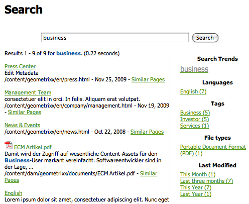

# Using Tags{#using-tags}

Tags are a quick and easy method of classifying content within a website. Tags may be thought of as keywords or labels that can be attached to a page, an asset, or other content to enable searches to find that content and related content.

* See [Administering Tags](/help/sites-administering/tags.md) for information about creating and managing tags, as well as to which content tags have been applied.
* See [Tagging for Developers](/help/sites-developing/tags.md) for information about the tagging framework as well as including and extending tags in custom applications.

## Ten Reasons to Use Tagging {#ten-reasons-to-use-tagging}

1. Organizing Content : tagging makes life easier for authors as they can quickly organize content with little effort.
1. Organizing Tags : while tags organize content, hierarchical taxonomies/namespaces organize tags.
1. Deeply Organized Tags : with the ability to create tags and sub-tags it becomes possible to express entire taxonomic systems, covering terms, subterms and their relationships. This allows creation of a second (or third) content hierarchy in parallel to the official one.
1. Controlled Tagging : tagging can be controlled by applying permissions to tags and/or namespaces to control tag creation and application.
1. Flexible Tagging : Tags have many names and faces: tags, taxonomy terms, categories, labels and many more. They are flexible in their content model and in the way they can be used; for instance, when outlining target demographics, categorizing and rating content or to create a secondary content hierarchy.
1. Improved Searching : the default search component in AEM broadly includes created tags and applied tags to which filters can be applied to narrow the results to those that are relevant.
1. SEO Enabling : tags applied as page properties will automatically show up in the metatags of the page making it visible to search engines.
1. Simple Sophistication : tags can simply be created from a word and the touch of a button. Afterwards, a title, description and unlimited labels can be added to provide more semantics to the tag.
1. Core Consistency : the tagging system is a core component of AEM and is used by all AEM capabilities to categorize content. Further, the tagging API is available to developers for creating tagging-enabled applications with access to the same taxonomies.
1. Combines Structure & Flexibility : AEM is ideal for working with structured information, due to the nesting of pages and paths. It is equally powerful when working with unstructured information, due to the built-in full-text search. Tagging combines the strengths of both structure and flexibility.

When designing the content structure for a site and the metadata schema for assets, consider the lightweight and accessible approach tagging provides.

## Applying Tags {#applying-tags}

In the author environment, authors may apply tags by accessing the page properties and entering one or more tags in the **Tags/Keywords** field.

To apply [pre-defined tags](/help/sites-administering/tags.md), in the **Page Properties** window use the `Tags/Keywords` field pull-down to select from the list of tags permitted for the page. Tthe **Standard Tags** tab is the default namespace, which means there is no `namespace-string:` prefixed to the taxonomy.

### Publishing Tags {#publishing-tags}

As with pages you can perform the following on tags and namespaces:

**Activate**

* Activate individual tags.

  Just as with pages, newly created tags will need to be activated before they become available on the publish environment.

>[!NOTE]
>
>When you activate a page, a dialog automatically opens and enables you to activate unactivated tags belonging to the page.

**Deactivate**

* Deactivate the selected tags.

## Tag Clouds {#tag-clouds}

Tag clouds show a cloud of tags, either for the current page, the entire website, or those most commonly accessed. Tag clouds are a means of highlighting the issues that are (have been) of interest to the user. The size of the text used to display the tag varies in relationship to its use.

The [Tag Cloud](/help/sites-classic-ui-authoring/classic-page-author-edit-mode.md#tag-cloud) component (General component group) is used to add a tag cloud to a page.

## Searching on Tags {#searching-on-tags}

You can search for tags in both the author and publish environments.

### Using Search Component {#using-search-component}

Adding a [Search component](/help/sites-classic-ui-authoring/classic-page-author-edit-mode.md#search) to a page provides a search capability which includes tags and can be used in both the author and publish environments.

