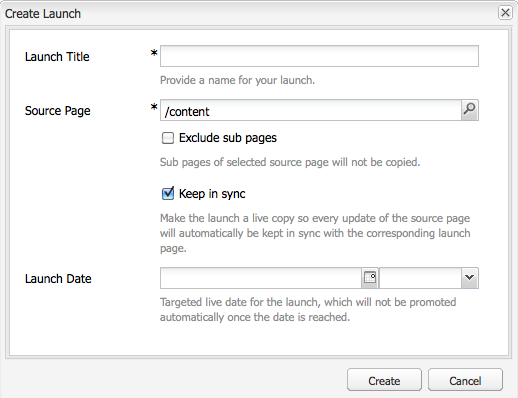

# Creating Launches{#creating-launches}

Create a launch to enable the updating of a new version of existing web pages for future activation. When you create a Launch, you specify a title and the source page:

* The title appears in the **Sidekick**, from where authors can access them to work on them.
* The child pages of the source page are included in the launch by default. You can use only the source page if desired.
* By default, [Live Copy](/help/sites-administering/msm.md) automatically updates the launch pages as the source pages change. You can specify that a static copy is created to prevent automatic changes.

Optionally, you can specify the **Launch Date** (and time) to define when the launch pages are to be promoted and activated. However the **Launch Date** only operates in combination with the **Production Ready** flag (see [Editing a Launch Configuration](/help/sites-classic-ui-authoring/classic-launches-editing.md#editing-a-launch-configuration)); for the actions to actually occur automatically, both must be set.

## Creating a Launch {#creating-a-launch}

The following procedure creates a launch.

1. Open the Website administration page ([http://localhost:4502/siteadmin](http://localhost:4502/siteadmin)).
1. Click **New...** then **New Launch...**.
1. In the **Create Launch** dialog, specify values for the following properties:

    * **Launch Title**: The name of the Launch. The name should be meaningful for authors.
    * **Source Page**: The path to the page for which to create the launch. By default, all child pages are included.
    * **Exclude Sub Pages**: Select this option to create the launch only for the source page and not the child pages. By default, this option is not selected.
    * **Keep In Sync**: Select this option to automatically update the content of launch pages when the source pages change. This is achieved by making the launch a [live copy](/help/sites-administering/msm.md).
    * **Launch Date**: The date and time when the launch copy is to be activated (dependent on the **Production Ready** flag; see [Launches - the Order of Events](/help/sites-authoring/launches.md#launches-the-order-of-events)).

   

1. Click **Create**.

## Deleting a Launch {#deleting-a-launch}

You can also delete a launch.

1. In the [launches console](/help/sites-classic-ui-authoring/classic-launches.md), select the required launch.
1. Click **Delete** - confirmation is required:

   

   >[!CAUTION]
   >
   >When deleting nested launches you should delete lower levels first.
