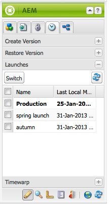
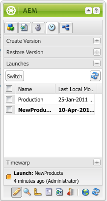

# Editing Launches{#editing-launches}

## Editing Launch Pages {#editing-launch-pages}

When a launch has been created for a page (or set of pages) you can edit the content in the launch copy of the page(s).

1. Open the page for editing.
1. In Sidekick, select the **Versioning** tab, then expand the **Launches** group. The title of the launch that is currently being edited uses a bold font.

   

1. Select the launch that you want to work on and then click **Switch**.
1. Start editing.

   >[!NOTE]
   >
   >You can use the **Page** tab of sidekick to perform actions such as **Create Child Page**, amongst others.

## Editing a Launch Configuration {#editing-a-launch-configuration}

After you create a launch you can change the launch name and the date of the launch. You can also specify an image to associate with the launch.

1. Open the launches administration page ([http://localhost:4502/libs/launches/content/admin.html](http://localhost:4502/libs/launches/content/admin.html)).

1. Select the required launch and click **Edit** to open the dialog:

    * In the **General** tab, you can edit:

        * **Title**
        * **Live Date**: this is equivalent to the launch date
        * **Production Ready**

      See [Launches - the Order of Events](/help/sites-authoring/launches.md#launches-the-order-of-events) for information about the purpose and interaction of these fields.

    * In the **Image** tab, you can upload an image file.

1. Click **Save**.

## Discovering the Launch Status of a Page {#discovering-the-launch-status-of-a-page}

When you are editing a launch of a page, information about the launch appears at the bottom of the **Versioning** tab of Sidekick:

* The name of the launch.
* The time since the last change.
* The user who performed the last change.
* The status of the **Production Ready** flag (orange=not set; green=set).

