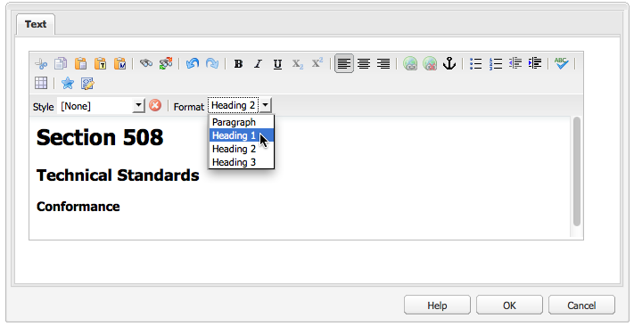
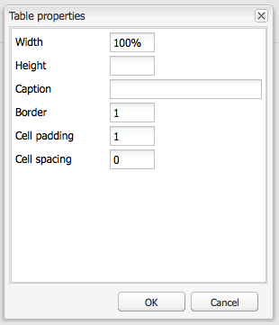
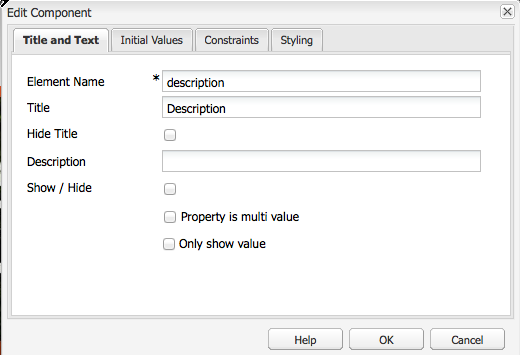
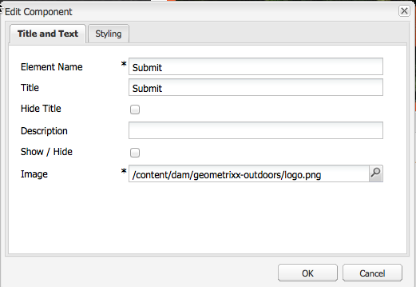
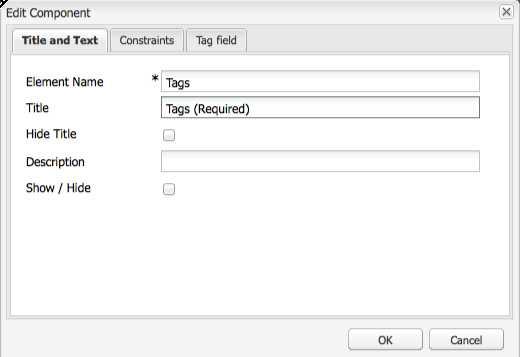

# Creating Accessible Content (WCAG 2.0 Conformance){#creating-accessible-content-wcag-conformance}

>[!CAUTION]
>
>Because the Classic UI was deprecated in AEM 6.4, the content on this page has not been updated for WCAG 2.1.
>
>See the following pages for details related to AEM and WCAG 2.1:
>
>* [AEM and the Web Accessibility Guidelines](/help/managing/web-accessibility.md)
>* [A Quick Guide to WCAG 2.1](/help/managing/qg-wcag.md)
>* [Creating Accessible Content (WCAG 2.1 Conformance)](/help/sites-authoring/creating-accessible-content.md)

WCAG 2.0 consists of a set of technology independent guidelines and success criteria to help make web content accessible to, and usable by, persons with disabilities.

>[!NOTE]
>
>See also:
>
>* [Quick Guide to WCAG 2.0](/help/managing/qg-wcag.md)
>* [Configuring the Rich Text Editor for producing accessible content](/help/sites-administering/rte-accessible-content.md)
>

These guidelines are graded according to three conformance levels: Level A (lowest), Level AA, and Level AAA (highest). Briefly, the levels are defined as follows:

* **Level A:** Your site reaches a basic, minimum level of accessibility. To meet this level, all Level A Success Criteria are satisfied.
* **Level AA:** The ideal level of accessibility to strive for, in which your site reaches an enhanced level of accessibility, so that it is accessible to most people in most situations using most technologies. To meet this level, all Level A and Level AA Success Criteria are satisfied.
* **Level AAA:** Your site reaches a high level of accessibility. To meet this level, all Level A, Level AA and Level AAA Success Criteria are satisfied.

When creating your site, you should determine the overall level to which you would like your site to conform.

The following section presents the [WCAG 2.0 Guidelines](https://www.w3.org/TR/WCAG20/#guidelines) with related success criteria for Level A and Level AA [conformance levels](https://www.w3.org/TR/UNDERSTANDING-WCAG20/conformance.html).

>[!NOTE]
>
>As it is not possible to satisfy all Level AAA Success Criteria for certain types of content, it is not recommended for this level of conformance to be required as a general policy.

>[!NOTE]
>
>This document uses the following:
>
>* the short names for the [WCAG 2.0 Guidelines](https://www.w3.org/TR/WCAG20/#guidelines).
>* the numbering used in the [WCAG 2.0 Guidelines](https://www.w3.org/TR/WCAG20/#guidelines) to aid cross-referencing with the WCAG website.
>

## Principle 1: Perceivable {#principle-perceivable}

[Principle 1: Perceivable - Information and user interface components must be presentable to users in ways they can perceive.](https://www.w3.org/TR/WCAG20/#perceivable)

### Text Alternatives (1.1) {#text-alternatives}

[Guideline 1.1 Text Alternatives: Provide text alternatives for any non-text content so that it can be changed into other forms people need, such as large print, braille, speech, symbols, or simpler language.](https://www.w3.org/TR/WCAG20/#text-equiv)

### Non-text Content (1.1.1) {#non-text-content}

* Success Criterion 1.1.1
* Level A
* Non-text Content: All non-text content that is presented to the user has a text alternative that serves the equivalent purpose, except for the situations listed below.

#### Purpose - Non-text Content (1.1.1) {#purpose-non-text-content}

Information on a web page can be provided in many different non-text formats, such as pictures, videos, animations, charts, and graphs. People who are blind or have severe visual impairments are unable to see non-text content, but they can access text content by having it read to them by a screen reader or presented in tactile form by a Braille display device. So, by providing text alternatives to content in graphical format, people who cannot see that graphical content can access an equivalent version of the information the content provides.

A useful additional benefit is that text alternatives enable non-text content to be indexed by search engine technology.

#### How to Meet - Non-text Content (1.1.1) {#how-to-meet-non-text-content}

For static graphics, the basic requirement is to provide an equivalent text alternative for the graphic. This method is done in the **Alt Text** field:

>[!NOTE]
>
>Some out-of-the-box components, such as **Carousel** and **Slideshow** do not provide a means for adding alternate text descriptions to images. When implementing versions of these components for your AEM instance, your development team should configure such components to support the `alt` attribute. Doing so ensures that authors can add it to the content (see [Adding Support for Additional HTML Elements and Attributes](/help/sites-administering/rte-accessible-content.md#add-support-for-more-html-elements-and-attributes)).

The **Alt Text** field is available in the **Advanced** image properties tab of the **Image** component dialog:


AEM adds an **Alt Text** to your images by default. For the classic UI, there are two different scenarios for how the default attribute is created, though the default value may not be sufficient as an alternative and likely must be edited in the **Advanced** image properties tab:

*   File:

  An image is uploaded from the user's hard drive. If you add an image component to a page and then choose an image from your hard drive, or another source, the default value for **Alt Text** is `file`. This value must be changed in the **Advanced** image properties tab. Again, this value is not displayed in the **Alt Text** field, but when the value is changed, the new value is displayed in the field.

*   Asset:

  An image is added from the digital asset repository. If you drag an image from the digital asset repository to a web page, then the **Title** and **Alt Text** values for that image are taken from the metadata for that image.

>[!NOTE]
>
>In both of the above scenarios, the default **Alt Text** value is not visible in the **Advanced Image Properties** tab. To change the default value, simply enter a new value in the **Alt Text** field.

>[!NOTE]
>
>If your image is purely decorative (see [Creating Good Text Alternatives](#creating-good-text-alternatives)), you can enter a space in the **Alt Text** field using the spacebar. Doing so creates an empty `alt` attribute, which prompts a screen reader to ignore the image.

#### Creating Good Text Alternatives {#creating-good-text-alternatives}

There are various forms of non-text content, so the value of the text alternative depends on the role the graphic plays in the web page. Some general rules of thumb include the following:

*   Text alternatives should be succinct yet clearly capture the essential information provided by the non-text content.
*   Overly long descriptions (over 100 characters) should be avoided. If a text alternative requires more detail:

    * provide a short description in the alternative text
    * and have a longer description in text elsewhere on the same page or in a separate web page. Link to this separate description by making the image a link, or by placing a text link next to the image.

*   Alternative text should not replicate content provided in text form nearby on the same page. Remember that many images are illustrations of points already covered in the text of a page, so a detailed text alternative may exist already.
*   If the non-text content is a link to another page or document and there is no other text forming part of the same link, then the alternative text for the image must indicate the destination of the link. It must not describe the image.
*   If the non-text content is contained in a button element and there is no text forming part of the same button, then the alternative text of the image must indicate the functionality of the button, not describe the image.
*   It is acceptable for an image to be given empty (null), alternative text, but only if the image has no alternative text. For example, it is a purely decorative graphic. Or, if the equivalent text exists already in the page text.

The [W3C draft: HTML5 Techniques for providing useful text alternatives](https://html.spec.whatwg.org/multipage/images.html#alt) has more details and examples of appropriate alternative text provision for images of different types.

Specific types of non-text content that require text alternatives might include:

*   Illustrative photos:

  These are images of people, objects, or places. Think about the role of the photo in the page; an appropriate text equivalent is likely to be *Photo of [object]*, but may depend on the surrounding text.

*   Icons:

  Small pictograms (graphics) conveying specific information. They must be consistently used across a page and site. All instances of the icon on a page or site should have the same short and succinct text alternative, unless doing so results in unnecessary duplication of adjacent text.

*   Charts and graphs:

  These typically represent numerical data. So one option for providing a text alternative might be to include a brief summary of the main trends shown in the chart or graphic. If necessary, also provide a more detailed description in text using the **Description** field in the **Advanced** image properties tab. Also, you could provide the source data in tabular form elsewhere in the page or site.

  

  To provide an alternative for this example chart, add a concise `alt` text to the image itself and then follow the image with a full text alternative.

  ```xml
  <p></p>
  <p> Figure 1. Distribution of Articles by Journal Category.
  Pie chart: Language=68%, Education=14% and Science=18%.</p>
  ```

  >[!NOTE]
  >
  >The above snippet is only used to illustrate the order. Use the **Image** component, rather than the `img src` reference used above.

  In AEM, you can use a combination of the **Alt Text** and **Description** fields in the image's configuration dialog - as in [How to Meet - Non-text Content (1.1.1)](#how-to-meet-non-text-content).

*   Maps, diagrams, flowcharts:

  For graphics providing spatial data (for example. to support describing relationships between objects or a process), ensure that the key message is provided in text format. For maps, providing a full text equivalent is likely to be impractical, but if the map is provided as a way of helping people find their way to a particular location, then the map image's alternative text can briefly indicate *Map of X*, then provide directions to that location in text elsewhere in the page or through the **Description** field in the **Advanced** tab of the **Image** component.

*   CAPTCHAs:

  A CAPTCHA is a *Completely Automated Public Turing test to tell Computers and Humans Apart*. It is a security check used on web pages to distinguish humans from malicious software, but which can cause accessibility barriers. They are images that require users to describe what they see to pass a security test. Providing a text alternative for the image is not possible, so instead you must consider alternative non-graphic solutions.

  The W3C provides several suggestions, such as the following. Each of these approaches has their own merits and drawbacks.

    * Logic puzzles
    * The use of sound output instead of images
    * Limited use accounts and spam filters.

*   Background images:

  These images are achieved using Cascading Style Sheets (CSS) rather than in HTML. It is not possible to specify an alternative text value. Therefore background images should not provide important textual information - if they do, this information must also be provided in the page's text.

  However, it is important that an alternative background is displayed when the image cannot be displayed.

  >[!NOTE]
  >
  >There should be an appropriate level of contrast between the background and the foreground text. This contrast is discussed in more detail in [Contrast (Minimum) (1.4.3)](#contrast-minimum).

#### More Information - Non-text Content (1.1.1) {#more-information-non-text-content}

* [Understanding Success Criteria 1.1.1](https://www.w3.org/TR/UNDERSTANDING-WCAG20/text-equiv-all.html)
* [How to Meet Success Criteria 1.1.1](https://www.w3.org/WAI/WCAG21/quickref/?versions=2.0#text-alternatives)
* [W3C: HTML5 Techniques for providing useful text alternatives](https://html.spec.whatwg.org/multipage/images.html#alt)
* [W3C explanation of and alternatives to CAPTCHAs](https://www.w3.org/TR/turingtest/)

### Time-based Media (1.2) {#time-based-media}

[Guideline 1.2 Time-based Media: Provide alternatives for time-based media.](https://www.w3.org/TR/WCAG20/#text-equiv)

This information deals with web content that is *time-based*. This covers content that the user can play (such as video, audio, and animated content) and may be pre-recorded or a live stream.

### Audio-only and Video-only (Pre-recorded) (1.2.1) {#audio-only-and-video-only-pre-recorded}

*   Success Criterion 1.2.1
*   Level A
*   Audio-only and Video-only (Prerecorded): For prerecorded audio-only and prerecorded video-only media, the following are true, except when the audio or video is a media alternative for text and is clearly labeled as such:

    * Prerecorded Audio-only: An alternative for time-based media is provided which presents equivalent information for prerecorded audio-only content.
    * Prerecorded Video-only: Either an alternative for time-based media or an audio track is provided which presents equivalent information for prerecorded video-only content.

#### Purpose - Audio-only and Video-only (Pre-recorded) (1.2.1) {#purpose-audio-only-and-video-only-pre-recorded}

Accessibility problems for video and audio may be experienced by:

* People with visual impairments when there is no soundtrack, or the soundtrack is not sufficient to inform them of what is happening in the video or animation;
* People with hearing impairments or who are deaf, who cannot hear the soundtrack;
* People who can hear the soundtrack, but do not understand what is being spoken (for example, because it is in a language they do not understand).

Video or audio may also be unavailable to people using browsers or devices that do not support the playing of content in specific media formats, such as Adobe Flash.

Providing this information in a different format, such as text (or audio for video without audio) can make it accessible for people unable to access the original content.

#### How to Meet - Audio-only and Video-only (Pre-recorded) (1.2.1) {#how-to-meet-audio-only-and-video-only-pre-recorded}

*   If the content is pre-recorded audio with no video (such as a podcast):

    *   Provide a link immediately before or after the content to a text-transcript of the audio content.

      The transcript should be an HTML page with a text equivalent of all spoken and important non-spoken content. It should also indicate who is speaking, a description of the setting, vocal expressions, and a description of any other significant audio.

*   If the content is an animation or pre-recorded video with no audio:

    * Provide a link immediately before or after the content to an equivalent text description of the information provided by the video
    * Or an equivalent audio description in a commonly used audio format such as MP3.

>[!NOTE]
>
>If the audio or video content is provided as an alternative to content that exists in another format on a web page, there is no need to follow the above requirements. For example, if a video illustrates a list of text instructions, then this video does not require an alternative as the text instructions already act as an alternative to the video.

Inserting multimedia, specifically Flash content, into your AEM web pages is similar to inserting an image. However, as multimedia content is much more than a still image, there are various different settings and options for controlling how multimedia is played.

>[!NOTE]
>
>When you use multimedia with informational content, you must also create links to alternatives. For example, to include a text transcript, create an HTML page to display the transcript and then add a link next to or underneath the audio content.

#### More Information - Audio-only and Video-only (Pre-recorded) (1.2.1) {#more-information-audio-only-and-video-only-pre-recorded}

* [Understanding Success Criteria 1.2.1](https://www.w3.org/TR/UNDERSTANDING-WCAG20/media-equiv-av-only-alt.html)
* [How to Meet Success Criteria 1.2.1](https://www.w3.org/WAI/WCAG21/quickref/?versions=2.0#time-based-media)

### Captions (Pre-Recorded) (1.2.2) {#captions-pre-recorded}

* Success Criterion 1.2.2
* Level A
* Captions (Prerecorded): Captions are provided for all prerecorded audio content in synchronized media, except when the media is a media alternative for text and is clearly labeled as such.

#### Purpose - Captions (Pre-Recorded) (1.2.2) {#purpose-captions-pre-recorded}

People who are deaf or hard of hearing are unable or have great difficulty accessing audio content. Captions are text equivalents for spoken and non-spoken audio, shown on screen at the appropriate time during the video. They allow people who cannot hear the audio to understand what is happening.

>[!NOTE]
>
>Captions are not required where suitable text or non-text equivalents (that provide directly equivalent information) are available on the same page as the video or animation.

#### How to Meet - Captions (Pre-Recorded) (1.2.2) {#how-to-meet-captions-pre-recorded}

Captions can be either:

* Open: always visible when the video is played
* Closed: the captions can be switched on or off by the user

Use closed captioning wherever possible. It gives users the choice over whether to view captions.

For closed captions, create and provide a synchronized caption file in an appropriate format, such as [SMIL](https://www.w3.org/AudioVideo/), along with the video file. 

See the tutorials in [More Information - Captions (Pre-Recorded) (1.2.2)](#more-information-captions-pre-recorded). Make sure you provide a note to let users know that captions are available for the video.

If you must use open captions, embed the text into the video track. This method is achieved using video editing applications that allow the overlaying of titles onto the video.

#### More Information - Captions (Pre-Recorded) (1.2.2) {#more-information-captions-pre-recorded}

* [Understanding Success Criteria 1.2.2](https://www.w3.org/TR/UNDERSTANDING-WCAG20/media-equiv-captions.html):
* [How to Meet Success Criteria 1.2.2](https://www.w3.org/WAI/WCAG21/quickref/?versions=2.0#time-based-media)
* [W3C: Synchronized Multimedia](https://www.w3.org/AudioVideo/)
* [Captions, Transcripts, and Audio Descriptions - by WebAIM](https://webaim.org/techniques/captions/)

### Audio Description or Media Alternative (Pre-Recorded) (1.2.3) {#audio-description-or-media-alternative-pre-recorded}

* Success Criterion 1.2.3
* Level A
* Audio Description or Media Alternative (Prerecorded): An alternative for time-based media or audio description of the prerecorded video content is provided for synchronized media, except when the media is a media alternative for text and is clearly labeled as such.

#### Purpose - Audio Description or Media Alternative (Pre-Recorded) (1.2.3) {#purpose-audio-description-or-media-alternative-pre-recorded}

People who are blind or visually impaired experience accessibility barriers if the information in a video or animation is only provided visually. Or, if the soundtrack does not provide sufficient information to allow understanding of what is happening visually.

#### How to Meet - Audio Description or Media Alternative (Pre-Recorded) (1.2.3) {#how-to-meet-audio-description-or-media-alternative-pre-recorded}

There are two approaches that can be adopted to meet this success criterion. Either is acceptable:

1.  Include additional audio description for the video content. You can accomplish this approach in one of three ways:

    *   During pauses in the existing dialogue, provide information about changes in the scene that are not presented as part of the existing audio track;
    *   Provide a new, additional, and optional audio track containing the original soundtrack, but also including extra audio information about changes in the scene.

        * Users can switch between the existing audio track (which *does not* contain an audio description) and the new audio track (which *does* contain an audio description).
        * This method prevents disruption to users who do not need the additional description.

    *   Create a second version of the video content to allow for extended audio descriptions. Doing so reduces the difficulties associated with providing detailed audio descriptions within the gaps between existing dialogue, by temporarily pausing the audio and video at appropriate points. As a result, a much longer audio description can be given, before the action starts again. As in the previous example, this is best provided as an optional extra audio track to prevent disruption to users who do not need the additional description.

1.  Provide a text transcript that is a suitable text equivalent of the audio and visual elements of the video or animation. It should include, where appropriate, an indication as to who is speaking, a description of the setting, vocal expressions. Depending on its length, you can place the transcript on the same page as the video or animation, or on a separate page; if you choose the latter option, provide a link to the transcript next to the video or animation.

Exact details of how to create audio-described video are beyond the scope of this guide. Creating videos and audio descriptions can be time consuming, but other Adobe products can help achieve these tasks. If you create content in Adobe Flash Professional, you should also create a script to prompt the user to download the appropriate plug-in, and provide a text alternative through the `<noscript>` element.

#### More Information - Audio Description or Media Alternative (Pre-Recorded) (1.2.3) {#more-information-audio-description-or-media-alternative-pre-recorded}

* [Understanding Success Criteria 1.2.3](https://www.w3.org/TR/UNDERSTANDING-WCAG20/media-equiv-audio-desc.html):
* [How to Meet Success Criteria 1.2.3](https://www.w3.org/WAI/WCAG21/quickref/?versions=2.0#qr-media-equiv-audio-desc)
* [Adobe Encore CS5](https://helpx.adobe.com/premiere-pro/using/whats-new.html)

### Captions (Live) (1.2.4)  {#captions-live}

* Success Criterion 1.2.4
* Level AA
* Captions (Live): Captions are provided for all live audio content in synchronized media.

#### Purpose - Captions (Live) (1.2.4) {#purpose-captions-live}

This success criterion is identical to [Captions (Pre-Recorded)](#captions-pre-recorded) in that it addresses accessibility barriers experienced by people who are deaf or hearing-impaired, except that this success criterion deals with live presentations such as webcasts.

#### How to Meet - Captions (Live) (1.2.4) {#how-to-meet-captions-live}

Follow the guidance provided for [Captions (Pre-Recorded)](#captions-pre-recorded) above. However, due to the live nature of the media, caption provision has to be created as quickly as possible and in response to what is happening. Therefore, you should consider using real-time captioning or speech-to-text tools.

Detailed instructions are beyond the scope of this document, but the following resources provide helpful information:

* [WebAIM: Real Time Captioning](https://webaim.org/techniques/captions/realtime)
* [AccessIT (University of Washington): Can captions be generated automatically using speech recognition?](https://www.washington.edu/doit/programs/accessit?1209)

#### More Information - Captions (Live) (1.2.4) {#more-information-captions-live}

* [Understanding Success Criteria 1.2.4](https://www.w3.org/TR/UNDERSTANDING-WCAG20/media-equiv-real-time-captions.html)
* [How to Meet Success Criteria 1.2.4](https://www.w3.org/WAI/WCAG21/quickref/?versions=2.0#qr-media-equiv-real-time-captions)

### Audio Description (Pre-Recorded) (1.2.5)  {#audio-description-pre-recorded}

* Success Criterion 1.2.5
* Level AA
* Audio Description (Prerecorded): Audio description is provided for all prerecorded video content in synchronized media.

#### Purpose - Audio Description (Pre-Recorded) (1.2.5) {#purpose-audio-description-pre-recorded}

This success criterion is identical to [Audio Description or Media Alternative (Pre-Recorded)](#audio-description-or-media-alternative-pre-recorded), except that authors must provide a much more detailed audio description to conform to Level AA.

#### How to Meet - Audio Description (Pre-Recorded) (1.2.5) {#how-to-meet-audio-description-pre-recorded}

Follow the guidance provided for [Audio Description or Media Alternative (Pre-Recorded)](#audio-description-or-media-alternative-pre-recorded).

#### More Information - Audio Description (Pre-Recorded) (1.2.5) {#more-information-audio-description-pre-recorded}

* [Understanding Success Criteria 1.2.5](https://www.w3.org/TR/UNDERSTANDING-WCAG20/media-equiv-audio-desc-only.html)
* [How to Meet Success Criteria 1.2.5](https://www.w3.org/WAI/WCAG21/quickref/?versions=2.0#qr-media-equiv-audio-desc-only)

### Adaptable (1.3) {#adaptable}

[Guideline 1.3 Adaptable: Create content that can be presented in different ways (for example simpler layout) without losing information or structure.](https://www.w3.org/TR/WCAG20/#content-structure-separation)

This guideline covers the requirements necessary to support people who:

*   may not be able to access information as presented by an author in a *standard* two dimensional, multi-column, colored web page layout

*   may use an audio-only, or alternative visual display such as large text or high contrast.

### Info and Relationships (1.3.1)  {#info-and-relationships}

* Success Criterion 1.3.1
* Level A
* Info and Relationships: Information, structure, and relationships conveyed through presentation can be programmatically determined or are available in text.

#### Purpose - Info and Relationships (1.3.1) {#purpose-info-and-relationships}

Many assistive technologies used by people with disabilities rely on structural information to effectively display or output content. This structural information can take the form of page headings, table row and column headings, and list types. For example, a screen reader could allow a user to navigate through a page from heading to heading. However, when page content only appears to have structure through visual styling, rather than the underlying HTML, then there is no structural information available to assistive technologies, limiting their ability to support easier browsing.

This success criterion exists to make sure that such structural information is provided through HTML, so that browsers and assistive technologies can access and take advantage of the information.

#### How to Meet - Info and Relationships (1.3.1) {#how-to-meet-info-and-relationships}

AEM makes it easy to construct web pages using the appropriate HTML elements. Open your page content in the RTE (a Text component), and use the **Format** menu to specify the appropriate structural element (for example paragraph, and heading).

The following image shows text that has been styled as paragraph text; the source code view being used shows it has the correct opening and closing &lt;p&gt; and &lt;/p&gt; tags.


Make sure that your web pages are given the appropriate structure by:

*   **Using headings:**

  As long as you have the accessibility features of the RTE enabled (see [AEM and Accessibility](/help/sites-administering/rte-accessible-content.md)), AEM offers three levels of page heading. You can use these to identify sections and subsections of content. Heading 1 is the highest level of heading, Heading 3 the lowest. The system administrator can configure the system to allow the use of more heading levels.

  The following image demonstrates an example of the different types of headings.

  

*   **Emphasized text**:

  Use the &lt;strong&gt; or &lt;em&gt; element to indicate emphasis. Do not use headings to highlight text within paragraphs.

    * Highlight the text you want to emphasize;
    * Click on the **B** icon (for &lt;strong&gt;) or the **I** icon (for &lt;em&gt;) shown within the **Properties** panel (make sure that HTML is selected).

  >[!NOTE]
  >
  >RTE in a standard AEM installation is set up to use:
  >
  >* &lt;b&gt; for &lt;strong&gt;
  >* &lt;i&gt; for &lt;em&gt;
  >
  >They are effectively the same, but &lt;strong&gt; and &lt;em&gt; are preferable as they are semantically correct html. Your development team can configure the RTE to use &lt;strong&gt; and &lt;em&gt; (instead of &lt;b&gt; and &lt;i&gt;) when developing your project instance.

*   **Use lists**: You can use HTML to specify three different types of lists:

    *   The `<ul>` element is used for *unordered* lists (bulleted) lists. Individual list items are identified using the `<li>` element.

      in the RTE, use the **Bulleted List** icon.

    *   The `<ol>` element is used for *numbered* lists. Individual list items are identified using the `<li>` element.

      In the RTE, use the **Numbered List** icon.

  If you want to change existing content into a specific list type, highlight the appropriate text and select the appropriate list type. As in the earlier example showing how paragraph text is entered, the appropriate list elements are automatically added to your HTML, but you can view this in source edit view.

  >[!NOTE]
  >
  >The `<dl>` element is not supported by the RTE.

*   **Use tables**:

  Tables of data must be identified using HTML table elements:

    * one `<table>` element
    * a `<tr>` element for each row of the table
    * a `<th>` element for each row and column heading
    * a `<td>` element for every data cell

  >[!NOTE]
  >
  >Tables should be realized with the **Table** component. Although tables can be created in the Text component, this is not recommended.

  Also, accessible tables use the following elements and attributes:

    * The `<caption>` element is used to provide a visible caption for the table. Captions by default appear centred above the table, but can be positioned appropriately using CSS. The caption is programmatically associated with the table, thus it is a useful method for providing an introduction to content.
    * The `<h3 class="summary">` element assists non-sighted users to more easily understand the information presented within a table, by providing a synopsis of what a sighted user can see. This is particularly useful where complex or unconventional table layouts are used (this attribute is not displayed in the browser, it is only read out to assistive technologies).
    * The `scope` attribute of the `<th>` element is used to indicate whether a cell represents a header for a particular row, or for a particular column. A similar approach is to use the header and id attributes in complex tables, where data cells may be associated with one or more headers.

  >[!NOTE]
  >
  >By default, these elements and attributes are not directly available, though it is possible for the system administrator to add support for these values in the **Table properties** dialog box (see [Adding Support for Additional HTML Elements and Attributes](/help/sites-administering/rte-accessible-content.md#add-support-for-more-html-elements-and-attributes)).

  When adding a **Table**, you can configure **Table properties** using the dialog.

    * an appropriate **Caption**.
    * Ideally remove any default values for **Width**, **Height**, **Border**, **Cell padding**, **Cell spacing**. as these properties can be set in a global style sheet.

  

  You can then use the **Cell properties** to choose whether the cell is a data or header cell and, if a header cell, whether it relates to a row or column or both:

  

*   **Complex Data Tables:**

  Sometimes, where there are complex tables with two or more levels of headers, then the basic Table Properties may not be enough to provide all the structural information necessary. For these kinds of complex tables, direct relationships must be created between the headers and their related cells using the **header** and **id** attributes. For example, in the table below headers and ids are matched to make a programmatic association for assistive technology users.

  >[!NOTE]
  >
  >The id attribute is not available in an out-of-the-box installation. It can be enabled by configuring HTML rules and the serializer in the RTE.

  >[!NOTE]
  >
  >Tables should be realized with the **Table** component. Although tables can be created in the Text component, this is not recommended.

  ```xml
  <table>
     <tr>
       <th rowspan="2" id="h">Homework</th>
       <th colspan="3" id="e">Exams</th>
       <th colspan="3" id="p">Projects</th>
     </tr>
     <tr>
       <th id="e1" headers="e">1</th>
       <th id="e2" headers="e">2</th>
       <th id="ef" headers="e">Final</th>
       <th id="p1" headers="p">1</th>
       <th id="p2" headers="p">2</th>
       <th id="pf" headers="p">Final</th>
     </tr>
     <tr>
      <td headers="h">15%</td>
      <td headers="e e1">15%</td>
      <td headers="e e2">15%</td>
      <td headers="e ef">20%</td>
      <td headers="p p1">10%</td>
      <td headers="p p2">10%</td>
      <td headers="p pf">15%</td>
     </tr>
    </table>
  ```

  To achieve this in AEM, you must add the markup directly using the source edit mode.

  >[!NOTE]
  >
  >This functionality is not immediately available in a standard installation. It requires configuration of the RTE; HTML rules and serializer.

#### More information - Info and Relationships (1.3.1) {#more-information-info-and-relationships}

* [Understanding Success Criteria 1.3.1](https://www.w3.org/TR/UNDERSTANDING-WCAG20/content-structure-separation-programmatic.html)
* [How to Meet Success Criteria 1.3.1](https://www.w3.org/WAI/WCAG21/quickref/?versions=2.0#qr-content-structure-separation-programmatic)

### Sensory Characteristics (1.3.3)  {#sensory-characteristics}

* Success Criterion 1.3.3
* Level A
* Sensory Characteristics: Instructions provided for understanding and operating content do not rely solely on sensory characteristics of components such as shape, size, visual location, orientation, or sound.

#### Purpose - Sensory Characteristics (1.3.3) {#purpose-sensory-characteristics}

Designers often focus on visual design features, such as color, shape, text style, or a piece of content's absolute or relative position when presenting information. These can be powerful design techniques in conveying information, but people who are blind or visually impaired may be unable to access information that requires visual identification of attributes such as position, color or shape.

Similarly, information that requires distinguishing between different sounds (for example, male or female spoken content) present accessibility barriers to people with hearing impairment, if it is not reflected in any text alternative for the audio content.

>[!NOTE]
>
>For requirements related to alternatives to color, refer to [Use of Color](#use-of-color).

#### How to Meet - Sensory Characteristics (1.3.3) {#how-to-meet-sensory-characteristics}

Make sure that any information that relies on visual characteristics of page content is also presented in an alternative format.

* Do not rely on visual position to give information. For example, if you want to refer users to a menu on the right-hand side of the page for access to further information, do not refer to *the menu on the right*; instead, name the menu (for example via a heading) and refer to that name in text.
* Do not rely on text styling (for example, bold or italicized text) as the only way to convey information.

>[!NOTE]
>
>The use of descriptive terms is acceptable if they are understood to have meaning in a non-visual context. For example, using *above* and *below* would generally be acceptable, as they respectively imply content before and after a particular item of content. It would still make sense when the content is spoken aloud.

#### More information - Sensory Characteristics (1.3.3) {#more-information-sensory-characteristics}

* [Understanding Success Criteria 1.3.3](https://www.w3.org/TR/UNDERSTANDING-WCAG20/content-structure-separation-understanding.html)
* [How to Meet Success Criteria 1.3.3](https://www.w3.org/WAI/WCAG21/quickref/?versions=2.0#qr-content-structure-separation-understanding)

### Distinguishable (1.4) {#distinguishable}

[Guideline 1.4 Distinguishable: Make it easier for users to see and hear content including separating foreground from background.](https://www.w3.org/TR/WCAG20/#visual-audio-contrast)

### Use of Color (1.4.1)  {#use-of-color}

* Success Criterion 1.4.1
* Level A
* Use of Color: Color is not used as the only visual means of conveying information, indicating an action, prompting a response, or distinguishing a visual element.

>[!NOTE]
>
>This success criterion addresses color perception specifically. Other forms of perception are covered in [Adaptable (1.3)](#adaptable); including programmatic access to color and other visual presentation coding.

#### Purpose - Use of Color (1.4.1) {#purpose-use-of-color}

Color is an effective way of enhancing the aesthetic appeal of web pages and is also useful in conveying information. However, there is a range of visual impairments, from blindness to color vision deficiency, which means that some people are unable to distinguish between certain colors. This issue makes color-coding an unreliable way of providing information.

For example, someone with red-green color vision deficiency is unable to distinguish between shades of green and shades of red. They may see both colors as a third color (for example, brown), in which case they are unable to distinguish between red, green, and brown.

Also, color cannot be perceived by people using text-only browsers, monochrome display devices, or viewing a black-and-white printout of the page.

#### How to Meet - Use of Color (1.4.1) {#how-to-meet-use-of-color}

Wherever color is used to convey information, make sure that the information is available without the need to see the color.

For example, make sure that information provided by color is also provided explicitly in text. The illustration below shows how color and text both indicate seating availability for a performance:

<table>
 <tbody>
  <tr>
   <td><p><strong>Performance</strong></p> </td>
   <td><p><strong>Availability</strong></p> </td>
  </tr>
  <tr>
   <td><p>Tuesday March 16<sup>th</sup></p> </td>
   <td><p>SEATS AVAILABLE</p> </td>
  </tr>
  <tr>
   <td><p>Wednesday March 17<sup>th</p> </td>
   <td><p>SEATS AVAILABLE</p> </td>
  </tr>
  <tr>
   <td><p>Thursday March 18<sup>th</sup></p> </td>
   <td><p>SOLD OUT</p> </td>
  </tr>
 </tbody>
</table>

If color is used as a cue to provide information, you should provide an extra visual cue, such as changing the style (for example, bold, italics) or font. This helps people with low vision or who have color vision deficiency to identify the information. However, it cannot be relied on entirely, as it does not help people who cannot see the page at all.

#### More Information - Use of Color (1.4.1) {#more-information-use-of-color}

* [Understanding Success Criteria 1.4.1](https://www.w3.org/TR/2008/NOTE-WCAG20-TECHS-20081211/working-examples/G183/link-contrast.html)
* [How to Meet Success Criteria 1.4.1](https://www.w3.org/TR/2008/NOTE-WCAG20-TECHS-20081211/working-examples/G183/link-contrast.html)
* [Guidance on meeting a 3:1 contrast ratio, containing a list of "web safe" colors](https://www.w3.org/TR/2008/NOTE-WCAG20-TECHS-20081211/working-examples/G183/link-contrast.html)

### Contrast (Minimum) (1.4.3) {#contrast-minimum}

*   Success Criterion 1.4.3
*   Level AA
*   Contrast (Minimum): The visual presentation of text and images of text has a contrast ratio of at least 4.5:1, except for the following:

    * Large Text: Large-scale text and images of large-scale text have a contrast ratio of at least 3:1.
    * Incidental: Text or images of text that are part of an inactive user interface component, that are pure decoration, that are not visible to anyone, or that are part of a picture that contains significant other visual content, have no contrast requirement.
    * Logotypes: Text that is part of a logo or brand name has no minimum contrast requirement.

#### Purpose - Contrast (Minimum) (1.4.3) {#purpose-contrast-minimum}

People with certain visual impairments may be unable to distinguish between certain low-contrast color pairs. Accessibility problems may occur for these people if either:

* The text contrasts poorly with its background color.
* The color coding of text (such as link text and non-link text) is important in distinguishing information.

>[!NOTE]
>
>Text used purely for decoration purposes is excluded from this success criterion.

#### How to Meet - Contrast (Minimum) (1.4.3) {#how-to-meet-contrast-minimum}

Make sure that the text contrasts sufficiently with its background. Contrast ratios depend on the size and style of the text in question:

* For text less than 18-point (or 14-point bold) in size, the contrast ratio between text/images of text and the background should be at least 4.5:1.
* For text that is at least 18-point (or 14-point bold) in size, the contrast ratio should be at least 3:1.
* If a background is patterned, then the background around any text should be shaded so that the 4.5:1 or 3:1 ratio is maintained.

To check contrast ratios, use a color contrast tool, such as the [Paciello Group Color Contrast Analyzer](https://www.paciellogroup.com/resources/contrast-analyser.html) or the [WebAIM color contrast checker](https://webaim.org/resources/contrastchecker/). These tools allow you to check pairs of colors and report on any contrast problems.

Alternatively, if you are less concerned about specifying the appearance of your page, you can choose not to specify background and foreground text colors. No contrast checking is required, as the user's browser determines the colors of the text and background.

If it is not possible to meet the recommended contrast levels, provide a link to an alternative, equivalent version of the page (which has no color contrast issues). Or, let the user adjust the contrast of the page color scheme to their own requirements.

#### More Information - Contrast (Minimum) (1.4.3) {#more-information-contrast-minimum}

* [Understanding Success Criteria 1.4.3](https://www.w3.org/TR/UNDERSTANDING-WCAG20/visual-audio-contrast-contrast.html)
* [How to Meet Success Criteria 1.4.3](https://www.w3.org/WAI/WCAG21/quickref/?versions=2.0#qr-visual-audio-contrast-contrast)

### Images of Text (1.4.5) {#images-of-text}

*   Success Criterion 1.4.5
*   Level AA
*   Images of Text: If the technologies being used can achieve the visual presentation, text is used to convey information rather than images of text except for the following:

    * Customizable: The image of text can be visually customized to the user's requirements;
    * Essential: A particular presentation of text is essential to the information being conveyed.

>[!NOTE]
>
>Logotypes (text that is part of a logo or brand name) are considered essential.

#### Purpose - Images of Text (1.4.5) {#purpose-images-of-text}

Images of text are often used when a particular style of text is preferred; for example, a logotype or if text has been generated from another source (for example, a scan of a paper document). However, compared to text presented in HTML and styled using CSS, images of text lack the flexibility to change size or appearance that might be necessary for people with visual impairments or reading difficulties.

#### How to Meet - Images of Text (1.4.5) {#how-to-meet-images-of-text}

If images of text must be used, use CSS to replace the images of text with equivalent text in HTML so that the text is available in a customizable way. For an example, see [C30: Using CSS to replace text with images of text and providing user interface controls to switch](https://www.w3.org/TR/2008/NOTE-WCAG20-TECHS-20081211/C30).

#### More Information - Images of Text (1.4.5) {#more-information-images-of-text}

* [Understanding Success Criteria 1.4.5](https://www.w3.org/TR/UNDERSTANDING-WCAG20/visual-audio-contrast-text-presentation.html)
* [How to Meet Success Criteria 1.4.5](https://www.w3.org/WAI/WCAG21/quickref/?versions=2.0#qr-visual-audio-contrast-text-presentation)

## Principle 2: Operable {#principle-operable}

[Principle 2: Operable - User interface components and navigation must be operable.](https://www.w3.org/TR/WCAG20/#operable)

### Pause, Stop, Hide (2.2.2)  {#pause-stop-hide}

*   Success Criterion 2.2.2
*   Level A
*   Pause, Stop, Hide: For moving, blinking, scrolling, or auto-updating information, the following are true:

    * Moving, blinking, scrolling: For any moving, blinking, or scrolling information that (a) starts automatically, (b) lasts more than five seconds, and (c) is presented in parallel with other content, there is a mechanism for the user to pause, stop, or hide it unless the movement, blinking, or scrolling is part of an activity where it is essential;
    * Auto-updating: For any auto-updating information that (a) starts automatically and (b) is presented in parallel with other content, there is a mechanism for the user to pause, stop, or hide it or to control the frequency of the update unless the auto-updating is part of an activity where it is essential.

Points to note are:

1. For requirements related to flickering or flashing content, refer to [Do not Design Content in a Way that is Known to Cause Seizures (2.3)](#seizures).
1. Since any content that does not meet this success criterion can interfere with a user's ability to use the whole page, all content on the web page (whether it is used to meet other success criteria or not) must meet this success criterion. See [Conformance Requirement 5: Non-Interference](https://www.w3.org/TR/WCAG20/#cc5).
1. Content that is updated periodically by software or that is streamed to the user agent is not required to preserve or present information that is generated or received between the initiation of the pause and resuming presentation, as this may not be technically possible, and in many situations could be misleading to do so.
1. An animation that occurs as part of a preload phase or similar situation can be considered essential if interaction cannot occur during that phase for all users and if not indicating progress could confuse users or cause them to think that content was frozen or broken.

#### Purpose - Pause, Stop, Hide (2.2.2) {#purpose-pause-stop-hide}

Certain users may find content that moves is distracting and makes it difficult to concentrate on other parts of the page. Also, such content may prove difficult to read for people who have trouble keeping up with moving text.

#### How to Meet - Pause, Stop, Hide (2.2.2) {#how-to-meet-pause-stop-hide}

Depending on the nature of the content, you can apply one or more of the following suggestions when creating web pages containing moving, flashing, or blinking content:

* Provide a means of pausing scrolling content so that users have enough time to read it. For example, news tickers or auto-updated text.
* Make sure that content that blinks stops blinking after five seconds.
* Use appropriate technologies to display blinking content that can be disabled by the browser. For example, Graphics Interchange Format (GIF) or Animated Portable Network Graphics (APNG) files.
* Provide a form control on the web page to allow the user to disable all blinking content on the page.
* If any of the above is not possible, provide a link to a page containing all the content, but without any blinking.

#### More information - Pause, Stop, Hide (2.2.2) {#more-information-pause-stop-hide}

* [Understanding Success Criterion 2.2.2](https://www.w3.org/TR/UNDERSTANDING-WCAG20/time-limits-pause.html)
* [How to meet Success Criterion 2.2.2](https://www.w3.org/WAI/WCAG21/quickref/?versions=2.0#qr-time-limits-pause)

### Seizures (2.3) {#seizures}

[Guideline 2.3 Seizures: Do not design content in a way that is known to cause seizures.](https://www.w3.org/TR/WCAG20/#seizure)

### Three Flashes or Below Threshold (2.3.1) {#three-flashes-or-below-threshold}

* Success Criterion 2.3.1
* Level A
* Three Flashes or Below Threshold: Web pages do not contain anything that flashes more than three times in any one-second period, or the flash is below the general flash and red flash thresholds.

>[!NOTE]
>
>Because any content that does not meet this success criterion can interfere with a user's ability to use the whole page, all content on the web page (whether it is used to meet other success criteria or not) must meet this success criterion. See [Conformance Requirement 5: Non-Interference](https://www.w3.org/TR/WCAG20/#cc5).

#### Purpose - Three Flashes or Below Threshold (2.3.1) {#purpose-three-flashes-or-below-threshold}

In certain cases, flashing content can cause photosensitive seizures. This success criterion allows such users to access and experience all content without worrying about flashing content.

#### How to Meet - Three Flashes or Below Threshold (2.3.1) {#how-to-meet-three-flashes-or-below-threshold}

Take steps to make sure that the following techniques are applied:

* Make sure that components do not flash for more than three times during any one-second period;
* If the above condition cannot be met, then display flashing content within a *small safe area* in pixels on the screen. This area is calculated using a complex formula, covered in [G176: Keeping the flashing area small enough](https://www.w3.org/TR/2008/NOTE-WCAG20-TECHS-20081211/G176), so this technique should only be followed if flashing content is necessary.

#### More Information - Three Flashes or Below Threshold (2.3.1) {#more-information-three-flashes-or-below-threshold}

* [Understanding Success Criterion 2.3.1](https://www.w3.org/TR/UNDERSTANDING-WCAG20/seizure-does-not-violate.html)
* [How to meet Success Criterion 2.3.1](https://www.w3.org/WAI/WCAG21/quickref/?versions=2.0#seizure)

### Page Titled (2.4.2)  {#page-titled}

* Success Criterion 2.4.2
* Level A
* Page Titled: Web pages have titles that describe topic or purpose.

#### Purpose - Page Titled (2.4.2) {#purpose-page-titled}

This success criterion helps everyone, regardless of any particular impairment, to quickly identify the content of a web page without reading the page in full. This design is useful where several web pages are opened in browser tabs, as the page title is shown in the tab and therefore can be located quickly.

#### How to Meet - Page Titled (2.4.2) {#how-to-meet-page-titled}

When a new HTML page is created in AEM, you can specify the page title. Make sure that the title adequately describes the content of the page, so that visitors can quickly identify whether the content is relevant to their needs.

You can also edit the page title when editing a page, which is accessible by **Sidekick** - **Page** tab - **Page Properties...**

#### More Information - Page Titled (2.4.2) {#more-information-page-titled}

* [Understanding Success Criterion 2.4.2](https://www.w3.org/TR/UNDERSTANDING-WCAG20/navigation-mechanisms-title.html)
* [How to meet Success Criterion 2.4.2](https://www.w3.org/WAI/WCAG21/quickref/?versions=2.0#qr-navigation-mechanisms-title)

### Link Purpose (In Context) (2.4.4)  {#link-purpose-in-context}

* Success Criterion 2.4.4
* Level A
* Link Purpose (In Context): The purpose of each link can be determined from the link text alone or from the link text together with its programmatically determined link context. The exception is where the purpose of the link is ambiguous to users in general.

#### Purpose - Link Purpose (In Context) (2.4.4) {#purpose-link-purpose-in-context}

For all users, regardless of impairment, clearly indicating the direction of a link through appropriate link text is vital. This design helps users decide whether they actually want to follow a link. For sighted users, meaningful link text is useful where there are several links on a page (particularly if the page is text-heavy), as meaningful link text provides a clearer indication of the functionality of the target page. While users of assistive technologies, which can generate a list of all the links on a single page, can more easily understand the link text out of context.

#### How to Meet - Link Purpose (In Context) (2.4.4) {#how-to-meet-link-purpose-in-context}

Above all, make sure that the purpose of a link is clearly described within the text of the link.

*   Bad Example:

    * Text: For details of evening classes for autumn 2010, click here.
    * Reason: it does not clearly and unambiguously indicate its destination.

*   Good Example:

    * Text: Evening classes for autumn 2010 - details.
    * Reason: By slightly adjusting the text and the position of the link element, the link text can be improved:

Links should be phrased consistently across pages, especially for navigation bars. For example, if a link to a specific page is named **Publications** on one page, use that text on other pages to ensure consistency.

However, at the time of writing, there are some issues surrounding the use of titles:

* Text contained within the title attribute is only available to mouse users as a tool-tip pop-up and cannot be accessed using the keyboard.
* Screen readers can read out title attributes, but this functionality may not be enabled by default; so users may be unaware a title attribute exists.
* It is difficult to change the appearance of the title text, which means it may be difficult or impossible to read by some people.

So, while the title attribute can be used to provide extra context to a link, be aware of its limitations and do not use it as an alternative to appropriate link text.

Where the link is made up of an image, make sure that the alternative text for the image describes the destination of the link. For example, if an image of a bookshelf is set as a link to a person's publications, the alternative text should read **John Smith's publications** and not **Bookshelf**.

Alternatively, if the link anchor contains text that describes the purpose of the link in addition to the image element (and thus the text appears alongside the image), use an empty alt attribute for the image:

```xml
<a href="publications.html">

John Smith's publications
</a>
```

>[!NOTE]
>
>The above snippet is an illustration, it is recommended to use the **Image** component.

While it's advisable to provide link text that identifies the purpose of the link without needing additional context, it is recognized that this is not always possible. Context free links can be used in the following cases, HTML examples of which can be found in [How to Meet Success Criterion 2.4.4](https://www.w3.org/WAI/WCAG21/quickref/?versions=2.0#qr-navigation-mechanisms-refs).

* Where the link text is part of a list of closely related links and when the list item enclosing the link provides enough context.
* Where the purpose of a link can be clearly identified from the *preceding* (not the following) paragraph text.
* Where the link is contained within a data table and thus the purpose can clearly be identified from the associated headings.
* Where a list of links is contained within a set of headings and the heading itself provides suitable context.
* Where a list of links is contained within a nested link and the parent list item above the nested link provides suitable context.

Sometimes, where there are several links on a page (each of which provides the direction of a link in complex, but necessary detail), it can be appropriate to provide an alternative version of the web page that displays the exact same content but where the link text is not as detailed.

Alternatively, scripts can be used so that a minimal amount of text is provided within the link itself. But on activating an appropriate control positioned towards the top of the page, the link text is *expanded* into further detail. A similar approach is to use CSS to *hide* the full link from sighted users, but still output it in full to screen reader users. This falls outside the scope of this document, but more information on how this can be achieved can be found in the [More Information - Link Purpose (In Context) (2.4.4)](#more-information-link-purpose-in-context) section.

#### More Information - Link Purpose (In Context) (2.4.4) {#more-information-link-purpose-in-context}

* [Understanding Success Criterion 2.4.4](https://www.w3.org/TR/UNDERSTANDING-WCAG20/navigation-mechanisms-refs.html)
* [How to meet Success Criterion 2.4.4](https://www.w3.org/WAI/WCAG21/quickref/?versions=2.0#qr-navigation-mechanisms-refs)
* [C7: Using CSS to hide a portion of the link text](https://www.w3.org/TR/2008/NOTE-WCAG20-TECHS-20081211/C7)

## Principle 3: Understandable {#principle-understandable}

[Principle 3: Understandable - Information and the operation of user interface must be understandable.](https://www.w3.org/TR/WCAG20/#understandable)

### Make Text Content Readable and Understandable (3.1) {#make-text-content-readable-and-understandable}

[Guideline 3.1 Readable: Make text content readable and understandable.](https://www.w3.org/TR/WCAG20/#meaning)

### Language of Page (3.1.1) {#language-of-page}

* Success Criterion 3.1.1
* Level A
* Language of Page: The default human language of each web page can be programmatically determined.

#### Purpose - Language of Page (3.1.1) {#purpose-language-of-page}

The purpose of this success criterion is to make sure that text and other linguistic content is rendered correctly. For screen reader users, this ensures that the content is pronounced correctly, while visual browsers are more likely to display certain character sets correctly.

#### How to Meet - Language of Page (3.1.1) {#how-to-meet-language-of-page}

To meet this success criterion, the default language of a web page can be identified using the `lang` attribute within the `<html>` element at the top of the page. For example:

*   If a page is written in British English, the `<html>` element should read:

  `<html lang = "en-gb">`

*   Whereas, a page to be rendered as US English should adopt the following standard:

  `<html lang = "en-us">`

In AEM, the default language of your page is set when creating the page, but may also be changed when editing a page, which is accessible by **Sidekick** - **Page** tab - **Page Properties...** - **Advanced** tab.

#### More Information - Language of Page (3.1.1) {#more-information-language-of-page}

* [Understanding Success Criterion 3.1.1](https://www.w3.org/TR/UNDERSTANDING-WCAG20/meaning-doc-lang-id.html)
* [How to meet Success Criterion 3.1.1](https://www.w3.org/WAI/WCAG21/quickref/?versions=2.0#qr-meaning-doc-lang-id)
* The codes are based on ISO 639-1. A more extensive list of codes for each language can be found at the [W3 Schools site](https://www.w3schools.com/tags/ref_language_codes.asp).

### Language of Parts (3.1.2)  {#language-of-parts}

* Success Criterion 3.1.2
* Level AA
* Language of Parts: The human language of each passage or phrase in the content can be programmatically determined except for proper names, technical terms, words of indeterminate language, and words or phrases that have become part of the vernacular of the immediately surrounding text.

#### Purpose - Language of Parts (3.1.2) {#purpose-language-of-parts}

The purpose of this success criterion is similar to the success criterion [Language of Page](#language-of-page), except that it applies to web pages containing content in multiple languages on a single page (for example, because of quotations or uncommon loan words).

Pages applying this success criterion allow:

* Braille transition software to insert accented characters.
* Screen readers to pronounce those words that are not in the default language correctly.
* Translation tools such as Google Translate to correctly translate content from one language to another.

#### How to Meet - Language of Parts (3.1.2) {#how-to-meet-language-of-parts}

The `lang` attribute can be used to identify changes in the language of content. For example, a quotation in German (ISO 639-1 code "de") can be shown as follows:

```xml
<blockquote cite = "John F. Kennedy" lang = "de">
     <p>Ich bin ein Berliner</p>
 </blockquote>
```

>[!NOTE]
>
>Blockquotes are not supported in an out-of-the-box instance. A custom component could be developed to support the feature.

Similarly, the browser can render an uncommon loan word or phrase correctly if the `span` element is used as follows:

```xml
<p>The only French phrase I know is <span lang = "fr">je ne sais quoi</span>.</p>
```

>[!NOTE]
>
>It is not necessary to follow this success criterion when including names or cities in different languages, or when using loan words or phrases that have become commonplace in the default language (such as *schadenfreude* in English).

To add the span element, with an appropriate language, you can manually edit your HTML markup in the source edit mode of the RTE so that it reads as above. Alternatively the `lang` attribute can be included in the RTE by a system administrator (see [Adding Support for Additional HTML Elements and Attributes](/help/sites-administering/rte-accessible-content.md#add-support-for-more-html-elements-and-attributes)).

#### More Information - Language of Parts (3.1.2) {#more-information-language-of-parts}

* [Understanding Success Criterion 3.1.2](https://www.w3.org/TR/UNDERSTANDING-WCAG20/meaning-other-lang-id.html)
* [How to meet Success Criterion 3.1.2](https://www.w3.org/WAI/WCAG21/quickref/?versions=2.0#qr-meaning-other-lang-id)

### Help Users Avoid and Correct Mistakes (3.3) {#help-users-avoid-and-correct-mistakes}

[Guideline 3.3 Input Assistance: Help users avoid and correct mistakes.](https://www.w3.org/TR/WCAG20/#minimize-error)

### Labels or Instructions (3.3.2) {#labels-or-instructions}

* Success Criterion 3.3.2
* Level A
* Labels or Instructions: Labels or instructions are provided when content requires user input.

#### Purpose - Labels or Instructions (3.3.2) {#purpose-labels-or-instructions}

Providing instructions to help people complete forms is a fundamental part of good practice in interface usability. It is helpful for people with visual or cognitive impairments who might otherwise have difficulty understanding the layout of a form and the sort of data to be provided in a particular form field.

In AEM, a default label is added when you add a form component, such as a **Text Field**, to the page. This default title depends on the component type. You can add your own title in the **Title and Text** tab of the edit dialog for that field. It is important to ensure that labels help users to understand the data associated with each form component.



This **Title** field must be used for field elements as it provides a label that is available to assistive technology. Simply writing a label in text beside the field is not sufficient.

For some form components it is also possible to visually hide labels using the **Hide Title** checkbox. Labels hidden in this way are still available to assistive technology, but not displayed on the screen. While this can be a good approach in some situations it is best to include a visual label wherever possible. Some users may be looking at a small section of the screen (one field at a time) and need the labels to identify the field correctly.

#### Image Buttons {#image-buttons}

Where image buttons are used (for example, the **Image Button** component) the **Title** field in the **Title and Text** tab of the edit dialog actually provides the alt text for the image, rather than the label. So, in the example below, the image with the text `Submit` has alt text of `Submit`, added using the **Title** field in the edit dialog.



#### Groups of Form Fields {#groups-of-form-fields}

Where there is a group of related controls, such as **Radio Group**, a title may be needed for the group, and individual controls. When adding a set of radio buttons in AEM, the **Title** field provides this group title, while individual titles are specified as the radio buttons (**Items**) are created.


However, there is no programmatic association between the group title and the radio buttons themselves. Template editors must wrap the title in the necessary `fieldset` and `legend` tags to create this association and this can only be done by editing the page source code. Alternatively, a system administrator can add support for these elements so that they appear in the **Field Properties** dialog (see [Adding Support for Additional HTML Elements and Attributes](/help/sites-administering/rte-accessible-content.md#add-support-for-more-html-elements-and-attributes)).

#### Additional Considerations for Forms {#additional-considerations-for-forms}

If data is to be entered in a specific format, make this clear in the label text. For example, if a date has to be entered in the `DD-MM-YYYY` format, specifically indicate this as part of the label. This means that when screen reader users encounter the field, the label is automatically announced, along with the additional information about format.

If input for a form field is mandatory, make this clear by using the word required as part of the label. AEM adds an asterisk when a field is required, but it would be ideal to include the word `required`in the label itself (in the **Title** field in the edit dialog).



The positioning of labels is also important as it helps them to locate appropriate fields. This is of particular importance when the user is faced with a complex form. Follow the convention below:

*   Checkboxes or radio buttons:

  Labels are positioned immediately to the right of the field.

*   All other form components (for example, text boxes, combo boxes):

  Labels are positioned either immediately above or immediately to the left of the field.

In simple forms with limited functionality, appropriately labeling a `Submit` button can act as a label for the adjacent field (for example `Search`). This is useful in situations when finding space for the label text might be difficult.

#### More Information - Labels or Instructions (3.3.2) {#more-information-labels-or-instructions}

* [Understanding Success Criterion 3.3.2](https://www.w3.org/TR/UNDERSTANDING-WCAG20/minimize-error-cues.html)
* [How to meet Success Criterion 3.3.2](https://www.w3.org/WAI/WCAG21/quickref/?versions=2.0#qr-minimize-error-cues)
