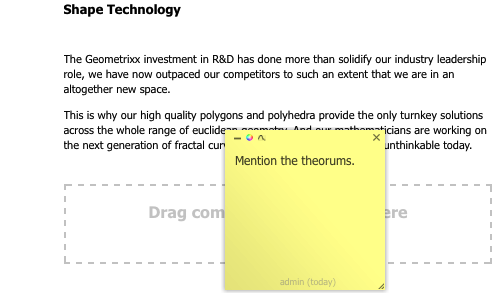

# Annotations when Editing a Page{#annotations-when-editing-a-page}

Adding content to the pages of your website is often subject to discussions prior to it actually being published. To aid this, many components directly related to content (as opposed, for example, to layout) allow you to add an annotation.

An annotation places a colored marker/sticky-note on the page. The annotation allows you (or other users) to leave comments and/or questions for other authors/reviewers.

>[!NOTE]
>
>The definition of an individual component type determines whether adding an annotation is possible (or not) on instances of that component.

>[!NOTE]
>
>Annotations created in the classic UI will be shown as well in the touch-optimized UI. However sketches are UI-specific and are only shown in the UI in which they were created.

>[!CAUTION]
>
>Deleting a resource (e.g. paragraph) deletes all the annotations and sketches attached to that resource; irrespective of their position on the page as a whole.

>[!NOTE]
>
>Depending on your requirements you can also develop a workflow to send notifications when annotations are added, updated or deleted.

## Annotations {#annotations}

Depending on the paragraph design, annotation is either available as an option on the context menu (usually the right-hand mouse button when over the required paragraph), or as a button on the paragraph edit bar.

In either case select **Annotate**. A colored sticky-note annotation will be applied to the paragraph, you are immediately in Edit mode, allowing you to add text directly:

You can move the annotation to a new position on the page. Click on the top border area, then hold and simultaneously drag the annotation to the new position. This can be anywhere on the page, though it is usually meaningful to keep it connected to the paragraph in some way.

Annotations (including related sketches) are also included in any copy, cut or delete actions carried out on the paragraph to which they are attached; for copy or cut actions, the position of the annotation (and related sketches) retain their position in relation to the originating paragraph.

The size of the annotation can also be increased, or decreased, by dragging the bottom right corner.

For tracking purposes the footer line will indicate the user who created the annotation and the date. Subsequent authors can edit the same annotation (footer will be updated), or create a new annotation for the same paragraph.

Confirmation will be requested when you select to delete the annotation (deleting an annotation also deletes any sketches attached to that annotation).

The three icons at top left allow you to minimize the annotation (together with any related sketches), change the color and add sketches.

>[!NOTE]
>
>Annotations are only visible in Edit mode of the author environment.
>
>They are not visible on a publish environment, nor in the Preview or Design modes available on an author environment.

>[!NOTE]
>
>Annotations can not be added to a page that has been locked by another user.

## Annotation Sketches {#annotation-sketches}

>[!NOTE]
>
>Sketches are not available in Internet Explorer so:
>
>* the icon will not be shown.
>* existing sketches, created in another browser, will not be shown.
>

Sketches are a feature of annotations that allow you to create simple line graphics anywhere on the browser window (visible portion):

* The cursor will change to a crosswire when you are in sketch mode. You can draw multiple distinct lines.
* The sketch line reflects the annotation color and can be either:

    * freehand

      the default mode; finish by releasing the mouse button.

    * straight:

      hold down `ALT` and click the start and end points; finish with a double-click.

* After you have exited sketch modus, you can click on a sketch line to select that sketch.
* Move a sketch by selecting the sketch, then dragging it to the desired position.
* A sketch overlays the content. This means that within the 4 corners of the sketch you cannot click on the underlying paragraph; for example, if you need to edit, or access a link. If this becomes an issue (for example, you have a sketch covering a large area of the page) then minimize the appropriate annotation, as this will also minimize all related sketches, giving you access to the underlying area.
* To delete an individual sketch - select the required sketch, then press the **Delete** key (**fn**-**backspace** on a MAC).

* If you move, or copy, a paragraph then any related annotations and their sketches will also be moved, or copied; their position in relation to the paragraph will remain the same.
* If you delete an annotation all sketches attached to that annotation will be deleted too.
