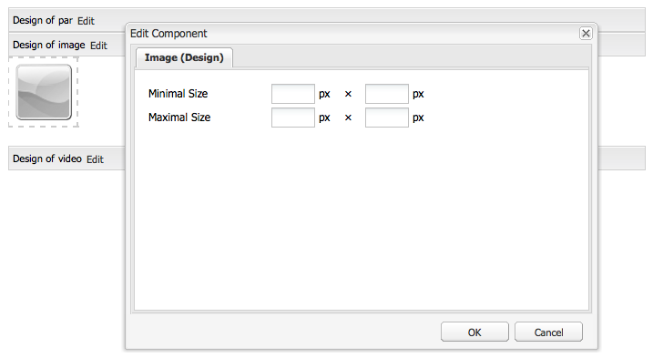

# Configuring components in Design Mode{#configuring-components-in-design-mode}

When AEM instance is installed out-of-the-box, a selection of components are immediately available in the sidekick.

In addition to these, various other components are also available. You can use Design mode to [Enable/disable such components](#enabledisablecomponentsusingdesignmode). When enabled and located on your page you can then use Design mode to [configure aspects of the component design](#configuringcomponentsusingdesignmode) by editing the attribute parameters.

>[!NOTE]
>
>Care must be taken when editing these components. The design settings are often an integral part of the design of the entire website, so they should only be changed by someone with the appropriate privileges (and experience), often an administrator or developer. See [Developing Components](/help/sites-developing/components.md) for more information.

This actually involves adding, or removing, the components allowed in the paragraph system for the page. The paragraph system ( `parsys`) is a compound component that contains all other paragraph components. The paragraph system allows authors to add components of different types to a page as it contains all other paragraph components. Each paragraph type is represented as a component.

For example, the content of a product page may contain a paragraph system holding the following:

* An image of the product (in the form of an image or textimage paragraph)
* The product description (as a text paragraph)
* A table with technical data (as a table paragraph)
* A form users fill out (as a forms begin, forms element, and forms end paragraph)

>[!NOTE]
>
>See [Developing Components](/help/sites-developing/components.md#paragraphsystem) and [Guidelines for Using Templates and Components](/help/sites-developing/dev-guidelines-bestpractices.md#guidelines-for-using-templates-and-components) for more information about `parsys`.

## Enable/Disable Components {#enable-disable-components}

In Design mode, the sidekick is minimized and you have the possibility to configure the components accessible for authoring:

1. To enter Design mode, open a page for editing and use the Sidekick icon:

   

1. Click **Edit** on the Paragraph system (**Design of par**).

   

1. A dialog will be opened, listing the component groups that are shown in the Sidekick together with the individual components that they contain.

   Select as required to add, or remove, the components to be available in the sidekick.

   

1. The Sidekick minimizes in Design mode. By clicking on the arrow you can maximize the Sidekick and return to Edit Mode:

   

## Configuring the Design of a Component {#configuring-the-design-of-a-component}

In Design mode, you can also configure attributes for the individual components. Each component has its own parameters, the following example shows the **Image** component:

1. To enter Design mode, open a page for editing and use the Sidekick icon:

   

1. You can configure the design of components.

   For example, if you click **Edit** on the Image component (**Design of image**) you can configure the component specific parameters:

   

1. Click **OK** to save your changes.

1. The Sidekick minimizes in Design mode. By clicking on the arrow you can maximize the Sidekick and return to Edit Mode:

   
