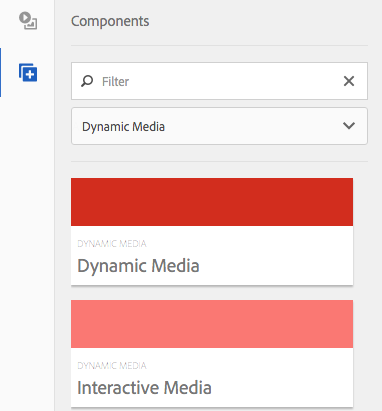
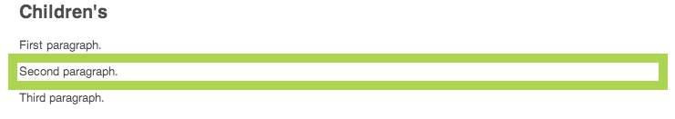
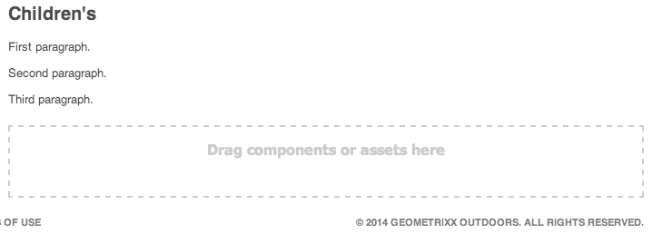
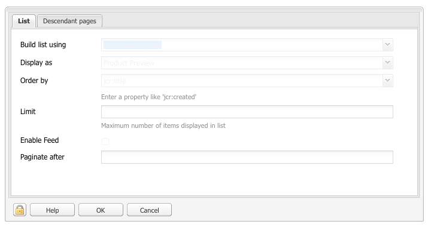
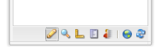
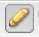
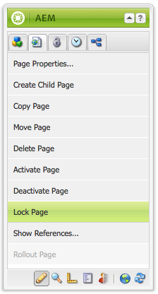

# Editing Page Content{#editing-page-content}

Once your page is created (either new or as part of a launch or live copy) you can edit the content to make the updates you require.

Content is added using [components](/help/sites-classic-ui-authoring/classic-page-author-default-components.md) (appropriate to the content type) that can be dragged onto the page. These can then be edited in place, moved, or deleted.

>[!NOTE]
>
>Your account needs the [appropriate access rights](/help/sites-administering/security.md) and [permissions](/help/sites-administering/security.md#permissions) to edit pages; for example, adding, editing or deleting components, annotating, unlocking.
>
>If you encounter any problems we suggest you contact your system administrator.

## Sidekick {#sidekick}

The sidekick is a key tool when authoring pages. It floats when authoring a page, so it is always visible.

Several tabs and icons are available, including:

* Components
* Page
* Information
* Versioning
* Workflow
* Modes
* Scaffolding
* Client Context
* Websites

These provide access to a wide selection of functionality; including:

* [selecting components](/help/sites-classic-ui-authoring/classic-page-author-env-tools.md#sidekick)
* [showing references](/help/sites-classic-ui-authoring/classic-page-author-env-tools.md#showing-references)
* [accessing the audit log](/help/sites-classic-ui-authoring/classic-page-author-env-tools.md#audit-log)
* [switching modes](/help/sites-classic-ui-authoring/classic-page-author-env-tools.md#page-modes)
* [creating](/help/sites-classic-ui-authoring/classic-page-author-work-with-versions.md#creating-a-new-version), [restoring](/help/sites-classic-ui-authoring/classic-page-author-work-with-versions.md#restoring-a-page-version-from-sidekick) and [comparing](/help/sites-classic-ui-authoring/classic-page-author-work-with-versions.md#comparing-with-a-previous-version) versions

* [publishing](/help/sites-classic-ui-authoring/classic-page-author-publish-pages.md#publishing-a-page), [unpublishing](/help/sites-classic-ui-authoring/classic-page-author-publish-pages.md#unpublishing-a-page) a page

* [editing page properties](/help/sites-classic-ui-authoring/classic-page-author-edit-page-properties.md)

* [scaffolding](/help/sites-authoring/scaffolding.md)

* [client context](/help/sites-administering/client-context.md)

## Inserting a Component {#inserting-a-component}

### Inserting a Component {#inserting-a-component-1}

After you open the page, you can start to add content. You do this by adding components (also called paragraphs).

To insert a new component:

1. There are several methods of selecting the type of paragraph you want to insert:

    * Double-click the area labeled **Drag components or assets here...** - the **Insert New Component** toolbar opens. Select a component and click **OK**.

    * Drag a component from the floating toolbar (called sidekick) to insert a new paragraph.
    * Right-click an existing paragraph and select **New...** - the Insert New Component toolbar opens. Select a component and click **OK**.

   

1. In both the sidekick and the **Insert New Component** toolbar you see a list of the available components (paragraph types). These may be split into various sections (for example, General, Columns, etc.), which can be expanded as required.

   Depending on your production environment, these choices may differ. For complete details on components, see [Default Components](/help/sites-classic-ui-authoring/classic-page-author-default-components.md).

1. Insert the component that you want on the page. Then double-click the paragraph, a window opens that allows you to configure your paragraph and add content.

### Inserting a Component using the Content Finder {#inserting-a-component-using-the-content-finder}

You can also add a new component to the page by dragging an asset from the [Content Finder](/help/sites-classic-ui-authoring/classic-page-author-env-tools.md#the-content-finder). This will automatically create a new component of the appropriate type containing the asset.

This is valid for the following asset types (some will be dependent on page/paragraph system):

| Asset Type |Resultant Component Type |
|---|---|
| Image |Image |
| Document |Download |
| Product |Product |
| Video |Flash |

>[!NOTE]
>
>This behavior can be configured for your installation. See [Configuring a Paragraph System so that Dragging an Asset Creates a Component Instance](/help/sites-developing/developing-components.md#configuring-a-paragraph-system-so-that-dragging-an-asset-creates-a-component-instance) for further details.

To create a component by dragging one of the above asset types:

1. Make sure that your page is in [**Edit** mode](/help/sites-classic-ui-authoring/classic-page-author-env-tools.md#page-modes).
1. Open the [Content Finder](/help/sites-classic-ui-authoring/classic-page-author-env-tools.md#the-content-finder).
1. Drag the required asset to the required position. The [component placeholder](#componentplaceholder) shows you where the component will be positioned.

   A component, appropriate for the asset type, will be created at the required location - it will contain the selected asset.

1. [Edit](#editmovecopypastedelete) the component if required.

## Editing a Component (Content and Properties) {#editing-a-component-content-and-properties}

To edit an existing paragraph, do one of the following:

* **Double-click** the paragraph to open it. You see the same window as when you created the paragraph with the existing content. Make your changes and click **OK**.

* **Right-click** the paragraph and click **Edit**.

* **Click** twice on the paragraph (a slow double-click) to enter the in-place editing mode. You will be able to directly edit the text on the page, instead of inside a dialog window. In this mode, you will be provided with a toolbar at the top of the page. Just make your changes and they will be automatically saved.

## Moving a Component {#moving-a-component}

To move a paragraph:

>[!NOTE]
>
>You can also use [Cut and Paste](#cut-copy-paste-a-component) to move a component.

1. Select the paragraph to be moved:

   

1. Drag the paragraph to the new location - AEM indicates where the paragraph can be moved to with a green checkmark. Drop it in your desired location.
1. Your paragraph is moved:

   

## Deleting a Component {#deleting-a-component}

To delete a paragraph:

1. Select the paragraph and **right-click**:

   

1. Select **Delete** from the menu. AEM WCM requests confirmation that you want to delete the paragraph as this action cannot be undone.
1. Click **OK**.

>[!NOTE]
>
>If you have set your [User Properties to show the Global Editing Toolbar](/help/sites-classic-ui-authoring/author-env-user-props.md) you can also perform certain actions on the paragraphs by using the **Copy**, **Cut**, **Paste**, **Delete** buttons available.
>
>Various [keyboard shortcuts](/help/sites-classic-ui-authoring/classic-page-author-keyboard-shortcuts.md) are also available.

## Cut/Copy/Paste a Component {#cut-copy-paste-a-component}

As when [Deleting a Component](#deleting-a-component) you can use the context menu to copy, cut and/or paste a component

>[!NOTE]
>
>If you have set your [User Properties to show the Global Editing Toolbar](/help/sites-classic-ui-authoring/author-env-user-props.md) you can also perform certain actions on the paragraphs by using the **Copy**, **Cut**, **Paste**, **Delete** buttons available.
>
>Various [keyboard shortcuts](/help/sites-classic-ui-authoring/classic-page-author-keyboard-shortcuts.md) are also available.

>[!NOTE]
>
>Cutting, copying, and pasting content is only supported within the same page.

## Inherited Components {#inherited-components}

Inherited components can be the product of various scenarios, including:

* [Multi site management](/help/sites-administering/msm.md); also in combination with [scaffolding](/help/sites-classic-ui-authoring/classic-feature-scaffolding.md#scaffolding-with-msm-inheritance).

* [Launches](/help/sites-classic-ui-authoring/classic-launches.md) (when based on livecopy).
* Specific components; for example the Inherited Paragraph System within Geometrixx.

You can cancel (then re-enable) the inheritance. Depending on the component, this can be available from:

1. **Live Copy**

   If a component is part of a livecopy or launch, it is indicated by a padlock icon. You can click on the padlock to cancel the inheritance.

    * The padlock icon is shown when the component is selected; for example:

   

    * The padlock is also shown in the dialog of components; for example:

   

1. **An Inherited Paragraph System**

   The configuration dialog. For example, as with the Inherited Paragraph System within Geometrixx:

   

## Adding Annotations {#adding-annotations}

[Annotations](/help/sites-classic-ui-authoring/classic-page-author-annotations.md) allow other authors to provide feedback on your content. This is often used for review and validation purposes.

## Previewing Pages {#previewing-pages}

There are two icons in the bottom border of the sidekick that are important to previewing pages:

* The pencil icon shows you that you are currently in edit mode where you can add, modify, move or delete content.

  

* The magnifying glass icon allows you to select preview mode where the page is displayed as it will be seen in the publish environment (a page refresh is sometimes also needed):

  

  In preview mode the sidekick will be reduced, click the down arrow icon to return to edit mode:

  

## Find & Replace {#find-replace}

For larger scale edits of the same phrase a **[Find & Replace](/help/sites-classic-ui-authoring/author-env-search.md#find-and-replace)** menu option allows you to search for, and replace multiple instances of a string, within a section of the website.

## Locking a Page {#locking-a-page}

AEM allows you to lock a page, so that no-one else can modify the contents. This is useful when you are making a lot of edits to one specific page, or when you need to freeze a page for a short while.

>[!CAUTION]
>
>Locking a page should be used with care as the only person who can unlock a page is the person who locked it (or an account with administrator privileges).

To lock a page:

1. In the **Websites** tab, select the page that you want to lock.
1. Double-click the page to open it for edit.
1. In the **Page** tab of sidekick, select **Lock Page**:

   

   A message shows that your page is locked to other users. In addition, in the right pane of the **Websites** console, AEM WCM displays the page as locked and indicates which user has locked the page.

   

## Unlocking a Page {#unlocking-a-page}

To unlock a page:

1. In the **Websites** tab, select the page you want to unlock.
1. Double-click the page to open it.
1. In the **Page** tab of sidekick, select **Unlock Page**.

## Undoing and Redoing Page Edits {#undoing-and-redoing-page-edits}

Use the following keyboard shortcuts while the content frame of the page has focus:

* Undo: Ctrl+Z (Windows) or Cmd+Z (Mac)
* Redo: Ctrl+Y (Windows) or Cmd+Y (Mac)

When you undo or redo the removal, addition, or relocation of one or more paragraphs, flashing (default behavior) highlights indicate the affected paragraphs.

>[!NOTE]
>
>See [Undoing and Redoing Page Edits - The Theory](#undoing-and-redoing-page-edits-the-theory) for the full details of what is possible when undoing and redoing page edits.

## Undoing and Redoing Page Edits - The Theory {#undoing-and-redoing-page-edits-the-theory}

>[!NOTE]
>
>Your system administrator can [configure various aspects of the Undo/Redo features](/help/sites-administering/config-undo.md) according to the requirements for your instance.

AEM stores a history of actions that you perform and the sequence in which you performed them. So, you undo several actions in the order that you performed them. Then, you can use redo to re-apply one or more of the actions.

If an element on the content page is selected, the undo and redo command applies to the selected item, such as a text component.

The behavior of the undo and redo commands is similar to that in other software programs. Use the commands to restore the recent state of your web page as you make decisions about content. For example, if you move a text paragraph to a different location on the page, you can use the undo command to move the paragraph back. If you then decide again to move the paragraph, use the redo command.

>[!NOTE]
>
>You can:
>
>* redo actions as long as you have not made a page edit since you used undo.
>* undo a maximum of 20 edit actions (default setting).
>* also use [Keyboard shortcuts](/help/sites-classic-ui-authoring/classic-page-author-keyboard-shortcuts.md) for undo and redo.
>

You can use undo and redo for the following types of page changes:

* Adding, editing, removing, and moving paragraphs
* In-place editing of paragraph content
* Copying, cutting, and pasting items within a page
* Copying, cutting, and pasting items across pages
* Adding, removing, and changing files and images
* Adding, removing, and changing annotations and sketches
* Changes to Scaffold
* Adding and removing references
* Changing property values in component dialog boxes.

Form fields that form components render are not meant to have values specified while authoring pages. Therefore, the undo and redo commands do not affect changes that you make to the values of those types of components. For example, you cannot undo the selecting of a value in a drop-down list.

>[!NOTE]
>
>Special permissions are required to undo and redo changes to files and images. Also, undo history for changes to files and images lasts for a minimum of hours. Beyond this time however, the undo of the changes is not guaranteed. Your administrator can provide permissions and change the default time of ten hours.
