# Components for Page Authoring{#components-for-page-authoring}

The following components are intended for use when authoring content for a standard web page. They form a subset of the components available out-of-the-box for a standard installation of AEM.

Some are immediately available through the sidekick, various others are also available by using [Design mode](/help/sites-classic-ui-authoring/classic-page-author-design-mode.md) to enable/disable them.

>[!CAUTION]
>
>This section only discusses components that are available out-of-the-box in a standard AEM installation.
>
>Depending on your instance you may have customized components developed explicitly for your requirements. These may even have the same name as some of the components discussed here.

The components are available when [editing a page](/help/sites-classic-ui-authoring/classic-page-author-edit-content.md) from the **Components** tab of the sidekick and the **Insert New Component** selector (when you double-click in the **Drag components or assets here** area).

You can select a component and drag it to the required location on your page and then [Edit Content and Properties](/help/sites-classic-ui-authoring/classic-page-author-edit-content.md#editing-a-component-content-and-properties).

Components are sorted according to various categories (component groups) including (for page authoring):

* [General](#general): Includes basic components, including text, images, tables, charts, and so on.
* [Columns](#columns): Includes components necessary for organizing the layout of the content.
* [Form](#formgroup): Includes all the components needed to create a form.

## General {#general}

The General components are the basic components that you use to create content.

### Account Item {#account-item}

You can define a link with title and description.


### Adaptive Image {#adaptive-image}

The Adaptive Image foundation component generates images that are sized to fit the window in which the web page is opened. To use the component, you provide an image resource either from the file system or DAM. When the web page is opened, the web browser downloads a copy of the image that has been resized so that it is suitable for the current window.

The following characteristics can determine the size of the window:

* Device screen: Mobile devices typically display web pages so that they extend across the entire screen.
* Web browser window size: Users of laptop and desktop computers can resize web browser windows.

For example, the component generates a small image when the web page is opened on a cell phone, and a medium-sized image when opened on a tablet. On a laptop, the component creates an delivers a large image when the page is opened in a maximized web browser. When the web browser is resized to fit a portion of the screen, the component adapts by delivering a smaller image and refreshes the view.

#### Supported Image Formats {#supported-image-formats}

You can use image files of the following file name extensions with the Adaptive Image component:

* .jpg
* .jpeg
* .png
* .gif &#42;&#42;

>[!CAUTION]
>
>&#42;&#42; Animated .gif files are not supported in AEM for adaptive renditions.

#### Images Sizes and Quality {#images-sizes-and-quality}

The following table lists the width of the image that is generated for the given viewport width. The height of the generated image is calculated to maintain a constant aspect ratio and no whitespace occurs inside the image edge. Cropping can be used to avoid whitespace.

When the image is a JPEG image, the viewport size can also influence the JPEG quality. The following JPEG qualities are possible:

* Low (0.42)
* Medium (0.82)
* High (1.00)

| Viewport Width Range (pixels) |Image Width (pixels) |JPEG Quality |Targeted Device Type |
|---|---|---|---|
| width <= 319 |320 |low |  |
| width = 320 |320 |medium |Cell phone (portrait) |
| 320 < width < 481 |480 |medium |Cell phone (landscape) |
| 480 < width < 769 |476 |high |Tablet (portrait) |
| 768 < width < 1025 |620 |high |Tablet (landscape) |
| width <= 1025 |full (original size) |high |Desktop |

#### Properties {#properties}

The dialog allows you to edit properties for your instance of the Adaptive Image component, many of which are common with the Image component on which it is based. The properties are available in two tabs:

* **Image**

    * **Image**
      Drag an image from the content finder or click to open a browse window where you can load an image. After the image is loaded, you can crop the image, rotate it, or delete it. To zoom in and out of the image, use the slide bar beneath the image (above the OK and Cancel buttons)

    * **Crop**
      Crop an image. Drag the border to crop the image.

    * **Rotate**
      Click Rotate repeatedly until the image is rotated as desired.

    * **Clear**
      Remove the current image.

* **Advanced**

    * **Title**
      The Adaptive Image component does not use this property.

    * **Alt Text**
      The alternate text to use for the image.

    * **Link To**
      The Adaptive Image component does not use this property.

    * **Description**
      The Adaptive Image component does not use this property.

#### Extending the Adaptive Image Component {#extending-the-adaptive-image-component}

For information about customizing the Adaptive Image component, see [Understanding the Adaptive Image Component](/help/sites-developing/responsive.md#using-adaptive-images).

### Carousel {#carousel}

The Carousel Component allows you to display images associated with individual pages:

* one at a time
* for a short time
* in an order you specify
* with a time delay that you specify

Clickable controls also let the user cycle through the displayed pages in real time, on demand. Clicking on the currently visible page image takes you to that page. In other words, the Carousel acts as a navigation control.

#### Properties {#properties-1}

These are available in two tabs:

* **Carousel**
  Here you specify how the carousel operates:

    * Play Speed
      The time in milliseconds before the next slide is shown.
    * Transition Time
      Time in milliseconds for the transition between two slides.
    * Controls Style
      Various options are available from a pulldown menu; for example, Prev / Next Buttons, Top-Right Switches.

* **List**
  Here you specify how pages are included in your Carousel:

    * **Build list using**
      There are several ways to build a page list - Child Pages, Fixed List, Search, or Advanced Search (all described below).
      Note that no matter which method you choose, the pages you include in your list should each already have an image associated with the page, it is this image that will be displayed in the Carousel. If there is no image for a given page under that page's Page Properties, you should associate an image with the page before beginning, as otherwise the Carousel will display a blank (or mostly blank) page. See [Editing Page Properties](/help/sites-classic-ui-authoring/classic-page-author-edit-page-properties.md).
      Depending on the item you choose a new panel will appear:

        * **Options for Child Pages**

            * **Parent Page**
              Specify a path either manually or using the selector. Leave empty to use the current page as parent.

        * **Options for Fixed List**

            * **Pages**
              Select a list of pages. Use `+` to add more entries and the up/down buttons to adjust the order.

        * **Options for Search**

            * **Start in**
              Enter a starting path, either manually or using the selector.

            * **Search query**
              You can enter a plain text search query.

        * **Options for Advanced Search**

            * **Querybuilder predicate notation**
              You can enter a search query using Querybuilder predicate notation. For example, you can enter "fulltext=Marketing" to have all pages with "Marketing" in their content show up in the Carousel.
              See [QueryBuilder API](/help/sites-developing/querybuilder-api.md) for full discussion of query expressions and further examples.

    * **Order by**
      Select `jcr:title`, `jcr:created`, `cq:lastModified`, or `cq:template` from the dropdown menu.

    * **Limit**
      The maximum number of items you would like to use in the Carousel; this is optional.

>[!NOTE]
>
>You can create a custom carousel component for Adobe Experience Manager that displays digital assets located in the AEM DAM. For information, see [Creating Custom Carousel components for Adobe Experience Manager](https://helpx.adobe.com/experience-manager/using/custom-carousel-components.html).

### Chart {#chart}

The Chart component lets you add a bar, line, or pie chart. AEM creates a chart from the data you provide. You provide data by typing directly into the Data tab or by copying and pasting a spreadsheet.

* **Data**

    * **Chart Data**
      Enter your chart data using the CSV format; the Comma Separated Values format uses commas (",”) as the field separator.

* **Advanced**

    * **Chart Type**
      Select from Pie Chart, Line Chart, and Bar Chart.

    * **Alternative text**
      Alternative text that displays instead of the chart.

    * **Width**
      Width of the chart in pixels.

    * **Height**
      Height of the chart in pixels.

The following show an example of chart data followed by the resulting Bar chart:

 

>[!NOTE]
>
>You can create a custom AEM chart control that displays data located in the AEM JCR. For information, see [Displaying Adobe Experience Manager Data in a Chart](https://helpx.adobe.com/experience-manager/using/displaying-experience-manager-data-chart.html).

### Content Fragment {#content-fragment}

>[!CAUTION]
>
>The full functionality of Content Fragment Management is only available with the touch-optimized UI.
>
>The Content Fragment component can be seen in the classic UI sidekick, but further functions are not available.

[Content fragments](/help/sites-classic-ui-authoring/classic-page-author-content-fragments.md) are created and managed as page-independent assets. You can then use these fragments, and their variations, when authoring your content pages.

### Design Importer {#design-importer}

This allows you to upload a zip file holding a design package.

### Download {#download}

The Download component creates a link on the selected web-page to download a specific file. You can either drag an asset from the Content Finder or upload a file.

* **Download**

    * **Description**
      A short description displayed with the download link.

    * **File**
      File available for download on the resulting web-page. Drag an asset from the content finder or click the area to upload the file to be available for download.

The following example shows the Download component in Geometrixx:


### External {#external}

The external application integration component (**External**) enables you to embed external applications into your AEM page using an iframe.

* **External**

    * **Target application**

      Specify the URL of the web application to be integrated; for example:

      ```
      https://en.wikipedia.org/wiki/Main_Page

      ```

    * **Pass parameters**

      Check the box for parameters to be passed to the application when required.

    * **Width and Height**

      Define the size of the iframe

The external application is integrated into the paragraph system of the AEM page; for example, when using a Target application of `https://en.wikipedia.org/wiki/Main_Page`:


>[!NOTE]
>
>Depending on your use case, other options are available for integration of external applications, for example. the [Integration of Portlets](/help/sites-administering/aem-as-portal.md).

### Flash {#flash}

The Flash component lets you load a Flash movie. You can drag a flash asset from the content finder onto the component, or you can use the dialog:

* **Flash**

    * **Flash movie**

      The flash movie file. Either drag an asset from the content finder, or click to open a browse window.

    * **Size**

      Dimensions in pixels of the display area holding the movie.

* **Alternative Image**

  An alternative image to be shown

* **Advanced**

    * **Context menu**

      Indicates whether the context menu should be shown or hidden.

    * **Window Mode**

      How the window appears, for example opaque, transparent, or as a distinct (solid) window.

    * **Background color**

      A background color selected from the color chart provided.

    * **Minimum version**

      The minimum version of Adobe Flash Player required to run the movie. The default is 9.0.0.

    * **Attributes**

      Any further attributes required.

### Image {#image}

The image component displays an image and accompanying text according to the specified parameters.

You can upload an image, then edit and manipulate it (e.g. crop, rotate, add link/title/text).

You can either drag and drop an image from the [Content Finder](/help/sites-classic-ui-authoring/classic-page-author-env-tools.md#the-content-finder) directly onto the component or its Edit dialog. You can also double-click in the central area of the Edit dialog to browse your local file system and upload an image. The two tabs of the Edit dialog also control all definitions and manipulation of the image:


>[!NOTE]
>
>The progress of the upload cannot be monitored with Internet Explorer.
>
>Internet Explorer users need to upload the image and click **Ok** then re-open the image to see the uploaded file in the preview and to be able to perform modifications (i.e. crop).
>
>See the [Certified Platforms](/help/release-notes/release-notes.md#certifiedplatforms) section for more information about HTML5 features used by AEM.

When an image is loaded, you can configure the following:

* **Map**

  To map an image, select Map. You can specify how you want to create the image map (rectangle, polygon, and so on) and where the area should point to.

* **Crop**

  Select Crop to crop an image. Use your mouse to crop the image.

* **Rotate**

  To rotate an image, select Rotate. Use repeatedly until the image is rotated the way you want it.

* **Clear**

  Remove the current image.

* **Zoom bar**

  To zoom in and out of the image, use the slide bar beneath the image (above the OK and Cancel buttons)

* **Title**

  The title of the image.

* **Alt Text**

  An alternative text for use when creating accessible content.

* **Link To**

  Create a link to assets or other pages within your website.

* **Description**

  A description of the image.

* **Size**

  Sets the height and the width of the image.

The final image (with **Title** and **Description**) may be shown as:


### Layout Container {#layout-container}

>[!CAUTION]
>
>Although the Layout container component is available in the classic UI, its full functionality is only available in the touch-enabled UI. For details see [Responsive Layout](/help/sites-classic-ui-authoring/classic-page-author-responsive-layout.md).

### List {#list}

The List component allows you to configure search criteria for displaying a list:

* **List**

    * **Build list using**

      Here you specify where the list will retrieve its content. There are several methods:

    * Depending on the item you choose a new panel will appear:

        * **Options for Child Pages**

            * **Children of** (Parent Page)
              Specify a path either manually or using the selector. Leave empty to use the current page as parent.

        * **Options for Fixed List**

            * **Pages**

              Select a list of pages. Use + to add more entries and the up/down buttons to adjust the order.

        * **Options for Search**

            * **Start in**

              Enter a starting path, either manually or using the selector.

            * **Search query**

              You can enter a plain text search query.

        * **Options for Advanced Search**

            * **Querybuilder predicate notation**

              You can enter a search query using Querybuilder predicate notation. For example, you can enter "fulltext=Marketing" to have all pages with "Marketing" in their content show up in the Carousel.

              See [QueryBuilder API](/help/sites-developing/querybuilder-api.md) for full discussion of query expressions and further examples.

        * **Tags**

          Specify the **Parent page**, **Tags/Keywords** and your required match criteria.

    * **Display as**

      How you want the items to be listed; includes Links, Teasers and News.

    * **Order by**

      Whether the list is to be ordered, and if so, the criteria to use for sorting. You can enter a criteria or select one from the drop down list provided.

    * **Limit**

      Specify the maximum number of items that you want displayed in the list.

    * **Enable Feed**

      Indicates whether an RSS feed should be activated for the list.

    * **Paginate after**

      Here you can specify the number of list items to display at once. A list with more items than specified will use pagination to display the list in several portions.

The following example shows a **List** component the way it may display a list of child pages (the design is controlled by a site design's custom CSS definitions).


### Login {#login}

These provides the Username and Password fields.


You can configure:

* Log In

    * Section Label

      Lead-in text for the input fields.

    * Username Label

      Text to label the username field.

    * Password Label

      Text to label the password field.

    * Log In Button Label

      Text for the login button.

    * Redirect to

      You can specify the page on your website that should be opened once the user has logged in.

* Already Logged In

    * Continue Button Label

      Text to indicate the user is already logged in.

### Order Status {#order-status}

* **Title**

    * **Title**

      Specify the title text you want displayed.

    * **Link**

      Specify the page (product) for which the order status should be displayed.

    * **Type/Size**

      Select from the selection provided.

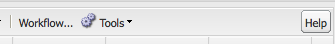

### Reference {#reference}

The **Reference** component lets you reference text from another page of your AEM website (within the current instance). The content of the referenced paragraph then appears as if it was on the current page. The content will be updated when the source paragraph changes (might need a page refresh).

* **Paragraph Reference**

    * **Reference**

      Specify the path to the page and paragraph that you want to reference (include content).

To specify the path to a paragraph you need to suffix the path (to the page) with:

`.../jcr:content/par/<paragraph-ID>`

For example:

`/content/geometrixx-outdoors/en/equipment/biking/cajamara/jcr:content/par/similar-products`

As well as referencing a specific paragraph, the path can also be modified to specify an entire par-system. You can do this by suffixing the path with:

`/jcr:content/par`

For example:

`/content/geometrixx-outdoors/en/equipment/biking/cajamara/jcr:content/par`

Once configured the content will appear exactly as on the source page. The fact that it is a reference is only seen when you open the component for editing:

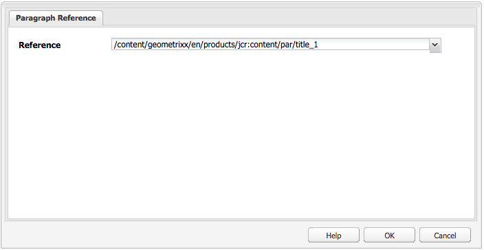

### Search {#searching}

The Search component adds search capability to your page.

You can configure:

* Search

    * **Node Types**

      If the search is to be restricted to specific node type list them here; for example, `cq:Page`.

    * **Path to search in**

      Specify the root page of the branch you want to search.

    * **Search Button Text**

      The name displayed on the actual search button.

    * **Statistics Text**

      The text displayed above the search results.

    * **No Results Text**

      If there are no results, the text entered here is displayed.

    * **Spellcheck Text**

      If someone enters a similar term, this text is displayed before the term.
      For example, if you type geometrixxe, the system displays "Did you mean? geometrixx".

    * **Similar Pages Text**

      The text that is displayed next to a result for similar pages. Click this link to see pages that have similar content.

    * **Related Searches Text**

      The text that appears next to searches for related terms and topics.

    * **Search Trends Text**

      The title above the search terms users enter.

    * **Result Pages Label**

      The text that appears at the bottom of this list with links to other results pages.

    * **Previous Label**

      The name that appears on the link to previous search pages.

    * **Next Label**

      The name that appears on the link to subsequent search pages.

The following example shows the Search component after a search for the word *geometrixx* from the root directory of a standard installation. This also illustrates the pagination of results:

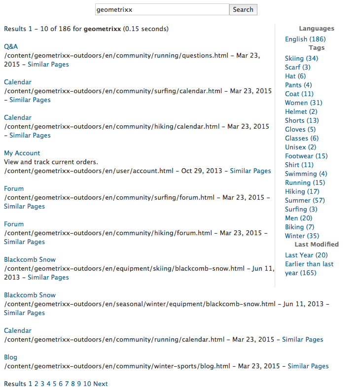

The following example shows a search term that is misspelled and not available:


### Sitemap {#sitemap}

An automatic sitemap listing, which (with the default settings) lists all pages (as active links) in the current website. For example, an extract shows:


If required you can configure:

* **Sitemap**

    * **Root Path**

      Path from where the listing is to start.

### Slideshow {#slideshow}

This component allows you to load a series of images to be displayed as a slideshow on your page.You can add or remove images and assign each a title. Under Advanced you can also specify the size of the display area.

You can configure:

* **Slides**

    * **New Slide**

      You can specify a selection of slides using the **Add** (and **Remove**) buttons.

    * **Title**

      Specify a title if required. This is overlaid on the appropriate slide.

* **Advanced**

    * **Size**

      Specify the width and height in pixels.

The slideshow component then repeatedly displays each in sequence, for a short period of time, before fading through to the next slide:


### Table {#table}

>[!NOTE]
>
>The **Table** component is based on the [Rich Text editor](/help/sites-classic-ui-authoring/classic-page-author-rich-text-editor.md), as is the **[Text](#text)** component.
>
>It is recommended to use the **Table** component for tables, although they can also be constructed with the **Text** component.

The **Table** component is preconfigured to let you construct, fill and format a table. Using the dialog you can configure your table and create the contents by either:

* from scratch
* copying and pasting a spreadsheet or a table from an external editor (such as Excel, OpenOffice, Notepad, etc).


The following screenshot shows an example of the table component; the design is determined by the site-specific CSS:


### Tag Cloud {#tag-cloud}

A tag cloud shows a graphically presented selection of the tags applied to content within your website:


When configuring the Tag Cloud component, you can specify:

* **Tags to Display**
  Where the tags to be displayed are collected from. Select from a page, a page with all children or all tags.

* **Page**
  Select the page to be referenced.

* **No links on tags**
  Whether the tags displayed should act as links.

For more information about applying tags, visit [Using Tags](/help/sites-classic-ui-authoring/classic-feature-tags.md).

### Text {#text}

>[!NOTE]
>
>The **Text** component is based on the [Rich Text editor](/help/sites-classic-ui-authoring/classic-page-author-rich-text-editor.md), as is the **[Table](#table)** component.
>
>It is recommended to use the **Table** component for tables, although they can also be constructed with the **Text** component.

The Text component lets you enter a text block using a WYSIWYG editor, with functionality provided by the [Rich Text editor](/help/sites-classic-ui-authoring/classic-page-author-rich-text-editor.md). A selection of icons allow you to format your text, including font characteristics, alignment, links, lists and indentation.

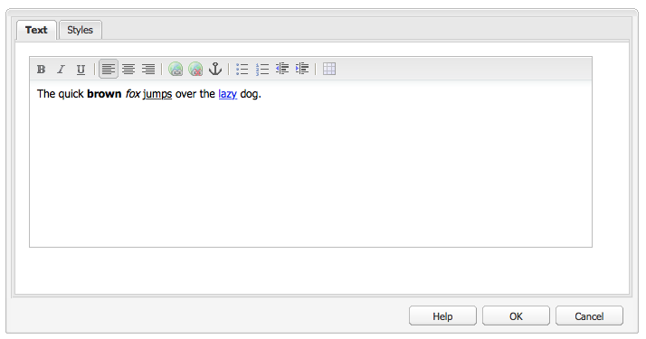

When you open the **Styles** tab of the **Edit** dialog you can also set:

* **Spacer**
* **Text Style**

The formatted text will then be shown on the page; the actual design will depend on the site CSS:

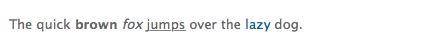

For more detailed information about the Text component and the functionality provided by the Rich Text editor, see the [Rich Text Editor](/help/sites-classic-ui-authoring/classic-page-author-rich-text-editor.md) page.

#### Inplace Editing {#inplace-editing}

In addition to the dialog based Rich Text editing mode, AEM also provides [Inplace Editing](/help/sites-authoring/editing-content.md), which allows direct editing of the text as it is displayed in the layout of the page.

### Text & Image {#text-image}

The Text & Image component adds a text block and an image. You can also add and edit text and images separately. See the [Text](#text) and [Image](#image) components for details.

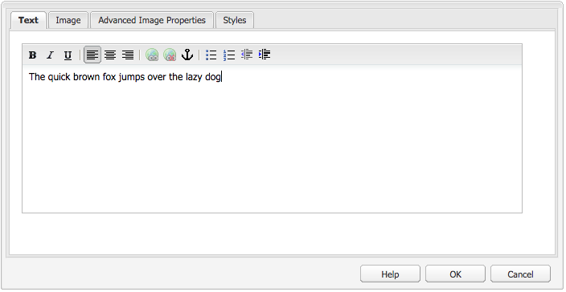 

You can configure:

* **Component Styles** (**Styles**)

  Here you can either left or right align the image. The default is **Left** aligned, with the image at the left.

* **Image Properties** (**Advanced Image Properties**)

  Allows you to specify the following:

    * **Image asset**

      Upload the required image.

    * **Title**

      The title for the block; will be shown by mouseover.

    * **Alt Text**

      Alternative text to be shown if the image cannot be displayed. If left empty the title will be used.

    * **Link to**

      Specify a target path.

    * **Description**

      A description of the image.

    * **Size**

      Sets the height and width of the image.

The following example shows a Text Image Component displaying the image left-aligned:


### Title {#title}

The title component can either:

* display the name of the current page; this is done by leaving the Title field blank
* display a text you specify in the Title field.

You can configure:

* **Title**

  If you want to use a name other than the page title, enter it here.

* **Link**

  The URI if the title is to operate as a link.

* **Type/Size**

  Select Small or Large from the dropdown list. Small is generated as an image. Large is generated as text.

The following example shows a **Title** component being displayed; the design is determined by the site-specific CSS.


### Video {#video}

The **Video** component allows you to place a predefined, out-of-the-box video element on a page.

See also [Configure your Video Profiles](/help/sites-administering/config-video.md#configuringvideoprofiles) for use with HTML5 elements.

After placing an instance of the component on your page you can configure:

* Video

    * **Video asset**

      Upload or drop your video asset.

    * **Size**

      The video's native size (width x height in pixels) will appear in the boxes next to Size (see above). Manually enter width and height dimensions here if you wish to override the video's native dimensions. Click **OK** to dismiss the dialog.

>[!NOTE]
>
>Formats supported include:
>
>* `.mp4`
>* `Ogg`
>* `FLV` (Flash video)
>

## Columns {#columns}

Columns are a mechanism to control the layout of content in AEM. In a standard installation components for creating two and/or 3 columns are provided.

The following example shows the 2 Columns and 3 Columns components in use. You can use the placeholders for new components:

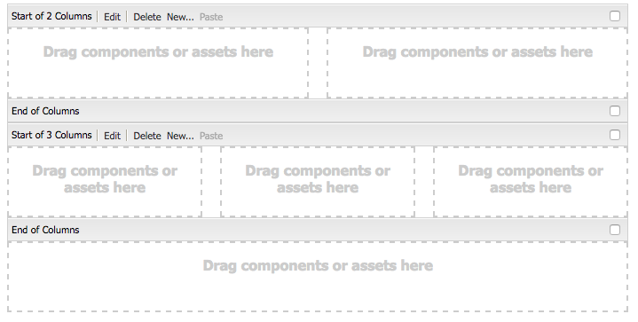

### 2 Columns {#columns-1}

A Column Control component that defaults to 2 equal columns.

### 3 Columns {#columns-2}

A Column Control component that defaults to 3 equal columns.

### Column Control {#column-control}

The Column Control component lets users select how they want to split the content in the main panel of the web-page into multiple columns. Users can select the number of columns required (from a predefined list) and then create, delete, or move content within each of the columns.

* **Column Control**

    * **Column Layout**

      Select the number of columns you want rendered. Once created, each column has its own link for dragging components or assets when adding content.

## Form {#form}

Form components are used to create forms for visitors to submit input. Forms and form components can be used to collect information including user feedback (for example, a customer satisfaction questionnaire) and user information (for example, user registration).

>[!NOTE]
>
>See [AEM Forms Help](/help/forms/home.md) for information about AEM Forms.

Forms are built up from several different components:

* **Form**

  The form component defines the beginning and end of a new form on a page. Other components can then be placed in between these elements, such as tables, downloads, and so on.

* **Form fields and elements**

  Form fields and elements can include text boxes, radio buttons, images, and so on. The user often completes an action in a form field, such as typing text. See individual form elements for more information.

* **Profile Components**

  Profile components relate to visitor profiles used for social collaboration and other areas where visitor personalization is required.

The following shows an example form; it is comprised of the **Form** component (start and end), with two **Form** **Text** fields used for input, a **General** **Text** field used for the lead-in text and a **Submit** button.

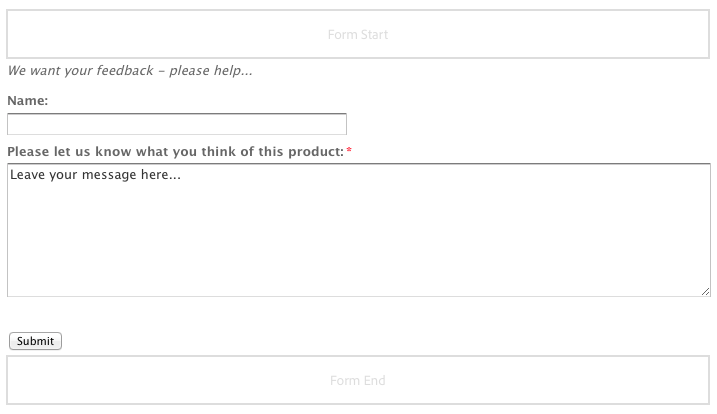

>[!NOTE]
>
>Information about developing and customizing your forms further is available on the [Developing Forms page](/help/sites-developing/developing-forms.md). This includes adding actions, constraints, preloading fields and using scripts to call a service to take action, amongst others.

### Settings Common to (Many) Form Components {#settings-common-to-many-form-components}

Although each of the form components has a different purpose, many are composed of similar options and parameters.

When configuring any of the form components the following tabs are available in the dialog:

* **Title and Text**

  Here you need to specify the basic information, such as the title of the form and any accompanying text. Where appropriate it also allows you to define other key information such as whether the field is multi-selectable and items available for selection.

* **Initial Values**

  Allows you to specify a default value.

* **Constraints**

  Here you can specify whether a field is required and place constraints are on that field (for example, must be numeric, and so on).

* **Styling**

  Indicates the size and styling of the fields.

>[!NOTE]
>
>The fields you see vary significantly depending on the individual component.

These tabs provide you with the necessary parameters; these can depend on the individual component type, but can include:

* **Title and Text**

    * **Element Name**

      Name of the form element. This indicates where in the repository the data is stored.
      This is a required field and should only contain the following characters:

        * alphanumeric characters
        * `_ . / : -`

    * **Title**

      The title displayed with the field. If left blank, the default title will be shown.

    * **Description**

      Allows you to provide additional information for the user, if necessary. On the form this is shown below the field, in a smaller font than the title.

    * **Show/Hide**

      Determines when the field is visible.

* **Initial Values**

    * **Default Value**

      The value displayed in the field when the form is opened; ie before the user has made any input.

* **Constraints**

    * **Required**

      This is dependent on the form component type, but provides one or more click boxes to indicate that this field, or certain parts of this field, is/are required.

    * **Required Message**

      A message to inform users that this field is required; a required field will also be flagged with and asterisk.

    * **Constraint**

      The constraints available for selection are dependent on the form component type.

    * **Constraint Message**

      A message to inform users what is required.

* **Styling**

    * **Size**

      In rows and columns.

    * **Width**

      In pixels.

    * **CSS**

### Form (component) {#form-component}

The Form component defines both the start and end of a form using the **Form Start** and **Form End** elements. These are always paired to ensure that the form is correctly defined.

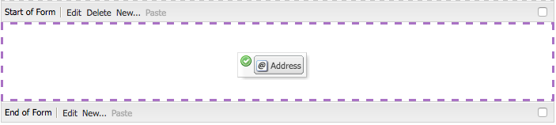

In between the start and end of a form, you can add form components that define the actual input fields for users.

#### Start of Form {#start-of-form}

This component is needed to define the start of a new form on a page. You can configure:

* **Form**

    * **Thank You Page**

      The page to be referenced to thank visitors for providing their input. If left blank, the form re-displays after submission.

    * **Start Workflow**

      Determines which workflow is triggered once a form is submitted.

* **Advanced**

    * **Action Type**

      A form needs an action. The action defines the operation that is triggered for execution with the data submitted by the user (similar to action= in HTML). Some need a corresponding **Action Configuration**.

      A selection of action types are included in a standard AEM installation:

        * **Account Request**
        * **Create Content**
        * **Create Lead**
        * **Create and Update Account**
        * **E-Mail Service: Create Subscriber and add to list**
        * **E-Mail Service: Send auto-responder email**
        * **E-Mail Service: Unsubscribe user from list**
        * **Edit Community**
        * **Edit Resource(s)**
        * **Edit Workflow Controlled Resource(s)**
        * **Mail**
        * **Placed Order Details**
        * **Profile Update**
        * **Reset Password**
        * **Set Password**
        * **Store Content**

          This is the default action type.

        * **Store Content with Uploads**
        * **Submit Order**
        * **Unsubscribe Subscriber**
        * **Update Order**

    * **Form Identifier**

      The form identifier uniquely identifies the form. Use the form identifier if you have several forms on a single page; make sure they have different identifiers.

    * **Load Path**

      The path to node properties used to load predefined values into the form fields.
      This is an optional field that specifies the path to a node in the repository. When this node has properties that match the field names, then the appropriate fields on the form are preloaded with the value of those properties. If no match exists, then the field contains the default value.
      Using **Load Path** you can preload the form with values in the required fields. See [Preloading Form Values](/help/sites-developing/developing-forms.md#preloading-form-values).

    * **Client Validation**

      Indicates whether client validation is required for this form (server validation *always* occurs.). This can be achieved in conjunction with the **Forms Captcha** component.

    * **Validation Resource Type**

      Defines the form validation resource type if you want to validate the entire form (instead of individual fields). If you are validating the complete form, also include one of the following:

        * A script for client validation:

          `/apps/<myApp>/form/<myValidation>/formclientvalidation.jsp`

        * A script for validation on the server side:

          `/apps/<myApp>/form/<myValidation>/formservervalidation.jsp`

    * **Action Configuration**

      The options available in **Action Configuration** are dependent on the **Action Type** selected:

        * **Account Request**

          * **Create Account Page**
              The page used when creating a new account.

        * **Create Content**

            * Content Path
              The content path for any content that the form dumps. Enter a path that ends with a slash `/`. The slash means that for each form port, a new node is created at the given location; for example:
              `/forms/feedback/`

            * **Type**

              Select the required type.

            * **Form**

              Specify the form.

            * **Render with**

              Select the required option from the list.

            * **Resource Type**

              If set, this is added to each comment as `sling:resourceType`

            * **View Selector**

        * **Create Lead**

            * **Lead will be added to this list**
              Specify the required lead list.

        * **Create and Update Account**

            * **Initial Group**

              Group to assign new user to.

            * **Home**

              Page to display after successful login.

            * **Path**

              The path (relative) to where the new account is created and stored.

            * **View Data...**

              Click this button to access the information about form results in the bulk editor. From here, you can export the information to a `.tsv` (tab-separated) file (for use, for example, in an Excel spreadsheet).

        * **Mail**

            * **From**

              Enter the email address that the email should come from.

            * **Mailto**

              Enter the email address(es) that the form is to sent to.

            * **CC**

              Enter the CC email address(es).

            * **BCC**

              Enter the BCC email address(es).

            * **Subject**

              Enter a subject for the email.

        * **Reset Password**

            * **Change Password Page**

              The page used when changing the password.

        * **Store Content**

            * **Content Path**

              The content path for any content that the form dumps. Enter a path that ends with a slash `/`. The slash means that for each form port, a new node is created at the given location; for example:
              `/forms/feedback/`

            * **View Data...**

              Click this button to access the information about form results in the bulk editor. From here, you can export the information to a .tsv (tab-separated) file (for use, for example, in an Excel spreadsheet).

        * **Store Content With Uploads**

          This has the same options as **Store Content**.

        * **Unsubscribe Subscriber**

            * **Lead will be deleted from this list**

              Specify the required lead list.

#### End of Form {#end-of-form}

This marks the end of the form. You can configure:

* **Form End**

    * **Show Submit Button**

      Indicates whether a Submit button should be shown or not.

    * **Submit Name**

      An identifier if you are using multiple submit buttons in a form.

    * **Submit Title**

      The name that appears on the button, such as Submit or Send.

    * **Show Reset Button**

      Select check box to make the Reset button visible.

    * **Reset Title**

      The name that appears on the Reset button.

    * **Description**

      Information that appears below the button.

### Account Name {#account-name}

This allows the user to input an account name:


### Address {#address}

This allows you to add an international address field with the following format:


The component is configured for immediate use, but you can change the configuration if required. For example, constraints can be added for the individual elements of the address. Leaving fields empty will use default settings.

### Captcha {#captcha}

The Captcha component requires the user to type in an alphanumeric string as displayed on screen. The string changes with each refresh.


You can configure various parameters for this component, including a message to be shown when the captcha string is invalid.

### Checkbox Group {#checkbox-group}

A checkbox allows you to build a list of one of more checkboxes, several of which may be selected at the same time.


You can specify various parameters including a title, description and element name. Using the + and - buttons you can add or remove items, then position them with the up and down arrows.

>[!NOTE]
>
>Using **Items Load Path** you can preload the check box group list with values.
>
>See [Preloading Form Fields with Multiple Values](/help/sites-developing/developing-forms.md#preloading-form-fields-with-multiple-values).

### Credit Card Details {#credit-card-details}

This allows you to provide the fields needed for entering credit card details. You can configure it to specify the types of card accepted and the information required (for example, security code).


### Dropdown List {#dropdown-list}

A drop down list can be configured to provide your use with a range of values for selection:


You can specify a title and items to appear in the list. Using the + and - buttons you can add or remove the list items, then position them with the Up and Down buttons. You can specify whether the users are allowed to select several items from the list and any items that should be automatically selected the first time they open the list (initial values).

>[!NOTE]
>
>Using **Items Load Path** you can preload the drop down list with values.
>
>See [Preloading Form Fields with Multiple Values](/help/sites-developing/developing-forms.md#preloading-form-fields-with-multiple-values).

### File Upload {#file-upload}

The file upload component provides the user with a mechanism for selecting and uploading a file.


>[!NOTE]
>
>You can create a custom upload component to upload files to a Sling Servlet. For information, see [Uploading files to Adobe Experience Manager](https://helpx.adobe.com/experience-manager/using/uploading-files-aem1.html).

### Hidden Field {#hidden-field}

This component allows you to create a hidden field. These can be used for various purposes; for example, when you need to perform an action after submitting the form, or when hidden data is required in post processing.


>[!NOTE]
>
>You can also customize your form to show or hide specific form components according to the value of other fields in the form. Changing the visibility of a form field is useful when the field is needed only under specific conditions.
>
>See [Showing and Hiding Form Components](/help/sites-developing/developing-forms.md#showing-and-hiding-form-components).

### Image Button {#image-button}

An image button allows you to create a button with your own image and text:


### Image Upload {#image-upload}

The image upload component provides the user with a mechanism for selecting and uploading an image file.


### Link Field {#link-field}

The link field allows the user to specify a URL:

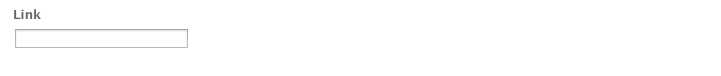

Most commonly used for the calendar event form, where it is used for the URL/link field of an event.

### Password Field {#password-field}

This is used to allow the user to input their password:


### Password Reset {#password-reset}

This component provides your user with two fields for:

* the input of a password
* repeated input of the password to check to confirm that input is correct.

With default settings the component will appear as:


### Radio Group {#radio-group}

A radio group provides you with a list of one of more radio checkboxes, only one of which may be selected at any particular time.

You can specify the element name together with a title and description Using the + and - buttons you can add or remove items, position them with the up and down arrows and specify a default value if required:

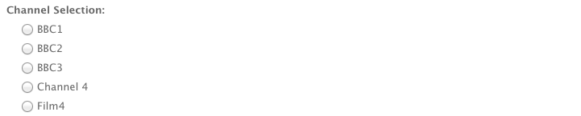

>[!NOTE]
>
>Using **Items Load Path** you can preload the radio group with values.
>
>See [Preloading Form Fields with Multiple Values](/help/sites-developing/developing-forms.md#preloading-form-fields-with-multiple-values).

### Submit Button {#submit-button}

This component allows you to create a submit button, with either the default text:


Or with your own text:

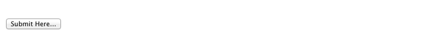

### Tags Field {#tags-field}

This field allows you to select tags:


You can specify various parameters, including the namespaces can be used using the specialized tab:

* **Tag Field**

    * **Allowed Namespaces**

        * **Geometrixx Outdoors**
        * **Workflow**
        * **Forum**
        * **Stock Photography**
        * **Geometrixx Media**
        * **Standard Tags**
        * **Marketing**
        * **Asset Properties**

    * **Width in pixels**
    * **Popup Size**

### Text Field {#text-field}

The standard text field can be configured to your required size and with with your own lead in message:

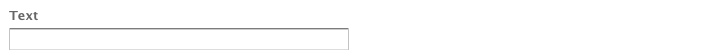

### Workflow Submit Button(s) {#workflow-submit-button-s}

This allows you to create a Submit button for use in a workflow.


