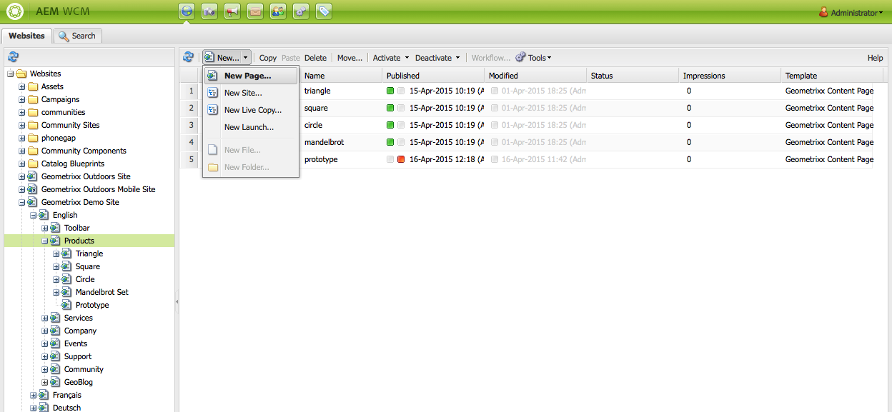
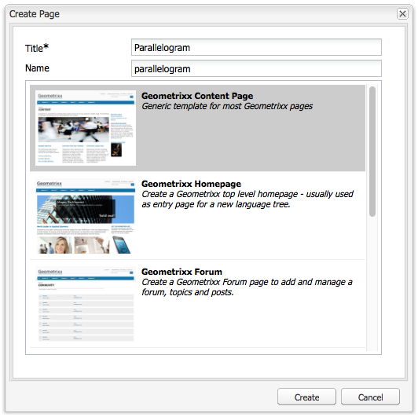
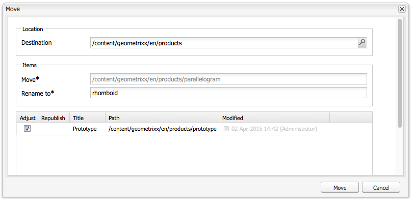
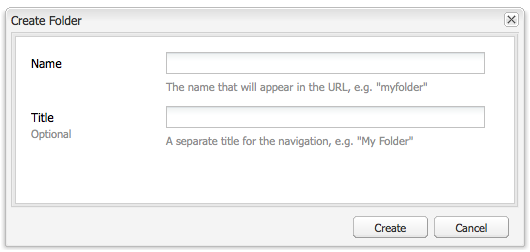

# Creating and Organizing Pages{#creating-and-organizing-pages}

This section describes how to create and manage pages with Adobe Experience Manager (AEM) so that you can then [create content](/help/sites-classic-ui-authoring/classic-page-author-edit-content.md) on those pages.

>[!NOTE]
>
>Your account needs the [appropriate access rights](/help/sites-administering/security.md) and [permissions](/help/sites-administering/security.md#permissions) to take action on pages, for example, create, copy, move, edit, delete.
>
>If you encounter any problems we suggest you contact your system administrator.

## Organizing your Website {#organizing-your-website}

As an author you will need to organize your website within AEM. This involves creating and naming your content pages so that:

* you can easily find them on the author environment
* visitors to your site can easily browse them on the publish environment

You can also use [folders](#creating-a-new-folder) to help organize your content.

The structure of a website can be thought of as a *tree structure* that holds your content pages. The names of these content pages are used to form the URLs, whereas the title is shown when the page content is viewed.

The following shows an extract from the Geometrixx site; where, for example, the `Triangle` page will be accessed:

* Author environment

  `http://localhost:4502/cf#/content/geometrixx/en/products/triangle.html`

* Publish environment

  `http://localhost:4503/content/geometrixx/en/products/triangle.html`

  Depending on the configuration of your instance, use of `/content` might be optional on the publish environment.

```xml
  /content
    /geometrixx
      /en
        /toolbar...
        /products
          /triangle
            /overview
            /features
          /square...
          /circle...
          /...
        /...
      /fr...
      /de...
      /es...
      /...
    /...
```

This structure can be viewed from the Websites console, which you can use to [navigate through the tree structure](/help/sites-classic-ui-authoring/author-env-basic-handling.md#main-pars-text-15).


### Page Naming Conventions {#page-naming-conventions}

When creating a new page there are two keys fields:

* **[Title](#title)**:

    * This is displayed to the user in the console and shown at the top of the page content when editing.
    * This field is mandatory.

* **[Name](#name)**:

    * This is used to generate the URI.
    * User input for this field is optional. If not specified, the name is derived from the title.

When creating a new page, AEM will [validate the page name according to the conventions](/help/sites-developing/naming-conventions.md) imposed by AEM and JCR.

Implementation and the list of characters allowed differs slightly according to UI (it is more extensive for the touch-enabled UI), but the minimum allowed is:

* 'a' through to 'z'
* 'A' through to 'Z'
* '0' through to '9'
* _ (underscore)
* `-` (hyphen/minus)

Use just these characters if you want to be sure of them being accepted/used (if you need full details of all characters allowed, see [the naming conventions](/help/sites-developing/naming-conventions.md)).

#### Title {#title}

If you supply only a page **Title** when creating a new page, AEM will derive the page **Name** from this string and [validate the name according to the conventions](/help/sites-developing/naming-conventions.md) imposed by AEM and JCR. In both UIs a **Title** field containing invalid characters will be accepted, but the name derived will have the invalid characters subsituted. For example:

| Title |Derived Name |
|---|---|
| Schön |schoen.html |
| SC%&&ast;ç+ |sc---c-.html |

#### Name {#name}

If you supply a page **Name** when creating a new page, AEM will [validate the name according to the conventions](/help/sites-developing/naming-conventions.md) imposed by AEM and JCR.

In the Classic UI you **cannot enter invalid characters** in the **Name** field.

>[!NOTE]
>In the touch-enabled UI you **cannot submit invalid characters** in the **Name** field. When AEM detects invalid characters the field will be highlighted and an explanatory message shown to indicate the characters that need removing/replacing.

>[!NOTE]
>
>You should avoid using a two-letter code as defined by ISO-639-1, unless it is a language root.
>
>See [Preparing Content for Translation](/help/sites-administering/tc-prep.md) for more information.

### Templates {#templates}

In AEM, a template specifies a specialized type of page. A template will be used as the basis for any new page being created.

The template defines the structure of a page; including a thumbnail image and other properties. For example, you may have separate templates for product pages, sitemaps, and contact information. Templates are comprised of [components](#components).

AEM comes with several templates provided out-of-the-box. The templates proffered depend on the individual website and the information that needs to be supplied (when creating the new page) depends on the UI being used. The key fields are:

* **Title**
  The title displayed on the resulting web-page.

* **Name**
  Used when naming the page.

* **Template**
  A list of templates available for use when generating the new page.

### Components {#components}

Components are the elements provided by AEM so that you can add specific types of content. AEM comes with a range of out-of-the-box components that provide comprehensive functionality; these include:

* Text
* Image
* Slideshow
* Video
* many more

Once you have created and opened a page you can [add content using the components](/help/sites-classic-ui-authoring/classic-page-author-edit-content.md#insertinganewparagraph), available from the [sidekick](/help/sites-classic-ui-authoring/classic-page-author-env-tools.md#sidekick).

## Managing Pages {#managing-pages}

### Creating a New Page {#creating-a-new-page}

Unless all pages have been created for you in advance, before you can start creating content, you must create a page:

1. From the **Websites** console, select the level at which you want to create a new page.

   In the following example, you are creating a page under the level **Products** - shown in the left pane; the right pane shows pages that already exist at the level under **Products**.

   

1. In the **New...** menu (click the arrow next to **New...**), select **New Page...**. The **Create Page** window opens.

   Clicking **New...** itself also acts as a shortcut to the **New Page...** option.

1. The **Create Page** dialog allows you to:

    * Provide a **Title**; this is displayed to the user.
    * Provide a **Name**; this is used to generate the URI. If not specified, the name will be derived from the title.

        * If you supply a page **Name** when creating a new page, AEM will [validate the name according to the conventions](/help/sites-developing/naming-conventions.md) imposesd by AEM and JCR.
        * In the classic UI you **cannot enter invalid characters** in the **Name** field.

    * Click the template you want to use to create the new page.

      The template is used as the basis for the new page; for example, to determine the basic layout of a content page.

   >[!NOTE]
   >
   >See [Page Naming Conventions](#page-naming-conventions).

   The minimum information required to create a new page is the **Title** and the template required.

   

   >[!NOTE]
   >
   >If you would like to use unicode characters in the URLs, set the Alias ( `sling:alias`) property ([page properties](/help/sites-classic-ui-authoring/classic-page-author-edit-page-properties.md)).

1. Click **Create** to create the page. You return to the **Websites** console where you can see an entry for the new page.

   The console provides information about the page (for example when it was last edited and by whom) which is updated as necessary.

   >[!NOTE]
   >
   >You can also create a page when you are editing an existing page. Using **Create Child Page **from the **Page** tab of the sidekick, will create a new page directly under the page being edited.

### Opening a Page For Editing {#opening-a-page-for-editing}

You can open the page to be [edited](/help/sites-classic-ui-authoring/classic-page-author-edit-content.md#editing-a-component-content-and-properties) by one of several methods:

* From **Websites** console, you can **double-click** the page entry to open it for editing.

* From **Websites** console, you can **right-click** (context menu) the page item, then select **Open** from the menu.

* After you have opened a page, you can navigate to other pages within the site (to edit them) by clicking hyperlinks.

### Copying and Pasting a Page {#copying-and-pasting-a-page}

When copying, you can copy either:

* a single page
* a page together with all subpages

1. From the **Websites** console, select the page you want to copy.

   >[!NOTE]
   >
   >At this stage, it is irrelevant whether you want to copy a single page or the underlying subpages.

1. Click **Copy**.

1. Navigate to the new location and click:

    * **Paste** - to paste the page together with all subpages
    * **Shift + Paste** - to paste the selected page only

   The page(s) are pasted at the new location.

   >[!NOTE]
   >
   >The page name might be automatically adjusted if an existing page already has the same name.

   >[!NOTE]
   >
   >You can also use **Copy Page** from the **Page** tab of the sidekick. This will open a dialog where you can specify the destination, etc.

### Moving or Renaming Page {#moving-or-renaming-page}

>[!NOTE]
>
>Renaming a page is also subject to the [Page Naming Conventions](#page-naming-conventions) when specifying the new page name.

The procedure to move or rename a page is the same. With the same action you can:

* move a page to a new location
* rename a page at the same location
* move a page to a new location and rename it at the same time

AEM offers you the functionality to update internal links to the page being renamed or moved. This can be done on a page-by-page basis to provide full flexibility.

To move or rename a page:

1. There are various methods of triggering a move:

    * From the **Websites** console, click to select the page, then select **Move...**
    * From the **Websites** console, you can also select the page item, then **right-click** and select **Move...**
    * When editing a page you can select **Move Page** from the **Page** tab of the sidekick.

1. The **Move** window opens; here you can either specify a new location, a new name for the page, or both.

   

   The page also lists any pages that reference the page being moved. Depending on the status of the referencing page, you may be able to adjust those links on and/or republish the pages.

1. Fill in the following fields, as appropriate:

    * **Destination**

      Use the sitemap (available via the drop-down selector) to select the location where the page should be moved to.

      If you are only renaming the page, ignore this field.

    * **Move**

      Specify the page to be moved - this is usually filled in by default, depending on how and where you started the move action.

    * **Rename to**

      The current page label displays by default. Specify the new page label, if required.

    * **Adjust**

      Update the links on the page listed that point to the moved page: for example, if page A has links to page B, AEM adjusts the links in page A in case you move page B.

      This can be selected/deselected for each individual referencing page.

    * **Republish**

      Republish the referencing page; again this can be selected for each individual page.

   >[!NOTE]
   >
   >If the page was already activated, moving the page will automatically deactivate it. By default, it will be reactivated when the move is complete, but this can changed by unchecking the **Republish** field for the page in the **Move** window.

1. Click **Move**. Confirmation will be required. Click **OK** to confirm.

   >[!NOTE]
   >
   >The page title will not be updated.

### Deleting a Page {#deleting-a-page}

1. You can delete a page from various locations:

    * Within the **Websites** console, click to select the page, then right-click and select **Delete** from the resulting menu.
    * Within the **Websites** console, click to select the page, then select **Delete** from the toolbar menu.
    * Within sidekick use the **Page** tab to select **Delete Page** - this deletes the page that is currently open.

1. After you have selected to delete a page you must confirm the request - as the action cannot be undone.

   >[!NOTE]
   >
   >After deletion, if the page has been published you can restore the latest (or a specific) version, but this may not have exactly the same content as your last version if further modifications had been made. See [How To Restore Pages](/help/sites-classic-ui-authoring/classic-page-author-work-with-versions.md#restoringpages) for further details.

>[!NOTE]
>
>If a page is already activated, it will automatically be deactivated before deletion.

### Locking a Page {#locking-a-page}

You can [lock/unlock a page](/help/sites-classic-ui-authoring/classic-page-author-edit-content.md#locking-a-page) from either a console or when editing an individual page. Information about whether a page is locked is also shown in both locations.

### Creating a New Folder {#creating-a-new-folder}

>[!NOTE]
>
>Folders are also subject to the [Page Naming Conventions](#page-naming-conventions) when specifying the new folder name.

1. Open the **Websites** console and navigate to the required location.
1. In the **New...** menu (click the arrow next to **New...**), select **New Folder...**.
1. The **Create Folder** dialog will open. Here you can enter the **Name** and **Title**:

   

1. Select **Create** to create the folder.
