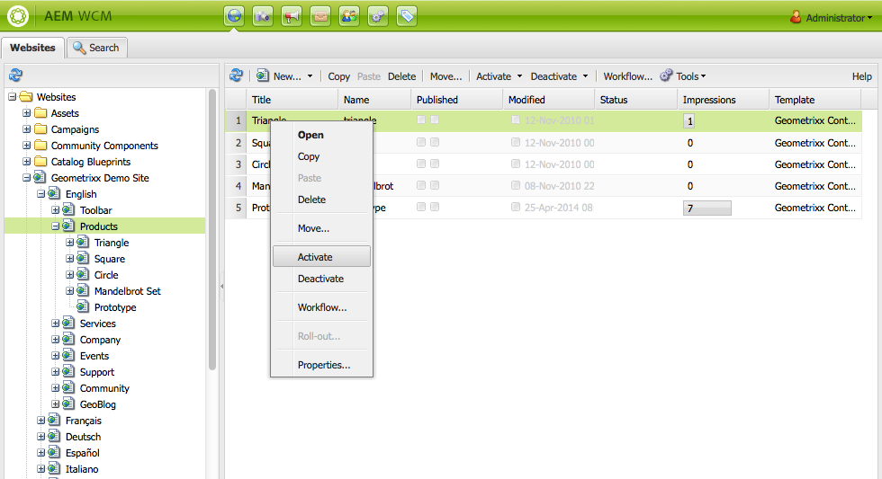
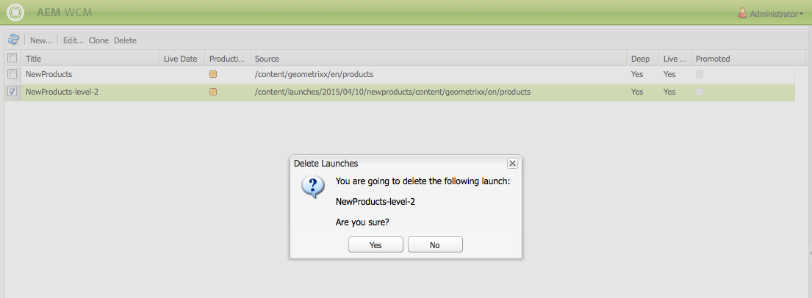
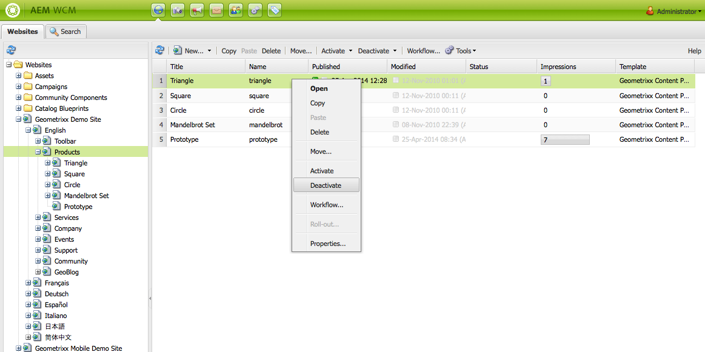
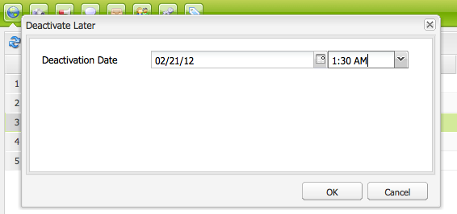

# Publishing Pages{#publishing-pages}

After you have created and reviewed your content on the author environment, make it available on your public website (your publish environment).

This is referred to as publishing a page. When you want to remove a page from the publish environment is referred to as unpublishing. When publishing and unpublishing the page remains available on the author environment for further changes until you delete it.

You can also publish/unpublish a page immediately or at a predefined date/time in the future.

>[!NOTE]
>
>Certain terms related to publishing can be confused:
>
>* **Publish / Unpublish**
>  These are the primary terms for the actions that make your content publicly available on your publish environment (or not).
>
>* **Activate / Deactivate**
>  These terms are synonymous with publish/unpublish.
>
>* **Replicate / Replication**
>  These are the technical terms describing the movement of data (e.g. page content, files, code, user comments) from one environment to another such as when publishing or reverse-replicating user comments.
>

>[!NOTE]
>
>If you do not have the required privileges for publishing a specific page:
>
>* A workflow will be triggered to notify the appropriate person of your request to publish.
>* A message will be displayed (for a short period of time) to notify you of this.
>

## Publishing a Page {#publishing-a-page}

There are two methods for activating a page:

* [from the Websites console](#activating-a-page-from-the-websites-console)
* [from the sidekick on the page itself](#activating-a-page-from-sidekick)

>[!NOTE]
>
>You can also activate a subtree of multiple pages using [Activate Tree](#howtoactivateacompletesectiontreeofyourwebsite) on the Tools console.

### Activating a Page from the Websites Console {#activating-a-page-from-the-websites-console}

You can activate pages in the Websites console. After you have opened a page and modified its contents, you return to the Websites console:

1. In the Websites console, select the page that you want to activate.
1. Select **Activate**, either from the top menu, or the drop-down menu on the selected page item.

   To activate the content of the page and all its sub-pages use the [**Tools** console](/help/sites-classic-ui-authoring/classic-page-author-publish-pages.md#howtoactivateacompletesectiontreeofyourwebsite).

   

   >[!NOTE]
   >
   >If necessary, AEM requests that you activate or reactivate any assets that are linked to the page. You can select or clear the check boxes to activate those assets.
   >
   >

1. If necessary, AEM requests that you activate or reactivate any assets that are linked to the page. You can select or clear the check boxes to activate those assets.

   

1. AEM WCM activates the selected content. The published page or pages appears in the [Websites console](/help/sites-classic-ui-authoring/author-env-basic-handling.md#page-information-on-the-websites-console) (marked green) with information about who activated the content as well as date and time of activation.

   

### Activating a Page from Sidekick {#activating-a-page-from-sidekick}

You can also activate a page when you have it open for editing.

After you have opened the page and modified its contents, you:

1. Select the **Page** tab in the Sidekick.
1. Click **Activate Page**.
   A message displays at the top right of the window confirming that the page has been activated.

## Unpublishing a Page {#unpublishing-a-page}

To remove a page from the publish environment, you deactivate the content.

To deactivate a page:

1. In the Websites console, select the page that you want to deactivate.
1. Select **Deactivate**, either from the top menu, or the drop-down menu on the selected page item. You are asked to confirm the deletion.

   

1. Refresh the [Websites console](/help/sites-classic-ui-authoring/author-env-basic-handling.md#page-information-on-the-websites-console) and the content is marked in red, indicating that it is no longer published.

   

## Activate/Deactivate Later {#activate-deactivate-later}

### Activate Later {#activate-later}

To schedule your activation for a later time:

1. In the Websites console, go to the **Activate** menu, and select **Activate later**.
1. In the dialog that opens you provide the date and time for activation and click **OK**. This creates a version of the page that is activated at the specified time.

   

Activating later starts a workflow to activate this version of the page at the specified time. Conversely, deactivating later starts a workflow to deactivate this version of the page at a specific time.

If you want to cancel this activation/deactivation, go to the [Workflow Console](/help/sites-administering/workflows-administering.md#main-pars_title_3-yjqslz-refd) to terminate the corresponding workflow.

### Deactivate Later {#deactivate-later}

To schedule your deactivation for a later time:

1. In the Website console, go to the **Deactivate** menu, and select **Deactivate later**.

1. In the dialog that opens you provide the date and time for deactivation and click **OK**.

   

**Deactivating late**r starts a workflow to deactivate this version of the page at a specific time.

If you want to cancel this deactivation, go to the [Workflow Console](/help/sites-administering/workflows-administering.md#main-pars_title_3-yjqslz-refd) to terminate the corresponding workflow.

## Scheduled Activation/Deactivation (On/Off Time) {#scheduled-activation-deactivation-on-off-time}

You can schedule times for a page to be published/unpublished using the **On Time** and **Off Time** that can be defined in the [Page Properties](/help/sites-classic-ui-authoring/classic-page-author-edit-page-properties.md).

### Determining Page Publication Status {#determining-page-publication-status-classic-ui}

The status can be seen from the [Websites console](/help/sites-classic-ui-authoring/author-env-basic-handling.md#page-information-on-the-websites-console). The colors indicate publication status.

## Activating a complete section (tree) of your website {#activating-a-complete-section-tree-of-your-website}

From the **Websites** tab you can activate the individual pages. When you have entered or updated a considerable number of content pages - all of which are resident under the same root page - it can be easier to activate the entire tree in one action. You can also perform a Dry Run to emulate an activation and highlight which pages would be activated.

1. Open the **Tools** console by selecting it from the **Welcome** page and then double-click **Replication** to open the console ( `https://localhost:4502/etc/replication.html`).

   

1. On the **Replication** console, click on **Activate Tree**.

   The following window ( `https://localhost:4502/etc/replication/treeactivation.html`) will be displayed.

   

1. Enter the **Start Path**. This specifies the path to the root of the section you want to activate (publish). This page and all pages underneath are considered for activation (or used in the emulation if a Dry Run is selected).
1. Activate the selection criteria as required:

    * **Only Modified**: only activate pages that have been modified.
    * **Only Activated**: only activate pages that have (already) been activated. Acts as a form of reactivation.
    * **Ignore Deactivated**: ignore any pages which have been deactivated.

1. Select the action you want to perform:

    1. Select **Dry Run** if you want to check which pages *would* be activated. This is only an emulation, no pages will be activated.

    1. Select **Activate** if you want to activate the pages.
