# Rich Text Editor {#rich-text-editor}

The Rich Text Editor is a basic building block for inputting textual content into AEM. It forms the basis of various components, including:

* Text
* Text Image
* Table

## Rich Text Editor {#rich-text-editor-1}

The WYSIWYG editing dialog provides a wide range of functionality:

>[!NOTE]
>
>The features available can be configured for individual projects, so might vary for your installation.

## In-Place Editing {#in-place-editing}

In addition to the dialog based Rich Text Editing mode, AEM also provides the in-place editing mode, which allows direct editing of the text as it is displayed in the layout of the page.

Click twice on a paragraph (a slow double-click) to enter the inplace editing mode (the component border will now be orange).

You will be able to directly edit the text on the page, instead of inside a dialog window. Just make your changes and they will be automatically saved.

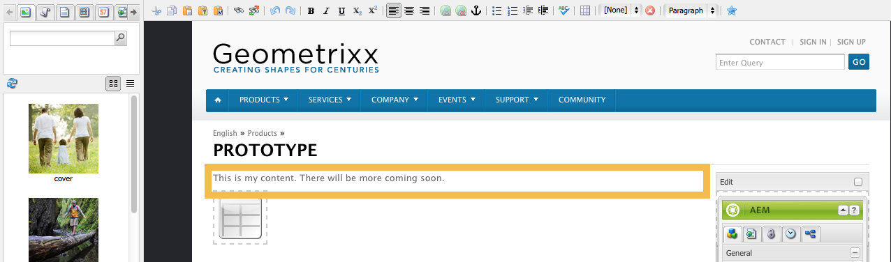

>[!NOTE]
>
>If you have the content finder open, a toolbar with the RTE formatting options is shown at the top of the tab (as above).
>
>If the content finder is not open then the toolbar will not be shown.

Currently, the Inplace Editing mode is enabled for page elements generated by the **Text** and **Title** components.

>[!NOTE]
>
>The [!UICONTROL Title] component is designed to contain a short text without linebreaks. When editing a title in Inplace Editing Mode, entering a linebreak opens a new **Text** component below the title.

## Features of the Rich Text Editor {#features-of-the-rich-text-editor}

The Rich Text Editor provides a range of featues, these [depend on the configuration](/help/sites-administering/rich-text-editor.md) of the individual component. The features are available for both the touch-optimized and classic UI.

### Basic Character Formats {#basic-character-formats}

Here you can apply formatting to characters you have selected (highlighted); some options also have short-cut keys:

* Bold (Ctrl-B)
* Italic (Ctrl-I)
* Underline (Ctrl-U)
* Subscript
* Superscript

All operate as a toggle, so reselection will remove the format.

### Predefined Styles and Formats {#predefined-styles-and-formats}

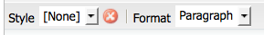

Your installation can include predefined styles and formats. These are available with the **[!UICONTROL Style]** and **[!UICONTROL Format]** drop-down lists and can be applied to text that you have selected.

A style can be applied to a specific string (a style correlates to CSS):

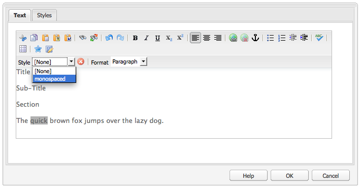

Whereas a format is applied to the entire text paragraph (a format is HTML-based):

A specific format can only be changed (the default is **[!UICONTROL Paragraph]**).

A style can be removed; place the cursor within the text to which the style has been applied and click the remove icon:

>[!CAUTION]
>
>Do not actually reselect any of the text to which the style has been applied or the icon will be deactivated.

### Cut, Copy, Paste {#cut-copy-paste}

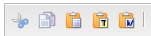

The standard functions of **[!UICONTROL Cut]** and **[!UICONTROL Copy]** are available. Several flavors of **[!UICONTROL Paste]** are provided to cater for differing formats.

* Cut (Ctrl-X)
* Copy (Ctrl-C)
* Paste
  This is the default paste mechanism (Ctrl-V) for the component; when installed out-of-the-box this is configured to be [!UICONTROL Paste from Word].

* Paste as Text: Strips all styles and formatting to paste only the plain text.

* Paste from Word: This pastes the content as HTML (with some necessary reformatting).

### Undo, Redo {#undo-redo}

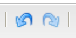

AEM keeps a record of your last 50 actions in the current component, held in chronological order. These actions can be undone (and then redone) in strict order, if necessary.

>[!CAUTION]
>
>The history is only held for the current edit session. It is restarted each time you open the component for editing.

>[!NOTE]
>
>Fifty is the default number of tasks. This may be different for your installation.

### Alignment {#alignment}

Your text can be either left, center or right aligned.

### Indentation {#indentation}

The indentation of a paragraph can be increased, or decreased. The selected paragraph will be indented, any new text entered will retain the current level of indentation.

### Lists {#lists}

Both bulleted and numbered lists can be created within your text. Either select the list type and start typing or highlight the text to be converted. In both cases a line-feed will start a new list item.

Nested lists can be achieved by indenting one or more list items.

The style of a list can be changed by simply positioning the cursor within the list, then selecting the other style. A sublist can also have a different style to the containing list. This can be applied once the sublist has been created (by indentation).

### Links {#links}

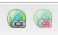

A link to a URL (either within your website or an external location) is generated by highlighting the required text then clicking the hyperlink icon:

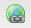

A dialog will let you specify the target URL; also whether it should be opened in a new window.

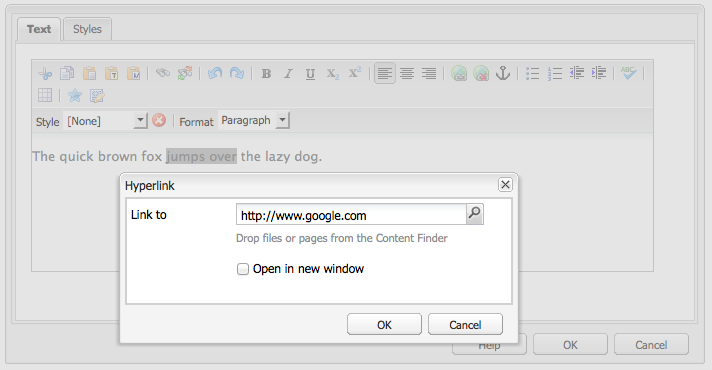

You can:

* Type in a URI directly
* Use the site map to select a page within your website
* Enter the URI, then append the target anchor; for example, `www.TargetUri.org#AnchorName`
* Enter an anchor only (to reference "the current page"); For example, `#anchor`
* Search for a page in the content finder, then drag and drop the page icon into the Hyperlink dialog

>[!NOTE]
>
>The URI can be prepended with any of the protocols configured for your installation. In a standard installation these are `https://`, `ftp://`, and `mailto:`. Protocols not configured for your installation will be rejected and marked as invalid.

To break the link position the cursor anywhere within the link text and click the [!UICONTROL Unlink] icon:

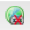

### Anchors {#anchors}

An anchor can be created anywhere within the text by either positioning the cursor, or selecting some text. Then click the **Anchor** icon to open the dialog box.

Enter the name of the anchor then click **OK** to save.

The anchor is shown when the component is being edited and can now be used within a target for links.

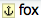

### Find and Replace {#find-and-replace}

AEM provides both a **Find** and a **Replace** (find and replace) function.

Both have a **Find next** button to search the open component for the text specified. You can also specify whether you need the case (upper/lower) to be matched.

The search will always start from the current cursor position within the text. When the end of the component is reached a message will inform you that the next search operation will start from the top.

The **Replace** option lets you **Find**, then **Replace** an individual instance with the specified text, or to **Replace all** instances in the current component.

### Images {#images}

Images can be dragged from the content finder to add them to the text.

>[!NOTE]
>
>AEM also offers specialized components for more detailed image configuration. For example, the **Image** and **Text Image** components are available.

### Spelling Checker {#spelling-checker}

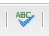

The spelling checker will check all the text in the current component.

Any incorrect spellings will be highlighted:

>[!NOTE]
>
>The spelling checker will operate in the language of the website by taking either the language property of the subtree or extracting the language from the URL. For example, the `en` branch will be checked for English and the `de` branch for German.

### Tables {#tables}

Tables are available both:

* As the **Table** component

  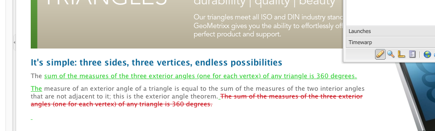

* From within the **Text** component

  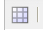

  >[!NOTE]
  >
  >Although tables are available in the RTE, it is recommended to use the **Table** component when creating tables.

In both the **Text** and **Table** components table functionality is available via the context menu (usually the right-mouse-button) clicked within the table; for example:

>[!NOTE]
>
>In the **Table** component, a specialized toolbar is also available, including various standard rich text editor functions, together with a subset of the table-specific functions.

The table specific functions are:

* [Table Properties](#table-properties)
* [Cell Properties](#cell-properties)
* [Add or Delete Rows](#add-or-delete-rows)
* [Add or Delete Columns](#add-or-delete-columns)
* [Selecting Entire Rows or Columns](#selecting-entire-rows-or-columns)
* [Merge Cells](#merge-cells)
* [Split Cells](#split-cells)
* [Nested Tables](#creating-nested-tables)
* [Remove Table](#remove-table)

#### Table Properties {#table-properties}

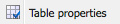

The basic properties of the table can be configured, before clicking **OK** to save:

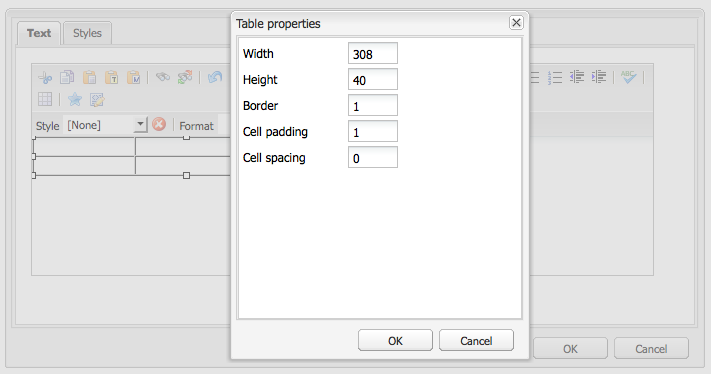

* **Width**: The total width of the table.

* **Height**: The total height of the table.

* **Border**: The size of the table border.

* **Cell padding**: This defines the white space between the cell content and its borders.

* **Cell spacing**: This defines the distance between the cells.

>[!NOTE]
>
>A few cell properties, like Width and Height, can be defined as pixels or as percentages.

>[!CAUTION]
>
>Adobe recommends that you define a width for your table.

#### Cell Properties {#cell-properties}

The properties of a specific cell, or series of cells, can be configured:

* **Width**
* **Height**
* **Horizontal Align** - Left, Center or Right
* **Vertical Align** - Top, Middle, Bottom or Baseline
* **Cell type**- Data or Header
* **Apply to:** Single cell, Entire row, Entire column

#### Add or Delete Rows {#add-or-delete-rows}

Rows can be added either above or below the current row.

The current row can also be deleted.

#### Add or Delete Columns {#add-or-delete-columns}

Columns can be added either to the left or right of the current column.

The current column can also be deleted.

#### Selecting Entire Rows or Columns {#selecting-entire-rows-or-columns}

Selects the entire current row or column. Specific actions (for example, merge) are then available.

#### Merge Cells {#merge-cells}

 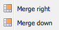

* If you have selected a group of cells you can merge these into one.
* If you have have only one cell selected then you can merge it with the cell to either the right or below.

#### Split Cells {#split-cells}

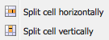

Select a single cell to split it:

* Splitting a cell horizontally will generate a new cell to the right of the current cell, within the current column.
* Splitting a cell vertically will generate a new cell underneath the current cell, but within the current row.

#### Creating Nested Tables {#creating-nested-tables}

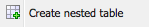

Creating a nested table creates a self-contained table within the current cell.

>[!NOTE]
>
>Certain additional behavior is browser dependent:
>
>* Windows IE: Use Ctrl+primary-mouse-button-click (usually left) to select multiple cells.
>* Firefox: Drag the pointer to select a cell range.

#### Remove Table {#remove-table}

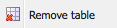

Use the option to remove the table from within the **[!UICONTROL Text]** component.

### Special Characters {#special-characters}

Special characters can be made available to your rich text editor; these might vary according to your installation.

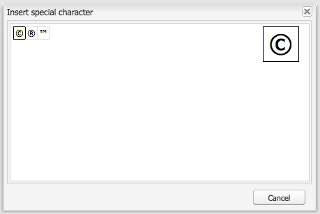

Use mouseover to see a magnified version of the character, then click for it to be included at the current location in your text.

### Source Editing Mode {#source-editing-mode}

The source editing mode lets you see and edit the underlying HTML of the component.

So the text:

Will looks as follows in source mode (often the source is much longer, so you will have to scroll):

>[!CAUTION]
>
>When leaving source mode, AEM makes certain validation checks (for example, ensuring that the text is correctly contained/nested in blocks). This can result in changes to your edits.
