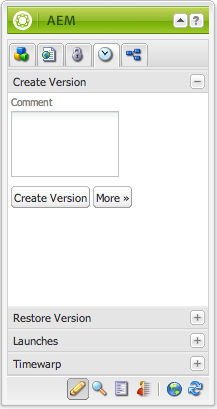
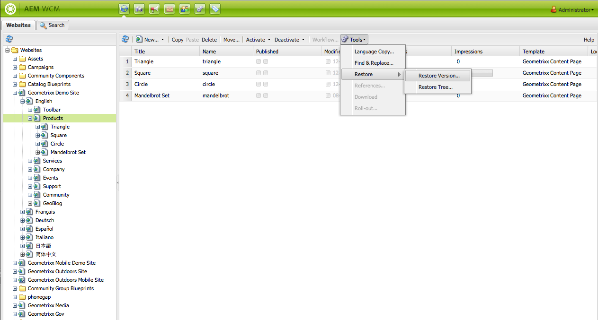
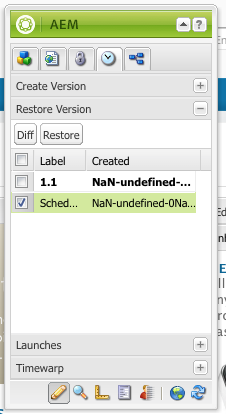
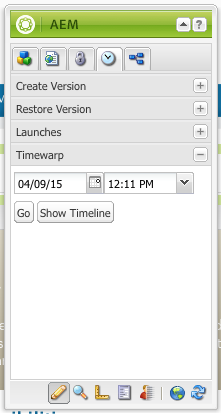
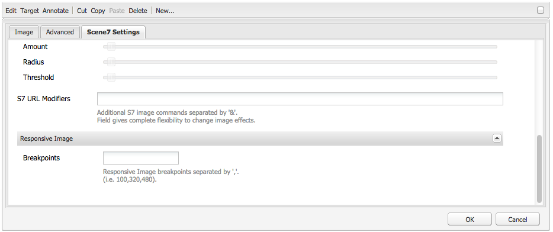

# Working with Page Versions{#working-with-page-versions}

Versioning creates a "snapshot" of a page at a specific point in time. With versioning, you can perform the following actions:

* Create a version of a page.
* Restore a page to a previous version in order to undo a change that you made to a page, for example.
* Compare the current version of a page with a previous version with differences in the text and images highlighted.

## Creating a New Version {#creating-a-new-version}

To create a new version of a page:

1. In your browser, open the page for which you want to create a new version.
1. In the Sidekick, select the **Versioning** tab, then the **Create Version** sub tab.

   

1. Enter a **Comment** (optional).
1. To set a label to the version (optional), click the **More &gt;&gt;** button and set the **Label** to name the version. If the label is not set, the version is an automatically incremented number.
1. Click **Create Version**. A greyed message is displayed on the page; for example:
   Version 1.2 created for: Shirts.

>[!NOTE]
>
>A version is automatically created when the page is activated.

## Restoring a Page Version from Sidekick {#restoring-a-page-version-from-sidekick}

To restore the page to a previous version:

1. Open the page for which you want to restore a previous version.
1. In the sidekick, select the **Versioning** tab, then the **Restore Version** sub-tab.

   

1. Select the version you want to restore and select **Restore**.

## Restoring a Page Version from the Console {#restoring-a-page-version-from-the-console}

This method can be used to restore a page version. It can also be used to restore pages that have been previously deleted:

1. In the **Websites** console, navigate to the page you want to restore and select it.
1. From the top menu select **Tools**, then **Restore**:

   

1. Selecting **Restore Version...** lists versions of documents in the current folder. Even if a page has been deleted, the last version will be listed:

   

1. Select the version you want to restore and click **Restore**. AEM restores the version(s) (or trees) that you select.

### Restoring a Tree from the Console {#restoring-a-tree-from-the-console}

This method can be used to restore a page version. It can also be used to restore pages that have been previously deleted:

1. In the **Websites** console, navigate to the folder you want to restore and select it.
1. From the top menu select **Tools**, then **Restore**.
1. Selecting **Restore Tree...** opens the dialog to let you select the tree you want to restore:

   

1. Click **Restore**. AEM restores the tree you have selected.

## Comparing with a Previous Version {#comparing-with-a-previous-version}

To compare the current version of the page with a previous version:

1. In your browser, open the page for which you want to compare with a previous version.
1. In the Sidekick, select the **Versioning** tab, then the **Restore Versio**n sub tab.

   

1. Select the version you want to compare and click the **Diff** button.
1. The differences between the current version and the selected version are displayed as follows:

    * Text that has been deleted is red and struck through.
    * Text that has been added is green and highlighted.
    * Images that have been added or deleted are green-framed.

   

1. In the Sidekick, select the **Restore Version** sub tab and click the **&lt;&lt;Back** button to display the current version.

## Timewarp {#timewarp}

Timewarp is a feature designed to simulate the ***published*** state of a page at specific times in the past.

The purpose is to allow you to track the published website at the selected point in time. This uses the page activations to determine the state of the publish environment.

To do this:

* The system looks for the page version that was active at the selected time.
* This means the version shown was created/activated *before* the point in time selected in Timewarp.
* When navigating to a page that has been deleted this will also be rendered - as long as the old versions of the page are still available in the repository.
* If no published version is found, then Timewarp will revert to the current state of the page on the author environment (this is to prevent an error/404 page, which would mean that you cannot browse anymore).

>[!NOTE]
>
>If versions are removed from the repository then Timewarp cannot show the correct view. Also, if elements (such as code, css, images, etc) for rendering the website have changed, the view will differ from what it originally was, as those items are not versioned in the repository.

### Using the Timewarp Calendar {#using-the-timewarp-calendar}

Timewarp is available from the sidekick.

The calendar version is used if you have a specific day to be viewed:

1. Open the **Versioning** tab and then click **Timewarp** (near the bottom of the sidekick). The following dialog will be shown:

   

1. Using the date and time selectors specify the date/time you want and click **Go**.

   Timewarp will display the page as it was in its published state before/on the date you have chosen.

   >[!NOTE]
   >
   >Timewarp will only work fully if you have previously published the page. If not, timewarp will show the current page on the author environment.

   >[!NOTE]
   >
   >If you navigate to a page that has been removed/deleted from the repository it will be rendered properly if old versions of the page are still available in the repository.

   >[!NOTE]
   >
   >You cannot edit the old version of the page. It is only available for viewing. If you want to restore the older version you will have to do that manually using [restore](/help/sites-classic-ui-authoring/classic-page-author-work-with-versions.md#restoring-a-page-version-from-sidekick).

1. When you have finished viewing the page, click:

    * **Exit Timewarp** to exit and return to the current author page.
    * [Show Timeline](#using-the-timewarp-timeline) to view the timeline.

   

### Using the Timewarp Timeline {#using-the-timewarp-timeline}

The timeline version is used if you want to see an overview of the publishing activities on the page.

If you want to view the timeline of the document:

1. To show the Timeline you can either:

    1. Open the **Versioning** tab and then click **Timewarp** (near the bottom of the sidekick).

    1. Use the sidekick dialog shown after [using the Timewarp Calendar](#using-the-timewarp-calendar).

1. Click on **Show Timeline** - the document's timeline will appear; for example:

   

1. Select and move (hold and drag) the timeline to move through the document's timeline.

    * All lines indicate published versions.
      When a page is activated, a new line starts. Every time the document is edited a new color appears.
      In the example below, the red line indicates that the page was edited during the timeframe of the initial green version and the yellow line indicates that the page was edited sometime during the red version etc.

   

1. Click:

    1. **Go** to show the content of the published page at the selected point of time.
    1. When showing that content then use **Exit Timewarp** to exit and return to the current author page.

### Timewarp Limitations {#timewarp-limitations}

Timewarp makes a best effort to reproduce a page at a selected point in time. However because of the complexities of the continuous authoring of content in AEM, this is not always possible. These limitations should be kept in mind as you use Timewarp.

* **Timewarp works based on published pages** - Timewarp will only work fully if you have previously published the page. If not, timewarp will show the current page on the author environment.
* **Timewarp uses page versions** - If you navigate to a page that has been removed/deleted from the repository it will be rendered properly if old versions of the page are still available in the repository.
* **Removed versions affect Timewarp** - If versions are removed from the repository then Timewarp cannot show the correct view.

* **Timewarp is read-only** - You cannot edit the old version of the page. It is only available for viewing. If you want to restore the older version you will have to do that manually using [restore](#main-pars-title-1).

* **Timewarp is only based on page content** - If elements (such as code, css, assets/images, etc) for rendering the website have changed, the view will differ from what it originally was, as those items are not versioned in the repository.

>[!CAUTION]
>
>Timewarp is designed as a tool to assit authors with understanding and creating their content. It is not intended as an audit log or for legal purposes.
