# Working with Adobe Campaign 6.1 and Adobe Campaign Standard{#working-with-adobe-campaign-and-adobe-campaign-standard}

You can create email content in AEM and process it in Adobe Campaign emails. To do that, you must:

1. Create a newsletter in AEM from an Adobe Campaign-specific template.
1. Select [an Adobe Campaign service](#selectingtheadobecampaigncloudservice) before editing the content to access all the functionality.
1. Edit the content.
1. Validate the content.

Content can then be synched with a delivery in Adobe Campaign. Detailed instructions are described in this document.

>[!NOTE]
>
>Before you can use this functionality, you must configure AEM to integrate with either [Adobe Campaign](/help/sites-administering/campaignonpremise.md) or [Adobe Campaign Standard](/help/sites-administering/campaignstandard.md).

## Sending Email Content via Adobe Campaign {#sending-email-content-via-adobe-campaign}

After you configure AEM and Adobe Campaign, you can create email delivery content directly in AEM and then process it in Adobe Campaign.

When you create Adobe Campaign content in AEM, you must link to an Adobe Campaign service before editing the content to access all the functionality.

There are two possible cases:

* Content can be synched with a delivery from Adobe Campaign. This lets you use AEM content in a delivery.
* (Adobe Campaign on premise only) The content can be sent directly to Adobe Campaign, which automatically generates a new email delivery. This mode has limitations.

Detailed instructions are described in this document.

### Creating new email content {#creating-new-email-content}

>[!NOTE]
>
>When adding email templates, be sure to add them under **/content/campaigns** to make them available.
>

1. In AEM, select the **Websites** folder then browse your explorer to find where your email campaigns are managed. In the following example, the node concerned is **Websites** &gt; **Campaigns** &gt; **Geometrixx Outdoors** &gt; **Email Campaigns**.

   >[!NOTE]
   >
   >[Email samples are only available in Geometrixx](/help/sites-developing/we-retail.md#weretail). Download sample Geometrixx content from Package Share.

   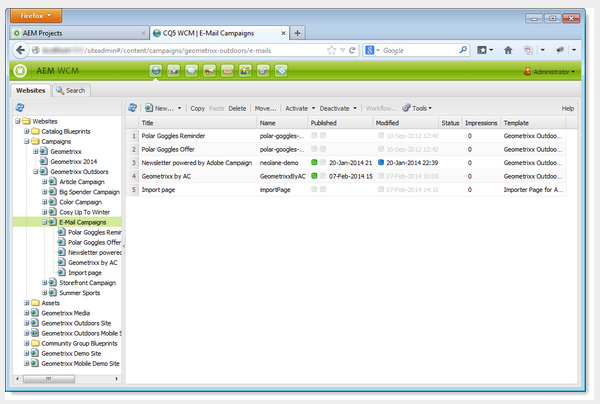

1. Select **New** &gt; **New Page** to create new email content.
1. Select one of the available templates specific to Adobe Campaign, then fill the general properties of the page. Three templates are available by default:

    * **Adobe Campaign Email (AC 6.1)**: lets you add content to a predefined template before sending it to Adobe Campaign 6.1 for delivery.
    * **Adobe Campaign Email (ACS)**: lets you add content to a predefined template before sending it to Adobe Campaign Standard for delivery.

   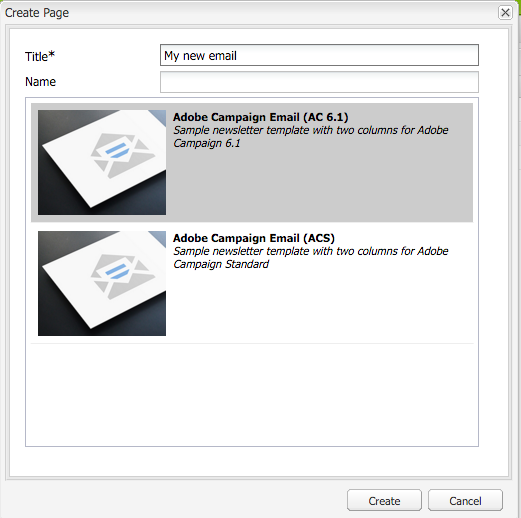

1. Click **Create** to create your email or newsletter.

### Selecting the Adobe Campaign cloud service and template {#selecting-the-adobe-campaign-cloud-service-and-template}

To integrate with Adobe Campaign, you need to add an Adobe Campaign cloud service to the page. Doing so provides you with access to personalization and other Adobe Campaign information.

In addition you may also need to select the Adobe Campaign template and change the subject and add plain text content for those users who will not view the email in HTML.

1. Select the **Page** tab in the sidekick, then select **Page properties.**
1. In the **Cloud services** tab in the pop-up window, select **Add Service** to add the Adobe Campaign service and click **OK**.

   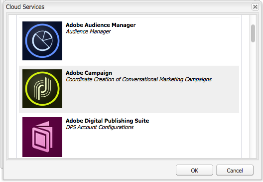

1. Select the configuration that matches your Adobe Campaign instance from the drop-down list, then click **OK**.

   >[!NOTE]
   >
   >Be sure to click **OK** or **Apply** after adding the cloud service. This enables the **Adobe Campaign** tab to work properly.

1. If you would like to apply a specific email delivery template (from Adobe Campaign), other than the default **mail** template, select **Page properties** again. In the **Adobe Campaign** tab, enter the email delivery template's internal name in the related Adobe Campaign instance.

   In Adobe Campaign Standard, the template is **Delivery with AEM Content**. In Adobe Campaign 6.1, the template is **Email delivery with AEM content**.

   When you select the template, AEM automatically enables the **Adobe Campaign Newsletter** components.

### Editing email content {#editing-email-content}

You can edit email content in either the classic user interface or the touch-optimized user interface.

1. Enter the subject and the text version of the email by selecting **Page properties** &gt; **Email** from the toolbox.

   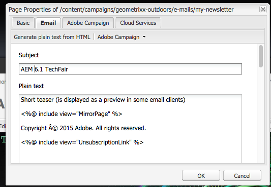

1. Edit email content by adding the elements you would like from those available in the sidekick. To do this, drag and drop them. Then double-click the element you want to edit.

   For example, you can add text containing personalization fields.

   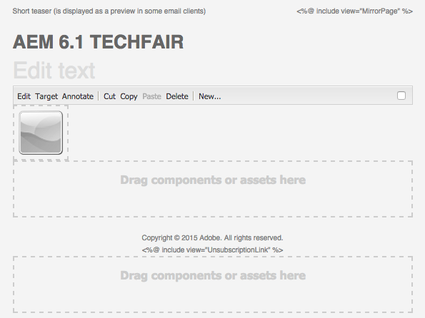

   See [Adobe Campaign Components](/help/sites-classic-ui-authoring/classic-personalization-ac-components.md) for a description of components available for Adobe Campaign newsletters/email campaigns.

   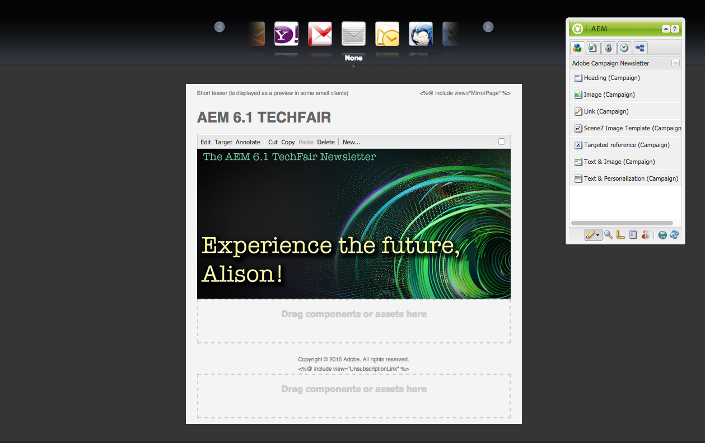

### Inserting personalization {#inserting-personalization}

When editing your content, you can insert:

* Adobe Campaign context fields. These are fields that you can insert within your text that will adapt according to the recipient's data (for example, first name, last name, or any data of the target dimension).
* Adobe Campaign personalization blocks. These are blocks of predefined content that are not related to the recipient's data, such as a brand logo, or link to a mirror page.

See [Adobe Campaign Components](/help/sites-classic-ui-authoring/classic-personalization-ac-components.md) for a full description of the Campaign components.

>[!NOTE]
>
>* Only the fields of the Adobe Campaign **Profiles** targeting dimension are taken into account.
>* When viewing Properties from **Sites**, you do not have access to the Adobe Campaign context fields. You can access those directly from the email while editing.
>

1. Insert a new **Newsletter** &gt; **Text & Personalization (Campaign)** component.
1. Open the component by double-clicking it. The **Edit** window has a functionality that lets you insert the personalization elements.

   >[!NOTE]
   >
   >The available context fields correspond to the **Profiles** targeting dimension in Adobe Campaign.
   >
   >See [Linking an AEM page to an Adobe Campaign email](/help/sites-classic-ui-authoring/classic-personalization-ac-campaign.md#linkinganaempagetoanadobecampaignemail).

   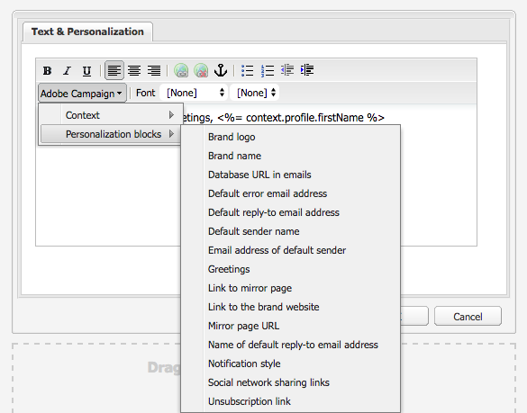

1. Select **Client Context** in the sidekick to test the personalization fields using the data in the persona profiles.

   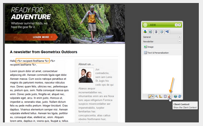

1. A window appears and lets you select the persona you like. The personalization fields are automatically replaced by data from the selected profile.

   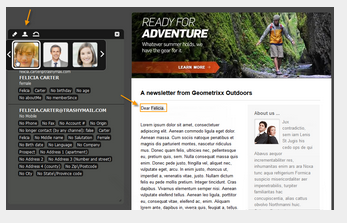

### Previewing a newsletter {#previewing-a-newsletter}

You can preview how the newsletter will look and preview the personalization.

1. Open the newsletter you want to preview and click Preview (magnifying glass) to shrink the sidekick.
1. Click one of the email client icons to see what your newsletter looks like in each email client.

   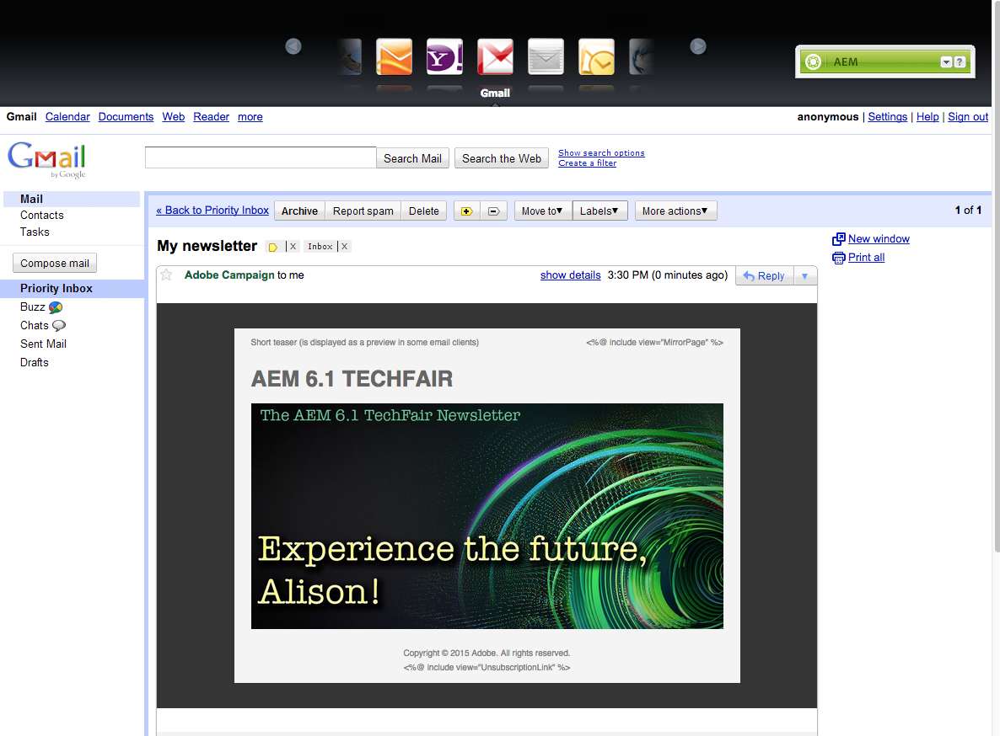

1. Expand the sidekick to begin editing again.

### Approving content in AEM {#approving-content-in-aem}

After the content is finished, you can start the approval process. Go to the **Workflow** tab of the toolbox and select the **Approve for Adobe Campaign** workflow.

This out-of-the-box workflow has two steps: revision then approval, or revision then rejection. Nevertheless, this workflow can be extended and adapted to a more complex process.

To approve content for Adobe Campaign, apply the workflow by selecting **Workflow** in the sidekick and selecting **Approve for Adobe Campaign** and click **Start Workflow**. Go through the steps and approve the content. You can also reject the contents by selecting **Reject** instead of **Approve** in the last workflow step.

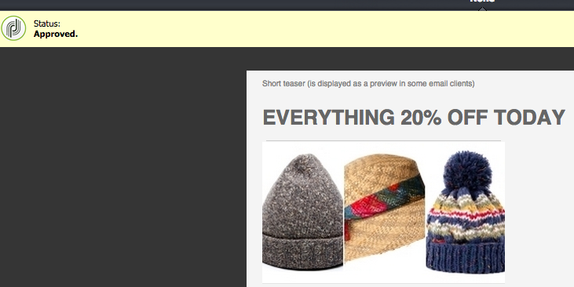

After content is approved, it appears as approved in Adobe Campaign. The email can then be sent.

In Adobe Campaign Standard:

In Adobe Campaign 6.1:

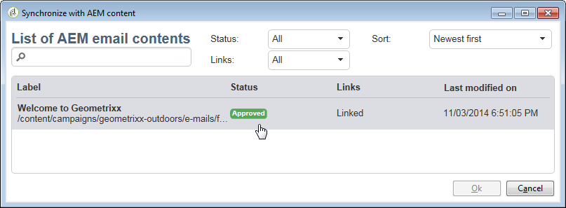

>[!NOTE]
>
>Unapproved content can be synched with a delivery in Adobe Campaign but the delivery cannot be executed. Only approved content can be sent via Campaign deliveries.

## Linking AEM with Adobe Campaign Standard and Adobe Campaign 6.1 {#linking-aem-with-adobe-campaign-standard-and-adobe-campaign}

>[!NOTE]
>
>See [Linking AEM with Adobe Campaign Standard and Adobe Campaign 6.1](/help/sites-authoring/campaign.md#linking-aem-with-adobe-campaign-standard-and-adobe-campaign-classic) under [Working with Adobe Campaign 6.1 and Adobe Campaign Standard](/help/sites-authoring/campaign.md) in the standard authoring docurmentation for details.
