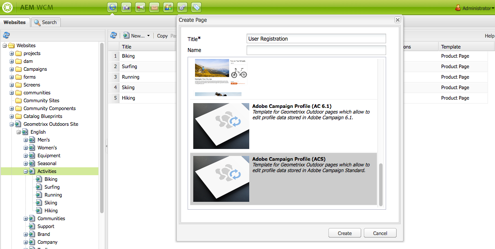
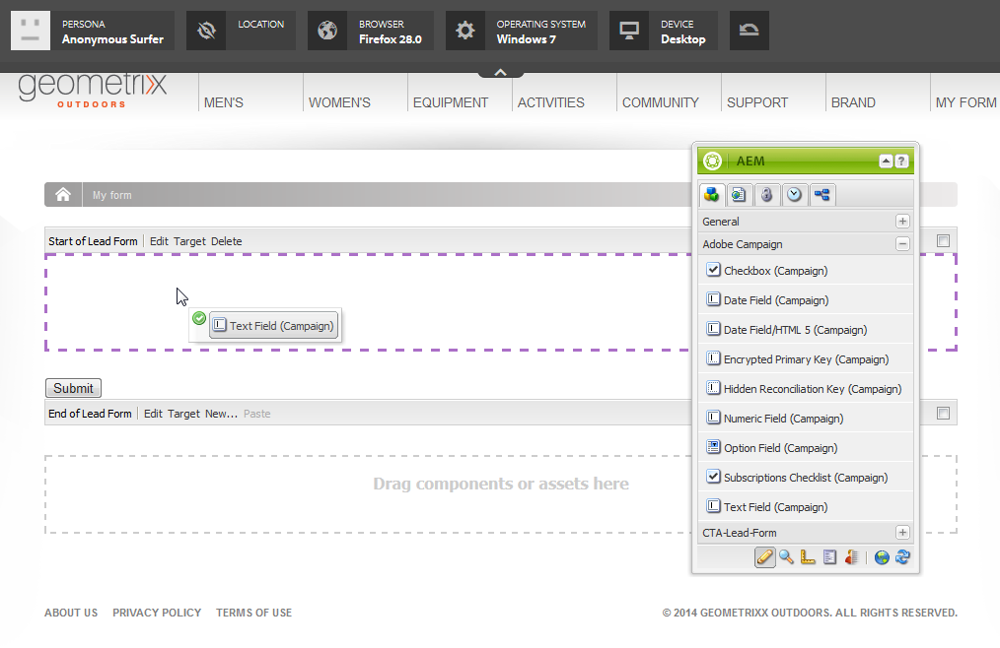

# Creating Adobe Campaign Forms in AEM{#creating-adobe-campaign-forms-in-aem}

AEM lets you create and use forms that interact with Adobe Campaign on your website. Specific fields can be inserted into your forms and mapped to the Adobe Campaign database.

You can manage new contact subscriptions, unsubscriptions, and user profile data, all while integrating their data into your Adobe Campaign database.

To use Adobe Campaign forms in AEM, you need to follow these steps, described in this document:

1. Make a template available.
1. Create a form.
1. Edit form content.

Three types of forms, specific to Adobe Campaign, are available by default:

* Save a profile
* Subscribe to a service
* Unsubscribe from a service

These forms define a URL parameter that accepts the encrypted primary key of an Adobe Campaign profile. Based on this URL parameter, the form updates the data of the associated Adobe Campaign profile.

Although you create these forms independently, in a typical use case, you generate a personalized link to a form page inside the newsletter content, so that recipients can open the link and make adjustments to their profile data (whether unsubscribing, subscribing, or updating their profile).

The form automatically updates based on the user. See [Editing Form Content](#editing-form-content) for more information.

## Making a Template Available {#making-a-template-available}

Before being able to create forms that are specific to Adobe Campaign, you must make the different templates available in your AEM application.

To do this, see the [Templates documentation](/help/sites-developing/page-templates-static.md#templateavailability).

First of all, check the connection between the author and publish instances and Adobe Campaign is working. See [Integrating with Adobe Campaign Standard](/help/sites-administering/campaignstandard.md) or [Integrating with Adobe Campaign 6.1](/help/sites-administering/campaignonpremise.md).

>[!NOTE]
>
>Make sure the **acMapping** property on the page's **jcr:content** node is set to **mapRecipient** or **profile** when using Adobe Campaign 6.1.x or Adobe Campaign Standard, respectively
>

### Creating a Form {#creating-a-form}

1. Start in siteadmin.
1. Scroll through the tree structure to get to the place you would like to create the form in your chosen website.
1. Select **New** &gt; **New page...**.
1. Select either **Adobe Campaign Profile (AC 6.1)** or **Adobe Campaign Profile (ACS)** template and enter the page properties.

   >[!NOTE]
   >
   >If the template is not available, refer to the [Making a template available](/help/sites-classic-ui-authoring/classic-personalization-ac.md#activatingatemplate) section.

1. Click **Create** to create the form.

   

   You can then [edit and configure your form's content](#editing-form-content).

## Editing Form Content {#editing-form-content}

Forms dedicated to Adobe Campaign have specific components. These components have an option to allow you to link each field of the form to a field in the Adobe Campaign database.

>[!NOTE]
>
>If the desired template is not available, see [Making a template available](/help/sites-classic-ui-authoring/classic-personalization-ac.md#activatingatemplate).

This section only details specific links to Adobe Campaign. For more information on a more general overview of how to use forms in Adobe Experience Manager, see [Editmode components](/help/sites-classic-ui-authoring/classic-page-author-edit-mode.md).

1. Navigate to the form you want to edit.
1. In the toolbox, select **Page** &gt; **Page Properties...** then go to the **Cloud Services** tab of the pop-up window.
1. Add the Adobe Campaign service by clicking **Add service**, and then selecting the configuration that corresponds to your Adobe Campaign instance in the service's drop down list. This configuration is carried out when setting up the connection between your instances. For more information, see [Connecting AEM to Adobe Campaign](/help/sites-administering/campaignonpremise.md#connecting-aem-to-adobe-campaign).

   >[!NOTE]
   >
   >If necessary, unlock the configuration by clicking the padlock icon to be able to add the Adobe Campaign service.

1. Access the form's general parameters using the **Edit** button found at the start of the form. The **Form** tab allows you to select a thank you page to which the user will be redirected after having validated the form.

   The **Advanced** form allows you to select the type of form. The **Post Options** field gives you the choice between three types of Adobe Campaign forms:

    * **Adobe Campaign: Save profile**: lets you create or update a recipient in Adobe Campaign (default value).
    * **Adobe Campaign: Subscribe to Services**: lets you manage the subscriptions of a recipient in Adobe Campaign.
    * **Adobe Campaign: Unsubscribe from Services**: lets you cancel the subscriptions of a recipient in Adobe Campaign.

   The **Action Configuration** field lets you specify whether or not you would like to create the recipient profile in the Adobe Campaign database if it does not yet exist. To do this, check the **Create user if not existing** option.

1. Add your selected components by dragging them from the toolbox and dropping them into the form. For more information on the available Adobe Campaign specific components, see [Adobe Form Components](/help/sites-classic-ui-authoring/classic-personalization-ac-components.md).

   

1. Configure the added fields by double clicking them. The **Adobe Campaign** tab lets you link the field to a field in the Adobe Campaign recipient table. You can also specify whether the field is part of the reconciliation key which allows recipients that are already present in the Adobe Campaign database to be recognized.

   >[!CAUTION]
   >
   >The **Element Name** must be different for each form field. Change it if necessary.
   >
   >Each form must contain an **Encrypted Primary Key** component in order to correctly manage recipients in the Adobe Campaign database.

1. Activate the page by selecting **Page** &gt; **Activate Page** in the toolbox. The page is activated on your site. You can view it by going to your AEM publication instance. The data in the Adobe Campaign database is updated once a form is validated.

## Testing a Form {#testing-a-form}

After you create a form and edit form content, you may want to manually test that the form is working as expected.

>[!NOTE]
>
>You must have an **Encryted Primary Key** component on each form. In Components, select Adobe Campaign so only those componente are visible.
>
>Although in this procedure you enter the epk number manually, in practice, users would get a link to this page (whether to unsubscribe, subscribe, or update your profile) within a newsletter. Based on the user, the epk automatically updates.
>
>To create that link, you use the variable **Main resource identifier**(Adobe Campaign Standard) or **Encrypted identifier** (Adobe Campaign 6.1) (for example, in a **Text & Personalization (Campaign)** component), which links to the epk in Adobe Campaign.

To do this, you need to manually get the EPK of an Adobe Campaign profile and then append it to the URL:

1. To get the encrypted primarly key (EPK) of an Adobe Campaign profile:

    * In Adobe Campaign Standard - Navigate to **Profiles and Audiences** &gt; **Profiles**, which lists the existing profiles. Make sure the table displays the **Main Resource Identifier** field in a column (This can be configured by clicking/tapping **Configure list**). Copy the main resource identifier of the desired profile.
    * In Adobe Campaign 6.11, go to **Profiles and Targets** &gt;  **Recipients**, which lists the existing profiles. Make sure the table displays the **Encrypted identifier** field in a column (This can be configured by right-clicking on an entry and selecting **Configure list...**). Copy the encrypted identifier of the desired profile.

1. In AEM, open the form page on the publish instance and append the EPK from step 1 as a URL parameter: use the same name that you previously defined in the EPK component when authoring the form (for example: `?epk=...`)
1. The form can now be used to modify the data and subscriptions associated to the linked Adobe Campaign profile. After you modify some fields and submit the form, you can verify inside Adobe Campaign that the appropriate data has been updated.

The data in the Adobe Campaign database is updated once a form is validated.
