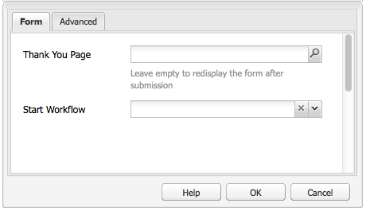

# Creating an Effective Newsletter Landing Page{#creating-an-effective-newsletter-landing-page}

An effective newsletter landing page helps you get as many people as possible to sign up for your newsletter (or other email marketing campaign). You can use the information you gather from your newsletter sign ups to get leads.

To create an effective newsletter landing page, you need to do the following:

1. Create a list for the newsletter so people can subscribe to the newsletter.
1. Create the Sign-Up form. When doing this, add a workflow step that automatically adds the person who signs up for the newsletter to your list of leads.
1. Create a Confirmation page that thanks users for signing up and possibly provides them with a promotion.
1. Add teasers.

>[!NOTE]
>
>Adobe is not planning to further enhance this capability (Managing Leads and Lists).
>Recommendation is to use [Adobe Campaign and the integration to AEM](/help/sites-administering/campaign.md).

## Creating a List for the Newsletter {#creating-a-list-for-the-newsletter}

Create a list, for example, **Geometrixx Newsletter**, in MCM for the newsletter that people should subscribe to. Creating lists is described in [Creating lists](/help/sites-classic-ui-authoring/classic-personalization-campaigns.md#creatingnewlists).

The following shows an example of a list:

## Create a Sign Up Form {#create-a-sign-up-form}

Create a newsletter registration form that allows users to subscribe to tags. The sample Geometrixx web site provides a newsletter page in the Geometrixx toolbar where you can create your form.

To create your own newsletter form, see information about creating forms in the [Forms documentation](/help/sites-authoring/default-components.md#form). The newsletter uses the tags from the Tag library. To add additional tags, see [Tag Administration](/help/sites-authoring/tags.md#tagadministration).

The hidden fields in the following example provide the bare minimum amount of information (e-mail); in addition, you can add more fields later but this will impact the conversion rate.

The following example is a form created at https://localhost:4502/cf#/content/geometrixx/en/toolbar/newsletter.html.

1. Create the form.

   

1. Click **Edit** in the Form component to configure the form to go to a Thank you page (see [Creating Thank You Pages](#creating-a-thank-you-page)).

   

1. Set the Form action (that is what will happen when you submit the form) and configure the group to assign registered users to the list you previously created (for example, geometrixx-newsletter).

   

### Creating a Thank You Page {#creating-a-thank-you-page}

When users click **Subscribe Now**, you want a Thank You page to automatically open. Create the Thank You page in the Geometrixx Newsletter page. After creating the Newsletter Form, edit the Form component and add the path to the thank you page.

Submitting the request takes the user to a **Thank You** page after which they will receive an email. This Thank You page was created at /content/geometrixx/en/toolbar/newsletter/thank_you.

### Adding Teasers {#adding-teasers}

Add [teasers](/help/sites-classic-ui-authoring/classic-personalization-campaigns.md#teasers) to target specific audiences. For example, you can add teasers to the Thank You page and Newsletter sign up page.

To add teasers to make an effective newsletter landing page:

1. Create a teaser paragraph for a sign-up gift. Select **First** as the strategy and include text that informs them what gift they will receive.

   

1. Create a teaser paragraph for the Thank You page. Select **First** as the strategy and include text that indicates that the gift is on its way.

   

1. Create a campaign with the two teasers -- tag one with business and one untagged.

### Pushing Content to Subscribers {#pushing-content-to-subscribers}

Push any changes to pages through the Newsletter functionality in the MCM. You then push updated content to subscribers.

See [Sending Newsletters](/help/sites-classic-ui-authoring/classic-personalization-campaigns.md#newsletters).
