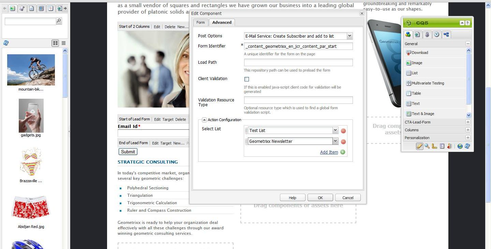
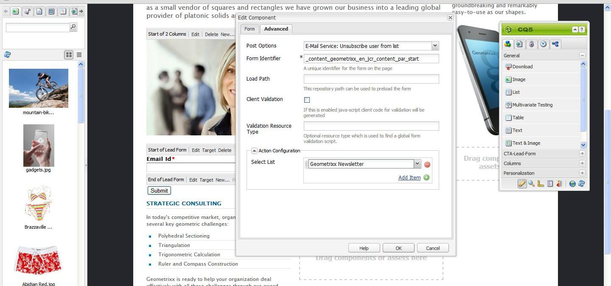
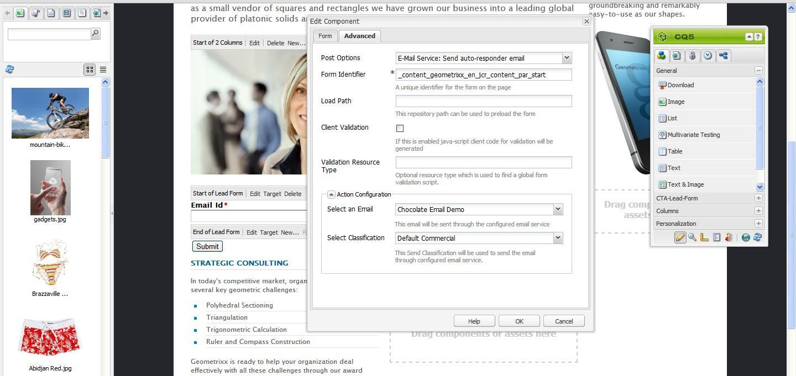

# Managing Subscriptions{#managing-subscriptions}

>[!NOTE]
>
>Adobe does not plan to further enhance this capability (Managing Leads and Lists).
>The recommendation is to use [Adobe Campaign and its AEM integration](/help/sites-administering/campaign.md).

Users can be asked to subscribe to **Email Service Provider's** mailing lists with the help of the **Form** component used on an AEM web page. To prepare an AEM page with a sign-up form for subscription to your e-mail service mailing lists, you must apply the corresponding service configuration to the AEM page that the potential subscriber will visit.

## Applying Email Service configuration to a page {#applying-email-service-configuration-to-a-page}

To configure an AEM page:

1. Navigate to the **Websites** tab.
1. Select the page that needs to be configured for the service. Right-click the page and select **Properties**.

1. Select **Cloud Services** then **Add Service**. Select a configuration from the list of available configurations.

   

1. Click **OK**.

## Creating a Sign-up form on an AEM page for subscribing/unsubscribing to lists {#creating-a-sign-up-form-on-an-aem-page-for-subscribing-unsubscribing-to-lists}

To create a sign-up form and configure it for subscriptions to Email Service Provider's mailing lists:

1. Open the AEM page that the user will visit.
1. Apply the Email Service Provider's configuration to the page.

1. Add a **Form** component to the page by dragging the component from the sidekick. If the component is not available, switch to design mode and enable **Form** group.
1. Click **Edit** in the **Start of Form** bar and navigate to the **Advanced** tab.
1. In the **Form** drop-down menu, select **E-mail Service: Create Subscriber** and add to list.
1. At the bottom of the dialog box, open the **Action Configuration** drop-down, which lets you select one or more subscription lists.
1. In the **Select list**, select the list you want users to subscribe to. You can add multiple lists by using the plus button (**Add Item**).

   

   >[!NOTE]
   >
   >Your dialog box may differ depending on the e-mail service provider.

1. In the **Form** tab, select the thank you page you want users to go to after they submit the form (If left blank, the form redisplays upon submission.) Click **OK**. An **Email id** component appears in the Form, which lets you create a form where users can submit their email addresses to subscribe or unsubscribe from a mailing list.
1. Add the **Submit** button component from the **Form** section in sidekick.

   The form is ready. Publish the page configured in the steps above along with the **thank you** page to the publish instance. Any potential subscribers who visit the page can fill the form and subscribe to the list provided in the configuration.

   >[!NOTE]
   >
   >To make the form subscription fucntion correctly, [encryption keys from author need to be exported and imported on the publish instance](#exporting-keys-from-author-and-importing-on-publish).

## Exporting keys from author and importing on publish {#exporting-keys-from-author-and-importing-on-publish}

In order for e-mail service subscribing and unsubscribing to work via the sign-up form on the publish instance, you need to follow these steps:

1. On the author instance, navigate to the Package Manager.
1. Create a package. Set the filter as `/etc/key`.
1. Build and download the package.
1. Navigate to the Package Manager on the publish instance and upload this package.
1. Navigate to the Publish osgi console and restart the bundle named **Adobe Granite Crypto Support**.

## Unsubscribing users from lists {#unsubscribing-users-from-lists}

To unsubscribe users from lists:

1. Open the page properties of the AEM page that has the sign-up form to unsubscribe a lead.
1. Apply the service configuration to the page.
1. Create a sign-up form on the page.
1. While configuring the component, select the action **E-mail Service**: **Unsubscribe user from list.**
1. From the drop-down menu, select the appropriate list from which the user will be removed when unsubscribing.

   

1. Export the keys from author to publish.

## Configuring auto-responder emails for Email Service {#configuring-auto-responder-emails-for-email-service}

To configure an auto-responder email for a subscriber:

1. Open the page properties of the AEM page that have the sign-up form to configure auto responder for a lead.
1. Apply the ExactTarget configuration to the page.

1. Add a **Form** component to the page by dragging the component from the sidekick. If the component is not available, switch to design mode and enable the **Form** group.
1. Click **Edit** in the **Start of Form** bar and navigate to the **Advanced** tab.
1. In the **Form** drop-down menu, select **E-mail Service: Send auto responder email.**
1. **Select an email** (this is the mail that is sent as an auto-responder email).

1. **Select Classification** (this classification is used to send the email).
1. Select the **Thank you** page (the page where users are directed to once they submit the form).

   In the **Form** tab, select the thank you page you want users to go to after they submit the form. (If left blank, the form redisplays upon submission.) Click **OK**.

1. Export the keys from author to publish.
1. Add the **Submit** button component from the **Form** section in sidekick.

   The sign-up form is ready. Publish the page configured in the steps above along with the **thank you** page to the publish instance. Any potential subscribers who visit the page can fill the form and on submitting the form the visitor shall receive an auto-responder email on the email id filled in the form.

   >[!NOTE]
   >
   >To make the sign-up form subscription function correctly, [encryption keys from author need to be exported and imported on the publish instance](#exporting-keys-from-author-and-importing-on-publish).

   
