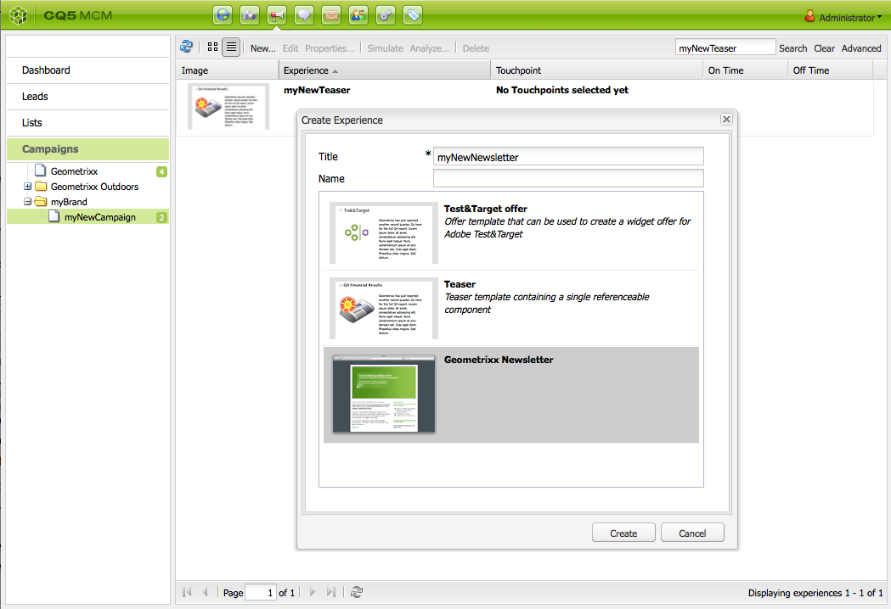
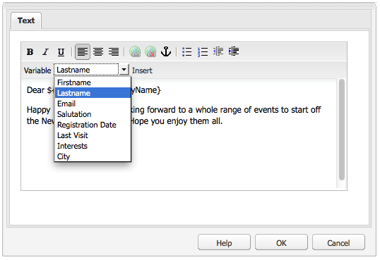
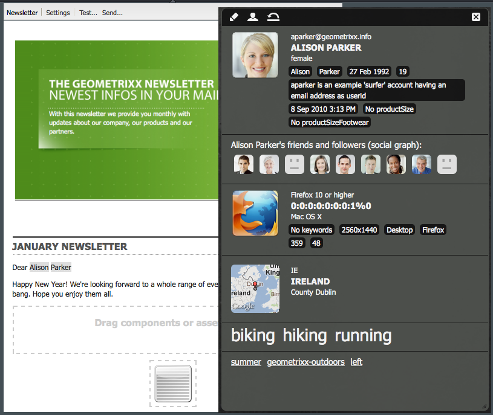
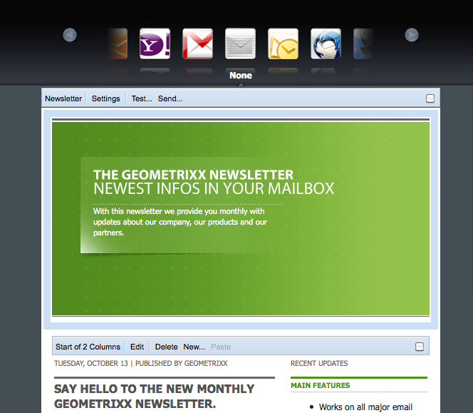
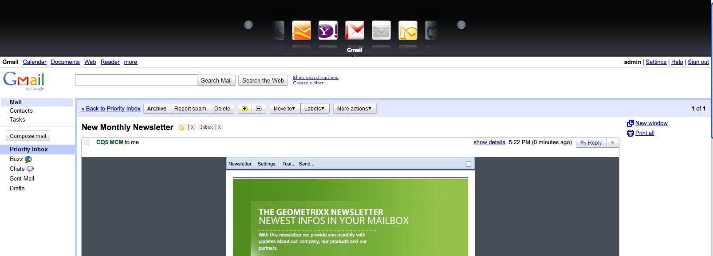
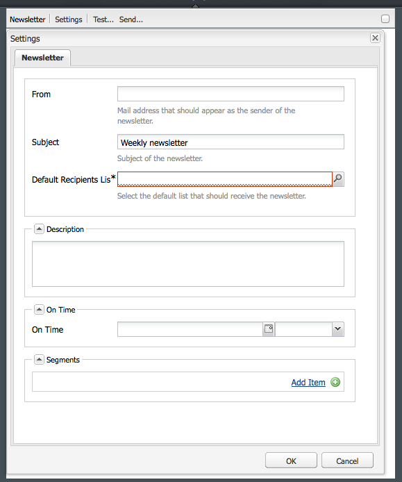
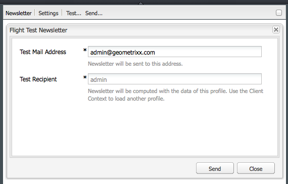

# E-mail Marketing{#e-mail-marketing}

>[!NOTE]
>
>Adobe is not planning to further enhance E-mail tracking of open/bounces (not deliverable) send by AEM SMTP service.
>Recommendation is to use [Adobe Campaign and the integration to AEM](/help/sites-administering/campaign.md).

E-mail marketing (for example, newsletters) are an important part of any marketing campaign as you use them to push content to your leads. In AEM, you can create newsletters from existing AEM content and add new content, specific to the newsletters.

Once created, you can send newsletters to the specific group of users either immediately or at another scheduled time (through the use of a workflow). In addition, users can subscribe to newsletters in the format that they choose.

In addition, AEM lets you administer the newsletter functionality, including maintaining topics, archiving newsletters, and viewing newsletter statistics.

>[!NOTE]
>
>In Geometrixx, the newsletter template automatically opens the email editor. You can use the email editor in other templates that you want to send emails in, for example, invitations. The email editor displays anytime a page is inherited from **mcm/components/newsletter/page**.

This document describes the basics of creating newsletters in AEM. For more detailed information on how to work with e-mail marketing, see the following documents:

* [Creating an Effective Newsletter Landing Page](/help/sites-classic-ui-authoring/classic-personalization-campaigns-email-landingpage.md)
* [Managing Subscriptions](/help/sites-classic-ui-authoring/classic-personalization-campaigns-email-subscriptions.md)
* [Publishing an Email to Email Service Providers](/help/sites-classic-ui-authoring/classic-personalization-campaigns-email-newsletters.md)
* [Tracking Bounced Emails](/help/sites-classic-ui-authoring/classic-personalization-campaigns-email-tracking-bounces.md)

>[!NOTE]
>
>If you update email providers, do a flight test, or send a newsletter, these operations fail if the newsletter is not published to the Publish instance first or if the Publish instance is not available. Be sure to publish your newsletter and make sure the Publish instance is up and running.

## Creating a Newsletter Experience {#creating-a-newsletter-experience}

>[!NOTE]
>
>Email notifications need to be configured via the osgi configuration. See [Configuring Email Notification.](/help/sites-administering/notification.md)

1. Select your new campaign in the left pane, or double-click it in the right pane.

1. Select the list view, using the icon:

   

1. Click **New...**

   You can specify the **Title**, **Name** and type of experience to be created; in this case, Newsletter.

   

1. Click **Create**.

1. A new dialog box opens immediately. Here you can enter properties for the newsletter.

   The **Default Recipients List** is a mandatory field as this forms the touchpoint for the newsletter (see [Working with Lists](/help/sites-classic-ui-authoring/classic-personalization-campaigns.md#workingwithlists) for more information about lists).

   

    * **From Name**
      Name that should appear as the sender of the newsletter.

    * **From Address**
      Mail address that should appear as the sender of the newsletter.

    * **Subject**
      Subject of the newsletter.

    * **Reply To**
      Mail address that should address replies for sent newsletter.

    * **Description**
      Description of the newsletter.

    * **On Time**
      The on time for sending the newsletter.

    * **Default Recipients List**
      Default list that should receive the newsletter.

   These can be updated at a later stage from the **Properties...** dialog.

1. Click **OK** to save.

## Adding Content to Newsletters {#adding-content-to-newsletters}

You can add content, including dynamic content, into your newsletter as you would in any AEM component. In Geometrixx, the Newsletter template has certain components available for adding and modifying content in newsletters.

1. In the MCM, click the **Campaigns** tab and double-click the newsletter you want to add content to or edit. The newsletter opens.

1. If components are not visible, go to Design view and enable the necessary components (for example, the Newsletter components) before you start editing.
1. Enter any new text, images, or other components as appropriate. In the Geometrixx example, 4 components are available: Text, Image, Heading, and 2 Columns. Your newsletter may have more or less components depending on how you set it up.

   >[!NOTE]
   >
   >You personalize newsletters by using variables. In the Geometrixx newsletter, variables are available in the Text component. Values for the variables are inherited from the information in the user profile.

   

1. To insert variables, select the variable from the list and click **Insert**. Variables are populated from the Profile.

## Personalizing Newsletters {#personalizing-newsletters}

You personalize newsletters by inserting pre-defined variables in the Text component of the newsletters in Geometrixx. Values for the variables are inherited from the information in the user profile.

You can also simulate how a newsletter is personalized by using the cliient context and loading a profile.

To personalize a newsletter and simulate how it will look:

1. From the MCM, open the newsletter you want to customize settings for.

1. Open the Text component you want to personalize.

1. Place the cursor where you want the variable to appear and select a variable from the drop-down list and click **Insert**. Do this for as many variables as required and click **OK**.

   

1. To simulate how the variable will look when sent, press CTRL+ALT+c to open the client context and select **Load**. Select the user from the list whose profile you would like to load and click **OK**.

   The information from the profile you loaded has populated the variables.

   

## Testing Newsletters in Different E-mail Clients {#testing-newsletters-in-different-e-mail-clients}

>[!NOTE]
>
>Before sending newsletters, check the OSGi configuration for Day CQ Link Externalizer at `https://localhost:4502/system/console/configMgr`.
>
>By default, the value of the parameter is `localhost:4502` and operation cannot be complete if port for running instance is changed.

Switch between common e-mail clients to see how your newsletter will look to your leads. By default, your newsletter opens with none of the e-mail clients selected.

Currently, you can view newsletters in the following e-mail clients:

* Yahoo mail
* Gmail
* Hotmail
* Thunderbird
* Microsoft Outlook 2007
* Apple Mail

To switch between clients, click the corresponding icon to view the newsletter in that e-mail client:

1. From the MCM, open the newsletter you want to customize settings for.

1. Click an e-mail client in the top bar to see what the newsletter would look like in that client.

   

1. Repeat this step for any additional e-mail clients you want to see.

   

## Customizing Newsletter Settings {#customizing-newsletter-settings}

Although only authorized users can send a newsletter, you should customize the following:

* The subject line, so that users want to open your email and also to ensure that your newsletter will not end up marked as spam.
* The From address, for example, `noreply@geometrixx.com`, so that users receive e-mail from a specified address.

To customize newsletter settings:

1. From the MCM, open the newsletter you want to customize settings for.

   

1. At the top of the newsletter, click **Settings**.

   
1. Enter the **From** e-mail address

1. Modify the **Subject** of the e-mail, if necessary.

1. Select a **Default Recipients List** from the drop-down list.

1. Click **OK**.

   When you test or send the newsletter, recipients will receive e-mails with the specified e-mail address and subject.

## Flight Testing Newsletters {#flight-testing-newsletters}

While flight testing is not mandatory, before you send out a newsletter, you may want to test it to be sure it appears the way you want it to.

Flight testing lets you do the following:

* Look at the newsletter in [all intended clients](#testing-newsletters-in-different-e-mail-clients).
* Validate that the mail server is set up correctly.
* Determine whether your emai is getting flagged as spam. (Make sure you include yourself in the list of recipients.)

>[!NOTE]
>
>If you update email providers, do a flight test, or send a newsletter, these operations fail if the newsletter is not published to the Publish instance first or if the Publish instance is not available. Be sure to publish your newsletter and make sure the Publish instance is up and running.

To flight test newsletters:

1. From the MCM, open the newsletter you want to test and send.

1. At the top of the newsletter, click **Test** to test before sending.

   

1. Enter the test mail address where you want the newsletter sent and click **Send**. If you want to change the profile, you load another profile in the client context. You do this by pressing CTRL+ALT+c and selecting Load and loading a profile.

## Sending Newsletters {#sending-newsletters}

>[!NOTE]
>
>Adobe is not planning to further enhance E-mail tracking of open/bounces (not deliverable) send by AEM SMTP service.
>Recommendation is to use [Adobe Campaign and the integration to AEM](/help/sites-administering/campaign.md).

You can send out a newsletter from either the newsletter or from the list. Both procedures are described.

>[!NOTE]
>
>Before sending newsletters, check the OSGi configuration for Day CQ Link Externalizer at `https://localhost:4502/system/console/configMgr`.
>
>By default, the value of the parameter is `localhost:4502` and operation cannot be complete if port for running instance is changed.

>[!NOTE]
>
>If you update email providers, do a flight test, or send a newsletter, these operations fail if the newsletter is not published to the Publish instance first or if the Publish instance is not available. Be sure to publish your newsletter and make sure the Publish instance is up and running.

### Sending newsletters from a campaign {#sending-newsletters-from-a-campaign}

To send out a newsletter from within the campaign:

1. From the MCM, open the newsletter you want to send.

   >[!NOTE]
   >
   >Before sending out, make sure you have customized your newsletter's subject and originating e-mail address by [customizing its settings](#customizing-newsletter-settings).
   >
   >
   >[Flight testing](#flight-testing-newsletters) the newsletter before sending is recommended.

1. At the top of the newsletter, click **Send**. The Newsletter wizard opens.

1. In the recipient's list, select the list you want to receive the newsletter and click **Next**.

   

1. Setup completion is confirmed. Click **Send** to actually send the newsletter.

   

   >[!NOTE]
   >
   >Make sure you are one of the recipients so you can ensure the newsletter was received.

### Sending newsletters from a list {#sending-newsletters-from-a-list}

To send out a newsletter from a list:

1. In the MCM, click **Lists** in the left hand pane.

   >[!NOTE]
   >
   >Before sending out, make sure you have customized your newsletter's subject and originating e-mail address by [customizing its settings](#customizing-newsletter-settings). You cannot test a newsletter if you send it from the list; you can [flight test](#flight-testing-newsletters) it if you send it from the newsletter.

1. Select the check box next to the list of leads you want to send a newsletter to.

1. In the **Tools** menu, select **Send Newsletter**. The **Send Newsletter** window opens.

   

1. In the **Newsletter** field, select the newsletter you want to send and click **Next**.

   

1. Setup completion is confirmed. Click **Send** to send the selected newsletter to the specified list of leads.

   

   Your newsletter is sent to the selected recipients.

## Subscribing to a Newsletter {#subscribing-to-a-newsletter}

This section describes how to subscribe to a newsletter.

### Subscribing to a newsletter {#subscribing-to-a-newsletter-1}

To subscribe to a newsletter (using the Geometrixx web site as an example):

1. Click **Websites** and navigate to the Geometrixx **Toolbar** and open it.

   

1. In the Geometrixx Newsletter **Sign Up** field, enter your e-mail address and click **Sign Up**. You are now subscribed to the newsletter.
