# Landing Pages{#landing-pages}

The landing pages feature allows quick and easy importing of a design and content right into an AEM page. A web developer can prepare the HTML and additional assets that can be imported as a full page or only a part of a page. The functionality is useful to create marketing landing pages that are only active for a limited time and need to be created quickly.

This page describes the following:

* what landing pages look like in AEM including components available
* how to create a landing page and how to import a design package
* how to work with landing pages in AEM
* how to set up mobile landing pages

Preparing the design package for importing is covered in [Extending and Configuring the Design Importer](/help/sites-administering/extending-the-design-importer-for-landingpages.md). Integrating with Adobe Analytics is covered in [Integrating Landing Pages with Adobe Analytics.](/help/sites-administering/integrating-landing-pages-with-adobe-analytics.md)

>[!CAUTION]
>
>The Design Importer, used to import landing pages, [has been deprecated with AEM 6.5](/help/release-notes/deprecated-removed-features.md#deprecated-features).

>[!CAUTION]
>
>Because the Design Importer requires access to `/apps`, it will not work in containerized cloud environments where `/apps` is immutable.

## What are Landing Pages? {#what-are-landing-pages}

Landing pages are single or multipage sites that are the "endpoint" of a marketing outreach - for example, with email, adwords/banners, social media. A landing page can serve various purposes, but all have one thing in common - the visitor should fulfill a task and that defines the success of a landing page.

The Landing Pages feature in AEM allows marketers to work with web designers at agencies or internal creative teams to create page designs that can be easily be imported into AEM and still be editable by the marketers and published under the same governance as the rest of the AEM-powered sites.

In AEM, you create landing pages by performing the following steps:

1. Create a page in AEM that contains the landing pages canvas. AEM ships with a sample called **Importer Page**.

1. [Prepare the HTML and assets.](/help/sites-administering/extending-the-design-importer-for-landingpages.md)
1. Package the resources into a ZIP file referred to here as the Design Package.
1. Import the design package on the importer page.
1. Modify and publish the page.

### Desktop Landing Pages {#desktop-landing-pages}

A sample landing page in AEM looks as follows:

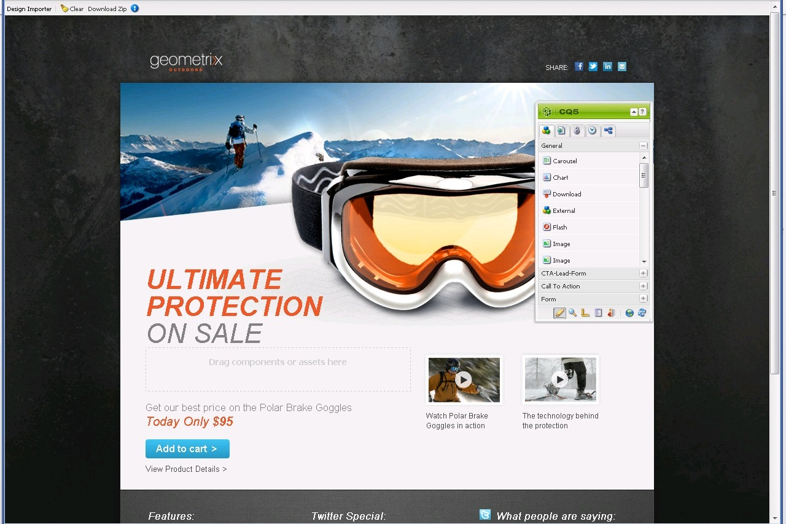

### Mobile Landing Pages {#mobile-landing-pages}

A landing page can also have a mobile version of the page. To have a separate mobile version of the landing page the import design has to have two html files: *index.htm(l)* and *mobile.index.htm(l)*.

The landing page import procedure is same as that of a normal landing page, the landing page design has an additional html file corresponding to the mobile landing page. This html file too, must have a canvas `div` with `id=cqcanvas` just like the desktop landing page html and it supports all the editable components described for the desktop landing page.

Mobile landing page is created as a child page of the desktop landing page. To open it, navigate to the landing page in Websites and open the child page.

>[!NOTE]
>
>The mobile landing page gets deleted/deactivated along with the desktop landing page if the desktop landing page is deleted or deactivated.

## Landing Page Components {#landing-page-components}

To make parts of the HTML that gets imported editable within AEM, you can map content within the Landing pages HTML to AEM components directly. The design importer understands the following components per default:

* Text, for any text
* Title, for content in H1-6 tags
* Image, for images that should be made exchangeable
* Call To Actions:

    * Clickthrough Link
    * Graphical Link

* CTA Lead-Form, to capture user information
* Paragraph System (Parsys), to allow any component to be added, or the above component converted

In addition, it is possible to extend this and support custom components. This section describes the components in detail.

### Text {#text}

The Text component lets you enter a text block using a WYSIWYG editor. See [Text component](/help/sites-authoring/default-components.md#text) for more information.

The following is an example of a text component on a landing page:

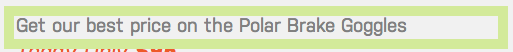

#### Title {#title}

The title component lets you display a title and configure the size (h1-6). See [Title component](/help/sites-authoring/default-components.md#title) for more information.

The following is an example of a title component on a landing page:

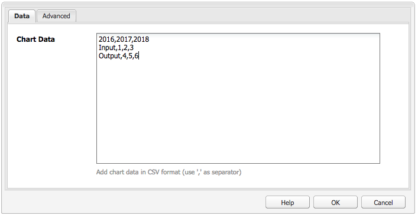

#### Image {#image}

The image component displays an image that you can either drag and drop from the Content Finder or click to upload. See [image component](/help/sites-authoring/default-components.md) for more information.

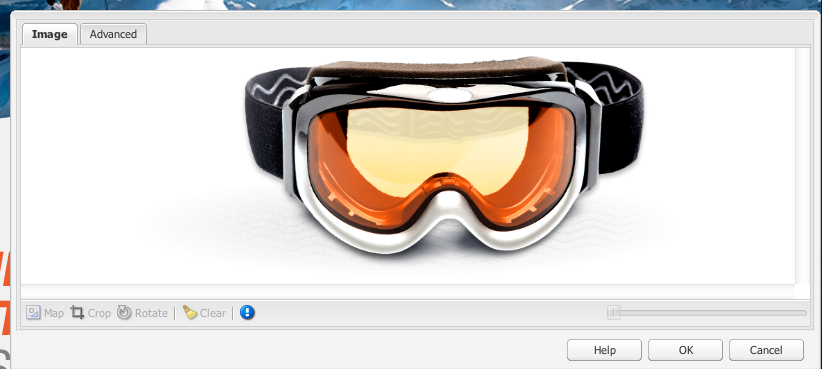

The following is an example of an image component on a landing page:

#### Call to Action (CTA) {#call-to-action-cta}

A landing page design may have several links - some of these may be intended as "Calls to action."

Call to action (CTA) is used to get the visitor take immediate action on the landing page such as "Subscribe Now," "View this video," "Limited Time Only", and so on.

* Click Through Link - Lets you add a text link that when clicked takes the visitor to a target URL.
* Graphical Link - Lets you add an image that when clicked takes the visitor to a target URL.

Both CTA components have similar options. The Click Through Link has additional rich text options. The components are described in detail in the following paragraphs.

#### Click Through Link {#click-through-link}

This CTA component can be used to add a text link on the landing page. That link can be clicked to take the user to the target URL specified in the component properties. It is a part of "Call to Action" group.

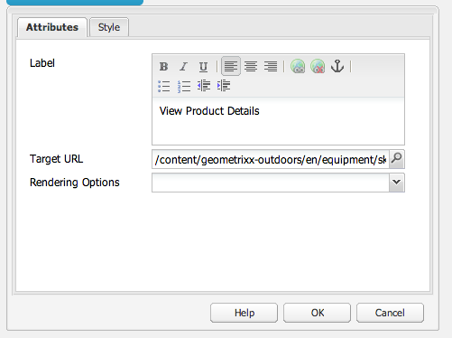

**Label** The text users see. You can modify formatting with the rich text editor.

**Target URL** Enter the URI you want users to visit if they click the text.

**Rendering Options** Describes rendering options. You can select from the following:

* Load page in a new browser window
* Load page in current window
* Load page in the parent frame
* Cancel all frames, and load page in full browser window

**CSS** On the Style tab, enter a path to your CSS style sheet.

**ID** On the Style tab, enter an ID for the component to uniquely identify it.

The following is an example of a click through link:

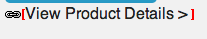

#### Graphical Link {#graphical-link}

This CTA component can be used to add any graphical image with link on the landing page. The image can be a simple button or any graphical image as background. When the image is clicked, the user is taken to the target URL specified in the component properties. It is a part of the **Call to Action** group.

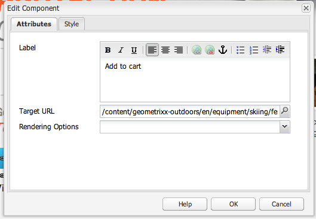

**Label** The text users see in the graphic. You can modify formatting with the rich text editor.

**Target URL** Enter the URI you want users to visit if they click the image.

**Rendering Options** Describes rendering options. You can select from the following:

* Load page in a new browser window
* Load page in current window
* Load page in the parent frame
* Cancel all frames, and load page in full browser window

**CSS** On the Style tab, enter a path to your CSS style sheet.

**ID** On the Style tab, enter an ID for the component to uniquely identify it.

The following is an example graphical link:

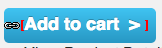

### Call to Action (CTA) Lead Form {#call-to-action-cta-lead-form}

A lead form is a form that is used to collect a visitor/lead's profile information. This information can be stored and used later to do an effective marketing based on the information. This information generally includes title, name, email, date of birth, address, interest, and so on. It is a part of the **CTA Lead form** group.

An example CTA lead form looks like this:

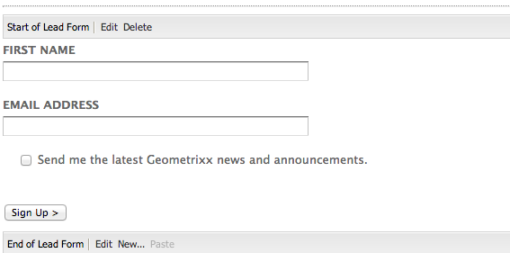

CTA lead forms are built up from several different components:

* **Lead Form**
  The lead form component defines the beginning and end of a new lead form on a page. Other components can then be placed in between these elements, such as Email Id, First Name, and so on.

* **Form fields and elements**
  Form fields and elements can include text boxes, radio buttons, images, and so on. The user often completes an action in a form field, such as typing text. See individual form elements for more information.

* **Profile Components**
  Profile components relate to visitor profiles used for social collaboration and other areas where visitor personalization is required.

The preceding shows an example form; it is comprised of the **Lead Form** component (start and end), with **First Name** and **Email Id** fields used for input and a **Submit** field

From the sidekick, the following components are avaiable for the CTA Lead Form:

#### Settings common to many lead form components {#settings-common-to-many-lead-form-components}

Although each of the lead form components has a different purpose, many are composed of similar options and parameters.

When configuring any of the form components the following tabs are available in the dialog:

* **Title and Text**
  Here you need to specify the basic information, such as the title of the component and any accompanying text. Where appropriate, it also lets you define other key information such as whether the field is multi-selectable and items available for selection.

* **Initial Values**
  Lets you specify a default value.

* **Constraints**
  Here you can specify whether a field is required and place constraints are on that field (for example, must be numeric, and so on).

* **Styling**
  Indicates the size and styling of the fields.

>[!NOTE]
>
>The fields you see vary depending on the individual component.
>
>Not all options are available to all lead form components. See Forms for more information on these [common settings](/help/sites-authoring/default-components.md#formsgroup).

#### Lead Form Components {#lead-form-components}

The following section describes the components available to Call-to-Action lead forms.

**About** Lets users add About information.

**Address Field** Allows users to enter address information. When configuring this component, you must enter the Element Name in the dialog. The Element Name is the name of the form element. This indicates where in the repository the data is stored.

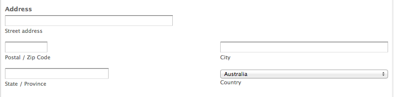

**Date of Birth** Users can enter date of birth information.

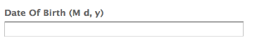

**Email Id** Allows users enter an email address (identification).

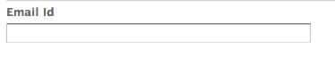

**First Name** Provides a field for users to enter their first name.

**Gender** Users can select their gender from a dropdown list.

**Last Name** Users can enter Last Name information.

**Lead Form** Add this component to add a lead form to your landing page. A lead form automatically contains a Start of Lead Form and End of Lead Form field. In between, you add the Lead Form components described in this section.

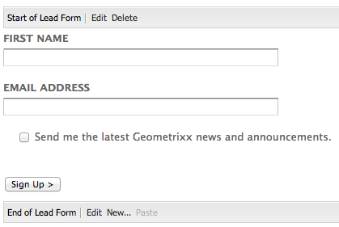

The Lead Form component defines both the start and end of a form using the **Form Start** and **Form End** elements. These are always paired to ensure that the form is correctly defined.

After you have added the lead form, you can configure the start of form or end of form by clicking **Edit** in the corresponding bar.

**Start of Lead Form**

Two tabs are available for configuration **Form** and **Advanced**:

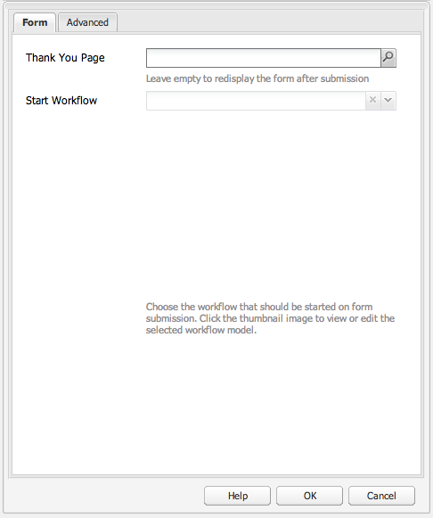

**Thank You Page** The page to be referenced to thank visitors for providing their input. If left blank, the form re-displays after submission.

**Start Workflow** Determines which workflow is triggered once a lead form is submitted.

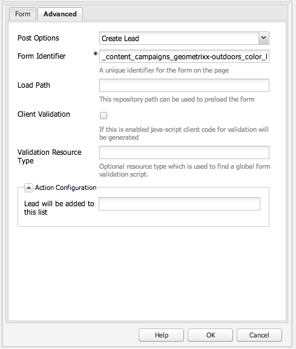

**Post Options** The following post options are available:

* Create Lead
* Email Service: Create Subscriber and add to list - Use if you are using an email service provider like ExactTarget.
* Email Service: Send auto-responder email - Use if you are using an email service provider like ExactTarget.
* Email Service: Unsubscribe user from list - Use if you are using an email service provider like ExactTarget.
* Unsubscribe user

**Form Identifier** The form identifier uniquely identifies the lead form. Use the form identifier if you have several forms on a single page; make sure they have different identifiers.

**Load Path** Is the path to node properties used to load predefined values into the lead form fields.

This is an optional field that specifies the path to a node in the repository. When this node has properties that match the field names, then the appropriate fields on the form are preloaded with the value of those properties. If no match exists, then the field contains the default value.

**Client Validation** Indicates whether client validation is required for this form (server validation always occurs). This can be achieved in conjunction with the Forms Captcha component.

**Validation Resource Type** Defines the form validation resource type if you want to validate the entire lead form (instead of individual fields).

If you are validating the complete form, also include one of the following:

* A script for client validation:
  ` /apps/<myApp>/form/<myValidation>/formclientvalidation.jsp`

* A script for validation on the server side:
  ` /apps/<myApp>/form/<myValidation>/formservervalidation.jsp`

**Action Configuration** Depending on the selection in Post Options, the Action Configuration changes. For example, when you select Create Lead, you can configure what list the lead is added to.

* **Show Submit Button**
  Indicates whether a Submit button should be shown or not.

* **Submit Name**
  An identifier if you are using multiple submit buttons in a form.

* **Submit Title**
  The name that appears on the button, such as Submit or Send.

* **Show Reset Button**
  Select check box to make the Reset button visible.

* **Reset Title**
  The name that appears on the Reset button.

* **Description**
  Information that appears below the button.

## Creating a Landing Page {#creating-a-landing-page}

When you create a landing page, you need to perform three steps:

1. Create an importer page.
1. [Prepare the HTML for importing.](/help/sites-administering/extending-the-design-importer-for-landingpages.md)
1. Import the design package.

### Use of the Design Importer {#use-of-the-design-importer}

Because importing of pages involves preparation of HTML, verification, and testing of the pages, the import of landing pages is intended as an admin task. As an admin, the users performing the import need read, write, create, and delete permissions on `/apps`. If the user does not have these permissions, the import will fail.

>[!NOTE]
>
>Because the design importer is intended as an admin tool requiring read, write, create, and delete permissions on `/apps`, Adobe does not recommend using the design importer in production.

Adobe recommends using the design importer on a staging instance. On a staging instance the import can be tested and validated by a developer who is then responsible for deploying the code to the production instance.

### Creating an Importer Page {#creating-an-importer-page}

Before you can import your Landing Page design, you need to create an importer page, for example, under a campaign. The Imporer Page template lets you import your full HTML landing page. The page contains a drop box where the landing page design package can be imported by using drag and drop.

>[!NOTE]
>
>By default, an Importer Page can only be created under campaigns, but you can also overlay this template to create a landing page under `/content/mysite`.

To create a landing page:

1. Go to the **Websites** console.
1. Select your campaign in the left pane.
1. Click **New** to open the **Create Page** window.
1. Select the **Importer Page** template and add a title and optionally, a name, and click **Create**.

   

   Your new importer page is displayed.

### Preparing the HTML for Import {#preparing-the-html-for-import}

Before importing the design package, the HTML needs to be prepared. See [Extending and Configuring the Design Import](/help/sites-administering/extending-the-design-importer-for-landingpages.md) for more information.

### Importing the Design Package {#importing-the-design-package}

After an importer page has been created, you can import a design package onto it. Details on creating the design package and its recommended structure are explained in [Extending and Configuring the Design Import](/help/sites-administering/extending-the-design-importer-for-landingpages.md).

Assuming that you have the design package ready, the following steps describe how to import the design package onto an importer page.

1. Open the importer page you [created earlier](#creatingablankcanvaspage).

   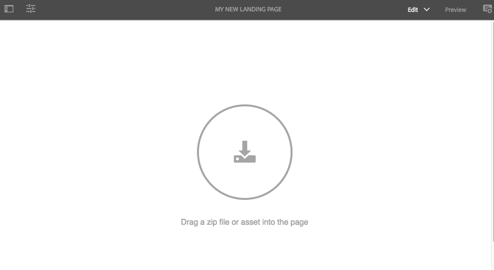

1. Drag and drop the design package onto the dropbox. Notice the arrow changes direction when a package is dragged over it.
1. As a result of drag and drop, you see your landing page in place of the importer page. Your HTML landing page has been successfully imported.

   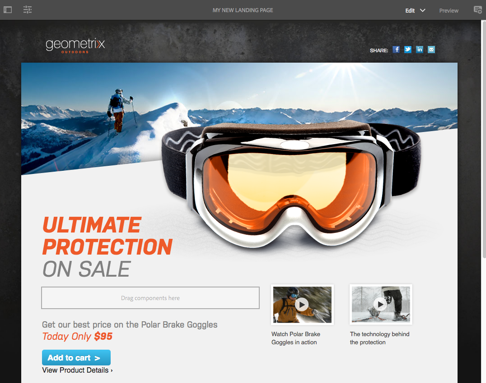

>[!NOTE]
>
>Upon import the markup is sanitized for security reasons and to avoid importing and publishing invalid markup. This assumes HTML-only markup and all other form of elements such as inline SVG or Web Components will be filtered out.

>[!NOTE]
>
>If you have trouble importing the design package, see [Troubleshooting](/help/sites-administering/extending-the-design-importer-for-landingpages.md#troubleshooting).

## Working with Landing Pages {#working-with-landing-pages}

The design and assets for a landing page are usually created by a designer possibly at an agency in tools that they are used to such as Adobe Photoshop or Adobe Dreamweaver. When the design is complete, the designer sends a zip file with all the assets to marketing. The contact in marketing is then responsible for dropping the zip file into AEM and publishing the content.

In addition, the designer may need to make modifications to the landing page after it is imported by editing or deleting content and configuring the call-to-action components. Last, the marketeer will want to preview the landing page and then activate the campaign to ensure the landing page is published.

This section describes how to do the following:

* Delete a landing page
* Download the design package
* View import information
* Reset a landing page
* [Configure the CTA components and add content to the page](#call-to-action-cta)
* Preview the landing page
* Activate/publish a landing page

When you import the design package, **Clear Design** and **Download Imported Zip** are available in the settings menu of the page:

### Downloading the imported design package {#downloading-the-imported-design-package}

Downloading the zip file lets you record which zip was imported with a particular landing page. Changes made on a page are not added to the zip.

To download the imported design package, click **Download Zip** in the Landing Page toolbar.

### Viewing import information {#viewing-import-information}

At any time, you can view information about the last import by clicking the blue exclamation mark at the top of the landing page in the classic user interface.

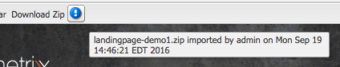

In case the imported design package has some issues, for example, if it refers to images/scripts that do not exist within the package, and so on, then the design importer displays such issues in the form of a list. To view the list of issues, in the classic user interface, click the issues link in the Landing Page toolbar. In the following image, clicking on **Issues** link opens the Import Issues window.

### Resetting a landing page {#resetting-a-landing-page}

In case you want to re-import your landing page design package after making some changes to it, you can "clear" the landing page by clicking **Clear** at the top of the landing page in the classic user interface or click Clear in the settings menu in the touch-optimized user interface. Doing so deletes the imported landing page and creates a blank importer page.

While clearing the landing page, you can remove the content changes. If you click **No**, then the content changes are preserved, that is, the structure under `jcr:content/importer`is preserved and only the importer page component and the resources in `etc/design` are removed. Whereas, if you click **Yes**, the `jcr:content/importer` is also removed.

>[!NOTE]
>
>If you decide to remove the content changes, then all the changes that you made on the imported landing page and all page properties are lost when you click **Clear**.

### Modifying and Adding Components on a Landing Page {#modifying-and-adding-components-on-a-landing-page}

To modify components on the landing page, double-click them to open them and edit as you would any other component.

To add components on the landing page, drag and drop components to the landing page - either from the sidekick in classic user interface or from the Components pane in the touch-optimized user interface - and edit as appropriate.

>[!NOTE]
>
>If a component on the landing page cannot be edited, you need to re-import the zip file after [modifying the HTML file.](/help/sites-administering/extending-the-design-importer-for-landingpages.md) It means that during the import, the non-editable parts were not converted into AEM components.

### Deleting a landing page {#deleting-a-landing-page}

Deleting a landing page is like deleting a normal AEM page.

The only exception is that when you delete a desktop landing page, it also deletes the corresponding mobile landing page (if present) but not conversely.

### Publishing a landing page {#publishing-a-landing-page}

You can publish the landing page and all its dependencies just like publishing a normal page.

>[!NOTE]
>
>Publishing the desktop landing page also publishes its corresponding mobile version (if any). But publishing a mobile landing page does not publish the desktop version.
