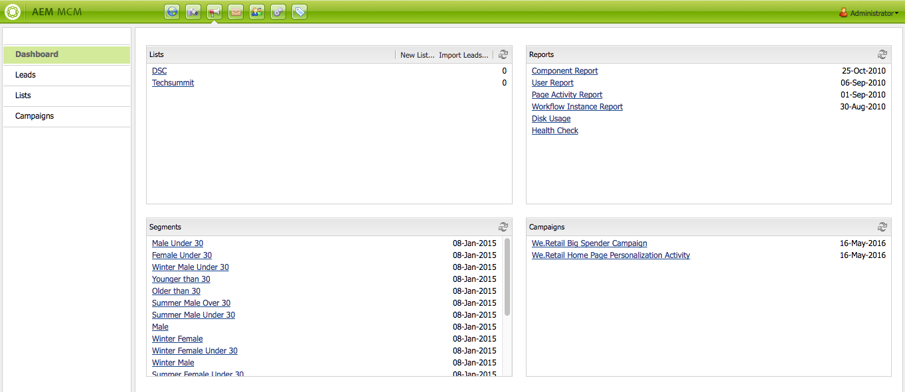
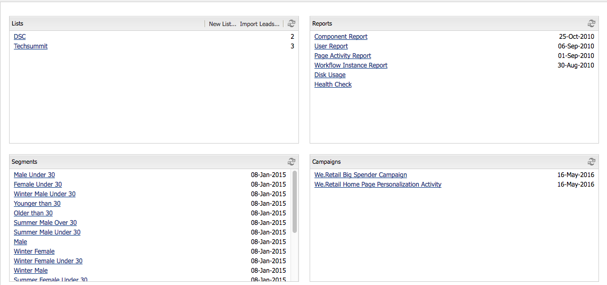
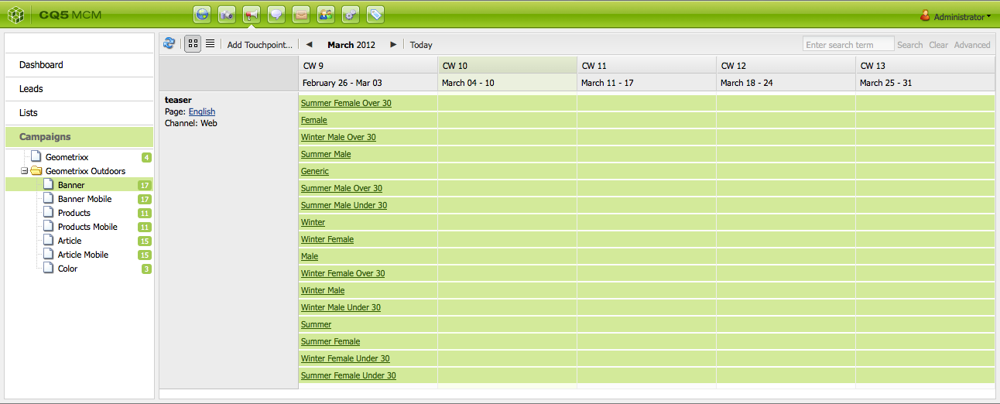
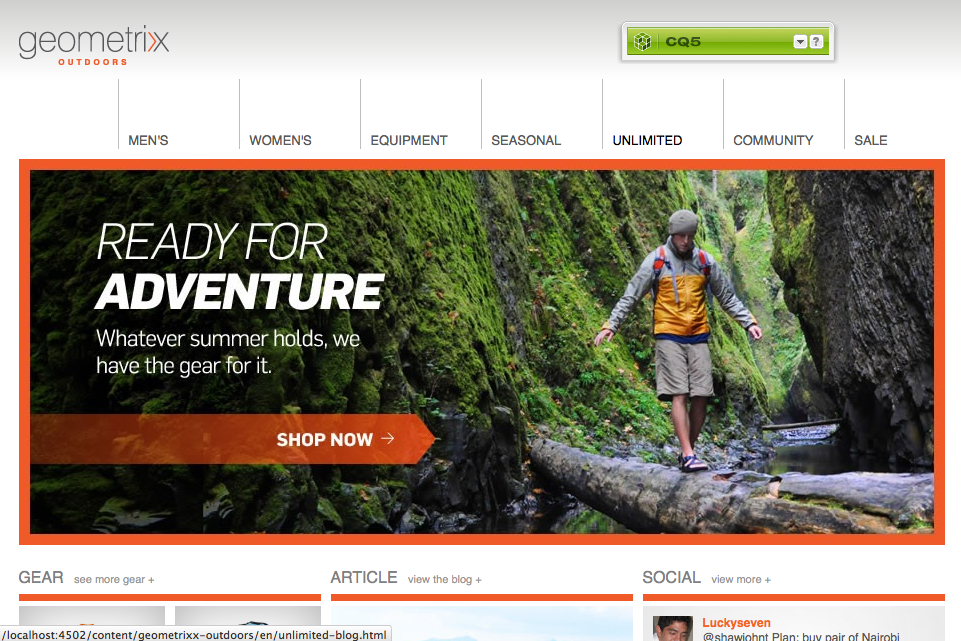

# Working with the Marketing Campaign Manager{#working-with-the-marketing-campaign-manager}

In AEM, the Marketing Campaign Manager (MCM) is a console that helps you manage multi-channel campaigns. With this marketing automation software you can manage all your brands, campaigns and experiences together with the related segments, lists, leads, and reports.

MCM can be accessed from various locations in AEM; for example, the Welcome screen, using the Campaigns icon or with the URL:

`https://<hostname>:<port>/libs/mcm/content/admin.html`

For example:

`https://localhost:4502/libs/mcm/content/admin.html`

From the MCM you can access:

* **[Dashboard](#dashboard)**
  This is divided into four panes:

    * [Lists](#lists)
      This pane shows the lists you have already created, together with the number of leads in that list. From this pane you can create a list directly or import leads to create a list.
      Selecting a specific list will take you to the [Lists](#lists) section showing details for your list.

    * [Segments](/help/sites-classic-ui-authoring/classic-personalization-campaigns.md#anoverviewofsegmentation)
      This pane show the segments that you have defined. Segments let you characterize a collection of visitors that share certain traits.
      Selecting a specific segment opens the segment definition page.

    * [Reports](/help/sites-administering/reporting.md)
      AEM provides different reports to help you analyze and monitor the state of your instance. This MCM pane lists the reports.
      Selecting a report opens the report page.

    * [Campaigns](#campaigns)
      This pane lists your campaign experiences such as [newsletters](/help/sites-classic-ui-authoring/classic-personalization-campaigns.md#newsletters) and [teasers](/help/sites-classic-ui-authoring/classic-personalization-campaigns.md#teasers).

* **[Leads](#leads)**
  Here you can manage your leads. You can create or import leads, edit specific details for individual leads or delete when no longer needed. You can also put leads in different groups, called Lists. **Note:** Adobe is not planning to further enhance this capability.
  Recommendation is to use [Adobe Campaign and the integration to AEM](/help/sites-administering/campaign.md).

* **[Lists](#lists)**
  Here you can manage your lists (of leads).**Note:** Adobe is not planning to further enhance this capability.
  Recommendation is to use [Adobe Campaign and the integration to AEM](/help/sites-administering/campaign.md).

* **[Campaigns](#campaigns)**
  Here you can manage your Brands, Campaigns and Experiences.

## Dashboard {#dashboard}

The dashboard shows four panes that provide you with an overview of your lists (of leads), segments, reports and campaigns. Access to basic functionality for these is also available here.

### Leads {#leads}

>[!NOTE]
>
>Adobe is not planning to further enhance this capability (Managing Leads).
>Recommendation is to use [Adobe Campaign and the integration to AEM](/help/sites-administering/campaign.md).

In AEM MCM, you can organize and add leads by either entering them manually or importing a comma-separated list; for example, a mailing list. Additional ways to generate leads are from newsletter sign-ups or community sign-ups (if configured, these can trigger a workflow that populates leads). Leads are usually categorized and put into a list so that later you can perform actions on the whole list; for example, sending out a custom email to a certain list.

Under **Leads** in the left pane you can create, import, edit and delete your leads, then activate or deactivate as required. You can add a lead to a list, or see which lists it already belongs to.

>[!NOTE]
>
>See [Working with Leads](/help/sites-classic-ui-authoring/classic-personalization-campaigns.md#workingwithleads) for detailed information about specific tasks.

### Lists {#lists}

>[!NOTE]
>
>Adobe is not planning to further enhance this capability (Managing Lists).
>Recommendation is to use [Adobe Campaign and the integration to AEM](/help/sites-administering/campaign.md).

Lists let you organize your leads into groups. With lists, you can target your marketing campaigns to a select group of people; for example, you can send a targeted newsletter to a list.

Under **Lists**, you can manage your lists by creating, importing, editing, merging and deleting lists which you can then activate or deactivate as required. You can also view the leads within that list, see if the list is a member of another list or view the description.

>[!NOTE]
>
>See [Working with Lists](/help/sites-classic-ui-authoring/classic-personalization-campaigns.md#workingwithlists) for detailed information about specific tasks.

### Campaigns {#campaigns}

>[!NOTE]
>
>See [Teasers and Strategies](/help/sites-classic-ui-authoring/classic-personalization-campaigns.md#workingwithlists), [Setting up your Campaign](/help/sites-classic-ui-authoring/classic-personalization-campaigns.md#settingupyourcampaign) and [Newsletters](/help/sites-classic-ui-authoring/classic-personalization-campaigns.md#newsletters) for detailed information about specific tasks.

To access existing campaigns, in the MCM click **Campaigns**.

* **In the left pane**:
  There is a list of all brands and campaigns.
  Clicking a brand expands the list to show all related campaigns in the left pane; this list also shows the number of experiences that exist for each campaign. It also opens the brand overview in the right pane.

* **In the right pane**:
  Icons are shown for each brand (historical campaigns will not be shown).
  You can double-click these to open the brand overview.

#### Brand Overview {#brand-overview}

From here you can:

* See the number of campaigns and experiences (number shown in the left pane) that exist for this brand.
* Create a **New...** campaign for this brand.

* Change the timespan being viewed; select **Week**, **Month** or **Quarter**, use the arrows to select specific periods or return to **Today**.

* Select a campaign (in the right pane) to:

    * Edit the **Properties...**
    * **Delete** the campaign.

* Open the campaign overview (double-click a campaign in the right pane, or single click in the left pane).

#### Campaign Overview {#campaign-overview}

For the individual campaigns there are two views available:

1. **Calendar View**

   Use the icon:

   

   This presents a list of all touchpoints (grey) with a horizontal timeframe of the experiences (green) connected to that touchpoint:

   

   From here you can:

    * Change the timespan you are viewing by using the arrows, or return to **Today**.

    * Use **Add Touchpoint...** to add a new touchpoint for an existing experience.

    * Click on a teaser (in the right pane) to set the **On Time** and **Off Time**.

1. **List View**

   Use the icon:

   

   This lists all experiences (for example, teasers and newsletters) for the selected campaign:

   

   From here you can:

    * Create a **New...** experience; for example, Adobe Target offers, teasers and newsletters.
    * **Edit** the details of a specific teaser page or newsletter (a double-click can also be used).
    * Define the **Properties...** for a specific teaser page or newsletter.
    * **Simulate** the look and feel of an experience (teaser page or newsletter).
      When the simulated page is open you can then open the sidekick to switch into edit mode for that page.

    * **Analyze...** the impressions generated for a page.

    * **Delete** items when they are no longer needed.
    * **Search** for your text (the Title field of the experience will be searched).
    * Use **Advanced** search to apply filters to the search.

### Simulating your Campaign Experiences {#simulating-your-campaign-experiences}

In the MCM, click **Campaigns**. Ensure that the list view is active, then select the required campaign experience and click **Simulate**. The touchpoint (teaser or newsletter page) will be opened to show the experience that you have selected - as the visitor will see it.

From here you can also open the sidekick (click the small down arrow) to change to edit mode for updating the page.

### Analyzing your Campaign Experiences {#analyzing-your-campaign-experiences}

In the MCM, click **Campaigns**. Ensure that the list view is active, then select the required campaign experience and select **Analyze...**. A chart of the page impressions over time is shown.

