# Setting up your campaign{#setting-up-your-campaign}

Setting up a new campaign includes the following (generic) steps:

1. [Create a brand](#creating-a-new-brand) to hold your campaigns.
1. If necessary you can [define the properties for your new brand](#defining-the-properties-for-your-new-brand).
1. [Create a campaign](#creating-a-new-campaign) to hold experiences; for example, teaser pages or a newsletter.
1. If necessary you can [define the properties for your new campaign](#defining-the-properties-for-your-new-campaign).

Then, depending on the type of experiences you create, you must [create an experience](#creating-a-new-experience). The details of the experience, and the actions that follow its creation, are dependent on the type of experience you want to create:

* If creating a Teaser:

    1. [Create a teaser experience](/help/sites-classic-ui-authoring/classic-personalization-campaigns.md#creatingateaserexperience).
    1. [Add content to your teaser](/help/sites-classic-ui-authoring/classic-personalization-campaigns.md#addingcontenttoyourteaser).
    1. [Create a Touchpoint for your Teaser](/help/sites-classic-ui-authoring/classic-personalization-campaigns.md#creatingatouchpointforyourteaser) (add your teaser to a content page).

* If creating a Newsletter:

    1. [Create a newsletter experience](/help/sites-classic-ui-authoring/classic-personalization-campaigns.md#creatinganewsletterexperience).
    1. [Add content to the newsletter.](/help/sites-classic-ui-authoring/classic-personalization-campaigns.md#addingcontenttonewsletters)
    1. [Personalize the newsletter.](/help/sites-classic-ui-authoring/classic-personalization-campaigns.md#personalizingnewsletters)
    1. [Create a compelling newsletter landing page](/help/sites-classic-ui-authoring/classic-personalization-campaigns.md#settingupanewsletterlandingpage).
    1. [Send the newsletter](/help/sites-classic-ui-authoring/classic-personalization-campaigns.md#sendingnewsletters) to subscribers or leads.

* If creating an Adobe Target (formerly Test&Target) Offer:

    1. [Create an Adobe Target offer experience](/help/sites-classic-ui-authoring/classic-personalization-campaigns.md#creatingatesttargetofferexperience).
    1. [Integrate with Adobe Target](/help/sites-classic-ui-authoring/classic-personalization-campaigns.md#integratewithadobetesttarget)

>[!NOTE]
>
>See [Segmentation](/help/sites-administering/campaign-segmentation.md) for detailed instructions on defining your segments.

## Creating a New Brand {#creating-a-new-brand}

1. Open the **MCM** and select **Campaigns** in the left pane.

1. Select **New...** to enter the **Title** and **Name** and template to be used for your new brand:

   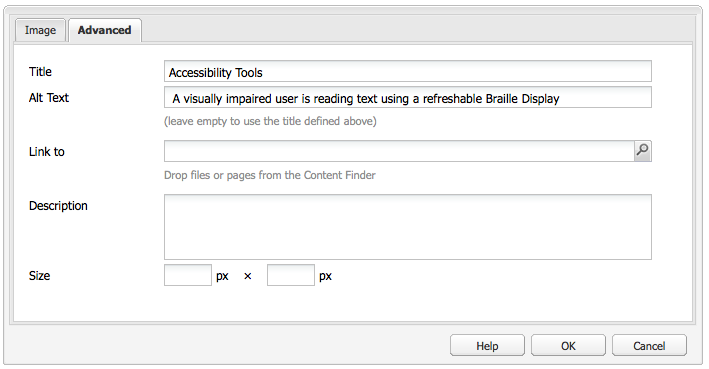

1. Click **Create**. Your new brand is shown in the MCM (with a default icon).

### Defining the Properties for Your New Brand {#defining-the-properties-for-your-new-brand}

1. From **Campaigns** in the left pane, select your new brand icon in the right pane and click **Properties...**

   You can enter a **Title**, **Description** and an image to be used as the icon.

   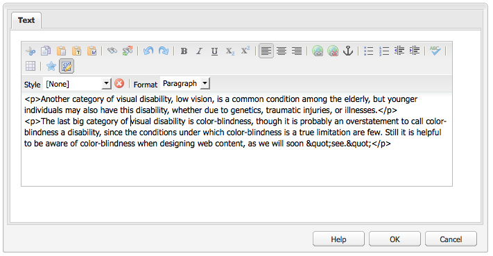

1. Click **OK** to save.

### Creating a New Campaign {#creating-a-new-campaign}

1. From **Campaigns**, select your new brand in the left pane, or double-click the icon in the right pane.

   The overview is shown (empty if the brand is new).

1. Click **New...** and specify the **Title**, **Name** and template to be used for your new campaign.

   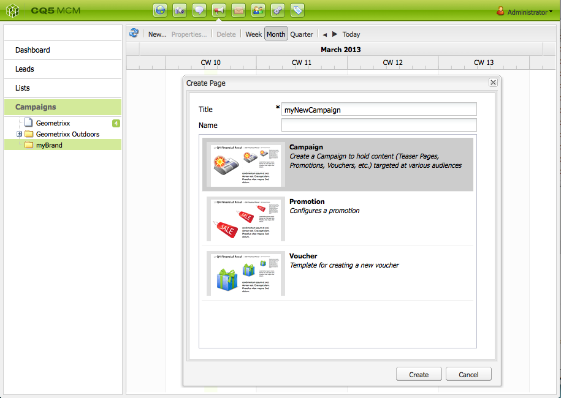

1. Click **Create**. Your new campaign is shown in the MCM.

### Defining the Properties for Your New Campaign {#defining-the-properties-for-your-new-campaign}

Configure campaign properties that control the behavior:

* **Priority:** The priority of this campaign relative to other campaigns. When multiple campaigns are simultaneously On, the campaign that has the highest priority controls the visitor experience.
* **On and Off Time:** These properties control the period of time when the campaign controls the visitor experience. The On Time property controls the time when the campaign begins to control the experience. The Off Time property controls when the campaigns stops controlling the experience.
* **Image:** The image that represents the campaign in AEM.
* **Cloud Services:** The Cloud Service configurations with which the campaign is integrated. (See [Integrating with Adobe Marketing Cloud](/help/sites-administering/marketing-cloud.md).)

* **Adobe Target:** Properties that configure campaigns that are integrated with Adobe Target. (See [Integrating with Adobe Target](/help/sites-administering/target.md).)

1. From **Campaigns**, select your brand. In the right pane, select your campaign and click **Properties**.

   You can enter various properties, including a **Title**, **Description** and any **Cloud Services** you want.

   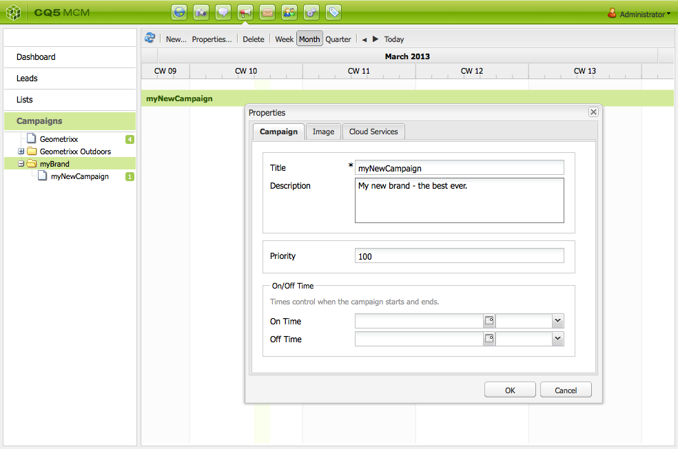

1. Click **OK** to save.

### Creating a New Experience {#creating-a-new-experience}

The procedure for creating an experience is dependent on the type of experience:

* [Creating a Teaser](/help/sites-classic-ui-authoring/classic-personalization-campaigns.md#creatingateaser)
* [Creating a Newsletter](/help/sites-classic-ui-authoring/classic-personalization-campaigns.md#creatinganewsletter)
* [Creating an Adobe Target Offer](/help/sites-classic-ui-authoring/classic-personalization-campaigns.md#creatingatesttargetoffer)

>[!NOTE]
>
>As with previous releases it is still possible to create the experience as a page in the **Websites** console (and any such pages created in previous releases are still fully supported).
>
>The recommended practice is now to use the MCM for creating experiences.

### Configuring Your New Experience {#configuring-your-new-experience}

Now that you have created the basic skeleton for your experience you need to continue with the following actions, dependent on the type of experience:

* [Teaser](/help/sites-classic-ui-authoring/classic-personalization-campaigns.md#teasers):

    * [Connect the teaser page to visitor segments.](/help/sites-classic-ui-authoring/classic-personalization-campaigns.md#applyingasegmenttoyourteaser)
    * [Create a Touchpoint for your Teaser](/help/sites-classic-ui-authoring/classic-personalization-campaigns.md#creatingatouchpointforyourteaser) (add your teaser to a content page).

* [Newsletter](/help/sites-classic-ui-authoring/classic-personalization-campaigns.md#newsletters):

    * [Add content to the newsletter.](/help/sites-classic-ui-authoring/classic-personalization-campaigns.md#addingcontenttonewsletters)
    * [Personalize the newsletter.](/help/sites-classic-ui-authoring/classic-personalization-campaigns.md#personalizingnewsletters)
    * [Send the newsletter](/help/sites-classic-ui-authoring/classic-personalization-campaigns.md#sendingnewsletters) to subscribers or leads.
    * [Create a compelling newsletter landing page](/help/sites-classic-ui-authoring/classic-personalization-campaigns.md#settingupanewsletterlandingpage).

* [Adobe Target Offer](/help/sites-classic-ui-authoring/classic-personalization-campaigns.md#testtargetoffers):

    * [Integrate with Adobe Target](/help/sites-administering/target.md)

### Adding a New Touchpoint {#adding-a-new-touchpoint}

If you have existing experiences you can add a touchpoint directly from the Calendar view of MCM:

1. Select the calendar view for your campaign.

1. Click **Add Touchpoint...** to open the dialog. Specify the experience you want to add:

   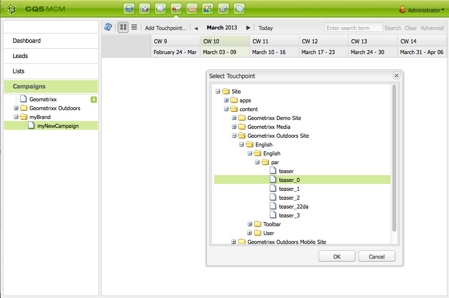

1. Click **OK** to save.

## Working with Leads {#working-with-leads}

>[!NOTE]
>
>Adobe is not planning to further enhance this capability (Managing Leads).
>Recommendation is to use [Adobe Campaign and the integration to AEM](/help/sites-administering/campaign.md).

In AEM MCM, you can organize and add leads either by entering them manually or importing a comma-separated list, for example, a mailing list. Additional ways to generate leads are from newsletter sign-ups or community sign-ups (if configured, those can trigger a workflow that populates leads).

Leads generally are categorized and put into a list so that later you can perform actions on the whole list, for example, sending out a custom email to a certain list.

In the Dashboard, you access all leads by clicking **Leads** from the left pane. You can also access leads from the **Lists** pane.

>[!NOTE]
>
>To add or modify the avatars of users, open the clickstream cloud (Ctrl+Alt+c), load the profile, and click **Edit**.

### Creating new leads {#creating-new-leads}

After you create new leads, be sure to [activate them](#activating-or-deactivating-leads) so that you can track their activity on the publish instance and personalize their experience.

To create a lead manually:

1. In AEM, navigate to the MCM. In the Dashboard, click **Leads**.
1. Click **New**. The **Create New** window opens.

   

1. Enter information in the fields, as appropriate. Click the **Address** tab.

   

1. Enter address information, as appropriate. Click **Save** to save the lead. If you need to add additional leads, click **Save and New**.

   The new lead appears in the Leads pane. When you click the entry, all entered information appears in the right pane. After creating a lead, you can add it to a list.

   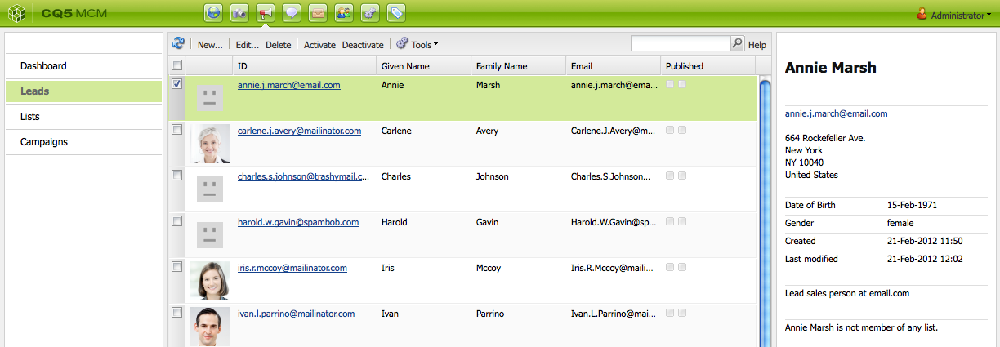

### Activating or deactivating leads {#activating-or-deactivating-leads}

Activating leads helps you track their activity on the publish instance and lets you personalize their experience. When you no longer want to track their activity, you can deactivate them.

To active or deactive leads:

1. In AEM, navigate to the MCM and click **Leads**.

1. Select the leads you want to activate or deactivate and click **Activate** or **Deactivate**.

   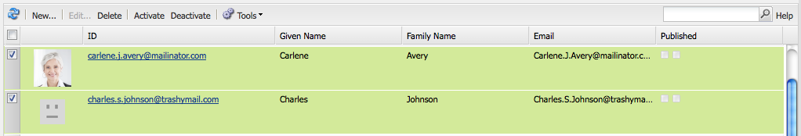

   As with AEM pages, the publishing status is indicated in the **Published** column.

   

### Importing new leads {#importing-new-leads}

When you import new leads, you can automatically add them to an existing list or create a list to include these leads.

To import leads from a comma-separated list:

1. In AEM, navigate to the MCM and click **Leads**.

   >[!NOTE]
   >
   >Alternatively, you can import leads by doing one of the following:
   >
   >* In the Dashboard, click **Import Leads** in the **Lists** pane 
   >* Click **Lists** and in the **Tools** menu, select **Import Leads**.  

1. In the **Tools** menu, select **Import** **Leads**.

1. Enter the information as described in Sample Data. The following fields can be imported: email,familyName,givenName,gender,aboutMe,city,country,phoneNumber,postalCode,region,streetAddress

   >[!NOTE]
   >
   >The first row in the CSV list are predefined labels that must be written exactly as in the example:
   >
   >
   >`email,givenName,familyName` - if written as `givenname`, for example, the system will not recognize it.
   >
   >

   

1. Click **Next**. Here, you preview the leads to ensure they are accurate.

   

1. Click **Next**. Select the list you want the leads to belong to. If you do not want them to belong to a list, delete the information in the field. By default, AEM creates a list name that includes the date and time. Click **Import**.

   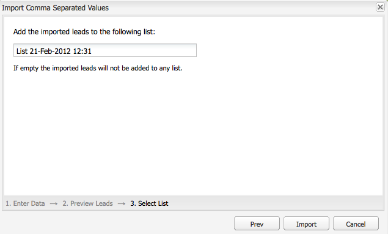

   The new lead appears in the Leads pane. If you click the entry, all entered information appears in the right pane. After creating a lead, you can add it to a list.

### Adding Leads to Lists {#adding-leads-to-lists}

To add leads to pre-existing lists:

1. In the MCM, click **Leads** to view all available leads.

1. Select the leads you want to add to a list by selecting the check box next to the lead. You can add as many leads as you want.

   

1. In the **Tools** menu, select **Add to List....** The **Add to List** window opens.

   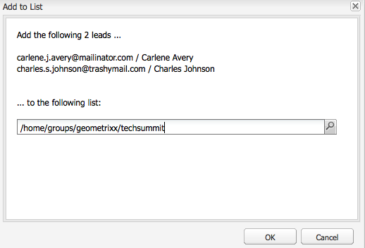

1. Select which list you want to add the leads to and click **OK**. The leads are added to the appropriate lists.

### Viewing lead information {#viewing-lead-information}

To view lead information, in the MCM, click the check box next to the lead and a right pane opens with all the lead's information displayed, including list affiliation.

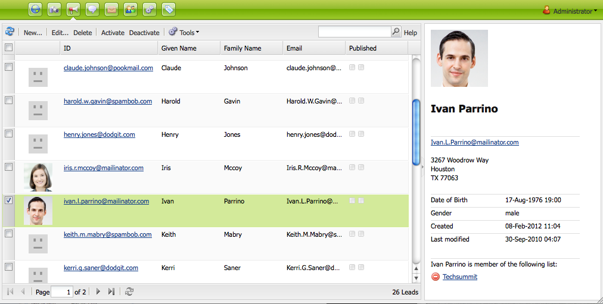

### Modifying existing leads {#modifying-existing-leads}

To modify existing lead information:

1. In the MCM, click **Leads**. From the list of leads, select the check box next to the lead you want to edit. All of the lead information appears in the right pane.

   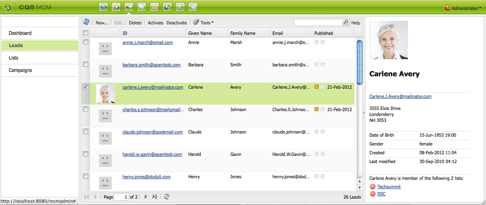

   >[!NOTE]
   >
   >You can only edit a single lead at a time. If you need to modify leads that are part of the same list, you can modify the list instead.

1. Click **Edit**. The **Edit Lead** window opens.

   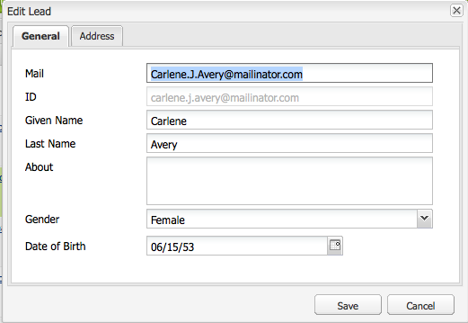

1. Make the edits as needed and click **Save** to save your changes.

   >[!NOTE]
   >
   >To change the lead avatar, go to the users profile. You can load the profile in the clickstream cloud by pressing CTRL+ALT+c, clicking **Load**, and then selecting the profile.

### Deleting existing leads {#deleting-existing-leads}

To delete existing leads in the MCM, select the check box next to the lead and click **Delete**. The lead is removed from the lead list and all associated lists.

>[!NOTE]
>
>Before deleting, AEM confirms that you want to delete the existing lead. After it is deleted, it cannot be retrieved.

## Working with Lists {#working-with-lists}

>[!NOTE]
>
>Adobe is not planning to further enhance this capability (managing lists).
>Recommendation is to use [Adobe Campaign and the integration to AEM](/help/sites-administering/campaign.md).

Lists let you organize your leads into groups. With lists, you can target your marketing campaigns to a select group of people, for example, you can send a targeted newsletter to a list. Lists are visible in the MCM, either in the Dashboard or by clicking **Lists**. Both provide you with the name of the list and the number of members.

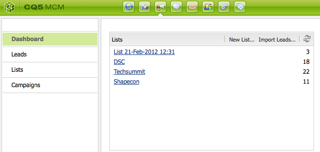

If you click **Lists**, you can also view if the list is a member of another list and see a description.

### Creating new lists {#creating-new-lists}

1. In the MCM dashboard, click **New List ...** or in **Lists**, click **New** ... The Create List window opens.

   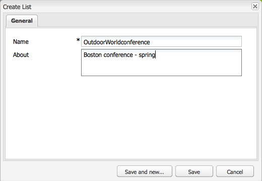

1. Enter a name (required) and if desired, a description and click **Save**. The list appears in the **Lists** pane.

   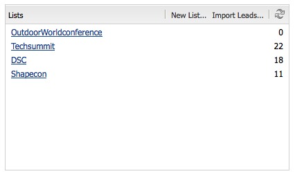

### Modifying existing lists {#modifying-existing-lists}

1. In the MCM, click **Lists**.

1. From the list, select the check box next to the list you want to edit and click **Edit**. The **Edit List** window opens.

   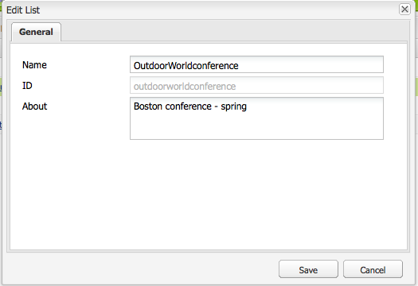

   >[!NOTE]
   >
   >You can only edit one list at a time.

1. Make edits, as needed and click **Save** to save your changes.

### Deleting existing lists {#deleting-existing-lists}

To delete existing lists, in the MCM, select the check box next to the list and click **Delete**. The list is removed. Leads that were affiliated with the list are not removed - only the affiliation with the list is deleted.

>[!NOTE]
>
>Before deleting, AEM confirms that you want to delete the existing lists. After it is deleted, it cannot be retrieved.

### Merging lists {#merging-lists}

You can merge an existing list with another list. When you do this, the list you are merging becomes a member of the other list. It still exists as a separate entity as well and should not be deleted.

You might merge lists if you have the same conference in two different locations and want to merge them into an attendees list of all conferences.

To merge existing lists:

1. In the MCM, click **Lists**.

1. Select the list you want to merge another list with by selecting the check box next to it.

1. In the **Tools** menu, select **Merge List**.

   >[!NOTE]
   >
   >You can only merge one list at a time.

1. In the **Merge List** window, select the list you want to merge with and click **OK**.

   

   The list you merged should increase by one member. To see that your list was merged, select the list you merged and in the **Tools** menu, select **Show Leads**.

1. Repeat the step until you have merged all the lists you want.

   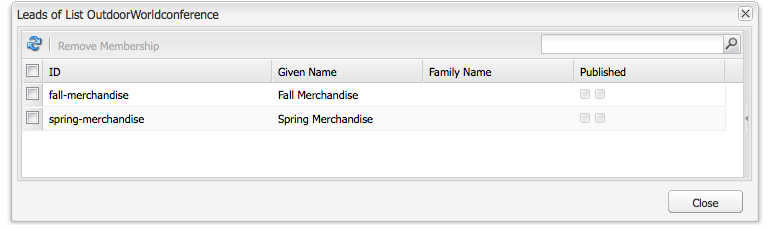

>[!NOTE]
>
>Removing a merged list from its membership is identical to removing a lead from a list. Open the **Lists** tab, select the list that includes the merged list, and remove the membership by clicking the red circle next to the list.

### Viewing leads in lists {#viewing-leads-in-lists}

At anytime, you can view which leads belong to a specific list either by browsing or searching for members.

To view the leads in lists:

1. In the MCM, click **Lists**.

1. Select the check box next to the list you want to view members for.

1. In the **Tools** menu, select **Show Leads**. AEM displays the leads that are a member of that list. You can browse through the list or search for members.

   >[!NOTE]
   >
   >In addition, you can delete leads from a list by selecting them and then clicking **Remove Membership**.

   

1. Click **Close** to return to the MCM.
