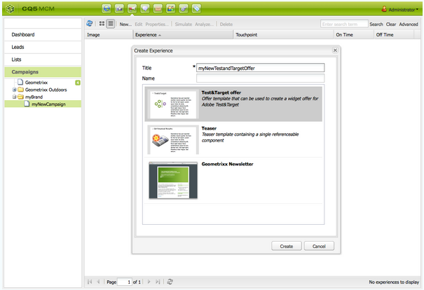

# Target offers{#target-offers}

## Creating a Test&Target Offer Experience {#creating-a-test-target-offer-experience}

1. Select your new campaign in the left pane, or double-click it in the right pane.
1. Select the list view using the icon:

   

1. Click **New ...**
1. You can specify the **Title**, **Name** and type of experience to be created; in this case, Test&Target Offer.

   

1. Click **Create**.

   >[!NOTE]
   >
   >Test&Target experiences are not currently listed in the MCM. They can be accessed from the **Websites** console, under Campaigns.

## Integrating with Adobe Target {#integrating-with-adobe-target}

See [Integrate with Adobe](/help/sites-administering/target.md) [Target](/help/sites-administering/target.md) for full details.
