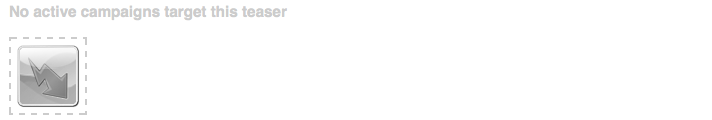
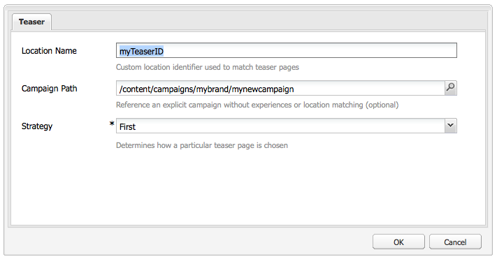
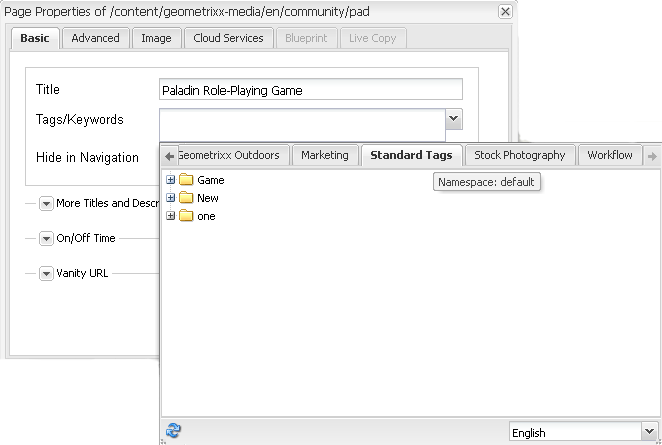

# Teasers and Strategies{#teasers-and-strategies}

Campaigns often use teasers as a mechanism to entice a specific segment of the visitor population through to content focused on their interests. One or more teasers are defined for a specific campaign.

>[!NOTE]
>
>The Teaser component is now deprecated in AEM 6.2. Instead, use the [Target component](/help/sites-authoring/content-targeting-touch.md).

* **Brand pages** are stored within the Campaigns section of the website. A brand contains the individual campaigns.
* **Campaign pages** are stored within the Campaigns section of the website. Each campaign has an individual page, under which the teaser definitions are held. The container, or overview, page also holds certain information and statistics concerning the individual teaser pages.

Teasers within AEM are composed of several parts:

* **Teaser pages** are stored under the appropriate campaign page and hold the definitions of the teaser paragraphs available for each specific campaign. These definitions are used when displaying the teaser paragraphs; including content variations, the segment to be used for selecting a variation and boost factor.
* The **Teaser component** is available out of the box and lets you create an instance of your specific teaser paragraph in a content page. You can drag the teaser component from the sidekick, then specify your teaser definition to create your own teaser paragraph. **Note:** The Teaser component is now deprecated in AEM 6.2. Instead, use the [Target component](/help/sites-authoring/content-targeting-touch.md).
* **Teaser paragraphs** are actual instances of your teaser within a content page. These entice a segment of visitors through to content focused on their interests.
* Pages that hold the campaign content focused on a specific visitor segment. Usually, the teaser paragraphs lead the visitor to such pages.

## Strategies {#strategies}

When adding a teaser paragraph to a page, you must define the **Strategy**.

This is for the case that several teasers are available for selection as their assigned segments all resolve successfully. The **Strategy** then specifies an extra criteria used to select the teaser shown:

* **Clickstream Score**, is based on the tags and related tag hits held within the visitor's client context (show how often a visitor has clicked pages that contain the respective tag). The hit rates for tags defined on the teaser page are compared.
* **Random**, for "random" selection; uses the random factor generated for a page, this can be seen with the [client context](/help/sites-administering/client-context.md).
* **First** in the list of resolved segments. The order is that of the teasers within the campaign container page.

The [Boost Factor](/help/sites-administering/campaign-segmentation.md#boost-factor) of the segment also has an impact on the selection. This is a weighting factor added to a segment definition to increase/decrease the relative likelihood of it being selected.

The process and interrelationships of the various selection criteria are best illustrated with an example (a method that can also be used to ensure that your teasers will reach the required audience).

If the following segments have already been created and assigned their respective Boost Factor:

| Segment |Boost Factor |
|---|---|
| S1 |0 |
| S2 |0 |
| S3 |10 |
| S4 |30 |
| S5 |0 |
| S6 |100 |

And we use the following teaser definitions:

<table>
 <tbody>
  <tr>
   <td>Campaign</td>
   <td>Teaser</td>
   <td>Assigned Segments</td>
   <td>Assigned Tags </td>
  </tr>
  <tr>
   <td>C1</td>
   <td>T1</td>
   <td>S1, S2</td>
   <td>Business, Marketing</td>
  </tr>
  <tr>
   <td>C1</td>
   <td>T2 </td>
   <td>S1</td>
   <td>  </td>
  </tr>
  <tr>
   <td>C1 </td>
   <td>T3</td>
   <td>S3, S4</td>
   <td>  </td>
  </tr>
  <tr>
   <td>C1 </td>
   <td>T4</td>
   <td>S2, S5</td>
   <td>  </td>
  </tr>
  <tr>
   <td>C1 </td>
   <td>T5</td>
   <td>S1, S2, S6</td>
   <td>Marketing</td>
  </tr>
  <tr>
   <td>C1 </td>
   <td>T6</td>
   <td>S6</td>
   <td>Business  </td>
  </tr>
 </tbody>
</table>

Then if we apply this to a visitor where:

* **S1**, **S2, and **S6** resolve successfully

* the tag **marketing** has three hits
* the tag **business** has six hits

We can see the resulting:

* match success - do any of the segments assigned to the teaser resolve successfully for the current visitor?
* boost factor - the highest boost factor of all applicable segments
* clickstream score - the accumulative total for all applicable tag hits

that are calculated before applying the appropriate strategy:

<table>
 <tbody>
  <tr>
   <td>Campaign</td>
   <td>Teaser</td>
   <td>Assigned Segments</td>
   <td>Tags </td>
   <td>Successful Match?</td>
   <td>Resulting Boost Factor</td>
   <td>Resulting Clickstream Score </td>
  </tr>
  <tr>
   <td>C1</td>
   <td>T1</td>
   <td>S1, S2</td>
   <td>Business, Marketing</td>
   <td>Yes</td>
   <td>0</td>
   <td>9</td>
  </tr>
  <tr>
   <td>C1</td>
   <td>T2 </td>
   <td>S1</td>
   <td>  </td>
   <td>Yes</td>
   <td>0</td>
   <td>  </td>
  </tr>
  <tr>
   <td>C1 </td>
   <td>T3</td>
   <td>S3, S4</td>
   <td>  </td>
   <td>No</td>
   <td>  </td>
   <td>  </td>
  </tr>
  <tr>
   <td>C1 </td>
   <td>T4</td>
   <td>S2, S5</td>
   <td>  </td>
   <td>Yes  </td>
   <td>0  </td>
   <td>  </td>
  </tr>
  <tr>
   <td>C1 </td>
   <td>T5</td>
   <td>S1, S2, S6</td>
   <td>Marketing</td>
   <td>Yes</td>
   <td>100</td>
   <td>3</td>
  </tr>
  <tr>
   <td>C1 </td>
   <td>T6</td>
   <td>S6</td>
   <td>Business</td>
   <td>Yes</td>
   <td>100</td>
   <td>6 </td>
  </tr>
 </tbody>
</table>

These values are used to determine the teasers that the visitor will see, depending on the **Strategy** applied to the teaser paragraph:

<table>
 <tbody>
  <tr>
   <td>Strategy</td>
   <td>Resulting Teaser</td>
   <td>Comments</td>
  </tr>
  <tr>
   <td>First</td>
   <td>T5</td>
   <td>Only T5 and T6 are considered as their segments all resolve <i>and</i> they have the highest boost factor. The list returned is in the order T5, T6; so T5 is selected and shown.</td>
  </tr>
  <tr>
   <td>Random</td>
   <td>T5 or T6</td>
   <td>Both teasers have segments that all resolve and the same boost factor. Therefore, the two teasers are shown in equal proportion.</td>
  </tr>
  <tr>
   <td>Clickstream Score</td>
   <td>T6</td>
   <td>
Segments for T1, T4, T5 and T6 all resolve for the visitor. The higher boost factors of T5 and T6 then excludes T1 and T4. Finally the higher Clickstream Score of T6 result in this being selected.
 </td>
  </tr>
 </tbody>
</table>

>[!NOTE]
>
>If, after the above resolution techniques, multiple teasers are available for selection, then an internal selection (random) will select a single teaser for display.
>
>For example, if the strategy was Clickstream Score and T5 had the same Clickstream Score as T6 (that is, six instead of three) then the internal selection (random) would be used to select one of these two.

Teaser Pages / Paragraphs are used to steer specific visitor segments to content that is focused on their interests. They can present a range of options for the visitor to choose from, or show only one teaser paragraph that is based on the specific visitor segment. For example, the teaser paragraph shown may be dependent on the age of the visitor.

Typically a teaser page is a temporary action that will last for a specific amount of time, until it is replaced by the next teaser page.

After creating your brand and campaign, you can create and set up your teaser experience.

### Creating a Touchpoint for your Teaser {#creating-a-touchpoint-for-your-teaser}

>[!NOTE]
>
>The Teaser component is now deprecated in AEM 6.2. Instead, use the [Target component](/help/sites-authoring/content-targeting-touch.md).

1. Navigate to the content page where you want to place the teaser paragraph that will lead to your campaign page.
1. Add a **Teaser** component (available in the **Personalization** section of sidekick) in the required position. When first created, it will show that the campaign path is not yet configured:

   

1. Edit the teaser component to add the:

    * **Campaign Path**
      Path to the campaign page that holds the individual teaser page; segments determine exactly which teaser is shown.

    * **[Strategy](/help/sites-classic-ui-authoring/classic-personalization-campaigns.md#strategies)**
      Method used for selection when multiple segments resolve successfully.

   

1. Click **OK** to save. Depending on the segments you have set on the teaser and the profile of the user you are currently logged in as, the appropriate content will be displayed:

   

1. Mouse over the teaser paragraph to reveal the question mark icon (bottom-right corner of the component). Click this to view the segments applied and whether they currently resolve.

   

### Teaser Overview {#teaser-overview}

As well as the campaign view in the MCM, the campaign page also gives information about the teasers connected to it:

1. From the **Websites** console, open the campaign page; for example:

   `https://localhost:4502/content/campaigns/geometrixx-outdoors/storefront/summer.html`

   This shows an overview of the teaser definitions and viewing statistics:

   
