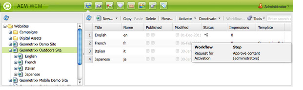

# Applying Workflows to Pages{#applying-workflows-to-pages}

When you apply the workflow, you specify the following information:

* The workflow to apply.

  You can apply any workflow (that you have access to, as assigned by your AEM administrator).
* Optionally:

    * A comment that provides information about why you started the workflow.
    * A title that helps identify the workflow instance in a user's Inbox.

>[!NOTE]
>
>AEM administrators can start workflows using [several other methods](/help/sites-administering/workflows-starting.md).

## Applying Workflows {#applying-workflows}

Workflows can be started from either the Websites console or, when editing a page, from Sidekick.

The **Status** column in the **Websites** console indicates whether a workflow has been applied to a page:

### Starting a Workflow from the Websites Console {#starting-a-workflow-from-the-websites-console}

1. Open the Websites console. ([http://localhost:4502/siteadmin](http://localhost:4502/siteadmin))
1. In the Websites tree, select the parent of the page to which you want to apply the workflow.
1. In the page list, select the page and then click Workflow.
1. In the Start Workflow dialog, select the workflow to apply. Optinally, enter a comment and a title. Then, click Start.

### Starting a Workflow using Sidekick {#starting-a-workflow-using-sidekick}

1. Open the Websites console.
1. Open the required page.
1. Select the Workflow tab from the Sidekick.
1. Expand the **Workflow** dialog, allowing you to select the **Workflow** and optionally enter **Workflow Title** and **Comment**.

   

1. Click **Start Workflow** to start a new workflow instance with the properties you configured and the current page as the payload. Now the workflow is running.
