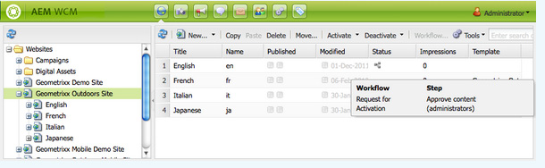
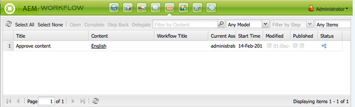
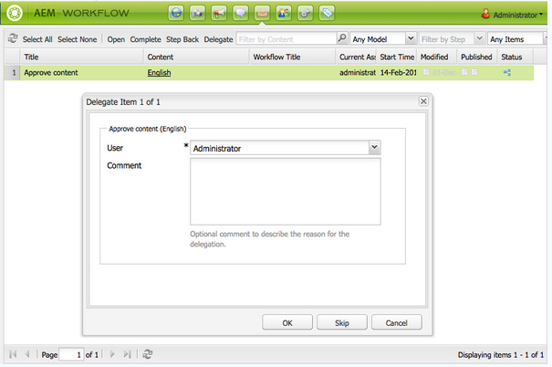
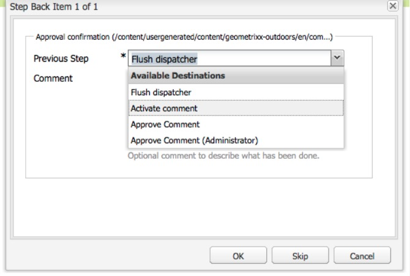

# Participating in Workflows{#participating-in-workflows}

Workflows typically include steps that require a person to perform an activity on a page or asset. The workflow selects a user or group to perform the activity and assigns a work item to that person or group.

## Processing Your Work Items {#processing-your-work-items}

You can perform the following actions to process a work item:

* **Complete**

  You can complete an item to allow the workflow to progress to the next step.

* **Delegate**

  If a step has been assigned to you, but for any reason you are unable to take action, you can delegate the step to another user or group.

  The users who are available for delegation depend on who was assigned the work item:

    * If the work item was assigned to a group, the group members are available.
    * If the work item was assigned to a group and then delegated to a user, the group members and the group are available.
    * If the work item was assigned to a single user, the work item cannot be delegated.

* **Step Back**

  If you discover that a step, or series of steps, needs to be repeated you can step back. This allows you to select a step, that occurred earlier in the workflow, for reprocessing. The workflow returns to the step you specify, then proceeds from there.

## Participating in a Workflow {#participating-in-a-workflow}

### Notifications of Assigned Workflow Actions {#notifications-of-assigned-workflow-actions}

When you are assigned a work item (for example, **Approve Content**) various alerts and/or notifications appear:

* The **Status** column of the Websites console indicates when a page is in a workflow:

  

* When you, or a group that you belong to, are assigned a work item as part of a workflow, the work item appears in your AEM Workflow Inbox.

  

### Completing a Participant Step {#completing-a-participant-step}

After you have taken the action indicated you can complete the work item, thus allowing the workflow to continue. Use the following procedure to complete the work item.

1. Select the workflow step and click the **Complete** button in the top navigation bar.
1. In the resulting dialog, select the **Next Step**; that is, the step to execute next. A drop down list shows all appropriate destinations. A **Comment** can also be entered.

   

   The number of steps listed depends on the design of the workflow model.

1. Click **OK** to confirm the action.

### Delegating a Participant Step {#delegating-a-participant-step}

Use the following procedure to delegate a work item.

1. Click the **Delegate** button in the top navigation bar.
1. In the dialog, use the drop-down list to select the **User** to delegate the work item to. You can also add a **Comment**.

   

1. Click **OK** to confirm the action.

### Performing Step Back on a Participant Step {#performing-step-back-on-a-participant-step}

Use the following procedure to step back.

1. Click the Step Back button in the top navigation bar.
1. In the resulting dialog, select the Previous Step; that is, the step to execute next - even though it is a step that occurs earlier in the workflow. A drop down list shows all appropriate destinations.

   

1. Click OK to confirm the action.
