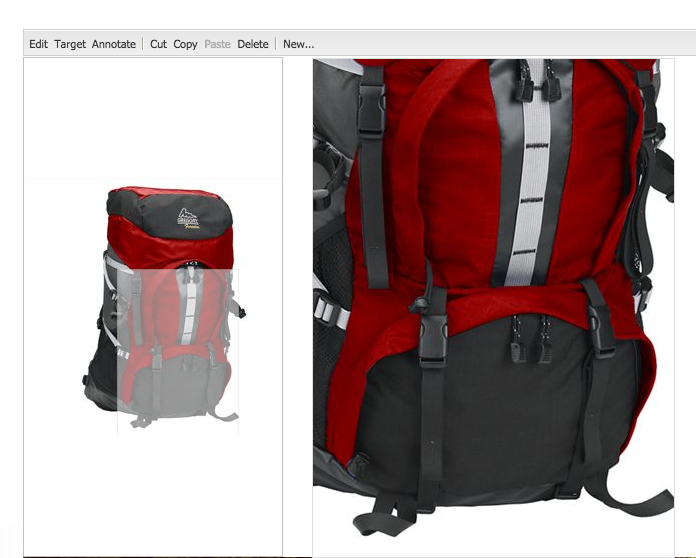
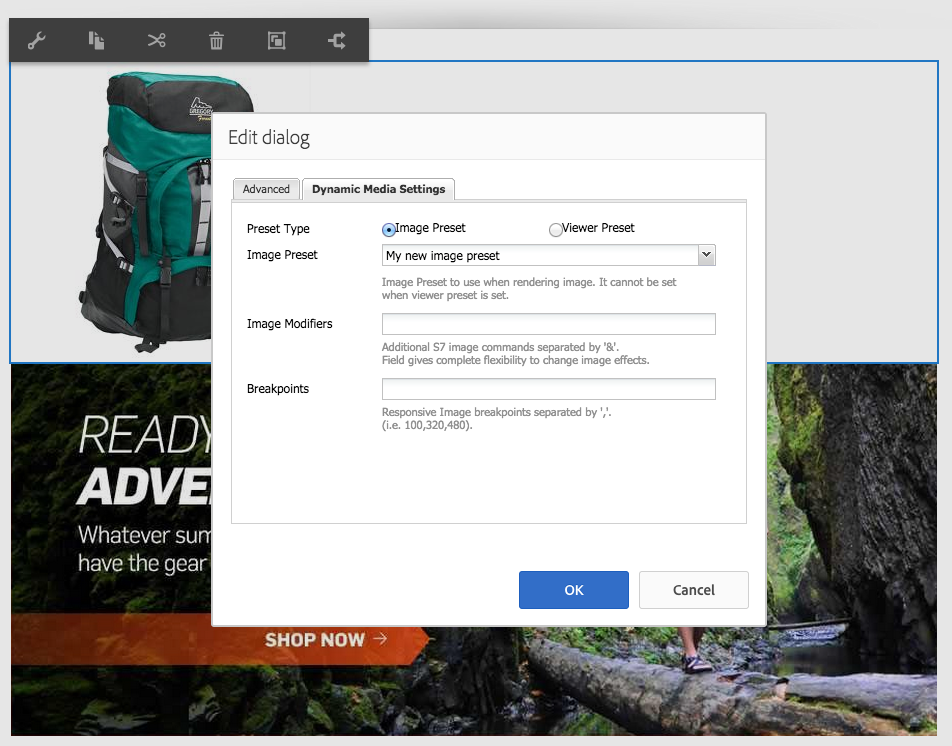
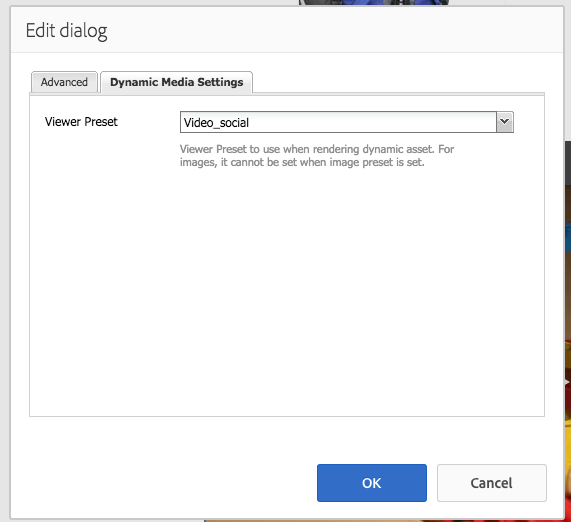

# Add Dynamic Media assets to pages{#adding-dynamic-media-assets-to-pages}

To add the Dynamic Media functionality to assets you use on your websites, you can add the **[!UICONTROL Dynamic Media]** or **[!UICONTROL Interactive Media]** component directly on the page. Enter **[!UICONTROL Design]** mode and enabling the Dynamic Media components. Then you can add these components to the page and add assets to the component. The Dynamic Media and interactive media components are smart - they know whether you are adding an image or a video and the options available change accordingly.

You add Dynamic Media assets directly to the page if you are using Adobe Experience Manager as your WCM.

>[!NOTE]
>
>Image maps are available out of the box for carousel banners.

## Add a Dynamic Media component to a page {#adding-a-dynamic-media-component-to-a-page}

Adding the [!UICONTROL Dynamic Media] or [!UICONTROL Interactive Media] component to a page is the same as adding a component to any page. The [!UICONTROL Dynamic Media] and [!UICONTROL Interactive Media] components are described in detail in the following sections.

To add a Dynamic Media component/viewer to a page:

1. In Experience Manager, open the page where you want to add the Dynamic Media component.
1. If no Dynamic Media component is available, select the ruler in the [!UICONTROL Sidekick] to enter **[!UICONTROL Design]** mode.
1. Select **[!UICONTROL Edit]** parsys.
1. Select **[!UICONTROL Dynamic Media]** so you can make the Dynamic Media components available.

   >[!NOTE]
   >
   >See [Configuring Components in Design Mode](/help/sites-authoring/default-components-designmode.md) for more information.

1. Return to **[!UICONTROL Edit]** mode by clicking the pencil icon in the [!UICONTROL Sidekick].
1. Drag the **[!UICONTROL Dynamic Media]** or **[!UICONTROL Interactive Media]** component from the **[!UICONTROL Other]** group in the sidekick onto the page in the desired location.
1. Select **[!UICONTROL Edit]** so the component opens.
1. [Edit the component](#dynamic-media-component) as necessary.
1. Select **[!UICONTROL OK]** so your changes are saved.

## Dynamic Media Components {#dynamic-media-components}

[!UICONTROL Dynamic Media] and [!UICONTROL Interactive Media] are available in the [!UICONTROL Sidekick] under **[!UICONTROL Dynamic Media]**. You use the **[!UICONTROL Interactive Media]** component for any interactive assets such as interactive video, interactive images, or carousel sets. For all other Dynamic Media components, use the **[!UICONTROL Dynamic Media]** component.

>[!NOTE]
>
>These components are not available by default and must be selected in Design mode before using. [After they are made available in Design mode](/help/sites-authoring/default-components-designmode.md), you can add the components to your page as you would any other Experience Manager component.

### Dynamic Media component {#dynamic-media-component}

The Dynamic Media component is smart&mdash;depending on whether you add an image or a video, you have various options. The component supports image presets, image-based viewers such as image sets, spin sets, mixed media sets, and video. In addition, the viewer is responsive. That is, the size of the screen changes automatically based on-screen size. All viewers are HTML5-based viewers.

>[!NOTE]
>
>When you add the [!UICONTROL Dynamic Media] component, and **[!UICONTROL Dynamic Media Settings]** is blank or you cannot add an asset properly, check the following:
>
>* You have [enabled Dynamic Media](/help/assets/config-dynamic.md). Dynamic Media is disabled by default.
>* The image has a pyramid tiff file. Images imported before Dynamic Media are enabled do not have a pyramid tiff file.
>

#### When working with images {#when-working-with-images}

The [!UICONTROL Dynamic Media] component lets you add dynamic images, including image sets, spin sets, and mixed media sets. You can zoom in, zoom out, and if applicable turn an image within a spin set or select an image from another type of set.

You can also configure the viewer preset, image preset, or image format directly in the component. To make an image responsive, you can either set the breakpoints or apply a responsive image preset.

You can edit the following Dynamic Media settings by clicking **[!UICONTROL Edit]** in the component and then clicking the **[!UICONTROL Dynamic Media Settings]** tab.

>[!NOTE]
>
>By default, the Dynamic Media image component is adaptive. If you want to make it a fixed size, set it in the component in the **[!UICONTROL Advanced]** tab with the **[!UICONTROL Width]** and **[!UICONTROL Height]** properties.

**[!UICONTROL Viewer preset]** - Select an existing viewer preset from the drop-down menu. If the viewer preset you are looking for is not visible, you must make it visible. See [Managing Viewer Presets](/help/assets/managing-viewer-presets.md). You cannot select a viewer preset if you are using an image preset and conversely.

This option is only available if you view image sets, spin sets, or mixed media sets. The viewer presets displayed are smart. That is, only relevant viewer presets appear.

**[!UICONTROL Image preset]** - Select an existing image preset from the drop-down menu. If the image preset you are looking for is not visible, you must make it visible. See [Managing Image Presets](/help/assets/managing-image-presets.md). You cannot select a viewer preset if you are using an image preset and conversely.

This option is not available if you are viewing image sets, spin sets, or mixed media sets.

**[!UICONTROL Image Modifiers]** - You can change image effects by supplying additional image commands. These commands are described in [Managing Image Presets](/help/assets/managing-viewer-presets.md) and the [Command reference](https://experienceleague.adobe.com/docs/dynamic-media-developer-resources/image-serving-api/image-serving-api/http-protocol-reference/command-reference/c-command-reference.html).

This option is not available if you are viewing image sets, spin sets, or mixed media sets.

**[!UICONTROL Breakpoints]** - If you are using this asset on a responsive site, you must add the page breakpoints. Image breakpoints are separated by commas (,). This option works when there is no height or width defined in an image preset.

This option is not available if you are viewing image sets, spin sets, or mixed media sets.

You can edit the following [!UICONTROL Advanced Settings] by clicking **[!UICONTROL Edit]** in the component.

**[!UICONTROL Title]** - Change the title of the image.

**[!UICONTROL Alt Text]** - Add a title to the image for those users who have graphics turned off.

This option is not available if you are viewing image sets, spin sets, or mixed media sets.

**[!UICONTROL URL, Open in]** - You can set an asset from to open a link. Set the **[!UICONTROL URL]** and **[!UICONTROL Open in]** to indicate whether you want it to open in the same window or a new window.

This option is not available if you are viewing image sets, spin sets, or mixed media sets.

**[!UICONTROL Width and Height]** - Enter value in pixels if you want the image to be a fixed size. Leaving these values blank makes the asset adaptive.

#### When working with video {#when-working-with-video}

Use the **[!UICONTROL Dynamic Media]** component to add dynamic video to your web pages. When you edit the component, you can choose to use a predefined video viewer preset for playing the video on the page.

You can edit the following [!UICONTROL Dynamic Media Settings] by clicking **[!UICONTROL Edit]** in the component.

>[!NOTE]
>
>By default, the Dynamic Media video component is adaptive. If you want to make it a fixed size, set it in the component with the **[!UICONTROL Width]** and **[!UICONTROL Height]** in the **[!UICONTROL Advanced]** tab.

**[!UICONTROL Viewer preset]** - Select an existing video viewer preset from the drop-down menu. If the viewer preset you are looking for is not visible, you must make it visible. See [Managing Viewer Presets](/help/assets/managing-viewer-presets.md).

You can edit the following [!UICONTROL Advanced] settings by clicking **[!UICONTROL Edit]** in the component.

**[!UICONTROL Title]** - Change the title of the video.

**[!UICONTROL Width and Height]** - Enter value in pixels if you want the video to be a fixed size. Leaving these values blank makes it adaptive.

#### Deliver secure video {#how-to-delivery-secure-video}

In Experience Manager 6.2, when you install [FP-13480](https://experience.adobe.com/#/downloads/content/software-distribution/en/aem.html?package=/content/software-distribution/en/details.html/content/dam/aem/public/adobe/packages/cq620/featurepack/cq-6.2.0-featurepack-13480), you can control whether a video is delivered over a secure SSL connection (HTTPS) or an insecure connection (HTTP). By default, the video delivery protocol is automatically inherited from the protocol of the embedding web page. If the web page is loaded over HTTPS, the video is also delivered over HTTPS. And conversely, if the web page is on HTTP, the video is delivered over HTTP. Usually, this default behavior is fine and there is no need to make any configuration changes. However, you can override this default behavior. Append `VideoPlayer.ssl=on` to either the end of a URL path or to the list of other viewer configuration parameters in an embed code snippet. Either action forces secure video delivery.

For more information about secure video delivery and using the `VideoPlayer.ssl` configuration attribute in your URL path, see [Secure Video Delivery](https://experienceleague.adobe.com/docs/dynamic-media-developer-resources/library/viewers-aem-assets-dmc/video/c-html5-video-viewer-20-securevideodelivery.html) in the Viewers Reference Guide. Besides the Video viewer, secure video delivery is available for Mixed Media viewer and Interactive Video viewer.

### Interactive Media component {#interactive-media-component}

Interactive Media component is for those assets that have interactivity on them such hotspots or image maps. If you have an interactive image, interactive video, or carousel banner, use the **[!UICONTROL Interactive Media]** component.

The [!UICONTROL Interactive Media] component is smart &ndash; depending on whether you add an image or a video, you have various options. In addition, the viewer is responsive. That is, the size of the screen changes automatically based on-screen size. All viewers are HTML5-based viewers.

You can edit the following **[!UICONTROL General]** settings by clicking **[!UICONTROL Edit]** in the component.

**[!UICONTROL Viewer preset]** - Select an existing viewer preset from the drop-down menu. If the viewer preset you are looking for is not visible, you must make it visible. Viewer Presets must be published before they can be used. See [Manage Viewer presets](/help/assets/managing-viewer-presets.md).

**[!UICONTROL Title]** - Change the title of the video.

**[!UICONTROL Width and Height]** - Enter value in pixels if you want the video to be a fixed size. Leaving these values blank makes it adaptive.

You can edit the following **[!UICONTROL Add To Cart]** settings by clicking **[!UICONTROL Edit]** in the component.

**[!UICONTROL Show Product Asset]** - By default, this value is selected. The product asset shows an image of the product as defined in the Commerce module. Clear the check mark to not show the product asset.

**[!UICONTROL Show Product Price]** - By default, this value is selected. Product price shows the price of the item as defined in the Commerce module. Clear the check mark to not show the product price.

**[!UICONTROL Show Product Form]** - By default, this value is not selected. The Product Form includes any product variants such as size and color. Clear the check mark to not show the product variants.
