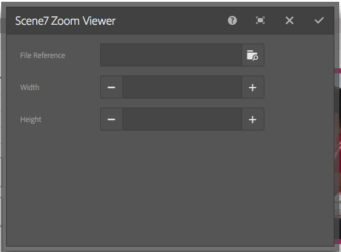

# Adding Dynamic Media Classic features to your page{#adding-scene-features-to-your-page}

[Adobe Dynamic Media Classic](https://help.adobe.com/en_US/scene7/using/WS26AB0D9A-F51C-464e-88C8-580A5A82F810.html) is a hosted solution for managing, enhancing, publishing, and delivering rich media assets to Web, mobile, email, and Internet-connected displays and print.

You can view AEM assets published in Dynamic Media Classic in various viewers:

* Zoom
* Flyout
* Video
* Image Template
* Image

You can publish digital assets directly from AEM to Dynamic Media Classic and you can publish digital assets from Dynamic Media Classic to AEM.  

This section describes how to publish digital assets from AEM to Dynamic Media Classic and vice versa. Viewers are also described in detail. For information on configuring AEM for Dynamic Media Classic, see [Integrating Dynamic Media Classic with AEM](/help/sites-administering/scene7.md).  

See also [Adding Image Maps](/help/assets/image-maps.md).  

For more information on using video components with AEM, see the following:

* [Video](/help/sites-classic-ui-authoring/manage-assets-classic-s7-video.md)

>[!NOTE]
>
>If Dynamic Media Classic assets do not display properly, make sure that Dynamic media is [disabled](/help/assets/config-dynamic.md#disabling-dynamic-media) and then refresh the page.

## Manually publishing to Dynamic Media Classic from Assets {#manually-publishing-to-scene-from-assets}

You can publish digital assets to Dynamic Media Classic either from the Assets console in the classic UI or directly from the asset.

>[!NOTE]
>
>AEM publishes to Dynamic Media Classic asynchronously. After you click **[!UICONTROL Publish]**, it may take several seconds for your asset to publish to Dynamic Media Classic.
>

### Publishing from the Assets console {#publishing-from-the-assets-console}

To publish to Dynamic Media Classic from the Assets console if the assets are in a Dynamic Media Classic target folder:

1. In the AEM classic UI, click **[!UICONTROL Digital Assets]** to access the digital asset manager.  

1. Select the asset (or assets) or folder from within the target folder you want to publish to Dynamic Media Classic and right-click and select **[!UICONTROL Publish to Dynamic Media Classic]**. Alternatively, you can select **[!UICONTROL Publish to Dynamic Media Classic]** from the **[!UICONTROL Tools] menuu.

   

1. Go to Dynamic Media Classic and confirm that the assets are available.

   >[!NOTE]
   >
   >If the assets are not in a Dynamic Media Classic synchronized folder, **[!UICONTROL Publish to Dynamic Media Classic]** in both menus is visible but disabled.

### Publishing from an asset {#publishing-from-an-asset}

You can manually publish an asset as long as that asset is located inside the synchronized Dynamic Media Classic folder.

>[!NOTE]
>
>If the asset is not located in the Dynamic Media Classic synchronized folder, the link to **[!UICONTROL Publish to Dynamic Media Classic]** is not available.

**To publish to Dynamic Media Classic directly from a digital asset**:

1. In AEM, click **[!UICONTROL Digital Assets]** to access the digital asset manager.  

1. Double-click to open an asset.  

1. In the asset details pane, select **[!UICONTROL Publish to Dynamic Media Classic]**.

   

1. The link changes to **[!UICONTROL Publishing ...]** and then **[!UICONTROL Published]**. Go to Dynamic Media Classic and confirm that the asset is available.

   >[!NOTE]
   >
   >If the asset does not publish properly to Dynamic Media Classic, the link changes to **[!UICONTROL Publishing Failed]**. If the asset has already been published to Dynamic Media Classic, the link reads **[!UICONTROL Re-Publish to Dynamic Media Classic]**. Republishing lets you make changes to an asset in AEM and re-publish them.

### Publishing assets from outside the CQ target folder {#publishing-assets-from-outside-the-cq-target-folder}

Adobe recommends that you publish assets to Dynamic Media Classic only from assets within the Dynamic Media Classic target folder. However, if you need to upload assets from a folder outside of the target folder, you can still do that by uploading them to an *ad-hoc* folder on Dynamic Media Classic.

You do this by configuring the Cloud configuration for the page where the asset will appear. You then add a Dynamic Media Classic component to the page and drag and drop an asset on the component. After the page properties are set for that page, a **[!UICONTROL Publish to Dynamic Media Classic]** link appears that when selected triggers uploading to Dynamic Media Classic.

>[!NOTE]
>
>Assets that are in the ad-hoc folder do not appear in the Dynamic Media Classic content browser.

**To publish assets that reside outside the CQ target folder**:

1. In AEM in the classic UI, click **[!UICONTROL Websites]** and navigate to the web page that you want to add a digital asset to that is not yet published to Dynamic Media Classic. (Normal page inheritance rules apply.)  

1. In the sidekick, click the **[!UICONTROL Page]** icon, then click **[!UICONTROL Page Properties]**.  

1. Click **[!UICONTROL Cloud Services > Add services > Dynamic Media Classic (Scene7)**.
1. In the Adobe Dynamic Media Classic drop-down list, select the desired configuration, then click **[!UICONTROL OK]**.

   

1. On the web page, add a Dynamic Media Classic (Scene7) component to the desired location on the page.
1. From the content finder, drag a digital asset to the component. You see a link to **[!UICONTROL Check Dynamic Media Classic Publication Status]**.

   >[!NOTE]
   >
   >If the digital asset is in the CQ target folder, then no link to **[!UICONTROL Check Dynamic Media Classic Publication Status]** appears. The assets is simply placed in the component.

   

1. Click **[!UICONTROL Check Dynamic Media Classic Publication Status]**. If the asset is not published, AEM publishes the asset to Dynamic Media Classic. After it is uploaded, the asset is located in the ad-hoc folder. By default, the ad-hoc folder is located in the `name_of_the_company/CQ5_adhoc`. You can [configure this, if needed](#configuringtheadhocfolder).

   >[!NOTE]
   >
   >If the asset is not in a Dynamic Media Classic synchronized folder and there is no Dynamic Media Classic cloud configuration associated to the current page, the upload will fail.

## Dynamic Media Classic (Scene7) components {#scene-components}

The following Dynamic Media Classic components are available in AEM:

* Zoom
* Flyout (Zoom)
* Image Template
* Image
* Video

>[!NOTE]
>
>These components are not available by default and need to be selected in **[!UICONTROL Design]** mode before using.

After they are made available in **[!UICONTROL Design]** mode, you can add the components to your page like any other AEM component. Assets that have not yet been published to Dynamic Media Classic are published to Dynamic Media Classic if in a synchronized folder or on a page or with a Dynamic Media Classic cloud configuration.

### Flash viewers end-of-life notice {#flash-viewers-end-of-life-notice}

Effective January 31, 2017, Adobe Dynamic Media Classic officially ended support for the Flash viewer platform.

For more information about this important change, see [Flash viewer end-of-life FAQs](https://docs.adobe.com/content/docs/en/aem/6-1/administer/integration/marketing-cloud/scene7/flash-eol.html).

### Adding a Dynamic Media Classic component to a page {#adding-a-scene-component-to-a-page}

Adding a Dynamic Media Classic component to a page is the same as adding a component to any page. Dynamic Media Classic components are described in detail in the following sections.

**To add a Dynamic Media Classic component/viewer to a page in the classic UI**:

1. In AEM, open the page where you want to add the Dynamic Media Classic component.  

1. If no Dynamic Media Classic components are available, click the ruler in the sidekick to enter **[!UICONTROL Design]** mode, click **[!UICONTROL Edit]** parsys, and select all the **[!UICONTROL Dynamic Media Classic]** components to make them available.  

1. Return to **[!UICONTROL Edit]** mode by clicking the pencil in the sidekick.  

1. Drag a component from the **[!UICONTROL Dynamic Media Classic]** group in the sidekick onto the page in the desired location.  

1. Click **[!UICONTROL Edit]** to open the component.  

1. Edit the component as necessary and click **[!UICONTROL OK]** to save changes.

### Adding interactive viewing experiences to a responsive website {#adding-interactive-viewing-experiences-to-a-responsive-website}

Responsive design for your assets means that your assets adapts depending on where it is displayed. With responsive design, the same assets are effectively displayed on multiple devices.

**To add an interactive viewing experience to a responsive site in the classic UI**:

1. Log in to AEM, and ensure that you have [configured Adobe Dynamic Media Classic Cloud Services](/help/sites-administering/scene7.md#configuring-scene-integration) and that Dynamic Media Classic components are available.

   >[!NOTE]
   >
   >If Dynamic Media Classic WCM components are not available, be sure to enable them by way of the **[!UICONTROL Design] mode.

1. In a website with the Dynamic Media Classic components enabled, drag an **[!UICONTROL Image]** viewer to the page.
1. Edit the component and adjust the breakpoints in the **[!UICONTROL Dynamic Media Classic Settings]** tab.

   

1. Confirm that the viewers are responsively resizing and that all interactions are optimized for desktop, tablet, and mobile.

### Settings common to all Dynamic Media Classic components {#settings-common-to-all-scene-components}

Although configuration options vary, the following are common to all Dynamic Media Classic components:

* **[!UICONTROL File Reference]** - Browse to a file that you want to reference. File reference shows the asset URL and not necessarily the full Dynamic Media Classic URL including the URL commands and parameters. You cannot add Dynamic Media Classic URL commands and parameters in this field. They have to be added through the corresponding functionality in the component.
* **[!UICONTROL Width]** - Lets you set the width.
* **[!UICONTROL Height]** - Lets you set the height.

You set these configuration options by double-clicking a Dynamic Media Classic component, for example, when you open a **[!UICONTROL Zoom]** component:

 

### Zoom {#zoom}

The HTML5 Zoom component displays a larger image when you press the + button.

The asset has zoom tools at the bottom. Click **[!UICONTROL +]** to enlarge. Click **[!UICONTROL -]** to reduce. Clicking **[!UICONTROL x]** or the reset zoom arrow brings the image back to the original size it was imported as. Click the diagonal arrows to make it full screen. Click **[!UICONTROL Edit]** to configure the component. With this component, you can configure [settings common to all Dynamic Media Classic components](#settings-common-to-all-scene-components).

 

### Flyout {#flyout}

In the HTML5 Flyout component, the asset is shown as split screen; left the asset in the specified size; right the zoom portion is displayed. Click **[!UICONTROL Edit]** to configure the component. With this component, you can configure [settings common to all Dynamic Media Classic components](/help/sites-administering/scene7.md#settingscommontoalldynamicmediaclassiccomponents).

>[!NOTE]
>
>If your Flyout component uses a custom size, then that custom size is used and responsive setup of the component is disabled.
>
>If your Flyout component uses the default size, as set in the [!UICONTROL Design] view, then the default size is used and the component stretches to accomodate the page layout size with responsive setup of the component enabled. Be aware, however, that there is a limitation on responsive setup of the component. When the you use the Flyout component with responsive setup, you should not use it with full page stretch. Otherwise, the Flyout may extend beyond the page's right border.

 

### Image {#image}

The Dynamic Media Classic Image component lets you add Dynamic Media Classic functionality to your images, such as Dynamic Media Classic modifiers, image or viewer presets, and sharpening. The Dynamic Media Classic image component is similar to other image components in AEM with special Dynamic Media Classic functionality. In this example, the image has the Dynamic Media Classic URL modifier, `&op_invert=1` applied.

**[!UICONTROL Title, Alt Text]** - In the [!UICONTROL Advanced] tab, add a title to the image and alt text for those users who have graphics turned off.

**[!UICONTROL URL, Open in]** - You can set an asset from to open a link. Set the **[!UICONTROL URL]** and **[!UICONTROL Open in]** to indicate whether you want it to open in the same window or a new window.

**[!UICONTROL Viewer preset]** - Select an existing viewer preset from the drop-down menu. If the viewer preset you are looking for is not visible, you may need to make it visible. See [Managing Viewer Presets](/help/assets/managing-viewer-presets.md). You cannot select a viewer preset if you are using an image preset and vice versa.

**[!UICONTROL Dynamic Media Classic Configuration]** - Select the Dynamic Media Classic configuration you want to use to fetch active image presets from the Scene7 Publishing System.

**[!UICONTROL Image preset]** - Select an existing image preset from the drop-down menu. If the image preset you are looking for is not visible, you may need to make it visible. See [Managing Image Presets](/help/assets/managing-image-presets.md). You cannot select a viewer preset if you are using an image preset and vice versa.

**[!UICONTROL Output Format]** - Select the output format of the image, for example jpeg. Depending on the output format you select, you may have additional configuration options. See [Managing Image Presets](/help/assets/managing-image-presets.md).

**[!UICONTROL Sharpening]** - Select how you want to sharpen the image. Sharpening is explained in detail in [*Adobe Dynamic Media Classic Image Quality and Sharpening Best Practices*](https://marketing.adobe.com/resources/help/en_US/s7/sharpening/s7_sharpening_images.pdf).

**[!UICONTROL URL Modifiers]** - You can change image effects by supplying additional Dynamic Media Classic image commands. These are described in [Managing Image Presets](/help/assets/managing-image-presets.md) and the [Command reference](https://marketing.adobe.com/resources/help/en_US/s7/is_ir_api/is_api/http_ref/c_command_reference.html).

**[!UICONTROL Breakpoints]** - If your website is responsive, you want to adjust the breakpoints. Breakpoints must be separated by commas `,`.

### Image Template {#image-template}

[Dynamic Media Classic Image Templates](https://help.adobe.com/en_US/scene7/using/WS60B68844-9054-4099-BF69-3DC998A04D3C.html) are layered Photoshop content that was imported to Dynamic Media Classic, where content and properties were parameterized for variability. The **[!UICONTROL Image template]** component lets you import images and change the text dynamically in AEM. In addition, you can configure the **[!UICONTROL Image template]** component to use values from client context, so that each user experiences the image in a personalized way.

Click **[!UICONTROL Edit]** to configure the component. You can configure [settings common to all Dynamic Media Classic components](/help/sites-administering/scene7.md#settingscommontoalldynamicmediaclassicscomponents) as well as other settings described in this section.

**[!UICONTROL File Reference, Width, Height]** - See settings common to all Dynamic Media Classic components.

>[!NOTE]
>
>Dynamic Media Classic URL commands and parameters cannot be added to the File Reference URL directly. They can only be defined in the component UI in the **[!UICONTROL Parameter]** panel.

**[!UICONTROL Title, Alt Text]** In the [!UICONTROL Dynamic Media Classic Image Template] tab, add a title to the image and alt text for those users who have graphics turned off.

**[!UICONTROL URL, Open in]** You can set an asset from to open a link. Set the **[!UICONTROL URL]** and in **[!UICONTROL Open in]** indicate whether you want it to open in the same window or a new window.

**[!UICONTROL Parameter Panel]** When importing an image, the parameters are pre-populated with information from the image. If there is no content that can be dynamically changed, this window is empty.

 

#### Changing text dynamically {#changing-text-dynamically}

To change the text dynamically, enter new text in the fields and click **[!UICONTROL OK]**. In this example, the **[!UICONTROL Price]** is now $50 and shipping is 99 cents.

The text in the image changes. You can reset the text back to the original value by clicking **[!UICONTROL Reset]** next to the field.

 

#### Changing text to reflect the value of a client context value {#changing-text-to-reflect-the-value-of-a-client-context-value}

To link a field to a client context value, click **[!UICONTROL Select]** to open the client-context menu, select the client context, and click **[!UICONTROL OK]**. In this example, the name changes based on linking the Name with the formatted name in the profile.

The text reflects the name of the currently logged in user. You can reset the text back to the original value by clicking **[!UICONTROL Reset]** next to the field.

 

#### Making the Dynamic Media Classic image template a link {#making-the-scene-image-template-a-link}

**To make the Dynamic Media Classic image template a link**:

1. On the page with the Dynamic Media Classic image template component, click **[!UICONTROL Edit]**.
1. In the **[!UICONTROL URL]** field, enter the URL that users go to when the image is clicked. In the **[!UICONTROL Open in]** field, select whether you want the target to open (a new window or same window). 

   

1. Click **[!UICONTROL OK]**.

### Video component {#video-component}

The Dynamic Media Classic **[!UICONTROL Video]** component (available from the Dynamic Media Classic section of the sidekick) uses device and bandwidth detection to serve the right video to each screen. This component is an HTML5 video player; it is a single viewer that can be used cross channel.

It can be used for adaptive video sets, a single MP4 video, or a single F4V video.

See [Video](/help/sites-classic-ui-authoring/manage-assets-classic-s7-video.md) for more information on how videos work with Dynamic Media Classic integration. In addition, see how [the **Dynamic Media Classic video** component compares to the foundation **video** component](/help/sites-classic-ui-authoring/manage-assets-classic-s7-video.md). 

 

### Known limitations for the video component {#known-limitations-for-the-video-component}

Adobe DAM and WCM shows if a master video is uploaded. They do not show these proxy assets:

* Dynamic Media Classic encoded renditions
* Dynamic Media Classic adaptive video sets

When using an adaptive video set with the Dynamic Media Classic video component, you must resize the component to fit the dimensions of the video.

## Dynamic Media Classic content browser {#scene-content-browser}

The Dynamic Media Classic content browser lets you view content from Dynamic Media Classic directly in AEM. To access the content browser, in the Content Finder, select **[!UICONTROL Dynamic Media Classic]** in the touch-optimized user interface or the **[!UICONTROL S7]** icon in the classic user interface. Functionality is identical between both user interfaces.

If you have multiple configurations, AEM by default displays the [default configuration](/help/sites-administering/scene7.md#configuring-a-default-configuration). You can select different configurations directly in the Dynamic Media Classic content browser in the drop-down menu.

>[!NOTE]
>
>* Assets located in the ad-hoc folder do not appear in the Dynamic Media Classic content browser.
>* When [Secure Preview is enabled](/help/sites-administering/scene7.md#configuring-the-state-published-unpublished-of-assets-pushed-to-scene), both published and unpublished assets on Dynamic Media Classic do appear in the Dynamic Media Classic content browser.
>* If you do not see **[!UICONTROL Dynamic Media Classic]** or the **[!UICONTROL S7]** icon as an option in the content browser, you need to [configure Dynamic Media Classic to work with AEM](/help/sites-administering/scene7.md).
>
>* For video, the Dynamic Media Classic content browser supports: 
>
>* Adaptive Video Sets: container of all video renditions needed for seamless playback across multiple screens
>* Single MP4 video
>* Single F4V video

### Browsing content in the classic UI {#browsing-content-in-the-classic-ui}

Browse content in Dynamic Media Classic by clicking the **[!UICONTROL S7]** tab.

You can change the configuration you are accessing by selecting the configuration. The folders change depending on which configuration you select.

As with the content finder for Assets, you can search for assets and filter results. However, unlike the Assets finder, when entering a keyword in the **[!UICONTROL S7]** tab, the file name *starts with* the string that you entered, rather than *containing* the keyword in the file name.

By default, assets are displayed by file name. You can also filter results by asset type.

>[!NOTE]
>
>For video, the Dynamic Media Classic content browser of WCM supports:
>
>* Adaptive Video Sets: container of all video renditions needed for seamless playback across multiple screens
>* Single MP4 video
>* Single F4V video
>

### Searching for Dynamic Media Classic assets with the content browser {#searching-for-scene-assets-with-the-content-browser}

Searching for Dynamic Media Classic assets is similar to searching AEM assets except that when you search you are actually seeing a remote view of the assets in the Dynamic Media Classic system, rather than importing them directly into AEM.

You can use either the classic UI or the touch-optimized UI to both view and search for assets. Depending on the interface, how you search is slightly different.

When searching in either UI, you can filter by the following criteria (shown here in the touch-optimized UI):

**[!UICONTROL Enter keywords]** - You can search assets by name. When searching the keywords you enter is what the file name starts with. For example, typing the word "swimming" would look for any asset file names that start with those letters in that order. Be sure to click enter after you type the term to find the asset.

**[!UICONTROL Folder/path]** - The name of the folder that appears is based on the configuration you have selected. You can drill down to lower levels by clicking the folder icon and selecting a sub-folder, then clicking the checkmark to select it.

If you enter a keyword and select a folder, AEM searches that folder and any sub-folders. However, if you do not enter any keywords when searching, selecting the folder will only show the assets in that folder and will not include any subfolders.

By default, AEM searches the folder selected and all sub-folders.

**[!UICONTROL Type of Asset]** Select Dynamic Media Classic to browse Dynamic Media Classic content. This option is only available if you have already configured Dynamic Media Classic.

**[!UICONTROL Configuration]** If you have more than one Dynamic Media Classic configuration defined in [!UICONTROL Cloud Services], you can select it here. As a result the folder will change based on the configuration you have chosen.

**[!UICONTROL Asset type]** Within the Dynamic Media Classic browser, you can filter results to include any of the following: images, templates, videos, and adaptive video sets. If you do not select any asset type, AEM by default searches all asset types.

>[!NOTE]
>
>* When searching video, you are searching a single rendition. Results return the original rendition (only &ast;.mp4) and the encoded rendition.
>* When searching an adaptive video set, you are searching the the folder and all sub-folders but only if you have added a keyword to the search. If you have not added a keyword, AEM does not search the sub-folders.
>

**[!UICONTROL Publish Status]** You can filter for assets based on publication status: [!UICONTROL Published] or [!UICONTROL Unpublished]. If you do not select any [!UICONTROL Publish status], AEM by default searches all publish statuses.

