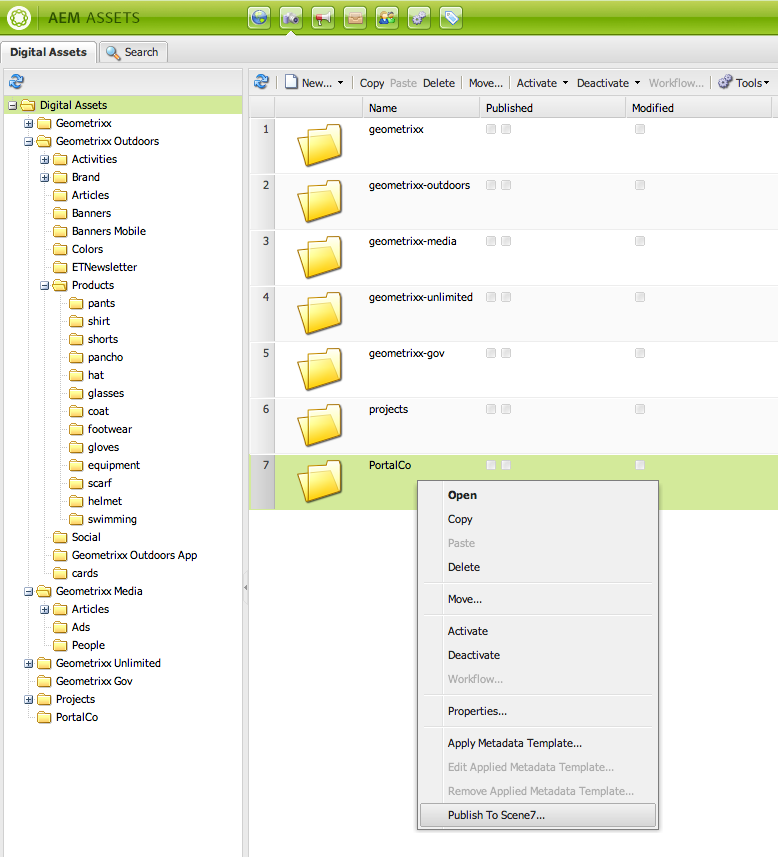
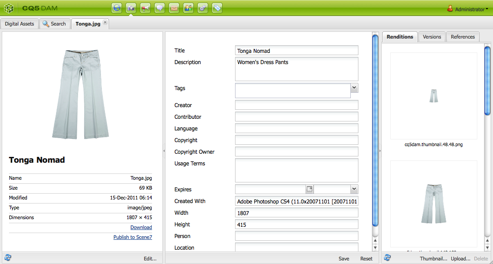
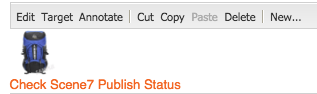
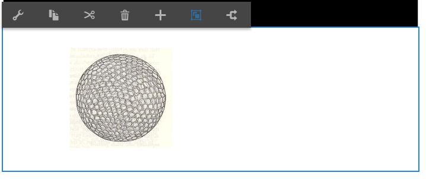
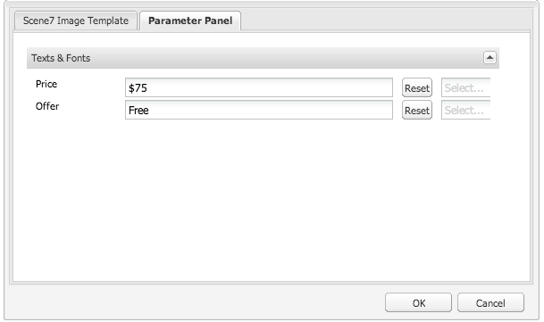
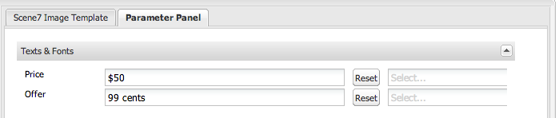
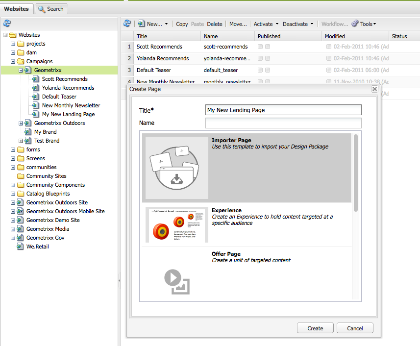
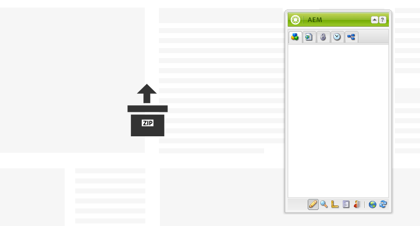
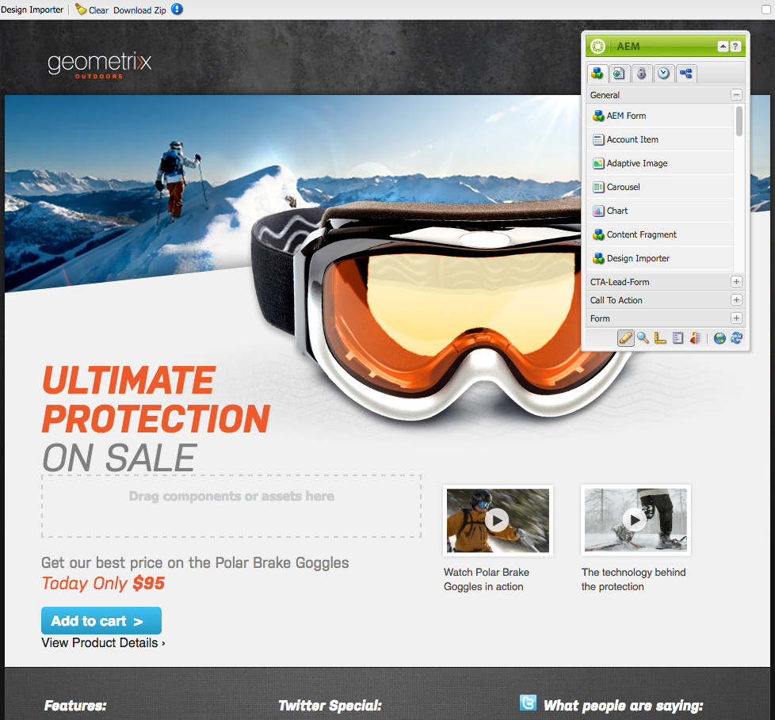
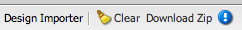

# Add Dynamic Media Classic (Scene7) features to your page{#adding-scene-features-to-your-page}

[Adobe Dynamic Media Classic (Scene7)](https://experienceleague.adobe.com/docs/dynamic-media-classic/using/home.html) is a hosted solution for managing, enhancing, publishing, and delivering rich media assets to Web, mobile, email, and Internet-connected displays and print.

You can view Experience Manager assets published in Dynamic Media Classic (Scene7) in various viewers:

* Zoom
* Flyout
* Video
* Image Template
* Image

You can publish digital assets directly from Experience Manager to Dynamic Media Classic (Scene7) and you can publish digital assets from Dynamic Media Classic (Scene7) to Experience Manager.

This document describes how to publish digital assets from Experience Manager to Dynamic Media Classic (Scene7) and conversely. Viewers are also described in detail. For information on configuring Experience Manager for Dynamic Media Classic (Scene7), see [Integrating Dynamic Media Classic (Scene7) with Experience Manager](/help/sites-administering/scene7.md).

See also [Add Image Maps](/help/assets/image-maps.md).

For more information on using video components with Experience Manager, see the following:

* [Video](/help/sites-classic-ui-authoring/manage-assets-classic-s7-video.md)

>[!NOTE]
>
>If Dynamic Media Classic (Scene7) assets do not display properly, make sure that Dynamic Media is [disabled](/help/assets/config-dynamic.md#disabling-dynamic-media) and then refresh the page.

## Manually publishing to Dynamic Media Classic (Scene7) from Assets {#manually-publishing-to-scene-from-assets}

You can publish digital assets to Dynamic Media Classic (Scene7) either from the Assets console in the classic UI or directly from the asset.

>[!NOTE]
>
>Experience Manager publishes to Dynamic Media Classic (Scene7) asynchronously. After you select **[!UICONTROL Publish]**, it may take several seconds for your asset to publish to Dynamic Media Classic (Scene7).
>

### Publishing from the Assets console {#publishing-from-the-assets-console}

You can publish to Dynamic Media Classic (Scene7) from the Assets console if the assets are in a Dynamic Media Classic (Scene7) target folder.

1. In the Experience Manager classic UI, select **[!UICONTROL Digital Assets]** to access the digital asset manager.

1. Select the asset (or assets) or folder from within the target folder that you want to publish to Dynamic Media Classic (Scene7) and right-click and select **[!UICONTROL Publish to Dynamic Media Classic (Scene7)]**. Alternatively, you can select **[!UICONTROL Publish to Dynamic Media Classic (Scene7)]** from the **[!UICONTROL Tools]** menu.

   

1. Go to Dynamic Media Classic (Scene7) and confirm that the assets are available.

   >[!NOTE]
   >
   >If the assets are not in a Dynamic Media Classic (Scene7) synchronized folder, **[!UICONTROL Publish to Dynamic Media Classic (Scene7)]** in both menus is visible but disabled.

### Publish from an asset {#publishing-from-an-asset}

You can manually publish an asset as long as that asset is located inside the synchronized Dynamic Media Classic (Scene7) folder.

>[!NOTE]
>
>If the asset is not in the Dynamic Media Classic (Scene7) synchronized folder, the link to **[!UICONTROL Publish to Dynamic Media Classic (Scene7)]** does not appear.

To publish to Dynamic Media Classic (Scene7) directly from a digital asset:

1. In Experience Manager, select **[!UICONTROL Digital Assets]** to access the digital asset manager.

1. Double-click to open an asset.

1. In the asset details pane, select **[!UICONTROL Publish to Dynamic Media Classic (Scene7)]**.

   

1. The link changes to **[!UICONTROL Publishing ...]** and then **[!UICONTROL Published]**. Go to Dynamic Media Classic (Scene7) and confirm that the asset is available.

   >[!NOTE]
   >
   >If the asset does not publish properly to Dynamic Media Classic (Scene7), the link changes to **[!UICONTROL Publishing Failed]**. If the asset has already been published to Dynamic Media Classic (Scene7), the link reads **[!UICONTROL Re-Publish to Dynamic Media Classic (Scene7)]**. Republishing lets you change assets in Experience Manager and republish them.

### Publish assets from outside the CQ target folder {#publishing-assets-from-outside-the-cq-target-folder}

Adobe recommends that you publish assets to Dynamic Media Classic (Scene7) only from assets within the Dynamic Media Classic (Scene7) target folder. However, if you must upload assets from a folder outside of the target folder, you can still do that by uploading them to an on-demand folder on Dynamic Media Classic (Scene7). First, configure the Cloud configuration for the page where you want the asset to appear. You then add a Dynamic Media Classic (Scene7) component to the page and drag and drop an asset on the component. After the page properties are set for that page, a **[!UICONTROL Publish to Dynamic Media Classic (Scene7)]** link appears that when selected triggers uploading to Dynamic Media Classic (Scene7).

>[!NOTE]
>
>Assets that are in the on-demand folder do not appear in the Dynamic Media Classic (Scene7) Content Browser.

**To publish assets from outside the CQ target folder:**

1. In Experience Manager in the classic UI, select **[!UICONTROL Websites]** and navigate to the web page that you want to add a digital asset to that is not yet published to Dynamic Media Classic (Scene7). (Normal page inheritance rules apply.)

1. In the sidekick, select the **[!UICONTROL Page]** icon and select **[!UICONTROL Page Properties]**.

1. Select **[!UICONTROL Cloud Services]**.
1. Select **[!UICONTROL Add services]**.
1. Select **[!UICONTROL Dynamic Media Classic (Scene7)]**.
1. In the **[!UICONTROL Adobe Dynamic Media Classic (Scene7)]** drop-down list, select the desired configuration and select **[!UICONTROL OK]**.

   

1. On the web page, add a Dynamic Media Classic (Scene7) component to the desired location on the page.
1. From the content finder, drag a digital asset to the component. You see a link to **[!UICONTROL Check Dynamic Media Classic (Scene7) Publication Status]**.

   >[!NOTE]
   >
   >If the digital asset is in the CQ target folder, then no link to **[!UICONTROL Check Dynamic Media Classic (Scene7) Publication Status]** appears. The assets are placed in the component.

   

1. Select **[!UICONTROL Check Dynamic Media Classic (Scene7) Publication Status]**. If the assets are not published, Experience Manager publishes the asset to Dynamic Media Classic (Scene7). After it is uploaded, the asset is found in the on-demand folder. By default, the on-demand folder is in the **[!UICONTROL name_of_the_company/CQ5_adhoc]**. You can [configure the on-demand folder, if needed](#configuringtheadhocfolder).

   >[!NOTE]
   >
   >If the asset is not in a Dynamic Media Classic (Scene7) synchronized folder and there is no Dynamic Media Classic (Scene7) cloud configuration associated to the current page, the upload fails.

## Dynamic Media Classic (Scene7) Components {#scene-components}

The following Dynamic Media Classic (Scene7) components are available in Experience Manager:

* Zoom
* Flyout (Zoom)
* Image Template
* Image
* Video

>[!NOTE]
>
>These components are not available by default and must be selected in Design mode before using.

After they are made available in Design mode, you can add the components to your page like any other Experience Manager component. Assets that are not yet published to Dynamic Media Classic (Scene7) are published to Dynamic Media Classic (Scene7) if in a synchronized folder or on a page or with a Dynamic Media Classic (Scene7) Cloud Configuration.

>[!NOTE]
>
>If you are creating and developing custom S7 viewers and using the Content Finder, you must explicitly add the `allowfullscreen` parameter.

### Flash Viewers End-of-Life Notice {#flash-viewers-end-of-life-notice}

Effective January 31, 2017, Adobe Dynamic Media Classic (Scene7) officially ended support for the Flash viewer platform.

### Add a Dynamic Media Classic (Scene7) component to a page {#adding-a-scene-component-to-a-page}

Adding a Dynamic Media Classic (Scene7) component to a page is the same as adding a component to any page. Dynamic Media Classic (Scene7) components are described in detail in the following sections.

To add a Dynamic Media Classic (Scene7) component/viewer to a page in the classic UI:

1. In Experience Manager, open the page where you want to add the Dynamic Media Classic (Scene7) component.

1. If no Dynamic Media Classic (Scene7) components are available, select the ruler in the sidekick to enter **Design** mode, select **[!UICONTROL Edit]** parsys, and select all the **[!UICONTROL Dynamic Media Classic (Scene7)]** components to make them available.

1. Return to **Edit** mode by selecting the pencil in the sidekick.

1. Drag a component from the **[!UICONTROL Dynamic Media Classic (Scene7)]** group in the sidekick onto the page in the desired location.

1. Select ***[!UICONTROL Edit]** so you can open the component.

1. Edit the component as necessary and select **[!UICONTROL OK]** to save changes.

### Add interactive viewing experiences to a responsive website {#adding-interactive-viewing-experiences-to-a-responsive-website}

Responsive design for your assets means that your assets adapt depending on where it is displayed. With responsive design, the same assets can be effectively displayed on multiple devices.

To add an interactive viewing experience to a responsive site in the classic UI:

1. Log in to Experience Manager, and ensure that you have [configured Adobe Dynamic Media Classic (Scene7) Cloud Services](/help/sites-administering/scene7.md#configuring-scene-integration) and that Dynamic Media Classic (Scene7) components are available.

   >[!NOTE]
   >
   >If Dynamic Media Classic (Scene7) WCM components are not available, be sure to enable them via Design mode.

1. In a website with the Dynamic Media Classic (Scene7) components enabled, drag an **[!UICONTROL Image]** viewer to the page.
1. Edit the component and adjust the breakpoints in the **[!UICONTROL Dynamic Media Classic (Scene7) Settings]** tab.

   

1. Confirm that the viewers are responsively resizing and that all interactions are optimized for desktop, tablet, and mobile.

### Settings common to all Dynamic Media Classic (Scene7) components {#settings-common-to-all-scene-components}

Although configuration options vary, the following are common to all Dynamic Media Classic (Scene7) components:

* **File Reference**- Browse to a file that you want to reference. File reference shows the asset URL and not necessarily the full Dynamic Media Classic (Scene7) URL including the URL commands and parameters. You cannot add Dynamic Media Classic (Scene7) URL commands and parameters in this field. Instead, they must be added through the corresponding functionality in the component.
* **Width** - Lets you set the width.
* **Height** - Lets you set the height.

You set these configuration options by opening (double-clicking) a Dynamic Media Classic (Scene7) component, for example, when you open a **Zoom** component:

### Zoom {#zoom}

The HTML5 Zoom component displays a larger image when you press the + button.

The asset has zoom tools at the bottom. Select **[!UICONTROL +]** to enlarge. Select **[!UICONTROL -]** to reduce. Selecting the **[!UICONTROL x]** or the reset zoom arrow brings the image back to the original size that it was imported as. Select the diagonal arrows so you can make it full screen. Select **[!UICONTROL Edit]** so you can configure the component. With this component, you can configure [settings common to all Dynamic Media Classic (Scene7) components](#settings-common-to-all-scene-components).

### Flyout {#flyout}

In the HTML5 Flyout component, the asset is shown as split screen; left the asset in the specified size; right the zoom portion is displayed. Select **[!UICONTROL Edit]** so you can configure the component. With this component, you can configure [settings common to all Dynamic Media Classic (Scene7) components](/help/sites-administering/scene7.md#settingscommontoallscene7components).

>[!NOTE]
>
>If your Flyout component uses a custom size, then that custom size is used and responsive setup of the component is disabled.
>
>If your Flyout component uses the default size, as set in the Design view, then the default size is used. The component stretches to accommodate the page layout size with responsive setup of the component enabled. Be aware, however, that there is a limitation on responsive setup of the component. When you use the Flyout component with responsive setup, you should not use it with full page stretch. Otherwise, the Flyout may extend beyond the page's right border.

### Image {#image}

The Dynamic Media Classic (Scene7) Image component lets you add Dynamic Media Classic (Scene7) functionality to your images, such as Dynamic Media Classic (Scene7) modifiers, image or viewer presets, and sharpening. The Dynamic Media Classic (Scene7) image component is similar to other image components in Experience Manager with special Dynamic Media Classic (Scene7) functionality. In this example, the image has the Dynamic Media Classic (Scene7) URL modifier, `&op_invert=1` applied.

**Title, Alt Text** - In the Advanced tab, add a title to the image and alt text for those users who have graphics turned off.

**URL, Open in** - You can set an asset from to open a link. Set the URL and in Open in indicate whether you want it to open in the same window or a new window.

**Viewer preset** - Select an existing viewer preset from the drop-down menu. If the viewer preset you are looking for is not visible, you must make it visible. See Managing Viewer Presets. You cannot select a viewer preset if you are using an image preset and conversely.

**Dynamic Media Classic (Scene7) Configuration** - Select the Dynamic Media Classic (Scene7) configuration that you want to use to fetch active image presets from the SPS.

**Image preset** - Select an existing image preset from the drop-down menu. If the image preset you are looking for is not visible, you must make it visible. See Managing Image Presets. You cannot select a viewer preset if you are using an image preset and conversely.

**Output Format** - Select the output format of the image, for example jpeg. Depending on the output format you select, you may have additional configuration options. See Image Preset best practices.

**Sharpening** - Select how you want to sharpen the image. Sharpening is explained in detail in Image Preset best practices and Sharpening best practices.

**URL Modifiers** - You can change image effects by supplying additional S7 image commands. These commands are described in Image Presets and the Command reference.

**Breakpoints** - If your website is responsive, you want to adjust the breakpoints. Breakpoints must be separated by commas (,).

### Image Template {#image-template}

Dynamic Media Classic (Scene7) Image Templates are layered Photoshop content that was imported to Dynamic Media Classic (Scene7), where content and properties were parameterized for variability. The **[!UICONTROL Image template]** component lets you import images and change the text dynamically in Experience Manager. In addition, you can configure the **[!UICONTROL Image template]** component to use values from client context, so that each user experiences the image in a personalized way.

Select **[!UICONTROL Edit]** - to configure the component. You can configure [settings common to all Dynamic Media Classic (Scene7) components](/help/sites-administering/scene7.md#settingscommontoallscene7components) and other settings described in this section.

**File Reference, Width, Height** - See [settings common to all Dynamic Media Classic (Scene7) components](/help/sites-administering/scene7.md#settingscommontoallscene7components).

>[!NOTE]
>
>Dynamic Media Classic (Scene7) URL commands and parameters cannot be added to the File Reference URL directly. They can only be defined in the component UI in the **[!UICONTROL Parameter]** panel.

**Title, Alt Text** - In the Dynamic Media Classic (Scene7) Image Template tab, add a title to the image and alt text for those users who have graphics turned off.

**URL, Open in** - You can set an asset from to open a link. Set the URL and in Open in indicate whether you want it to open in the same window or a new window.

**Parameter Panel** - When importing an image, the parameters are pre-populated with information from the image. If there is no content that can be dynamically changed, this window is empty.

#### Changing text dynamically {#changing-text-dynamically}

To change the text dynamically, enter new text in the fields and select **[!UICONTROL OK]**. In this example, the **Price** is now $50 and shipping is 99 cents.

The text in the image changes. You can reset the text back to the original value by selecting **[!UICONTROL Reset]** next to the field.

#### Change text to reflect the value of a client context value {#changing-text-to-reflect-the-value-of-a-client-context-value}

To link a field to a client context value, select **[!UICONTROL Select]** to open the client-context menu, select the client context, and select **[!UICONTROL OK]**. In this example, the name changes based on linking the Name with the formatted name in the profile.

The text reflects the name of the currently logged in user. You can reset the text back to the original value by selecting **[!UICONTROL Reset]** next to the field.

#### Make the Dynamic Media Classic (Scene7) image template a link {#making-the-scene-image-template-a-link}

You can make the Dynamic Media Classic (Scene7) image template component a clickable link.

1. On the page with the Dynamic Media Classic (Scene7) image template component, select **[!UICONTROL Edit]**.
1. In the **[!UICONTROL URL]** field, enter the URL that users go to when the image is clicked. In the **[!UICONTROL Open in]** field, select whether you want the target to open (a new window or same window).

   

1. Select **[!UICONTROL OK]**.

### Video component {#video-component}

The Dynamic Media Classic (Scene7) **[!UICONTROL Video]** component (available from the Dynamic Media Classic (Scene7) section of the sidekick) uses device and bandwidth detection to serve the right video to each screen. This component is an HTML5 video player; it is a single viewer that can be used cross channel.

It can be used for adaptive video sets, a single MP4 video, or a single F4V video.

See [Video](/help/sites-classic-ui-authoring/manage-assets-classic-s7-video.md) for more information on how videos work with Dynamic Media Classic (Scene7) integration. In addition, see how [the **Dynamic Media Classic (Scene7) video** component compares to the foundation **video** component](/help/sites-classic-ui-authoring/manage-assets-classic-s7-video.md).

### Known limitations for the video component {#known-limitations-for-the-video-component}

Adobe DAM and WCM show if a primary source video is uploaded. They do not show these proxy assets:

* Dynamic Media Classic (Scene7) encoded renditions
* Dynamic Media Classic (Scene7) adaptive video sets

When using an adaptive video set with the Dynamic Media Classic (Scene7) video component, the component must be resized to fit the dimensions of the video.

## Dynamic Media Classic (Scene7) content browser {#scene-content-browser}

The Dynamic Media Classic (Scene7) content browser lets you view content from Dynamic Media Classic (Scene7) directly in Experience Manager. To access the content browser, in the Content Finder, select **Dynamic Media Classic (Scene7)** in the touch-optimized user interface or the **S7** icon in the classic user interface. Functionality is identical between both user interfaces.

If you have multiple configurations, Experience Manager by default displays the [default configuration](/help/sites-administering/scene7.md#configuring-a-default-configuration). You can select different configurations directly in the Dynamic Media Classic (Scene7) content browser in the drop-down menu.

>[!NOTE]
>
>* Assets in the on-demand folder do not appear in the Dynamic Media Classic (Scene7) content browser.
>* When [Secure Preview is enabled](/help/sites-administering/scene7.md#configuring-the-state-published-unpublished-of-assets-pushed-to-scene), both published and unpublished assets on Dynamic Media Classic (Scene7) do appear in the Dynamic Media Classic (Scene7) content browser.
>* If you do not see **[!UICONTROL Dynamic Media Classic (Scene7)]** or the **[!UICONTROL S7]** icon as an option in the content browser, you must [configure Dynamic Media Classic (Scene7) to work with Experience Manager](/help/sites-administering/scene7.md).
>* For video, the Dynamic Media Classic (Scene7) content browser supports:
>   * Adaptive Video Sets: container of all video renditions needed for seamless playback across multiple screens
>   * Single MP4 video
>   * Single F4V video

### Browse content {#browsing-content-in-the-classic-ui}

Browse content in Dynamic Media Classic (Scene7) by selecting the **[!UICONTROL S7]** tab.

You can change the configuration you are accessing by selecting the configuration. The folders change depending on the selected configuration.

As with the content finder for Assets, you can search for assets and filter results. However, unlike the Assets finder, when entering a keyword in the **S7** tab, the file name **starts with** the string that you entered, rather than **containing** the keyword in the file name.

By default, assets are displayed by file name. However, you can also filter results by asset type.

>[!NOTE]
>
>For video, the Dynamic Media Classic (Scene7) content browser of WCM supports:
>
>* Adaptive Video Sets: container of all video renditions needed for seamless playback across multiple screens
>* Single MP4 video
>* Single F4V video
>

### Search for Dynamic Media Classic (Scene7) assets with the content browser {#searching-for-scene-assets-with-the-content-browser}

Searching for Dynamic Media Classic (Scene7) assets is similar to searching Experience Manager assets. The exception is that when you search you are actually seeing a remote view of the assets in the Dynamic Media Classic (Scene7) system, rather than importing them directly into Experience Manager.

You can use either the classic UI or the touch-optimized UI to both view and search for assets. Depending on the interface, how you search is slightly different.

When searching in either UI, you can filter by the following criteria (shown here in the touch-optimized UI):

**Enter keywords** - You can search assets by name. When searching the keywords, you enter is what the file name starts with. For example, typing the word "swimming" would look for any asset file names that start with those letters in that order. Be sure to select `Enter` after you type the term to find the asset.

**Folder/path** - The name of the folder is based on the configuration that you selected. You can drill down to lower levels by selecting the folder icon and selecting a subfolder, then selecting the checkmark to select it.

If you enter a keyword and select a folder, Experience Manager searches that folder and any subfolders. However, if you do not enter any keywords when searching, selecting the folder only shows the assets in that folder and does not include any subfolders.

By default, Experience Manager searches the folder selected and all subfolders.

**Type of Asset** - Select Dynamic Media Classic (Scene7) to browse Dynamic Media Classic (Scene7) content. This option is only available if Dynamic Media Classic (Scene7) has been configured.

**Configuration** - If you have more than one Dynamic Media Classic (Scene7) configuration defined in Cloud Services, you can select it here. As a result, the folder changes based on the configuration you chose.

**Asset type** - Within the Dynamic Media Classic (Scene7) browser, you can filter results to include any of the following: images, templates, videos, and adaptive video sets. If you do not select any asset type, Experience Manager by default searches all asset types.

>[!NOTE]
>
>* In the classic UI, you can also search for **Flash** and **FXG**. Filtering for these two terms in the touch-optimized UI is not supported.
>
>* When searching video, you are searching a single rendition. Results return the original rendition (only &#42;.mp4) and the encoded rendition.
>* When searching an adaptive video set, you are searching the folder and all subfolders but only if you have added a keyword to the search. If you have not added a keyword, Experience Manager does not search the subfolders.
>

**Publish Status** - You can filter for assets based on publication status: Unpublished or Published. If you do not select any Publish Status, Experience Manager by default searches all publish statuses.

