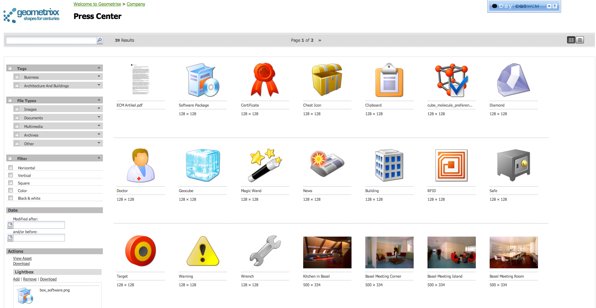
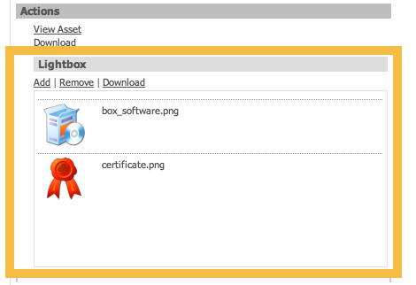

# Using Asset Share Pages{#using-asset-share-pages}

Depending on your instance of AEM, you can use a customized version of the DAM Finder called an Asset Share page. Asset Share is a web application that you use to search for assets using queries and predicates, browse and select assets using lenses, and perform actions on selected lenses.

This section describes possible ways to search for and find digital assets. However, the methods that are available to you depend on the design of your Asset Share page. (See [Creating customized Asset Share and Asset Editor pages](/help/assets/assets-finder-editor.md).)

## Finding Assets with Asset Share {#finding-assets-with-asset-share}

To help you manage digital assets, a finder functionality is included that allows you to find a set of assets according to predicates that you define, then perform one of a range of actions on the results. This finder functionality comes in the form of an Asset Share page.

What actions you can perform depends on how an Asset Share page has been customized. The Geometrixx Press Center is an example of a customized Asset Share page.

To find assets on the asset share page:

1. Browse through the categories. 
1. To further narrow your search, enter keywords and enter information in any other fields, as desired. AEM Assets displays the search results.
1. Select tags to further narrow your search. Selecting tags filters the results to those with the selected tags.  
1. You can collect assets in the lightbox and perform actions on them, such as downloading.

## Downloading Assets {#downloading-assets}

You can download assets either directly or by using the Lightbox. Depending on how a particular Asset Editor is configured, the Lightbox may not be available. The Lightbox is simply a place to collect assets.

### Direct Download {#direct-download}

To download assets directly:

1. Select one or more assets in the list view or mosaic view (use shift-click or control-click for multiple assets). 
1. After your selection is complete, click the download link.

AEM Assets generates a ZIP file that contains all selected files. Extract the ZIP file on your desktop by double-clicking it. In the extracted folder, you find the selected files.

### Lightbox Download {#lightbox-download}

If you want to download multiple assets simultaneously, but they are spread across multiple pages of the search results or you need to run two queries to collect all the assets, use the Lightbox download. The Lightbox lets you save selected assets together in a holding place.

To download assets using the Lightbox:

1. Start by searching for assets.
1. Select the assets that you want to download.
1. Click **Add** in the Lightbox link. You see the assets you selected in the Lightbox.
1. Browse to the next search result page or refine your search.
1. Select additional assets that you want to download. Click **Add** until you have selected all the assets you want in the Lightbox. 
1. Click the **Download** in the Lightbox.

AEM Assets again creates a ZIP file containing all the assets in the lightbox. You can empty the lightbox by clicking **Remove** at any time to start a new asset collection.
