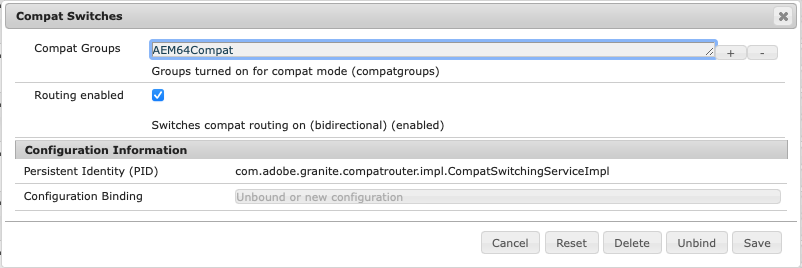

# Backward Compatibility in AEM 6.5{#backward-compatibility-in-aem}

## Overview {#overview}

>[!NOTE]
>
>For a list of content and configuration changes that are not under the scope of the Compatibility Package, see [Repository Restructuring in AEM](/help/sites-deploying/repository-restructuring.md).

In Adobe Experience Manager (AEM) 6.5, all features have been developed with backwards compatibility in mind.

Usually, customers running AEM 6.3 should not have to change the code or customizations when doing the upgrade. For AEM 6.1 and 6.2 customers, there are no additional breaking changes than you would be faced with during an upgrade to 6.3.

For exceptions where features could not be kept backward compatible, backward incompatibility issues for bundles and content can be mitigated. You do so by installing a Compatibility Package for 6.4 (see how to set up below for details on where to download). This compatibility package helps tp restore compatibility usually for applications compliant with AEM 6.4.

The Compatibility Package lets you run AEM in compatibility mode and defer custom development against new AEM features:

>[!NOTE]
>
>The compatibility package is only a temporary solution to defer development required for being AEM 6.5 compatible. Adobe recommends it only as a last option if you are not able to address compatibility issues through development immediately after the upgrade. Furthermore, Adobe recommends that you switch to native mode and uninstall the compatibility package once you decide to proceed with 6.5 based custom development and avail of full 6.5 functionality.

The Compatibility Package has two modes: **Routing Enabled** and **Routing Disabled**.

This allows AEM 6.5 to run in three modes:

**Native Mode:**

Native mode is for customers who want to use all the new features of AEM 6.5 and are ready to do some development to make their customizations work with all new features.

This means that you must adjust your application immediately after the upgrade.

**Compatibility Mode: Compatibility Package Installed with Routing Enabled**

Compatibility Mode is for customers who have customizations of interfaces that are not backward compatible. This allows AEM to run in compatibility mode and defer custom development required against new AEM Features that are not compatible with some of your custom code.

**Legacy Mode: Compatiblity Package Installed with Routing Disabled**

Legacy mode is for customers having custom interfaces based on legacy or deprecated code from AEM that has been moved out in the compatibility package.

## How to Set Up {#how-to-set-up}

The **AEM 6.4 Compatibility Pack for 6.5** can be installed as a package using the Package Manager. You can download the [AEM 6.4 Compatibility Pack for 6.5 from the Software Distribution](https://experience.adobe.com/#/downloads/content/software-distribution/en/aem.html?fulltext=compat*&orderby=%40jcr%3Acontent%2Fjcr%3AlastModified&orderby.sort=desc&layout=list&p.offset=0&p.limit=20&package=%2Fcontent%2Fsoftware-distribution%2Fen%2Fdetails.html%2Fcontent%2Fdam%2Faem%2Fpublic%2Fadobe%2Fpackages%2Fcq650%2Fcompatpack%2Faem-compat-cq65-to-cq64) site.

Once the Compatibility Package is installed, the routing can be enabled or disabled using a switch in the OSGI configuration as shown below:

After the Compatibility Package is installed and set up, the features are used based on the compatibility mode that has been chosen.
