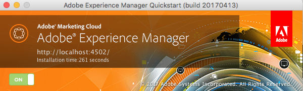

# Command Line Start and Stop{#command-line-start-and-stop}

## Starting Adobe Experience Manager from the Command Line {#starting-adobe-experience-manager-from-the-command-line}

The `start` script is available under *the &lt;cq-installation&gt;/bin* directory. Both UNIX&reg; and Windows versions are provided. The script starts the instance installed in *&lt;cq-installation&gt;* directory.

Those two versions support a list of environment variables that could be used to start and tune the Adobe Experience Manager (AEM) instance.

<table>
 <tbody>
  <tr>
   <td><strong>Environment variable </strong></td>
   <td><strong>Description </strong></td>
  </tr>
  <tr>
   <td>CQ_PORT</td>
   <td>TCP port used for stop and status scripts<br /> </td>
  </tr>
  <tr>
   <td>CQ_HOST</td>
   <td>Host name<br /> </td>
  </tr>
  <tr>
   <td>CQ_INTERFACE</td>
   <td>Interface that this server should listen to<br /> </td>
  </tr>
  <tr>
   <td>CQ_RUNMODE</td>
   <td>Run modes separated by comma<br /> </td>
  </tr>
  <tr>
   <td>CQ_JARFILE</td>
   <td>Name of the jarfile<br /> </td>
  </tr>
  <tr>
   <td>CQ_USE_JAAS</td>
   <td>Use of JAAS (if true)<br /> </td>
  </tr>
  <tr>
   <td>CQ_JAAS_CONFIG</td>
   <td>Path of the JAAS configuration<br /> </td>
  </tr>
  <tr>
   <td>CQ_JVM_OPTS</td>
   <td>Default JVM options<br /> </td>
  </tr>
 </tbody>
</table>

>[!CAUTION]
>
>Some run modes, among them author and publish, must be set before first starting AEM and cannot be changed afterwards. Before setting up an AEM instance that is used in production, see [run modes documentation](/help/sites-deploying/configure-runmodes.md) for details.

### Windows platform start.bat script example {#windows-platform-start-bat-script-example}

```shell
SET CQ_PORT=1234 & ./start.bat
```

### UNIX&reg; platform start script example {#unix-platform-start-script-example}

```shell
CQ_PORT=1234 ./start
```

>[!NOTE]
>
>The start script launches the AEM Quickstart installed under *the &lt;cq-installation&gt;/app* folder.

## Stopping Adobe Experience Manager {#stopping-adobe-experience-manager}

To stop AEM, do one of the following:

* Depending on the platform that you use:

    * If you started AEM from either a script or the command line, press **Ctrl+C** to shut down the server.
    * If you have used the start script on UNIX&reg;, you must use the stop script to stop AEM.

* If you started AEM by double-clicking the jar file, click the **On** button on the startup window (the button then changes to **Off**) to shut down the server.

  

## Stopping Adobe Experience Manager from the Command Line {#stopping-adobe-experience-manager-from-the-command-line}

The `stop` script is available under *the &lt;cq-installation&gt;/bin* directory. Both UNIX&reg; and Windows versions are provided. The script stops the running instance installed in *&lt;cq-installation&gt;* directory.

### UNIX&reg; platform stop script example {#unix-platform-stop-script-example}

```shell
./stop
```

### Windows platform stop.bat script example {#windows-platform-stop-bat-script-example}

```shell
./stop.bat
```

If you only want to preconfigure the repository (without relocating it), you only have to:

* Extract `repository.xml` to the required location

* update `repository.xml` as required

* create `bootstrap.properties` and define `repository.config`

Again, before starting the actual installation.
