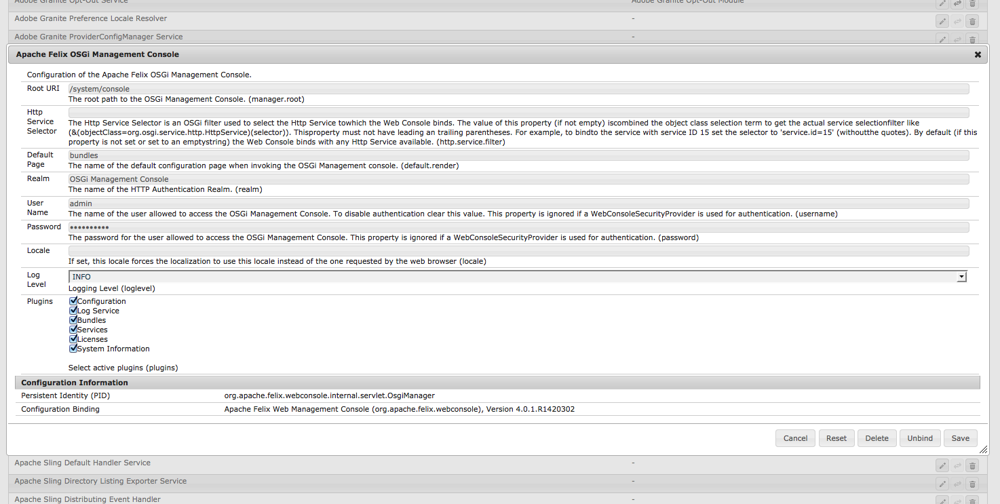
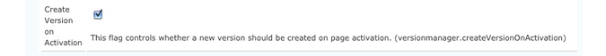

# Configuring OSGi{#configuring-osgi}

[OSGi](https://www.osgi.org/) is a fundamental element in the technology stack of Adobe Experience Manager (AEM). It is used to control the composite bundles of AEM and their configuration.

OSGi "*provides the standardized primitives that allow applications to be constructed from small, reusable, and collaborative components. These components can be composed into an application and deployed*".

Doing so allows easy management of bundles as they can be stopped, installed, started individually. The interdependencies are handled automatically. Each OSGi Component (see the [OSGi Specification](https://docs.osgi.org/specification/)) is contained in one of the various bundles.

You can manage the configuration settings for such bundles by either:

* using the [Adobe CQ Web console](#osgi-configuration-with-the-web-console)
* using [configuration files](#osgi-configuration-with-configuration-files)
* configuring [content-nodes ( `sling:OsgiConfig`) in the repository](#osgi-configuration-in-the-repository)

Either method can be used though there are subtle differences, primarily in relation to [Run Modes](/help/sites-deploying/configure-runmodes.md):

* [Adobe CQ Web console](#osgi-configuration-with-the-web-console)

    * The Web Console is the standard interface for OSGi configuration. It provides a UI for editing the various properties, where possible values can be selected from predefined lists.

      As such it is the easiest method to use.

    * Any configurations made with the Web Console are applied immediately and applicable to the current instance, irrespective of the current run mode, or any subsequent changes to the run mode.

* [configuration files](#osgi-configuration-with-configuration-files)

    * Contain settings defined in the web console.
    * Can be included in content packages for use on other instances.

* [content-nodes (sling:osgiConfig) in the repository](#osgi-configuration-in-the-repository)

    * Requires manual configuration using CRXDE Lite.
    * Due to the naming conventions of the `sling:OsgiConfig` nodes, you can tie the configuration to a specific [run mode](/help/sites-deploying/configure-runmodes.md). You can even save configurations for more than one run mode in the same repository.
    * Any appropriate configurations are applied immediately (dependent on the run mode).

Whichever method you use, all of these configuration methods:

* Ensure that copying or replicating the repository contents recreates identical configurations.
* Allow you to check configurations out to FileVault or Subversion; either for security or further updates.
* Can be saved in packages for use when setting up other instances.
* Allow you to perform configuration rollouts using scripts to propagate the configuration details.

>[!NOTE]
>
>Details of certain important settings are listed under [OSGi Configuration Settings.](/help/sites-deploying/osgi-configuration-settings.md)

## OSGi Configuration with the Web Console {#osgi-configuration-with-the-web-console}

The [Web console](/help/sites-deploying/web-console.md) in AEM provides a standardized interface for configuring the bundles. The **Configuration** tab is used for configuring the OSGi bundles, and is therefore the underlying mechanism for configuring AEM system parameters.

Any changes made are immediately applied to the relevant OSGi configuration, no restart is required.

>[!NOTE]
>
>Changes made in the web console are saved in the repository as [configuration files](#osgi-configuration-with-configuration-files). These files can be included in content packages for reuse in further installations.

>[!NOTE]
>
>On the Web console, any descriptions that mention default settings relate to Sling defaults.
>
>Adobe Experience Manager has its own defaults and so the defaults that are set might differ from the defaults documented on the console.

To update a configuration with the web console:

1. Access the **Configuration** tab of the Web Console by either:

    * Opening the web console from the link on the **Tool -&gt; Operations** menu. After logging into the console, you can use the drop-down menu of:

      **OSGi &gt;**

    * The direct URL; for example:

      `http://localhost:4502/system/console/configMgr`

   A list is shown.

1. Select the bundle that you want to configure by either:

    * clicking the **Edit** icon for that bundle
    * clicking the **Name** of the bundle

1. A dialog box opens. Here you can edit as required. For example, set the **Log Level** to `INFO`:

   

   >[!NOTE]
   >
   >Updates are saved in the repository as [configuration files](#osgi-configuration-with-configuration-files). To locate these files afterwards to include in a content package for use on another instance, for example, make a note of the persistent identity ( `PID`).

1. Click **Save**.

   Your changes are immediately applied to the relevant OSGi configuration of the running system, no restart is required.

   >[!NOTE]
   >
   >You can now locate the related [configuration files](#osgi-configuration-with-configuration-files). For example, to include in a content package for use on another instance.

## OSGi Configuration with configuration files {#osgi-configuration-with-configuration-files}

Configuration changes made using the Web Console are persisted in the repository as configuration files ( `.config`) under:

`/apps`

These files can be included in content packages and reused on other instances.

>[!NOTE]
>
>The format of the configuration files is specific - see the [Sling Apache documentation](https://sling.apache.org/documentation/development/slingstart.html#default-configuration-format) for full details.
>
>For this reason, it is recommended to create and maintain the configuration file by making actual changes in the web console.

The Web Console shows no indication of where in the repository that your changes have been saved, but they can be easily located:

1. Create the configuration file by [making an initial change in the web console](#osgi-configuration-with-the-web-console).
1. Open CRXDE Lite.
1. In the **Tools** menu, select **Query ...** .
1. To search for the PID of the configuration that you have updated, submit a query of **Type** `SQL`.

   For example, **Apache Felix OSGi Management Console** has the persistent identity (PID) of:

   `org.apache.felix.webconsole.internal.servlet.OsgiManager`

   So the SQL query could be:

   ```shell
   select * from nt:base where jcr:path like '/apps/%' and contains(*, 'org.apache.felix.webconsole.internal.servlet.OsgiManager')
   ```

1. The configuration file node is shown.

   For the above example:

   `/apps/system/config/org.apache.felix.webconsole.internal.servlet.OsgiManager.config`

   >[!CAUTION]
   >
   >You can open this file to view your changes, but to avoid typing errors it is recommended to make actual changes with the console.

1. You can now build a content package, containing this node, and use as required on your other instances.

## OSGi Configuration in the Repository {#osgi-configuration-in-the-repository}

In addition to using the web console, you can also define configuration details in the repository. Doing so lets you easily configure your differing run modes.

These configurations are made by creating `sling:OsgiConfig` nodes in the repository for the system to reference. These nodes mirror the OSGi configurations, and a user interface is formed to them. To update the configuration data, you update the node properties.

If you modify the configuration data in the repository, the changes are immediately applied to the relevant OSGi configuration. It is as if the changes had been made using the Web console, with the appropriate validation and consistency checks. This workflow also applies to the action of copying a configuration from `/libs/` to `/apps/`.

As the same configuration parameter is in several places, the system:

* searches for all nodes of type `sling:OsgiConfig`
* filters according to service name
* filters according to run mode

>[!NOTE]
>
>Read also [how to define a repository-based configuration for a specific instance only](https://experienceleague.adobe.com/docs/experience-cloud-kcs/kbarticles/KA-17500.html?lang=en).

### Adding a New Configuration to the Repository {#adding-a-new-configuration-to-the-repository}

#### What You Need to Know {#what-you-need-to-know}

To add a configuration to the repository, you must know the following:

1. The **Persistent Identity** (PID) of the service.

   Reference the **Configurations** field in the Web console. The name is shown in brackets after the bundle name (or in the **Configuration Information** towards the bottom of the page).

   For example, create a node `com.day.cq.wcm.core.impl.VersionManagerImpl.` to configure **AEM WCM Version Manager**.

   

1. Is a specific [run mode](/help/sites-deploying/configure-runmodes.md) required? Create the folder:

    * `config` - for all run modes
    * `config.author` - for the author environment
    * `config.publish` - for the publish environment
    * `config.<run-mode>` - as appropriate

1. Is a **Configuration** or **Factory Configuration** necessary?
1. The individual parameters to be configured, including any existing parameter definitions that must be recreated.

   Reference the individual parameter field in the Web console. The name is shown in brackets for each parameter.

   For example, create a property
   `versionmanager.createVersionOnActivation` to configure **Create Version on Activation**.

   

1. Does a configuration exist in `/libs`? To list all configurations in your instance, use the **Query** tool in CRXDE Lite to submit the following SQL query:

   `select * from sling:OsgiConfig`

   If so, this configuration can be copied to ` /apps/<yourProject>/`, then customized in the new location.

#### Creating the Configuration in the Repository {#creating-the-configuration-in-the-repository}

To actually add the new configuration to the repository:

1. Use CRXDE Lite to navigate to:

   ` /apps/<yourProject>`

1. If not existing, create the `config` folder ( `sling:Folder`):

    * `config` - applicable to all run modes
    * `config.<run-mode>` - specific to a particular run mode

1. Under this folder, create a node:

    * Type: `sling:OsgiConfig`
    * Name: the persistent identity (PID);

      for example for AEM WCM Version Manager use `com.day.cq.wcm.core.impl.VersionManagerImpl`

   >[!NOTE]
   >
   >When making a Factory Configuration append `-<identifier>` to the name.
   >
   >As in: `org.apache.sling.commons.log.LogManager.factory.config-<identifier>`
   >
   >Where `<identifier>` is replaced by free text that you (must) enter to identify the instance (you cannot omit this information); for example:
   >
   >`org.apache.sling.commons.log.LogManager.factory.config-MINE`

1. For each parameter that you want to configure, create a property on this node:

    * Name: the parameter name as shown in the Web console; the name is shown in brackets at the end of the field description. For example, for `Create Version on Activation` use `versionmanager.createVersionOnActivation`
    * Type: as appropriate.
    * Value: as required.

   You only must create properties for the parameters that you want to configure, others still take the default values as set by AEM.

1. Save all changes.

   Changes are applied when the node is updated by restarting the service (as with changes made in the Web console).

>[!CAUTION]
>
>Do not change anything in the `/libs` path.

>[!CAUTION]
>
>The full path of a configuration must be correct for it to be read at startup.

## Configuration Details {#configuration-details}

### Resolution Order at Startup {#resolution-order-at-startup}

The following order of precedence is used:

1. Repository nodes under `/apps/*/config...`.either with type `sling:OsgiConfig` or property files.

1. Repository nodes with type `sling:OsgiConfig` under `/libs/*/config...`. (out-of-the-box definitions).

1. Any `.config` files from `<*cq-installation-dir*>/crx-quickstart/launchpad/config/...`. on the local file system.

A generic configuration in `/libs` can be masked by a project-specific configuration in `/apps`.

### Resolution Order at Runtime {#resolution-order-at-runtime}

Configuration changes made while the system is running triggers a reload with the modified configuration.

Then the following order of precedence applies:

1. Modifying a configuration in the Web console takes immediate effect as it takes precedence at runtime.
1. Modifying a configuration in `/apps` takes immediate effect.
1. Modifying a configuration in `/libs` takes immediate effect, unless it is masked by a configuration in `/apps`.

### Resolution of multiple Run Modes {#resolution-of-multiple-run-modes}

For run mode-specific configurations, multiple run modes can be combined. For example, you can create configuration folders in the following style:

`/apps/*/config.<runmode1>.<runmode2>/`

Configurations in such folders are applied if all run modes match a run mode defined at startup.

For example, if an instance was started with the run modes `author,dev,emea`, configuration nodes in `/apps/*/config.emea`, `/apps/*/config.author.dev/`, and `/apps/*/config.author.emea.dev/` is applied, while configuration nodes in `/apps/*/config.author.asean/` and `/config/author.dev.emea.noldap/` are not applied.

If multiple configurations for the same PID are applicable, the configuration with the highest number of matching run modes is applied.

For example, if an instance was started with the run modes `author,dev,emea`, and both `/apps/*/config.author/` and `/apps/*/config.emea.author/` define a configuration for
`com.day.cq.wcm.core.impl.VersionManagerImpl`, the configuration in `/apps/*/config.emea.author/` is applied.

This rule's granularity is at a PID level.
You cannot define some properties for the same PID in `/apps/*/config.author/` and more specific ones in `/apps/*/config.emea.author/` for the same PID.
The configuration with the highest number of matching run modes is effective for the entire PID.

### Standard Configurations {#standard-configurations}

The following list shows a small selection of the configurations available (in a standard installation) in the repository:

* Author - AEM WCM Filter:

  `libs/wcm/core/config.author/com.day.cq.wcm.core.WCMRequestFilter`

* Publish - AEM WCM Filter:

  `libs/wcm/core/config.publish/com.day.cq.wcm.core.WCMRequestFilter`

* Publish - AEM WCM Page Statistics:

  `libs/wcm/core/config.publish/com.day.cq.wcm.core.stats.PageViewStatistics`

>[!NOTE]
>
>As these configurations reside in `/libs` they must not be edited directly, but copied to your application area ( `/apps`) before customization.

To list all configuration nodes in your instance, use the **Query** functionality in CRXDE Lite to submit the following SQL query:

`select * from sling:OsgiConfig`

### Configuration Persistence {#configuration-persistence}

* If you change a configuration through the Web console, it is (usually) written into the repository at:

  `/apps/{somewhere}`

    * By default `{somewhere}` is `system/config` so the configuration is written to

      `/apps/system/config`

    * However, if you are editing a configuration which initially came from elsewhere in the repository: for example:

      /libs/foo/config/someconfig

      Then the updated configuration is written under the original location; for example:

      `/apps/foo/config/someconfig`

* Settings that are changed by `admin` are saved in `*.config` files under:

  ```
     /crx-quickstart/launchpad/config
  ```

    * This area is the private data of the OSGi configuration admin and holds all configuration details specified by `admin`, regardless how they entered the system.
    * This area is an implementation detail and you must never edit this directory directly.
    * However, it is useful to know the location of these configuration files so that copies can be taken for backup, or multiple installations, or both:

        * Apache Felix OSGi Management Console

          `../crx/org/apache/felix/webconsole/internal/servlet/OsgiManager.config`

        * CRX Sling Client Repository

          `../com/day/crx/sling/client/impl/CRXSlingClientRepository/<pid-nr>.config`

>[!CAUTION]
>
>Never edit the folders or files under:
>
>`/crx-quickstart/launchpad/config`
