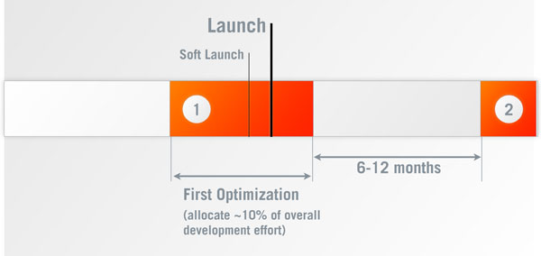
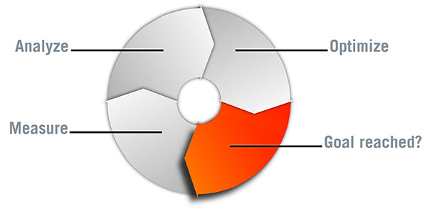
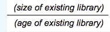
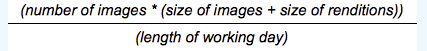
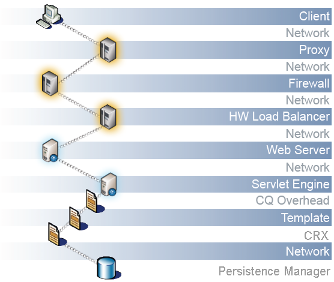
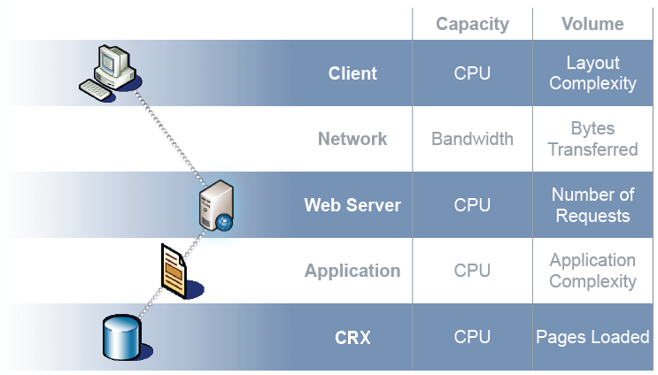
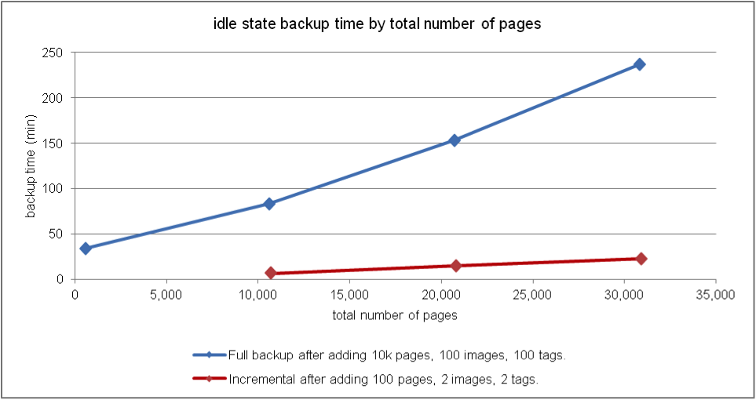
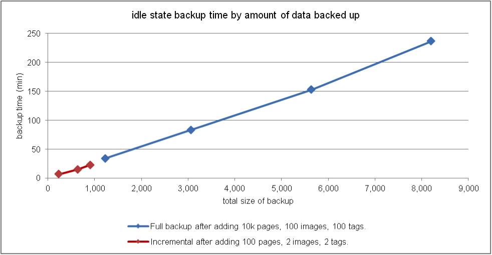
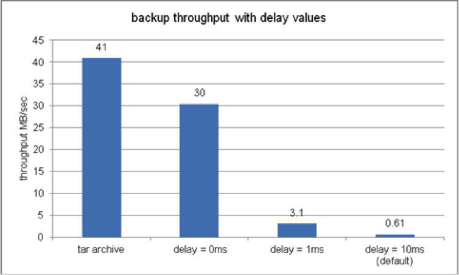

# Performance Optimization {#performance-optimization}

>[!NOTE]
>
>For general guidelines about performance, read the [Performance Guidelines](/help/sites-deploying/performance-guidelines.md) page.
>
>For more information about troubleshooting and fixing performance issues, also see the [Performance tree](/help/sites-deploying/performance-tree.md).
>
>Also, you can review a Knowledge Base article on [Performance Tuning Tips](https://experienceleague.adobe.com/docs/experience-manager-65/deploying/configuring/configuring-performance.html?lang=en).

A key issue is the time that your website takes to respond to visitor requests. Although this value varies for each request, an average target value can be defined. Once this value is proven to be both achievable and maintainable, it can be used to monitor the performance of the website and indicate the development of potential problems.

The response times that you are aiming for are different on the author and publish environments, reflecting the different characteristics of the target audience:

## Author Environment {#author-environment}

This environment is used by authors entering and updating content. It must cater for a few users who each generate a high number of performance intensive requests when updating content pages and the individual elements on those pages.

## Publish Environment {#publish-environment}

This environment contains content which you make available to your users. Here the number of requests is even greater and the speed is as vital. But because the nature of the requests is less dynamic, additional performance enhancing mechanisms can be applied; such as caching the content or load-balancing.

>[!NOTE]
>
>* After configuring for performance optimization, follow the procedures in [Tough Day](/help/sites-developing/tough-day.md) to test the environment under heavy load.
>* See also [Performance tuning tips.](https://experienceleague.adobe.com/docs/experience-manager-65/deploying/configuring/configuring-performance.html?lang=en)

## Performance Optimization Methodology {#performance-optimization-methodology}

A performance optimization methodology for AEM Projects can be summed up in five simple rules that can be followed to avoid performance issues from the start:

1. [Planning for Optimization](#planning-for-optimization)
1. [Simulate Reality](#simulate-reality)
1. [Establish Solid Goals](#establish-solid-goals)
1. [Stay Relevant](#stay-relevant)
1. [Agile Iteration Cycles](#agile-iteration-cycles)

These rules apply to web projects in general, and are relevant to project managers and system administrators to ensure that their projects do not face performance challenges when launch time comes.

### Planning for Optimization {#planning-for-optimization}



Plan about 10% of the project effort for the performance optimization phase. The actual performance optimization requirements depend on the level of complexity of a project and the experience of the development team. While your project may (ultimately) not require the allocated time, it is good practice to always plan for performance optimization in the suggested region.

Whenever possible, a project should first be soft-launched to a limited audience to gather real-life experience and perform further optimizations, without the additional pressure that follows a full announcement.

After you are "live", performance optimization is not over. It is now when you experience the "real" load on your system. It is important to plan for additional adjustments after the launch.

Since your system load changes and the performance profiles of your system shifts over time, a performance "tune-up" or "health-check" should be scheduled at 6-12 months intervals.

### Simulate Reality {#simulate-reality}


If you go live with a website, then find out after the launch that you run into performance issues, it is likely because your load and performance tests did not simulate reality closely enough.

Simulating reality is difficult and how much effort that you want to invest into getting "real" depends on the nature of your project. "Real" means not just "real code" and "real traffic", but also "real content", especially regarding content size and structure. Your templates may behave differently depending on the size and structure of the repository.

### Establish Solid Goals {#establish-solid-goals}


The importance of properly establishing performance goals is not to be underestimated. Often, after people become focused on specific performance goals it is hard to change these goals afterwards, even if they are based on assumptions.

Establishing good, solid performance goals is really one of the trickiest areas. It is often best to collect real life logs and benchmarks from a comparable website (for example the new website's predecessor).

### Stay Relevant {#stay-relevant}


It is important to optimize one bottleneck at a time. If you try to do things in parallel without validating the impact of the one optimization, you can lose track of which optimization measure helped.

### Agile Iteration Cycles {#agile-iteration-cycles}



Performance tuning is an iterative process that involves, measuring, analysis, optimization, and validation until the goal is reached. To account for this aspect, implement an agile validation process in the optimization phase rather than a more heavy-weight testing process after each iteration.

This focus means that the developer implementing the optimization should have a quick way to tell if the optimization has already reached the goal. This information is valuable, because when the goal is reached, optimization is over.

## Basic Performance Guidelines {#basic-performance-guidelines}

Generally speaking, keep your uncached html requests to less than 100 milliseconds. More specifically, the following may serve as a guideline:

* 70% of the requests for pages should be responded to in less than 100 milliseconds.
* 25% of the requests for pages should get a response within 100 milliseconds - 300 milliseconds.
* 4% of the requests for pages should get a response within 300 milliseconds - 500 milliseconds.
* 1% of the requests for pages should get a response within 500 milliseconds - 1000 milliseconds.
* No pages should respond slower than 1 second.

The above numbers assume the following conditions:

* Measured on publish (no overheads as related to an authoring environment)
* Measured on the server (no network overhead)
* Not cached (no AEM output cache, no Dispatcher cache)
* Only for complex items with many dependencies (HTML, JS, PDF, ...)
* No other load on the system

There are some issues that frequently contribute to performance problems, including the following:

* Dispatcher caching inefficiency
* The use of queries in normal display templates.

JVM and OS level tuning do not usually lead to significant leaps in performance and should therefore be performed at the very end of the optimization cycle.

The way a content repository is structured can impact performance as well. For best performance, the number of child nodes attached to individual nodes in a content repository should not exceed 1,000 (as a rule).

Your best friends during a usual performance optimization exercise are:

* The `request.log`
* Component-based timing
* A Java&trade; profiler.

### Performance when loading and editing Digital Assets {#performance-when-loading-and-editing-digital-assets}

Due to the large volume of data involved when loading and editing digital assets, performance can become an issue.

Two things affect performance here:

* CPU - multiple cores allow for smoother work when transcoding
* Hard disk - parallel RAID disks achieve the same

To improve performance, consider the following:

* How many assets are going to be uploaded per day? A good estimate can be based on:



* The time frame in which edits are made (typically the length of the working day, more for international operations).
* The average size of images uploaded (and the size of renditions generated per image) in megabytes.
* Determine the average data rate:



* 80% of all edits are made in 20% of the time, so in peak time you have four times the average data rate. Such performance is your goal.

## Performance Monitoring {#performance-monitoring}

Performance (or the lack of it) is one of the first things that your users notice, so as with any application with a user interface, performance is of key importance. To optimize the performance of your AEM installation, monitor various attributes of the instance and its behavior.

For information about how to perform performance monitoring, see [Monitoring Performance](/help/sites-deploying/monitoring-and-maintaining.md#monitoring-performance).

The problems that cause performance issues are often difficult to track down, even when their effects are easy to see.

A basic starting point is a good knowledge of your system when it is operating as normal. Unless you know how your environment "looks" and "behaves" when it performs properly, it is difficult to locate the problem when performance deteriorates. Spend time investigating your system when it is running smoothly and ensure that collecting performance information is an ongoing task. Doing so provides you with a basis for comparison should the performance suffer.

The following diagram illustrates the path that a request for AEM content can take, and therefore the number of different elements which can impact the performance.



Performance is also a balance between volume and capacity:

* **Volume** - The amount of output that is processed and delivered by the system.
* **Capacity** - The system's ability to deliver the volume.

Performance can be illustrated in various locations throughout the web-chain.



There are several functional areas which are often responsible for impacting the performance:

* Caching
* Application (your project) code
* Search functionality

### Basic Rules Regarding Performance {#basic-rules-regarding-performance}

Certain rules should be kept in mind when optimizing performance:

* Performance tuning *must* be part of every project.
* Do not optimize early in the development cycle.
* Performance is only as good as the weakest link.
* Always think about capacity vs. volume.
* Optimize important things first.
* Never optimize without *realistic* goals.

>[!NOTE]
>
>Bear in mind that the mechanism you use to measure performance often affects exactly what you are trying to measure. Try to account for these discrepancies, and eliminate as much of their effect as possible; in particular browser plug-ins should be de-activated wherever possible.

## Configuring for Performance {#configuring-for-performance}

Certain aspects of AEM (and/or the underlying repository) can be configured to optimize performance. The following are possibilities and suggestions, you must be sure of whether, or how, you use the functionality in question before making changes.

>[!NOTE]
>
>See [Performance Optimization](https://experienceleague.adobe.com/docs/experience-manager-65/deploying/configuring/configuring-performance.html?lang=en).

### Search Indexing {#search-indexing}

Starting in AEM 6.0, Adobe Experience Manager uses an Oak based repository architecture.

You can find the updated indexing information here:

* [Best Practices for Queries and Indexing](/help/sites-deploying/best-practices-for-queries-and-indexing.md)
* [Queries and Indexing](/help/sites-deploying/queries-and-indexing.md )

### Concurrent Workflow Processing {#concurrent-workflow-processing}

To improve performance, limit the number of concurrently running workflow processes. By default, the workflow engine processes as many workflows in parallel as there are processors available to the Java&trade; VM. When workflow steps require large amounts of processing resources (RAM or CPU), running several of these workflows in parallel can place high demands on available server resources.

For example, when images (or DAM assets in general) are uploaded, workflows automatically import the images into DAM. Images are often high resolution and that can easily consume hundreds of MB of heap for processing. Handling these images in parallel places a high load on the memory subsystem and the garbage collector.

The workflow engine uses Apache Sling job queues for handling and scheduling work item processing. The following job queue services have been created by default from the Apache Sling Job Queue Configuration service factory for processing workflow jobs:

* Granite Workflow Queue: Most workflow steps, such as the ones that process DAM assets, use the Granite Workflow Queue service.
* Granite Workflow External Process Job Queue: This service is used for special external workflow steps that are typically used for contacting an external system and polling for results. For example, the InDesign Media Extraction Process step is implemented as an external process. The workflow engine uses the external queue for processing the polling. (See [com.day.cq.workflow.exec.WorkflowExternalProcess](https://developer.adobe.com/experience-manager/reference-materials/6-5/javadoc/com/day/cq/workflow/exec/WorkflowExternalProcess.html).)

Configure these services to limit the maximum number of concurrently running workflow processes.

>[!NOTE]
>
>Configuring these job queues affects all workflows unless you have created a job queue for a specific workflow model (see [Configure the Queue for a Specific Workflow Model](/help/sites-deploying/configuring-performance.md#configure-the-queue-for-a-specific-workflow) below).

#### Configuration in the Repository {#configuration-in-the-repo}

If you are configuring the services [using a sling:OsgiConfig node](/help/sites-deploying/configuring-osgi.md#adding-a-new-configuration-to-the-repository), you must find the PID of the existing services, for example: org.apache.sling.event.jobs.QueueConfiguration.370aad73-d01b-4a0b-abe4-20198d85f705. You can discover the PID using the Web Console.

Configure the property named `queue.maxparallel`.

#### Configuration in the Web Console {#configuration-in-the-web-console}

To configure these services [using the Web Console](/help/sites-deploying/configuring-osgi.md#osgi-configuration-with-the-web-console), locate the existing configuration items below the Apache Sling Job Queue Configuration service factory.

Configure the property named Maximum Parallel Jobs.

### Configure the Queue for a Specific Workflow {#configure-the-queue-for-a-specific-workflow}

Create a job queue for a specific workflow model so that you can configure job handling for that workflow model. In this way, your configurations affect the processing for a specific workflow, while the configuration of the default Granite Workflow Queue controls the processing of other workflows.

When workflow models execute, they create Sling jobs for a specific topic. By default, the topic matches the topics that are configured for the general Granite Workflow Queue, or the Granite Workflow External Process Job Queue:

* `com/adobe/granite/workflow/job*`
* `com/adobe/granite/workflow/external/job*`

Actual job topics that workflow models generate include model-specific suffix. For example, the **DAM Update Asset** workflow model generates jobs with the following topic:

`com/adobe/granite/workflow/job/etc/workflow/models/dam/update_asset/jcr_content/model`

Therefore, you can create a job queue for the topic that matches the job topics of your workflow model. Configuring the performance-related properties of the queue affects only the workflow model that generates the jobs that match the queue topic.

The following procedure creates a job queue for a workflow, using the **DAM Update Asset** workflow as an example.

1. Execute the workflow model for which you want to create the job queue, so that topic statistics are generated. For example, add an image to Assets to execute the **DAM Update Asset** workflow.
1. Open the Sling Jobs console (`https://<host>:<port>/system/console/slingevent`).
1. Discover the workflow-related topics in the console. For DAM Update Asset, the following topics are found:

    * `com/adobe/granite/workflow/external/job/etc/workflow/models/dam/update_asset/jcr_content/model`
    * `com/adobe/granite/workflow/job/etc/workflow/models/dam/update_asset/jcr_content/model`
    * `com/adobe/granite/workflow/job/etc/workflow/models/dam-xmp-writeback/jcr_content/model`

1. Create one job queue for each of these topics. To create a job queue, create a factory configuration for the Apache Sling Job Queue factory service.

   The factory configurations are similar to the Granite Workflow Queue described in [Concurrent Workflow Processing](/help/sites-deploying/configuring-performance.md#concurrent-workflow-processing), except the Topics property matches the topic of your workflow jobs.

### AEM DAM Asset Synchronization Service {#cq-dam-asset-synchronization-service}

The `AssetSynchronizationService` is used to synchronize assets from mounted repositories (including LiveLink, Documentum&reg;, among others). By default, this synchronization makes a regular check every 300 seconds (5 minutes), so if you do not use mounted repositories, you can disable this service.

Disabling the service is done by [configuring the OSGi service](/help/sites-deploying/configuring-osgi.md) **CQ DAM Asset Synchronization Service** to set the **Synchronization period** ( `scheduler.period`) to (a minimum of) one year (defined in seconds).

### Multiple DAM instances {#multiple-dam-instances}

Deploying multiple DAM instances can help performance when, for example:

* You have a high load due to regular uploading of many assets for the author environment; here a separate DAM instance can be dedicated to servicing author.
* You have multiple teams in worldwide locations (for example, USA, Europe, Asia).

Additional considerations are:

* Separating "work in progress" on author from "final" on publish
* Separating internal users on author from external visitors/users on publish (for example, agents, press representatives, customers, and students).

## Best Practices for Quality Assurance {#best-practices-for-quality-assurance}

Performance is of prime importance to your publish environment. Therefore, you must carefully plan and analyze the performance tests you make for the publish environment while implementing your project.

This section aims to give a standardized overview of the issues involved with defining a test concept specifically for performance tests on your *publish* environment. This information is primarily of interest to QA engineers, project managers, and system administrators.

The following covers a standardized approach to performance tests for an AEM application on the *Publish* environment. This performance test involves the following five phases:

* [Verification of Knowledge](#verification-of-knowledge)
* [Definition of Scope](#scope-definition)
* [Test Methodologies](#test-methodologies)
* [Definition of Performance Goals](#defining-the-performance-goals)
* [Optimization](#optimization)

Controlling is an extra, all-encompassing process - necessary but not limited to testing.

### Verification of Knowledge {#verification-of-knowledge}

A first step is to document the basis information which you must know before you can start testing:

* The architecture of your test environment
* An application map detailing the internal elements which need testing (both in isolation and combination)

#### Test Architecture {#test-architecture}

Document the architecture of the test environment being used for your performance testing.

You need a reproduction of your planned production Publish environment, together with Dispatcher, and Load Balancer.

#### Application Map {#application-map}

Get a clear overview from which you can create a map of the entire application (you may already have this map from tests on the Author environment).

A diagram representation of the internal elements of the application, can give an overview of the testing requirements; with color-coding it can also act as a basis for reporting.

### Scope Definition {#scope-definition}

An application usually has a selection of use cases. Some use cases are important, others less so.

To focus the scope of the performance testing on publish, Adobe recommends that you define the following:

* Most important business use cases
* Most critical technical use cases

The number of use cases is up to you, but it should be limited to an easily manageable number (for example, between 5 to 10).

Once the key use cases have been selected, then the key performance indicators (KPI) and the tools used to measure them can be defined for each case. Examples of common KPIs include:

* End to end response time
* Servlet response time
* Response time for a single component
* Response time for the services
* Number of idle threads in the thread pool
* Number of free connections
* System resources such as CPU and I/O access

### Test Methodologies {#test-methodologies}

This concept has four scenarios used for defining and testing the performance goals:

* Single component tests
* Combined component tests
* *Going Live* scenario
* Error scenarios

Based on the following principles.

#### Component Breakpoints {#component-breakpoints}

* Each component has a specific breaking point when related to performance. That is, a component can show that good performance until a specific point is reached, after which performance degrades rapidly.
* To get a full overview of the application, you must first verify your components to determine when the breakpoint of each is reached.
* To find the breakpoint that you can perform a load test where, over a time period, you increase the number of users to create an increasing load. By monitoring this load, and the response of the components, you encounter specific performance behavior when the breaking point of the component is reached. The point can be qualified by the number of concurrent transactions per second, together with the number of concurrent users (if the component is sensitive to this KPI).
* This information can then act as a benchmark for improvements, indicate the efficiency of the measures being used, and help define test scenarios.

#### Transactions {#transactions}

* The term transaction is used to represent the request of a complete web page, including the page itself and all subsequent calls. That is, the page request, any AJAX calls, images, and other objects **Request Drill Down**.
* To fully analyze each request, you can represent each element of the call stack, then total the average processing time for each.

### Defining the Performance Goals {#defining-the-performance-goals}

After the scope and related KPIs are defined, the specific performance goals are set. This process involves devising test scenarios, together with target values.

Test performance under both average and peak conditions. In addition, you need Going Live scenario tests to ensure that you can cater for increased interest in your website when it is first made available.

Any experience, or statistics which you may have collected from an existing website can also be useful in determining future goals. For example, top traffic from your live website.

#### Single Component Tests {#single-component-tests}

Critical components must be tested - under both average and peak conditions.

In both cases, you can define the expected number of transactions per second when a predefined number of users are using the system.

| Component |Test Type |No. of Users |Tx/sec (Expected) |Tx/sec (Tested) |Description  |
|---|---|---|---|---|---|
| Homepage Single User |Average |1 |1 |  |  |
|   |Peak |1 |3 |  |  |
| Homepage 100 Users |Average |100 |3 |  |  |
|   |Peak |100 |3 |  |

#### Combined Component Tests {#combined-component-tests}

Testing the components in combination gives a closer reflection of the applications behavior. Again average and peak conditions must be tested.

| Scenario |Component |No. of Users |Tx/sec (Expected) |Tx/sec (Tested) |Description  |
|---|---|---|---|---|---|
| Mixed average |Homepage |10 |1 |  |  |
|   |Search |10 |1 |  |  |
|   |News |10 |2 |  |  |
|   |Events |10 |1 |  |  |
|   |Activations |10 |3 |  |Simulation of author behavior. |
| Mixed peak |Homepage |100 |5 |  |  |
|   |Search |50 |5 |  |  |
|   |News |100 |10 |  |  |
|   |Events |100 |10 |  |  |
|   |Activations |20 |20 |  |Simulation of author behavior. |

#### Going Live Tests {#going-live-tests}

During the first few days after your website is made available, you can expect an increased level of interest. This scenario is even greater than the peak values that you are testing for. Adobe recommends you test Going Live scenarios to ensure that the system can cater for this situation.

| Scenario |Test Type |No. of Users |Tx/sec (Expected) |Tx/sec (Tested) |Description  |
|---|---|---|---|---|---|
| Going Live peak |Homepage |200 |20 |  |  |
|   |Search |100 |10 |  |  |
|   |News |200 |20 |  |  |
|   |Events |200 |20 |  |  |
|   |Activations |20 |20 |  |Simulation of author behavior. |

#### Error Scenario Tests {#error-scenario-tests}

Test error scenarios to ensure that the system reacts correctly and appropriately. Not only in how the error itself is handled, but the impact it may have on performance. For example:

* What happens when the user tries to input an invalid search term in the search box
* What happens when the search term is so general that it returns an excessive number of results

When devising these tests, it should be remembered that not all scenarios occur regularly. However, their impact on the entire system is important.

|  Error Scenario |Error Type |No. of Users |Tx/sec (Expected) |Tx/sec (Tested) |Description  |
|---|---|---|---|---|---|
| Search component overload |Search on global wildcard (asterisk) |10 |1 |  |Only &ast;&ast;&ast; are searched. |
|   |Stop word |20 |2 |  |Searching for a stop word. |
|   |Empty string |10 |1 |  |Searching for an empty string. |
|   |Special characters |10 |1 |  |Searching for special characters. |

#### Endurance Tests {#endurance-tests}

Certain issues are only encountered after the system has been running for a continuous time period, either hours or days. An endurance test is used to test a constant average load over a required time period. Any performance degradation can then be analyzed.

| Scenario |Test Type |No. of Users |Tx/sec (Expected) |Tx/sec (Tested) |Description  |
|---|---|---|---|---|---|
| Endurance test (72 hours) |Homepage |10 |1 |  |  |
|   |Search |10 |1 |  |  |
|   |News |20 |2 |  |  |
|   |Events |10 |1 |  |  |
|   |Activations |1 |3 |  |Simulation of author behavior. |

### Optimization {#optimization}

In the later stages of implementation, optimize the application to fulfill and maximize the performance goals.

Any optimizations made must be tested to ensure they have:

* Not affected the functionality
* Been verified with the load tests before being released

A selection of tools is available to help you with load-generation, performance monitoring, and results analysis. Some of these tools include the following:

* [JMeter](https://jmeter.apache.org/)
* [Load Runner](https://www.microfocus.com/en-us/portfolio/performance-engineering/overview)
* [InfraRED](https://www.infraredsoftware.com/)
* [Java&trade; Interactive Profile](https://jiprof.sourceforge.net/)

After optimization, test again to confirm the impact.

### Reporting {#reporting}

Ongoing reporting keeps everyone informed of the status. As mentioned previously with color-coding, the architecture map can be used for this status.

After all tests are completed, report on the following:

* Any critical errors encountered
* Non-critical issues that still need more investigation
* Any assumptions made during testing
* Any recommendations to arise from the testing

## Optimizing Performance when using the Dispatcher {#optimizing-performance-when-using-the-dispatcher}

The [Dispatcher](https://experienceleague.adobe.com/docs/experience-manager-dispatcher/using/dispatcher.html?lang=en) is Adobe's caching and/or load-balancing tool. When using the Dispatcher, consider optimizing your website for cache performance.

>[!NOTE]
>
>Dispatcher versions are independent of AEM, however the Dispatcher documentation is embedded in the AEM documentation. Always use the Dispatcher documentation that is embedded in the documentation for the latest version of AEM.
>
>You may have been redirected to this page if you followed a link to the Dispatcher documentation that is embedded in the documentation for a previous version of AEM.

The Dispatcher offers several built-in mechanisms that you can use to optimize performance if your website takes advantage of them. This section tells you how to design your web site to maximize the benefits of caching.

>[!NOTE]
>
>It may help you to remember that the Dispatcher stores the cache on a standard web server. Knowing this information means that you can cache everything that you can store as a page and request using a URL. And, you cannot store other things, such as cookies, session data, and form data.
>
>In general, numerous caching strategies involve selecting good URLs and not relying on this additional data.
>
>With Dispatcher version 4.1.11 you can also cache response headers, see [Caching HTTP Response Headers](https://experienceleague.adobe.com/docs/experience-manager-dispatcher/using/configuring/dispatcher-configuration.html?lang=en#configuring-the-dispatcher-cache-cache).
>

### Calculating the Dispatcher Cache Ratio {#calculating-the-dispatcher-cache-ratio}

The cache ratio formula estimates the percentage of requests handled by the cache out of the total number of requests coming into the system. To calculate the cache ratio, you need the following:

* The total number of requests. This information is available in the Apache `access.log`. For more details, see the [official Apache documentation](https://httpd.apache.org/docs/2.4/logs.html#accesslog).

* The number of requests the Publish instance served. This information is available in the `request.log` of the instance. For further details, see [Interpreting the request.log](/help/sites-deploying/monitoring-and-maintaining.md#interpreting-the-request-log) and [Finding the log Files](/help/sites-deploying/monitoring-and-maintaining.md#finding-the-log-files).

The formula to calculate the cache ratio is:

* (The total number of requests **minus** the number of requests on Publish) **divided** by the total number of requests.

For example, if the total number of requests is 129491 and the number of requests served by the Publish instance is 58959 the cache ratio is: **(129491 - 58959)/129491= 54.5%**.

If you don't have a one-to-one publisher/dispatcher pairing, add requests from all dispatchers and publishers together to get an accurate measurement. See also [Recommended Deployments](/help/sites-deploying/recommended-deploys.md).

>[!NOTE]
>
>For best performance, Adobe recommends a cache ratio of 90% to 95%.

#### Using Consistent Page Encoding {#using-consistent-page-encoding}

With Dispatcher version 4.1.11, you can cache response headers. If you are not caching response headers on Dispatcher, problems can occur if you store page encoding information in the header. In this situation, when Dispatcher serves a page from the cache the default encoding of the web server is used for the page. There are two ways to avoid this problem:

* If you use only one encoding, make sure that the encoding used on the web server is the same as the default encoding of the AEM website.
* To set the encoding, use a `<META>` tag in the HTML `head` section, as in the following example:

```xml
        <META http-equiv="Content-Type" content="text/html; charset=EUC-JP">
```

#### Avoid URL Parameters {#avoid-url-parameters}

If possible, avoid URL parameters for pages that you want to cache. For example, if you have a picture gallery, the following URL is never cached (unless Dispatcher is [configured accordingly](https://experienceleague.adobe.com/docs/experience-manager-dispatcher/using/configuring/dispatcher-configuration.html?lang=en#configuring-the-dispatcher-cache-cache)):

```xml
www.myCompany.com/pictures/gallery.html?event=christmas&amp;page=1
```

However, you can put these parameters into the page URL, as follows:

```xml
www.myCompany.com/pictures/gallery.christmas.1.html

```

>[!NOTE]
>
>This URL calls the same page and the same template as `gallery.html`. In the template definition, you can specify which script renders the page, or you can use the same script for all pages.

#### Customize by URL {#customize-by-url}

If you allow users to change the font size (or any other layout customization), make sure that the different customizations are reflected in the URL.

For example, cookies are not cached, so if you store the font size in a cookie (or similar mechanism), the font size is not preserved for the cached page. As a result, Dispatcher returns documents of any font size at random.

Including the font size in the URL as a selector avoids this problem:

```xml
www.myCompany.com/news/main.large.html
```

>[!NOTE]
>
>For most layout aspects, it is also possible to use style sheets, or client-side scripts, or both. These instruments work well with caching.
>
>This strategy is also useful for a print version, where you can use a URL such as:
>
>`www.myCompany.com/news/main.print.html`
>
>Using the script globbing of the template definition, you can specify a separate script that renders the print pages.

#### Invalidating Image Files Used As Titles {#invalidating-image-files-used-as-titles}

If you render page titles, or other text, as pictures, then it is recommended to store the files so that they are deleted upon a content update on the page:

1. Place the image file in the same folder as the page.
1. Use the following naming format for the image file:

   `<page file name>.<image file name>`

For example, you can store the title of the page `myPage.html` in the `file myPage.title.gif`. This file is automatically deleted if the page is updated, so any change to the page title is automatically reflected in the cache.

>[!NOTE]
>
>The image file does not necessarily physically exist on the AEM instance. You can use a script that dynamically creates the image file. Dispatcher then stores the file on the web server.

#### Invalidating Image Files Used For Navigation {#invalidating-image-files-used-for-navigation}

If you use pictures for the navigation entries, the method is basically the same as with titles, but slightly more complex. Store all the navigation images with the target pages. If you use two pictures for normal and active, you can use the following scripts:

* A script that displays the page, as normal.
* A script that processes ".normal" requests and returns the normal picture.
* A script that processes ".active" requests and returns the activated picture.

It is important that you create these pictures with the same naming handle as the page, to ensure that a content update deletes these pictures and the page.

For pages that are not modified, the pictures remain in the cache, although the pages themselves are auto-invalidated.

#### Personalization {#personalization}

It is recommended that you limit personalization to where it is necessary. To illustrate why:

* If you use a freely customizable start page, that page has to be composed every time a user requests it.
* If, in contrast, you offer a choice of ten different start pages, you can cache each one of them, thus improving performance.

>[!TIP]
>For further details on configuring the Dispatcher cache, see the [AEM Dispatcher Cache Tutorial](https://experienceleague.adobe.com/docs/experience-manager-learn/dispatcher-tutorial/overview.html) and its section on [Caching Protected Content.](https://experienceleague.adobe.com/docs/experience-manager-learn/dispatcher-tutorial/chapter-1.html#dispatcher-tips-and-tricks)

 If you personalize each page by putting the user's name into the title bar (for example), it has a performance impact.

 >[!TIP]
 >For caching secured content, see [Caching Secured Content](https://experienceleague.adobe.com/docs/experience-manager-dispatcher/using/configuring/permissions-cache.html) in the Dispatcher guide.

 Regarding mixing restricted and public content on one page, consider a strategy that uses server side includes in the Dispatcher, or client side includes by way of Ajax in the browser.

 >[!TIP]
 >
 >For handling mixed public and restricted content, see [Set up Sling Dynamic Include.](https://experienceleague.adobe.com/docs/experience-manager-learn/foundation/development/set-up-sling-dynamic-include.html)

#### Sticky Connections {#sticky-connections}

[Sticky connections](https://experienceleague.adobe.com/docs/experience-manager-dispatcher/using/dispatcher.html?lang=en#the-benefits-of-load-balancing) ensure that the documents for one user are all composed on the same server. If a user leaves this folder and later returns to it, the connection still sticks. To hold all documents that require sticky connections for the website, define one folder. Try not to have other documents in it. This scenario impacts load-balancing if you use personalized pages and session data.

#### MIME Types {#mime-types}

There are two ways in which a browser can determine the type of a file:

1. By its extension (for example, `.html`, `.gif`, and `.jpg`).
1. By the MIME-type that the server sends with the file.

For most files, the MIME-type is implied in the file extension. That is,

1. By its extension (for example, `.html`, `.gif`, and `.jpg`).
1. By the MIME-type that the server sends with the file.

If the file name has no extension, it is displayed as plain text.

With Dispatcher version 4.1.11, you can cache response headers. If you do not cache response headers on Dispatcher, the MIME-type is part of the HTTP header. As such, if your AEM application returns files that do not have a recognized file ending, and rely on the MIME-type instead, these files may be incorrectly displayed.

To make sure that files are cached properly, follow these guidelines:

* Make sure that files always have the proper extension.
* Avoid generic file serve scripts, which have URLs such as `download.jsp?file=2214`. To use URLs containing the file specification, rewrite the script. For the previous example, this rewrite is `download.2214.pdf`.

## Backup Performance {#backup-performance}

This section presents a series of benchmarks used to assess the performance of AEM backups and effects of backup activity on application performance. AEM backups present a significant load on the system while it runs, and Adobe measures this impact, and the effects of the backup delay settings that attempt to modulate these effects. The objective is to offer some reference data about the expected performance of backups in realistic configurations and quantities of production data, and to provide guidance about how to estimate backup times for planned systems.

### Reference Environment {#reference-environment}

#### Physical System {#physical-system}

The results reported in this document were obtained from benchmarks run in a reference environment with the following configuration. This configuration is similar to a typical production environment in a data center:

* HP ProLiant DL380 G6, 8 CPUs x 2.533 GHz
* Serial attached SCSI 300 GB, 10,000-RPM drives
* Hardware RAID controller; eight drives in a RAID0+5 array
* VMware image CPU x 2 Intel Xeon&reg; E5540 @ 2.53 GHz
* Red Hat&reg; Linux&reg; 2.6.18-194.el5; Java&trade; 1.6.0_29
* Single Author instance

The disk subsystem on this server is fast, representative of a high-performance RAID configuration that might be used in a production server. Backup performance can be sensitive to disk performance, and the results in this environment reflect performance on a fast RAID configuration. The VMWare image is configured to have a single large disk volume which physically resides in local disk storage, on the RAID array.

The AEM configuration places the repository and datastore on the same logical volume, alongside the operating system and AEM software. The target directory for backups also resides on this logical filesystem.

#### Data Volumes {#data-volumes}

The following table illustrates the size of data volumes that are used in the backup benchmarks. The initial baseline content is first installed, then additional known amounts of data are added to increase the size of the content backed up. Backups are created at specific increments to represent a large increase in content and what may be produced in a day. The distribution of content (pages, images, tags) is roughly based on realistic production asset composition. Pages, images, and tags are limited to a maximum of 800 child pages. Each page includes title, Flash, text/image, video, slideshow, form, table, cloud, and carousel components. Images are uploaded from a pool of 400 unique files size from 37 KB to 594 KB.

|Content|Nodes|Pages|Images|Tags|
|---|---|---|---|---|
|Base install|69 610|562|256|237|
|Small content for incremental back-up||+100|+2|+2|
|Large content for full back-up||+10 000|+100|+100|

The backup benchmark is repeated with the additional content sets added at each repetition.

#### Benchmark Scenarios {#benchmark-scenarios}

The backup benchmarks cover two main scenarios: backups when the system is under significant application load, and backups when the system is idle. Although the general recommendation is that backups should be performed when AEM is as idle as possible, there are situations where it is necessary that the backup must be run when the system is under load.

* **Idle State** - Backups are performed with no other activity on AEM.
* **Under Load** - Backups are performed while the system is under 80% load from online processes. Backup delay varied to see the impact on load.

Backup times and size of resulting backup are obtained from the AEM server logs. It is normally recommended that backups be scheduled for off-times when AEM is idle, such as in the middle of the night. This scenario is representative of the recommended approach.

Load consists of pages created, pages deleted, traversals, and queries with most load coming from page traversals and queries. Adding and removing too many pages continually increase the workspace size and prevent the back-ups from completing. The distribution of load the script uses is 75% page traversals, 24% queries, and 1% page creations (single level with no nested subpages). Peak average transactions per second on an idle system is achieved with four concurrent threads, which is used when testing back-ups under load.

Impact of load on backup performance can be estimated by the difference between performance with and without this application load. Impact of the backup on application throughput is found by comparing the scenario throughput in transactions per hour with and without a concurrent backup ongoing, and with backups operating with different "backup delay" settings.

* **Delay Setting** - For several of the scenarios, the backup delay setting was also varied, using values of 10 milliseconds (default), 1 milliseconds, and 0 milliseconds, to explore how this setting affected the performance of backups.
* **Backup Type** - All backups were external backups of the repository made to a backup directory without creating a zip, except in one case for comparison where the tar command was used directly. Since incremental backups cannot be created to a zip file, or when the prior full backup is a zip file, the backup directory method is the most often used in production situations.

### Summary of Results {#summary-of-results}

#### Backup Time and Throughput {#backup-time-and-throughput}

The main result of these benchmarks is to show how backup times vary as a function of the backup type and overall quantity of data. The following chart shows the obtained backup time using the default backup configuration, as a function of the number of total number of pages.



Backup times on an idle instance are fairly consistent, averaging 0.608 MB per second, regardless of full, or incremental backups (see chart below). The backup time is simply a function of the amount of data that is being backed up. The time to complete a full backup clearly increases with the total number of pages. The time to complete an incremental backup also climbs with the total number of pages, but at a much lower rate. The time taken to complete the incremental backup is much shorter owing to the relatively small amount of data being backed up.

The size of the backup produced is the main determinant of the time taken to complete a backup. The following chart shows time taken as a function of final backup size.



This chart illustrates that both incremental and full backups follow a simple size versus time pattern that Adobe can measure as throughput. Backup times on an idle instance are fairly consistent, averaging 0.61 MB per second regardless of full or incremental backups on the benchmark environment.

#### Backup Delay {#backup-delay}

The backup delay parameter is provided to limit the extent to which backups may interfere with production workloads. The parameter specifies a wait time in milliseconds, which is interspersed into the backup operation on a file-by-file basis. The overall effect depends partly on the size of files affected. Measuring backup performance in MB/sec gives a reasonable way to compare the effects of delay on the backup.

* Running a backup concurrently with regular application load has a negative impact on the throughput of the regular load.
* The impact may be slight (as little as 5%) or significant, causing as much as 75% drop in throughput. It likely depends most on the application.
* Backup is not a heavy load on the CPU, and so CPU-intensive production workloads would be less affected by backup than I/O intensive ones.



For comparison, the throughput obtained using a file system backup ('tar') to back up the same repository files. The performance of the tar is comparable, but slightly higher than the backup with delay set to zero. Setting even a small delay greatly reduces the backup throughput and the default delay of 10-milliseconds results in vastly reduced throughput. In situations where backups may be scheduled when overall application usage is low, or the application can be idle, reduce the delay below the default value to permit the backup to proceed more quickly.

The actual impact of application throughput of an ongoing backup does depend on the application and infrastructure details. The choice of delay value should be made by empirical analysis of the application, but should be chosen as small as possible, so that backups can complete as quickly as possible. Because there is only a weak correlation between the choice of delay value and the impact on application throughput, the choice of delay should favor shorter overall backup times to minimize the overall impact of backups. A backup that takes eight hours to complete, but affects throughput by -20% is likely to have a greater overall impact than one which takes two hours to complete but affects throughput by -30%.

### References {#references}

* [Administering - Back up and Restore](/help/sites-administering/backup-and-restore.md)
* [Managing - Capacity and Volume](/help/managing/best-practices-further-reference.md#capacity-and-volume)
