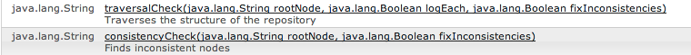

# Consistency and Traversal Checks{#consistency-and-traversal-checks}

When upgrading, there can be problems due to workspace inconsistencies. You can either run a test upgrade to see if this is an issue, or run the consistency checks as a preventive action.

If you run a test upgrade that fails due to workspace inconsistencies, you see entries similar to the following in crx-quickstart/logs/crx/error.log:

```xml
*ERROR* TarPersistenceManager: No bundle found for uuid 'deadbeef-cafe-babe-cafe-babecafebabe'
 ...
*ERROR* RepositoryImpl: Failed to initialize workspace 'crx.default'
javax.jcr.RepositoryException: Error indexing workspace: Error indexing workspace: Error indexing workspace
...
```

## Perform a Consistency Check {#perform-a-consistency-check}

To perform a consistency check, navigate to the administration page for the JMX Mbean **com.adobe.granite (Repository)**. From the AEM main screen, go to:

**Tools &gt; Web Console &gt; Main(on menu bar) &gt; JMX &gt; com.adobe.granite (Repository)**

On a default installation, it is found here:  **[|Show Me|](http://localhost:4502/system/console/jmx/com.adobe.granite%3Atype%3DRepository)**

In the **Operations** section of the page, you find two methods: **`traversalCheck`** and **`consistencyCheck`**. To run a check, click the operation and enter the desired parameters.


