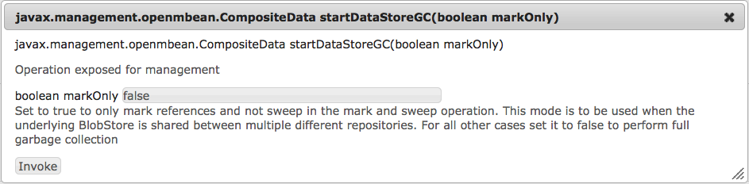
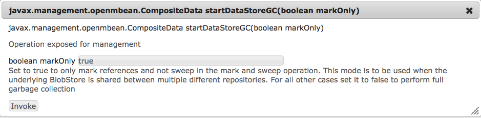

# Configuring node stores and data stores in AEM 6{#configuring-node-stores-and-data-stores-in-aem}

## Introduction {#introduction}

In Adobe Experience Manager (AEM), binary data can be stored independently from the content nodes. The binary data is stored in a data store, whereas content nodes are stored in a node store.

Both data stores and node stores can be configured using OSGi configuration. Each OSGi configuration is referenced using a persistent identifier (PID).

## Configuration steps {#configuration-steps}

To configure both the node store and the data store, perform these steps:

1. Copy the AEM quickstart JAR file to its installation directory.
1. Create a folder `crx-quickstart/install` in the installation directory.
1. First, configure the node store by creating a configuration file with the name of the node store option you want to use in the `crx-quickstart/install` directory.

   For example, the Document node store (which is the basis for AEM's MongoMK implementation) uses the file `org.apache.jackrabbit.oak.plugins.document.DocumentNodeStoreService.config`.

1. Edit the file, and set your configuration options.
1. Create a configuration file with the PID of the data store you want to use. Edit the file to set the configuration options.

   >[!NOTE]
   >
   >See [Node Store Configurations](#node-store-configurations) and [Data Store Configurations](#data-store-configurations) for configuration options.

1. Start AEM.

## Node Store Configurations {#node-store-configurations}

>[!CAUTION]
>
>Newer versions of Oak employ a new naming scheme and format for OSGi configuration files. The new naming scheme requires that the configuration file be named **.config** and the new format requires values to be typed and is [documented here](https://sling.apache.org/documentation/development/slingstart.html#default-configuration-format).
>
>If you upgrade from an older version of Oak, ensure that you make a backup of the `crx-quickstart/install`folder first. After the upgrade, restore the contents of the folder to the upgraded installation and modify the extension of the configuration files from **.cfg** to **.config**.
>
>In case you are reading this article in preparation for an upgrade from an **AEM 5.x** installation, ensure that you consult the [upgrade](https://experienceleague.adobe.com/docs/) documentation first.

### Segment Node Store {#segment-node-store}

The segment node store is the basis of Adobe's TarMK implementation in AEM6. It uses the `org.apache.jackrabbit.oak.segment.SegmentNodeStoreService` PID for configuration.

>[!CAUTION]
>
>The PID for the Segment node store has changed from `org.apache.jackrabbit.oak.plugins.segment.SegmentNodeStoreService in previous versions` of AEM 6 to `org.apache.jackrabbit.oak.segment.SegmentNodeStoreService` in AEM 6.3. Make sure you make the necessary configuration adjustments to reflect this change.

You can configure the following options:

* `repository.home`: Path to repository home under which repository-related data is stored. By default, segment files are stored under the `crx-quickstart/segmentstore` directory.

* `tarmk.size`: Maximum size of a segment in MB. The default maximum is 256MB.
* `customBlobStore`: Boolean value indicating that a custom data store is used. The default value is true for AEM 6.3 and later versions. Prior to AEM 6.3 the default was false.

The following is a sample `org.apache.jackrabbit.oak.segment.SegmentNodeStoreService.config` file:

```shell
#Path to repo
repository.home="crx-quickstart/repository"

#Max segment size
tarmk.size=I"256"

#Custom data store
customBlobStore=B"true"
```

#### Document Node Store {#document-node-store}

The document node store is the basis of AEM's MongoMK implementation. It uses the `org.apache.jackrabbit.oak.plugins.document.DocumentNodeStoreService`* *PID. The following configuration options are available:

* `mongouri`: The [MongoURI](https://docs.mongodb.org/manual/reference/connection-string/) required to connect to Mongo Database. The default is `mongodb://localhost:27017`

* `db`: Name of the Mongo database. The default is **Oak** ``. However, new AEM 6 installations use **aem-author** ``as the default database name.

* `cache`: The cache size in MB. This is distributed among various caches used in DocumentNodeStore. The default is `256`

* `changesSize`: Size in MB of capped collection used in Mongo for caching the diff output. The default is `256`

* `customBlobStore`: Boolean value indicating that a custom data store will be used. The default is `false`.

The following is a sample `org.apache.jackrabbit.oak.plugins.document.DocumentNodeStoreService.config` file:

```shell
#Mongo server details
mongouri="mongodb://localhost:27017"

#Name of Mongo database to use
db="aem-author"

#Store binaries in custom BlobStore
customBlobStore=B"false"
```

## Data Store Configurations {#data-store-configurations}

When dealing with large number of binaries, it is recommended that an external data store be used instead of the default node stores to maximize performance.

For example, if your project requires many media assets, storing them under the File or S3 Data Store makes accessing them faster than storing them directly inside a MongoDB.

The File Data Store provides better performance than MongoDB, and Mongo backup and restore operations are also slower with large number of assets.

Details on the different data stores and configurations are described below.

>[!NOTE]
>
>To enable custom Data Stores, you must make sure that `customBlobStore` is set to `true` in the respective Node Store configuration file ([segment node store](/help/sites-deploying/data-store-config.md#segment-node-store) or [document node store](/help/sites-deploying/data-store-config.md#document-node-store)).

### File Data Store {#file-data-store}

This is the implementation of [FileDataStore](https://jackrabbit.apache.org/api/trunk/org/apache/jackrabbit/core/data/FileDataStore.html) present in Jackrabbit 2. It provides a way to store the binary data as normal files on the file system. It uses the `org.apache.jackrabbit.oak.plugins.blob.datastore.FileDataStore` PID.

These configuration options are available:

* `repository.home`: Path to repository home under which various repository related data is stored. By default, binary files would be stored under `crx-quickstart/repository/datastore` directory

* `path`: Path to the directory under which the files would be stored. If specified then it takes precedence over `repository.home` value

* `minRecordLength`: The minimum size in bytes of a file stored in the data store. Binary content less than this value would be inlined.

>[!NOTE]
>
>When using a NAS to store shared file data stores, make sure you use only high performing devices to avoid performance issues.

## Amazon S3 Data Store {#amazon-s-data-store}

AEM can be configured to store data in Amazon's Simple Storage Service (S3). It uses the `org.apache.jackrabbit.oak.plugins.blob.datastore.S3DataStore.config` PID for configuration.

To enable the S3 data store functionality, a feature pack containing the S3 Datastore Connector must be downloaded and installed. Go to the [Adobe Repository](https://repo1.maven.org/maven2/com/adobe/granite/com.adobe.granite.oak.s3connector/) and download the latest version from the 1.10.x versions of the feature pack (for example, com.adobe.granite.oak.s3connector-1.10.0.zip). Also, you must download and install the latest AEM service pack as listed on the [AEM 6.5 Release Notes](/help/release-notes/release-notes.md) page.

>[!NOTE]
>
>When using AEM with TarMK, binaries will be stored by default in the `FileDataStore`. To use TarMK with the S3 Datastore, you must start AEM using the `crx3tar-nofds` runmode, for example:

```shell
java -jar <aem-jar-file>.jar -r crx3tar-nofds
```

Once downloaded, you can install and configure the S3 Connector as follows:

1. Extract the contents of the feature pack zip file to a temporary folder.

1. Go to the temporary folder and navigate to the following location:

   ```xml
   jcr_root/libs/system/install
   ```

   Copy all the contents from the above location to `<aem-install>/crx-quickstart/install.`

1. If AEM is already configured to work with the Tar or MongoDB storage, remove any existing configuration files from the ***&lt;aem-install&gt;***/*crx-quickstart*/*install* folder before proceeding. The files that must be removed are:

    * `For MongoMK: org.apache.jackrabbit.oak.plugins.document.DocumentNodeStoreService.config`
    * `For TarMK: org.apache.jackrabbit.oak.segment.SegmentNodeStoreService.config`

1. Return to the temporary location where the feature pack has been extracted, and copy the contents of the following folder:

    * `jcr_root/libs/system/config`

   to

    * `<aem-install>/crx-quickstart/install`

   Make sure you only copy the configuration files needed by your current configuration. For both a dedicated data store and a shared data store setup copy the `org.apache.jackrabbit.oak.plugins.blob.datastore.S3DataStore.config` file.

   >[!NOTE]
   >
   >In a cluster setup, perform above steps on all nodes of cluster one by one. Also, make sure to use same S3 settings for all nodes.

1. Edit the file and add the configuration options required by your setup.
1. Start AEM.

## Upgrading to a new version of the 1.10.x S3 Connector {#upgrading-to-a-new-version-of-the-s-connector}

To upgrade to a new version of the 1.10.x S3 connector (for example, from 1.10.0 to 1.10.4) follow these steps:

1. Stop the AEM instance.

1. Navigate to `<aem-install>/crx-quickstart/install/15` in the AEM installation folder and make a backup of its contents.
1. After the backup, delete the old version of the S3 Connector and its dependencies by deleting all the jar files in the `<aem-install>/crx-quickstart/install/15` folder, for example:

    * **oak-blob-cloud-1.6.1.jar**
    * **aws-java-sdk-osgi-1.10.76.jar**

   >[!NOTE]
   >
   >The file names presented above are used for illustration purposes only.

1. Download the latest version of the 1.10.x feature pack from the [Adobe Repository](https://repo1.maven.org/maven2/com/adobe/granite/com.adobe.granite.oak.s3connector/).
1. Unzip the contents to a separate folder, then navigate to `jcr_root/libs/system/install/15`.
1. Copy the jar files to **&lt;aem-install&gt;**/crx-quickstart/install/15 in the AEM installation folder.
1. Start AEM and check the connector functionality.

You can use the configuration file with the options detailed below.

<!--
* accessKey: The AWS access key.
* secretKey: The AWS secret access key. **Note:** When the `accessKey` or `secretKey` is not specified then the [IAM role](https://docs.aws.amazon.com/sdk-for-java/v1/developer-guide/java-dg-roles.html) is used for authentication.
* s3Bucket: The bucket name.
* s3Region: The bucket region.
* path: The path of the data store. The default is **&lt;AEM install folder&gt;/repository/datastore**
* minRecordLength: The minimum size of an object that should be stored in the data store. The minimum/default is **16KB.**
* maxCachedBinarySize: Binaries with size less than or equal to this size will be stored in memory cache. The size is in bytes. The default is **17408 **(17 KB).
* cacheSize: The size of the cache. The value is specified in bytes. The default is **64GB**.
* secret: Only to be used if using binaryless replication for shared datastore setup.
* stagingSplitPercentage: The percentage of cache size configured to be used for staging asynchronous uploads. The default value is **10**.
* uploadThreads: The number of uploads threads that are used for asynchronous uploads. The default value is **10**.
* stagingPurgeInterval: The interval in seconds for purging finished uploads from the staging cache. The default value is **300** seconds (5 minutes).
* stagingRetryInterval: The retry interval in seconds for failed uploads. The default value is **600** seconds (10 minutes).
-->

### S3 Connector Configuration File Options {#s3-connector-configuration-file-options}

>[!NOTE]
>
>The S3 connector supports both IAM user authentication and IAM role authentication. To use IAM role authentication, omit the `accessKey` and `secretKey` values from your configuration file. The S3 connector will then default to the [IAM role](https://docs.aws.amazon.com/sdk-for-java/v1/developer-guide/java-dg-roles.html) assigned to the instance.

| Key | Description | Default | Required |
| --- | --- | --- | --- |
| accessKey | Access Key ID for the IAM user with access to the bucket. | | Yes, when not using IAM roles. |
| secretKey | Secret access key for the IAM user with access to the bucket. | | Yes, when not using IAM roles. |
| cacheSize | The size (in bytes) of the local cache. | 64GB | No. |
| connectionTimeout | Set the amount of time to wait (in milliseconds) before timing out when initially establishing a connection.  | 10000 | No. |
| maxCachedBinarySize | Binaries with size less than or equal to this value (in bytes) are stored in the memory cache. | 17408 (17 KB) | No. |
| maxConnections | Set the maximum number of allowed open HTTP connections. | 50 | No. |
| maxErrorRetry | Set the maximum number of retry attempts for failed (retriable) requests. | 3 | No. |
| minRecordLength | The minimum size of an object (in bytes) that should be stored in the data store. | 16384 | No. |
| path | The local path of the AEM datastore. | `crx-quickstart/repository/datastore` | No. |
| proxyHost | Set the optional proxy host the client connects through. | | No. |
| proxyPort | Set the optional proxy port the client connects through. | | No. |
| s3Bucket | Name of the S3 bucket. | | Yes |
| s3EndPoint | S3 REST API endpoint. | | No. |
| s3Region | Region where the bucket resides. See this [page](https://docs.aws.amazon.com/general/latest/gr/s3.html) for more details.| Region where AWS instance is running. | No. |
| socketTimeout | Set the amount of time to wait (in milliseconds) for data to be transferred over an established, open connection before the connection times out and is closed. | 50000 | No. |
| stagingPurgeInterval | The interval (in seconds) for purging finished uploads from the staging cache. | 300 | No. |
| stagingRetryInterval | The interval (in seconds) to retry failed uploads. | 600 | No. |
| stagingSplitPercentage | The percentage of `cacheSize` to be used for staging asynchronous uploads. | 10 | No. |
| uploadThreads | The number of upload threads used for asynchronous uploads. | 10 | No. |
| writeThreads | The number of concurrent threads used for writing via S3 Transfer Manager. | 10 | No. |

<!---
### Bucket region options {#bucket-region-options}

<table>
 <tbody>
  <tr>
   <td>US Standard</td>
   <td><code>us-standard</code></td>
  </tr>
  <tr>
   <td>US West</td>
   <td><code>us-west-2</code></td>
  </tr>
  <tr>
   <td>US West (Northern California)</td>
   <td><code>us-west-1</code></td>
  </tr>
  <tr>
   <td>EU (Ireland)<br /> </td>
   <td><code>EU</code></td>
  </tr>
  <tr>
   <td>Asia Pacific (Singapore)<br /> </td>
   <td><code>ap-southeast-1</code></td>
  </tr>
  <tr>
   <td>Asia Pacific (Sydney)<br /> </td>
   <td><code>ap-southeast-2</code></td>
  </tr>
  <tr>
   <td>Asia Pacific (Tokyo)</td>
   <td><code>ap-northeast-1</code></td>
  </tr>
  <tr>
   <td>South America (Sao Paolo)<br /> </td>
   <td><code>sa-east-1</code></td>
  </tr>
 </tbody>
</table>
-->

### DataStore Caching {#data-store-caching}

>[!NOTE]
>
>The DataStore implementations of `S3DataStore`, `CachingFileDataStore` and `AzureDataStore` support local file system caching. The `CachingFileDataStore` implementation is useful when the DataStore is on NFS (Network File System).

When upgrading from an older cache implementation (pre Oak 1.6) there is a difference in the structure of the local file system cache directory. In the old cache structure, both the downloaded and the uploaded files were put directly under the cache path. The new structure segregates the downloads and uploads and stores them in two directories named `upload` and `download` under cache path. The upgrade process should be seamless and any pending uploads should be scheduled for upload and any previously downloaded files in the cache are put in the cache on initialization.

You can also upgrade the cache offline by using the `datastorecacheupgrade` command of oak-run. For details on how to execute the command, check the [readme](https://svn.apache.org/repos/asf/jackrabbit/oak/trunk/oak-run/README.md) for the oak-run module.

The cache has a size limit and it can be configured by using the cacheSize parameter.

#### Downloads {#downloads}

The local cache is checked for the record of the requested file/blob before accessing it from the DataStore. When the cache exceeds the configured limit (see the `cacheSize` parameter) while adding a file into the cache, then some of the files are evicted to reclaim space.

#### Asynchronous Upload {#async-upload}

The cache supports asynchronous uploads to the DataStore. The files are staged locally, in the cache (on the file system), and an asynchronous job starts to upload the file. The number of asynchronous uploads is limited by the size of the staging cache. The size of the staging cache is configured by using the `stagingSplitPercentage` parameter. This parameter defines the percentage of cache size to be used for the staging cache. Also, the percentage of cache available for downloads is calculated as **(100 - `stagingSplitPercentage`) &#42; `cacheSize`**.

The asynchronous uploads are multi-threaded and the number of threads is configured by using the `uploadThreads` parameter.

The files are moved to the main download cache after the uploads are complete. When the staging cache size exceeds its limit, the files are uploaded synchronously to the DataStore until the previous asynchronous uploads are complete and space is again available in the staging cache. The uploaded files are removed from the staging area by a periodic job whose interval is configured by the `stagingPurgeInterval` parameter.

Failed uploads (for example, because of a network disruption) are put on a retry queue and retried periodically. The retry interval is configured by using the `stagingRetryInterval parameter`.

#### Configuring binaryless replication with Amazon S3 {#configuring-binaryless-replication-with-amazon-s}

To configure binaryless replication with S3, the following steps are required:

1. Install the author and publish instances and make sure they are started properly.
1. Go to the replication agent settings, by opening a page to *https://localhost:4502/etc/replication/agents.author/publish.html*.
1. Press the **Edit** button in the **Settings** section.
1. Change the **Serialization** type option to **Binary less**.

1. Add the parameter " `binaryless`= `true`" in the transport uri. After the change, the uri should look similar to the following:

   *https://localhost:4503/bin/receive?sling:authRequestLogin=1&binaryless=true*

1. Restart all author and publish instances to let the changes take effect.

#### Creating a cluster using S3 and MongoDB {#creating-a-cluster-using-s-and-mongodb}

1. Unpack CQ quickstart using the following command:

   `java -jar cq-quickstart.jar -unpack`

1. After AEM has been unpacked, create a folder inside the installation directory *crx-quickstart*/*install*.

1. Create these two files inside the `crx-quickstart` folder:

    * *org.apache.jackrabbit.oak.plugins.document.DocumentNodeStoreService*.*config*

    * *org.apache.jackrabbit.oak.plugins.blob.datastore.S3DataStore*.*config*

   After the files have been created, add the configuration options as needed.

1. Install the two bundles required for the S3 data store as explained above.
1. Make sure MongoDB is installed and an instance of `mongod` is running.
1. Start AEM with the following command:

   `java -Xmx1024m -jar cq-quickstart.jar -r crx3,crx3mongo`

1. Repeat steps 1 through 4 for the second AEM instance.
1. Start the second AEM instance.

#### Configuring a Shared Data Store {#configuring-a-shared-data-store}

1. First, create the data store configuration file on each instance that is required to share the data store:

    * If you are using a `FileDataStore`, create a file named `org.apache.jackrabbit.oak.plugins.blob.datastore.FileDataStore.config` and place it in the `<aem-install>/crx-quickstart/install` folder.

    * If using S3 as the data store, create a file named o `rg.apache.jackrabbit.oak.plugins.blob.datastore.S3DataStore.config` in the `<aem-install>/crx-quickstart/install` folder as above.

1. Modify the data store configuration files on each instance so they point to the same data store. For more information, see [this article](/help/sites-deploying/data-store-config.md#data-store-configurations).
1. If the instance has been cloned from an existing server, you must remove the `clusterId` of the new instance by using the latest oak-run tool while the repository is offline. The command you must run is:

   ```xml
   java -jar oak-run.jar resetclusterid < repository path | Mongo URI >
   ```

   >[!NOTE]
   >
   >If a Segment node store is configured, then the repository path must be specified. By default, the path is `<aem-install-folder>/crx-quickstart/repository/segmentstore.` If a Document node store is configured you can use a [Mongo Connection String URI](https://docs.mongodb.org/manual/reference/connection-string/).

   >[!NOTE]
   >
   >The Oak-run tool can be downloaded from this location:
   >
   >
   >[https://mvnrepository.com/artifact/org.apache.jackrabbit/oak-run/](https://mvnrepository.com/artifact/org.apache.jackrabbit/oak-run/)
   >
   >
   >Different versions of the tool must be used depending on the Oak version you use with your AEM installation. Check the version requirements list below before using the tool:
   >
   >
   >
   >    * For Oak versions **1.2.x** use the Oak-run **1.2.12 or newer**
   >    * For Oak versions **newer than the above**, use the version of Oak-run that matches the Oak core of your AEM installation.
   >
   >

1. Lastly, validate the configuration. To validate, look for a unique file added to the data store by each repository that is sharing it. The format of the files is `repository-[UUID]`, where the UUID is a unique identifier of each individual repository.

   Therefore, a proper configuration should have as many unique files as there are repositories sharing the data store.

   The files are stored differently, depending on the data store:

    * For the `FileDataStore` the files are created under the root path of the data store folder.
    * For the `S3DataStore` the files are created in the configured S3 bucket under the `META` folder.

## Azure Data Store {#azure-data-store}

AEM can be configured to store data in Microsoft&reg;'s Azure storage service. It uses the `org.apache.jackrabbit.oak.plugins.blob.datastore.AzureDataStore.config` PID for configuration.

To enable the Azure data store functionality, a feature pack containing the Azure Connector must be downloaded and installed. Go to the [Adobe Repository](https://repo1.maven.org/maven2/com/adobe/granite/com.adobe.granite.oak.azureblobconnector/) and download the latest version from the 1.6.x versions of the feature pack (for example, com.adobe.granite.oak.azureblobconnector-1.6.3.zip).

>[!NOTE]
>
>When using AEM with TarMK, binaries are stored by default in the FileDataStore. To use TarMK with the Azure DataStore, you must start AEM using the `crx3tar-nofds` runmode, for example:

```shell
java -jar <aem-jar-file>.jar -r crx3tar-nofds
```

Once downloaded, you can install and configure the Azure connector as follows:

1. Extract the contents of the feature pack zip file to a temporary folder.

1. Go to the temporary folder and copy the contents of `jcr_root/libs/system/install` to the `<aem-install>crx-quickstart/install` folder.
1. If AEM is already configured to work with the Tar or MongoDB storage, remove any existing configuration files from the `/crx-quickstart/install` folder before proceeding. The files that must be removed are:

   ForMongoMK:

   `org.apache.jackrabbit.oak.plugins.document.DocumentNodeStoreService.config`

   For TarMK:

   `org.apache.jackrabbit.oak.segment.SegmentNodeStoreService.config`

1. Return to the temporary location where the feature pack has been extracted and copy the contents of `jcr_root/libs/system/config` to the `<aem-install>/crx-quickstart/install` folder.
1. Edit the configuration file and add the configuration options required by your setup.
1. Start AEM.

You can use the configuration file with the following options:

* azureSas="": In version 1.6.3 of the connector, Azure Shared Access Signature (SAS) support was added. **If both SAS and storage credentials exists in the configuration file, SAS has priority.** For more information about SAS see the [official documentation](https://learn.microsoft.com/en-us/azure/storage/common/storage-sas-overview). Ensure that the '=' character is escaped like '\='.

* azureBlobEndpoint="": The Azure Blob Endpoint. For example, https://&lt;storage-account&gt;.blob.core.windows.net.
* accessKey="": The storage account name. For more details about the Microsoft&reg; Azure authentication credentials, see the [official documentation](https://azure.microsoft.com/en-us/documentation/articles/storage-create-storage-account).

* secretKey="": The storage access key. Ensure that the '=' character is escaped like '\='.
* container="": The Microsoft&reg; Azure blob storage container name. The container is a grouping of a set of blobs. For additional details, read the [official documentation](https://learn.microsoft.com/en-us/rest/api/storageservices/Naming-and-Referencing-Containers--Blobs--and-Metadata?redirectedfrom=MSDN).
* maxConnections="": The concurrent number of simultaneous requests per operation. The default value is 1.
* maxErrorRetry="": Number of retries per request. The default value is 3.
* socketTimeout="": The timeout interval, in milliseconds, used for the request. The default value is 5 minutes.

Besides the settings above, the following settings can also be configured:

* path: The path of the data store. The default is `<aem-install>/repository/datastore.`
* RecordLength: The minimum size of an object that should be stored in the data store. The default is 16 KB.
* maxCachedBinarySize: Binaries with size less than or equal to this size are stored in memory cache. The size is in bytes. The default is 17408 (17 KB).
* cacheSize: The size of the cache. The value is specified in bytes. The default is 64 GB.
* secret: Only to be used if using binaryless replication for shared datastore setup.
* stagingSplitPercentage: The percentage of cache size configured to be used for staging asynchronous uploads. The default value is 10.
* uploadThreads: The number of uploads threads that are used for asynchronous uploads. The default value is 10.
* stagingPurgeInterval: The interval in seconds for purging finished uploads from the staging cache. The default value is 300 seconds (5 minutes).
* stagingRetryInterval: The retry interval in seconds for failed uploads. The default value is 600 seconds (10 minutes).

>[!NOTE]
>
>All settings should be put between quotes, for example:

```shell
accessKey="ASDASDERFAERAER"
secretKey="28932hfjlkwdo8fufsdfas\=\="
```

## Data store garbage collection {#data-store-garbage-collection}

The data store garbage collection process is used to remove any unused files in the data store, thus freeing up valuable disk space in the process.

You can run data store garbage collection by:

1. Going to the JMX console at *https://&lt;serveraddress:port&gt;/system/console/jmx*
1. Searching for **RepositoryManagement.** Once you find the Repository Manager MBean, click it to bring up the available options.
1. Scroll to the end of the page, and click the **startDataStoreGC(boolean markOnly)** link.
1. In the following dialogue, enter `false` for the `markOnly` parameter, then click **Invoke**:

   

   >[!NOTE]
   >
   >The `markOnly` parameter signifies whether the sweep phase of garbage collection runs or not.

## Data Store Garbage Collection for a Shared Data Store {#data-store-garbage-collection-for-a-shared-data-store}

>[!NOTE]
>
>When performing garbage collection in a clustered or shared data store, setup (with Mongo or Segment Tar) the log might display warnings about the inability to delete certain blob IDs. Blob IDs deleted in a previous garbage collection are incorrectly referenced again by other cluster or shared nodes which do not have information about the ID deletions. As a result, when garbage collection is performed it logs a warning when it tries to delete an ID that has already been deleted in the last run. This behavior does not affect performance or functionality.

>[!NOTE]
>
>If you are using a shared datastore setup and datastore garbage collection is disabled, running the Lucene Binary cleanup task can suddenly increase the disk space used. Consider disabling BlobTracker on all author and publish instances by doing the following:
>
>1. Stop the AEM Instance.
>2. Add the `blobTrackSnapshotIntervalInSecs=L"0"` parameter in the `crx-quickstart/install/org.apache.jackrabbit.oak.segment.SegmentNodeStoreService.config` file. This parameter requires Oak 1.12.0, 1.10.2 or later.
>3. Re-start the AEM Instance.

With newer versions of AEM, data store garbage collection can also be run on data stores shared by more than one repository. To be able to run data store garbage collection on a shared data store, take the following steps:

1. Make sure that any maintenance tasks configured for the data store garbage collection are disabled on all repository instances sharing the data store.
1. Run the steps mentioned in [Binary Garbage Collection](/help/sites-deploying/data-store-config.md#data-store-garbage-collection) individually on **all** repository instances sharing the data store. However, make sure to enter `true` for the `markOnly` parameter before clicking the Invoke button:

   

1. After completing the above procedure on all instances, run the data store garbage collect again from **any** of the instances:

    1. Go to the JMX console and select the Repository Manager Mbean.
    1. Click the **Click startDataStoreGC(boolean markOnly)** link.
    1. In the following dialogue, enter `false` for the `markOnly` parameter again.

   All the files found are collated using the mark phase used before and delete the rest that are unused from the data store.
