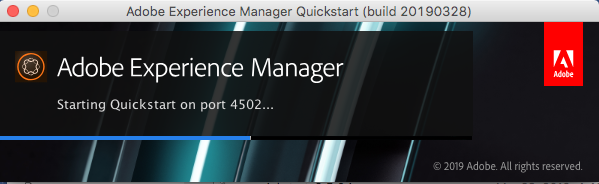
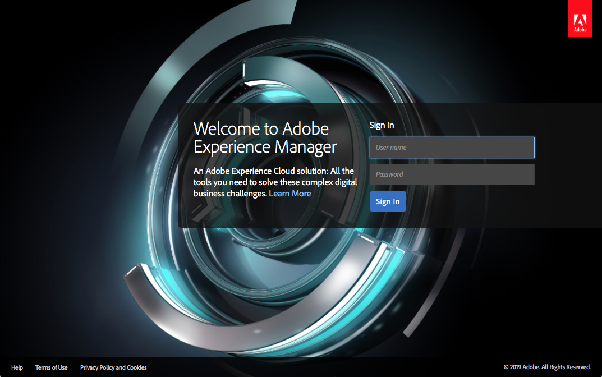

# Deploying and Maintaining{#deploying-and-maintaining}

In this page you will find:

* [Basic Concepts](#basic-concepts)

    * [What is AEM?](#what-is-aem)
    * [Typical Deployments](#typical-deployment-scenarios)

        * [On-premise](#on-premise)
        * [Managed Services using Cloud Manager](#managed-services-using-cloud-manager)

* [Getting Started](#getting-started)

    * [Prerequisites](#prerequisites)
    * [Getting the Software](#getting-the-software)
    * [Default Local Install](#default-local-install)
    * [Author and Publish Installs](#author-and-publish-installs)
    * [Unpacked Install Directory](#unpacked-install-directory)
    * [Starting and Stopping](#starting-and-stopping)

Once you have familiarized yourself with these basics, you will find in more advanced and detailed information in the following subpages:

* [Technical Requirements](/help/sites-deploying/technical-requirements.md)
* [Recommended Deployments](/help/sites-deploying/recommended-deploys.md)
* [Custom Standalone Install](/help/sites-deploying/custom-standalone-install.md)
* [Application Server Install](/help/sites-deploying/application-server-install.md)
* [Troubleshooting](/help/sites-deploying/troubleshooting.md)
* [Command Line Start and Stop](/help/sites-deploying/command-line-start-and-stop.md)
* [Configuring](/help/sites-deploying/configuring.md)
* [Upgrading to AEM 6.5](/help/sites-deploying/upgrade.md)
* [eCommerce](/help/commerce/cif-classic/deploying/ecommerce.md)
* [Configuration How-To Articles](/help/sites-deploying/ht-deploy.md)
* [Web Console](/help/sites-deploying/web-console.md)
* [Troubleshooting Replication](/help/sites-deploying/troubleshoot-rep.md)
* [Best Practices](/help/sites-deploying/best-practices.md)
* [Deploying Communities](/help/communities/deploy-communities.md)
* [Introduction to the AEM Platform](/help/sites-deploying/platform.md)
* [Performance Guidelines](/help/sites-deploying/performance-guidelines.md)
* [Getting Started with AEM Mobile](/help/mobile/getting-started-aem-mobile.md)
* [What is AEM Screens?](https://experienceleague.adobe.com/docs/experience-manager-screens/user-guide/aem-screens-introduction.html)

## Basic Concepts {#basic-concepts}

### What is AEM? {#what-is-aem}

Adobe Experience Manager is a web-based client-server system for building, managing and deploying commercial websites and related services. It combines a number of infrastructure-level and application-level functions into a single integrated package.

At the infrastructure level AEM provides the following:

* **Web Application Server**: AEM can be deployed in standalone mode (it includes an integrated Jetty web server) or as a web application within a third-party application server.
* **Web Application Framework**: AEM incorporates the Sling Web Application Framework that simplifies the writing of RESTful, content-oriented web applications.
* **Content Repository**: AEM includes a Java Content Repository (JCR), a type of hierarchical database designed specifically for unstructured and semi-structured data. The repository stores not only the user-facing content but also all code, templates and internal data used by the application.

Building on this base, AEM also offers a number of application-level features for the management of:

* **Websites**
* **Mobile Applications**
* **Digital Publications**
* **Forms**
* **Digital Assets**
* **Communities**
* **Online Commerce**

Finally, customers can use these infrastructure and application-level building blocks to create customized solutions by building applications of their own.

The AEM server is **Java-based** and runs on most operating systems that support that platform. All client interaction with AEM is done through a **web browser**.

### Typical Deployment Scenarios {#typical-deployment-scenarios}

In AEM terminology an "instance" is a copy of AEM running on a server. AEM installations usually involve at least two instances, typically running on separate machines:

* **Author**: An AEM instance used to create, upload and edit content and to administer the website. Once content is ready to go live, it is replicated to the publish instance.
* **Publish**: An AEM instance that serves the published content to the public.

These instances are identical in terms of installed software. They are differentiated by configuration only. In addition, most installations use a dispatcher:

* **Dispatcher**: A static web server (Apache httpd, Microsoft IIS, etc.) augmented with the AEM dispatcher module. It caches web pages produced by the publish instance to improve performance.

There are many advanced options and elaborations of this setup, but the basic pattern of author, publish and dispatcher is at the core of most deployments. We will begin by focusing on a relatively simple set up. Discussion of advanced deployment options will follow.

The following sections describe both the scenarios:

* **On-premise**: AEM deployed and managed in your corporate environment.

* **Managed Services - Cloud Manager for Adobe Experience Manager**: AEM deployed and managed by Adobe Managed Services.

### On-premise {#on-premise}

You can install AEM on servers in your Corporate environment. Typical installation instances include: Development, Testing and Publishing environments. Please refer to the [Getting Started](/help/sites-deploying/deploy.md#getting%20started) section for basic details on how to get the AEM software to install it locally.

To learn more about the typical on-premises deployments, refer to [Recommended Deployments](/help/sites-deploying/recommended-deploys.md).

### Managed Services using Cloud Manager {#managed-services-using-cloud-manager}

AEM Managed Services is a complete solution for Digital Experience management. It provides benefits of experience delivery solution in the cloud while retaining all the control, security and customization benefits of an on-premise deployment. AEM Managed Services enables customers to launch faster by deploying on the cloud and also by leaning on the best practices and support from Adobe. Organizations and business users can engage customers in minimal time, drive market share, and focus on creating innovative marketing campaigns while reducing the burden on IT.

With AEM Managed Services customers can realize the following benefits:

**Faster Time to Market:** With flexible cloud infrastructure of Adobe Managed Services, organizations can rapidly plan, launch and optimize successful digital experiences. Adobe manages the cloud architecture with no additional capital, hardware, or software required and Adobe's Customer Solutions Engineers, help with AEM architecture, provisioning, customization for connecting to back-end apps and go-live best practices.

**Higher Performance:** Provides reliable digital experiences for your business with four service availability options 99.5%, 99.9%, 99.95%, and 99.99%. Additionally, it allows automatic backup and multimode disaster recovery models to help ensure reliability and contingency management.

**Optimized IT Costs:** Proactive guidance and expertise helps organizations stay current on the latest version of AEM. Adobe Platinum Maintenance and Support is automatically included in new deployments of AMS Enterprise/Basic, offering technical expertise and operational experience to help organizations maintain their mission-critical applications. Free basic Analytics or Target capabilities offer additional value especially for mid-market organizations with limited needs for analytics and personalization.

**Highest Security:** Ensures enterprise-grade physical, network, and data security by hosting customer applications in a restricted-access facility, behind firewall systems, or inside a virtual private cloud. It includes single-tenant virtual machines with robust data storage encryption, antivirals, and data isolation.

**Cloud Manager**: Cloud Manager, part of the Adobe Experience Manager Managed Services offering is a self-service portal that further enables organizations to self-manage Adobe Experience Manager in the cloud. It includes a state-of-the-art continuous integration and continuous delivery (CI/CD) pipeline that lets IT teams and implementation partners speed the delivery of customizations or updates without compromising performance or security. Cloud Manager is only available for Adobe Managed Service customers.

To learn more about Cloud Manger and its resources, please refer to [**Cloud Manager User Guide**](https://experienceleague.adobe.com/docs/experience-manager-cloud-manager/content/introduction.html).

## Getting Started {#getting-started}

### Prerequisites {#prerequisites}

While production instances are usually run on dedicated machines running an officially supported OS (see [Technical Requirements](/help/sites-deploying/technical-requirements.md)), the Experience Manager server will actually run on any system that supports [**Java Standard Edition 8**](https://www.oracle.com/technetwork/java/javase/downloads/jdk8-downloads-2133151.html).

For purposes of familiarization and for developing on AEM it is quite common to use an instance installed on your local machine running Apple OS X or desktop versions of Microsoft Windows or Linux.

On the client-side, AEM works with all modern browsers (**Microsoft Edge**, **Internet Explorer** 11, **Chrome **51+** **, **Firefox **47+, **Safari** 8+) on both desktop and tablet operating systems. See [Supported Client Platforms](/help/sites-deploying/technical-requirements.md#supported-client-platforms) for details.

### Getting the Software {#getting-the-software}

Customers with a valid maintenance and support contract should have received a mail notification with a code and be able to download AEM from the [**Adobe Licensing Website**](https://licensing.adobe.com/). Business partners can request download access from [**spphelp@adobe.com**](mailto:spphelp@adobe.com).

The AEM software package is available in two foms:

* **cq-quickstart-6.5.0.jar:** A standalone executable *jar* file that includes everything needed to get up and running.

* **cq-quickstart-6.5.0.war:** A *war* file for deployment in a third-party application server.

In the following section we describe the **standalone installation**. For details on installing AEM in an application server see [Application Server Install](/help/sites-deploying/application-server-install.md).

### Default Local Install {#default-local-install}

1. Create an install directory on your local machine. For example:

   UNIX install location: **/opt/aem**

   Windows install location: **`C:\Program Files\aem`**

   Equally, it is common to install sample instances in a folder right on the desktop. In any case we will refer to this location generically as:

   `<aem-install>`

   *Note that path of the file directory must consist of only US ASCII characters.*

1. Place the **jar** and **license** files in this directory:

   ```shell
   <aem-install>/
       cq-quickstart-6.5.0.jar
       license.properties
   ```

   If you do not provide a `license.properties` file, AEM will redirect your browser to a **Welcome** screen on startup, where you can enter a license key. You will need to request a valid license key from Adobe if you do not yet have one.

1. To start up the instance in a GUI environment, just double-click the **`cq-quickstart-6.5.0.jar`** file.

   Alternative, you can launch AEM from the command line:

   ```shell
       java -Xmx1024M -jar cq-quickstart-6.5.0.jar
   ```

AEM will take a few minutes to unpack the jar file, install itself, and start up. The above procedure results in:

* an **AEM author** instance
* running on **localhost**
* on port **4502**

To access the instance point your browser to:

**`https://localhost:4502`**

The result in author instance will be automatically configured to connect to a **publish instance** on **`localhost:4503`**.

### Author and Publish Installs {#author-and-publish-installs}

The default install (an **author** instance on **`localhost:4502`**) can be changed simply by renaming the `jar` file before launching it for the first time. The naming pattern is:

**`cq-<instance-type>-p<port-number>.jar`**

For example, renaming the file to

**`cq-author-p4502.jar`**

and launching it will result in an author instance running on **`localhost:4502`**.

Similarly, renaming and launching the file

**`cq-publish-p4503.jar`**

will result in a publish instance running on **`localhost:4503`**.

You would install these two instances in, for example

`<aem-install>/author`and

**`<aem-install>/publish`**

For more details on customizing your installation see the following:

* [Custom Standalone Install](/help/sites-deploying/custom-standalone-install.md)
* [Run Modes](/help/sites-deploying/configure-runmodes.md)

### Unpacked Install Directory {#unpacked-install-directory}

When the quickstart jar is launched for the first time it will unpack itself into the same directory under a new sub-directory called `crx-quickstart`. You should end up with the following:

```xml
<aem-install>/
    license.properties
    cq-quickstart-6.5.0.jar
    crx-quickstart/
        app/
        bin/
        conf/
        launchpad/
        logs/
        metrics/
        monitoring/
        opt/
        repository/
        threaddumps/
        eula-de_DE.html
        eula-en_US.html
        eula-fr_FR.html
        eula-ja_JP.html
        readme.txt
```

If the instance was installed from the UI, then a browser window will open automatically and a desktop application window will also open displaying the host and port of the instance and an on/off switch:



>[!NOTE]
>
>If you are using symlinks, have a look at [issues with symlink](https://helpx.adobe.com/experience-manager/kb/changing-symlink.html).

### Starting and Stopping {#starting-and-stopping}

Once AEM has unpacked itself and started up for the first time, double clicking on the jar file in the install directory simply starts the instance, it does not re-install it.

To stop the instance fom the GUI, simply click the **on/off** switch on the desktop application window.

You can also stop and start AEM from the command line. Assuming you have already installed the instance for the first time, the **command-line scripts** are located here:

**`<aem-install>/crx-quickstart/bin/`**

This folder contains the following Unix bash shell scripts:

* **`start`**: Starts the instance
* `stop`: Stops the instance
* **`status`**: Reports the Status of the instance
* **`quickstart`**: Used to configure start information, if necessary.

There are also equivalent **`bat`** files for Windows. For more detailed information see:

* [Command Line Start and Stop](/help/sites-deploying/command-line-start-and-stop.md)

AEM starts and automatically redirects your web browser to the appropriate page, usually the login page; for example:

`https://localhost:4502/`



Once logged in, you have access to AEM. For further information, depending on the your role, see the following:

* [Authoring](/help/sites-authoring/home.md)
* [Administering](/help/sites-administering/home.md)
* [Developing](/help/sites-developing/home.md)
* [Managing](/help/managing/best-practices.md)

## Advanced Deployment {#advanced-deployment}

The above section should give you a good understanding of the basics of AEM installation. However, installing a full production system of AEM can involve considerably more complexity. For full coverage of advanced installation see the following subpages:

* [Technical Requirements](/help/sites-deploying/technical-requirements.md)
* [Recommended Deployments](/help/sites-deploying/recommended-deploys.md)
* [Custom Standalone Install](/help/sites-deploying/custom-standalone-install.md)
* [Application Server Install](/help/sites-deploying/application-server-install.md)
* [Troubleshooting](/help/sites-deploying/troubleshooting.md)
* [Command Line Start and Stop](/help/sites-deploying/command-line-start-and-stop.md)
* [Configuring](/help/sites-deploying/configuring.md)
* [Upgrading to AEM 6.5](/help/sites-deploying/upgrade.md)
* [eCommerce](/help/commerce/cif-classic/deploying/ecommerce.md)
* [Configuration How-To Articles](/help/sites-deploying/ht-deploy.md)
* [Web Console](/help/sites-deploying/web-console.md)
* [Troubleshooting Replication](/help/sites-deploying/troubleshoot-rep.md)
* [Best Practices](/help/sites-deploying/best-practices.md)
* [Deploying Communities](/help/communities/deploy-communities.md)
* [Introduction to the AEM Platform](/help/sites-deploying/platform.md)
* [Performance Guidelines](/help/sites-deploying/performance-guidelines.md)
* [Getting Started with AEM Mobile](/help/mobile/getting-started-aem-mobile.md)
* [What is AEM Screens?](https://experienceleague.adobe.com/docs/experience-manager-screens/user-guide/aem-screens-introduction.html)
